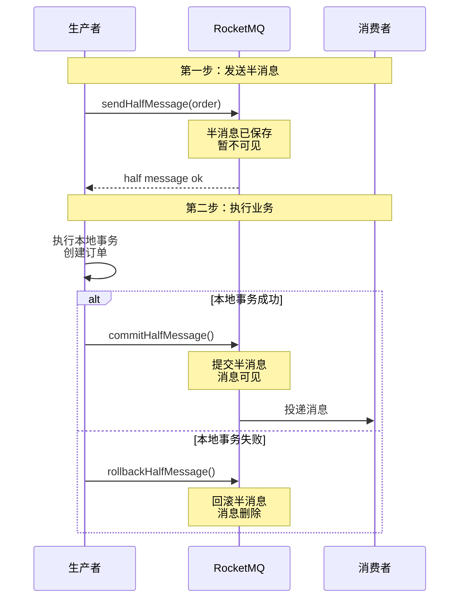
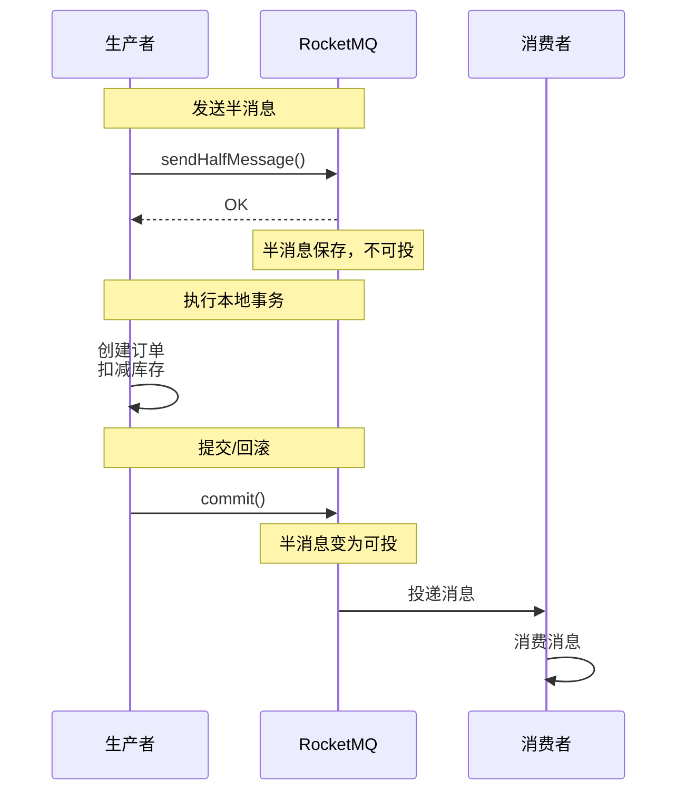
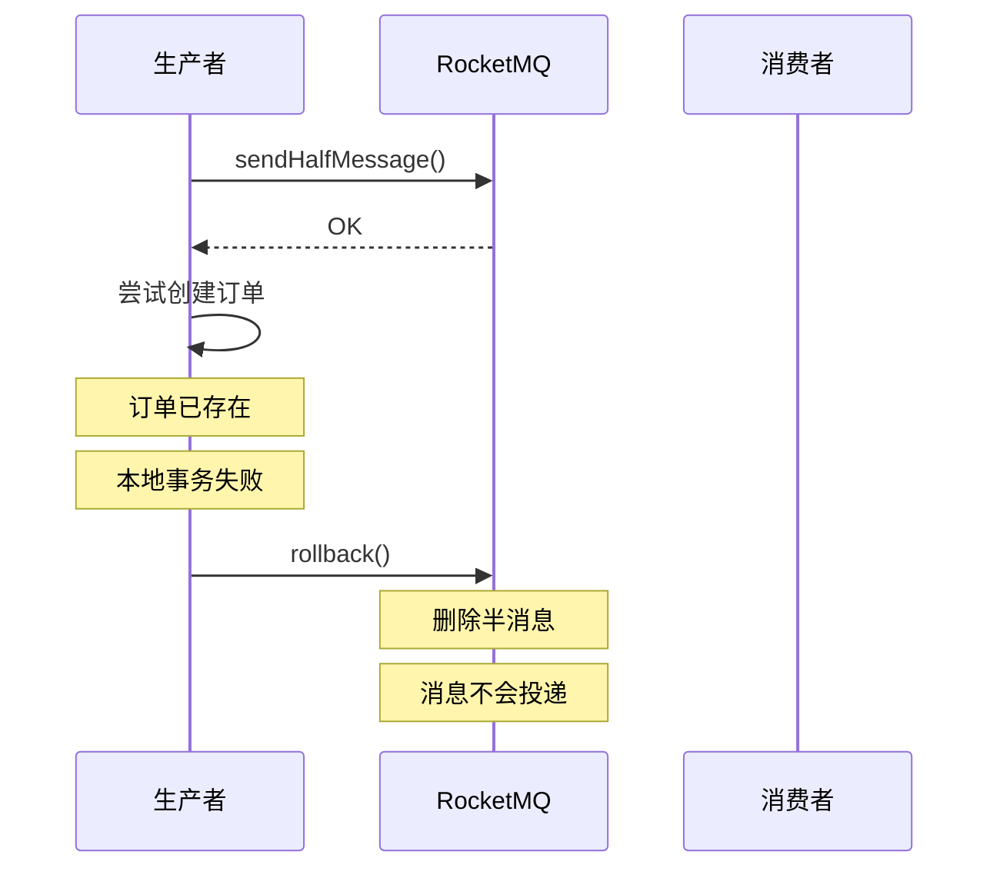
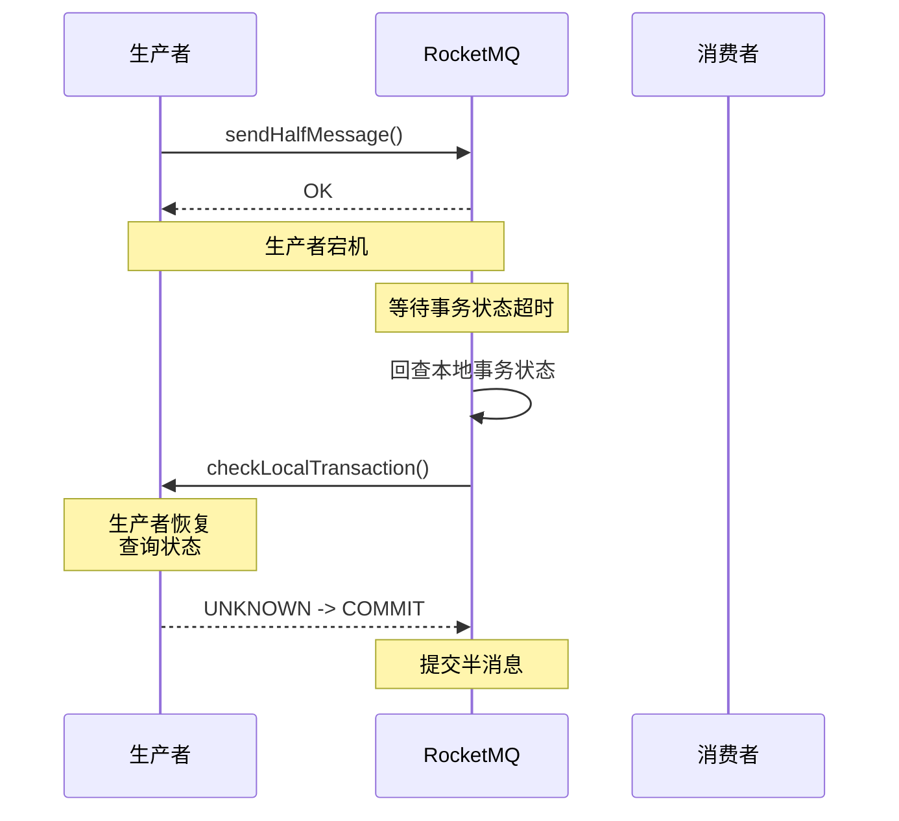

# RocketMQ 事务消息：MQ 原生的分布式事务方案

## 快速自测：面试官最关心的 3 个问题

> 🟡 **中频常考**，P6/P7 面试可能问

1. **RocketMQ 事务消息的原理是什么？半消息是如何工作的？**
2. **事务消息的发送流程是怎样的？本地事务回查是什么意思？**
3. **RocketMQ 事务消息和本地消息表有什么区别？**

---

## 一、事务消息的核心原理

### 1.1 什么是半消息

RocketMQ 的事务消息使用「半消息」机制：消息先发送到 MQ，但不可见，等本地事务成功后才可见。

```
半消息的工作流程：

1. 发送方发送半消息到 MQ
2. MQ 保存半消息，标记为「暂不可投」
3. 发送方执行本地事务
4. 本地事务成功 → 提交半消息 → 消息可见
5. 本地事务失败 → 回滚半消息 → 消息删除
```

### 1.2 架构图



---

## 二、事务消息的发送流程

### 2.1 TransactionMQProducer 配置

```java
// TransactionMQProducer 配置
@Configuration
public class TransactionMQConfig {
    
    @Bean
    public TransactionMQProducer transactionMQProducer() {
        TransactionMQProducer producer = new TransactionMQProducer("order-producer-group");
        producer.setNamesrvAddr("localhost:9876");
        
        // 设置事务监听器
        producer.setTransactionListener(new TransactionListenerImpl());
        producer.start();
        
        return producer;
    }
}
```

### 2.2 事务监听器实现

```java
public class TransactionListenerImpl implements TransactionListener {
    
    @Autowired
    private OrderService orderService;
    
    @Autowired
    private InventoryService inventoryService;
    
    /**
     * 执行本地事务
     * 在这个方法中：
     * 1. 执行业务逻辑
     * 2. 返回事务状态
     */
    @Override
    public LocalTransactionState executeLocalTransaction(Message msg, Object arg) {
        String orderId = msg.getKeys(); // 订单 ID
        
        try {
            // 1. 扣减库存
            boolean deducted = inventoryService.deductStock(orderId, 1);
            if (!deducted) {
                // 库存不足，回滚
                return LocalTransactionState.ROLLBACK_MESSAGE;
            }
            
            // 2. 创建订单
            orderService.createOrder(orderId);
            
            // 3. 本地事务成功，提交半消息
            return LocalTransactionState.COMMIT_MESSAGE;
            
        } catch (Exception e) {
            // 发生异常，回滚
            return LocalTransactionState.ROLLBACK_MESSAGE;
        }
    }
    
    /**
     * 检查本地事务状态
     * 当 MQ 无法确定事务状态时，会回调这个方法
     */
    @Override
    public LocalTransactionState checkLocalTransaction(MessageExt msg) {
        String orderId = msg.getKeys();
        
        // 查询本地事务状态
        TransactionStatus status = orderService.getTransactionStatus(orderId);
        
        switch (status) {
            case COMMITTED:
                return LocalTransactionState.COMMIT_MESSAGE;
            case ROLLBACK:
                return LocalTransactionState.ROLLBACK_MESSAGE;
            default:
                return LocalTransactionState.UNKNOWN;
        }
    }
}
```

### 2.3 发送事务消息

```java
@Service
public class OrderTransactionService {
    
    @Autowired
    private TransactionMQProducer transactionMQProducer;
    
    public void createOrderWithTransaction(OrderDTO order) {
        // 1. 创建消息
        Message message = new Message(
            "order-topic",
            "create-order",
            order.getId(),
            JSON.toJSONString(order).getBytes(StandardCharsets.UTF_8)
        );
        
        // 2. 发送事务消息
        // 第二个参数 arg 会传递给 TransactionListener
        transactionMQProducer.sendMessageInTransaction(
            message,
            order
        );
        
        // 3. sendMessageInTransaction 是异步的
        // 消息发送结果通过 TransactionListener 回调通知
    }
}
```

---

## 三、事务消息的完整流程

### 3.1 正常流程



### 3.2 异常流程 1：本地事务失败



### 3.3 异常流程 2：事务状态未知



---

## 四、与本地消息表对比

### 4.1 对比表

| 维度 | 本地消息表 | RocketMQ 事务消息 |
|------|-----------|-------------------|
| **实现方式** | 自己实现 | MQ 原生支持 |
| **需要 MQ** | 任意 MQ | RocketMQ |
| **补偿机制** | 定时任务 | MQ 回查 |
| **复杂度** | 中 | 中 |
| **性能** | 中 | 中 |
| **可靠性** | 高 | 高 |

### 4.2 选择建议

```
选择本地消息表：
- 使用 Kafka/RabbitMQ
- 需要定制化消息处理逻辑
- 希望自己控制消息表

选择 RocketMQ 事务消息：
- 使用 RocketMQ
- 希望简化实现
- 信任 MQ 的可靠性
```

---

## 五、面试题精讲

### 🔴 面试题 1：RocketMQ 事务消息的原理是什么？

**答案要点**：

1. **半消息**：消息先发送到 MQ 但不可见
2. **本地事务**：发送方执行本地事务
3. **提交/回滚**：根据本地事务结果决定提交或回滚
4. **回查机制**：当事务状态未知时，MQ 回查发送方

**追问链**：

> **第一层**：什么是半消息？
> **第二层**：本地事务回查是什么？
> **第三层**：RocketMQ 事务消息和本地消息表有什么区别？

### 🟡 面试题 2：如何保证事务消息的可靠性？

**答案要点**：

1. **半消息机制**：确保消息被持久化
2. **本地事务和消息原子性**：通过事务保证
3. **回查机制**：确保最终能确定事务状态
4. **消费者幂等**：防止重复消费

---

## 扩展阅读

如果本文档对你有帮助，建议继续阅读：

- [本地消息表](/distributed/transaction/local-message-table)：本地消息表实现
- [分布式事务方案选型](/distributed/transaction/selection)：完整选型指南