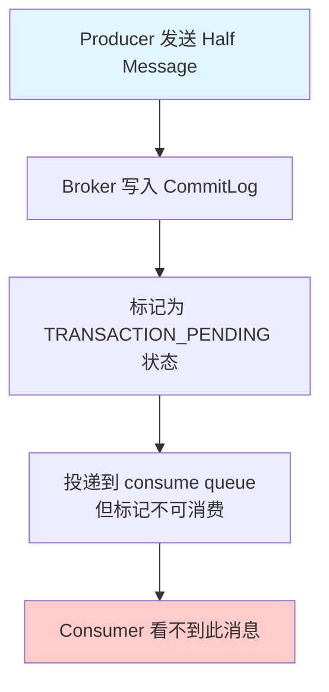
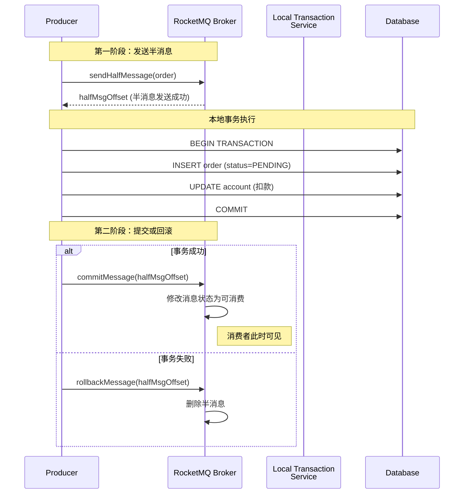
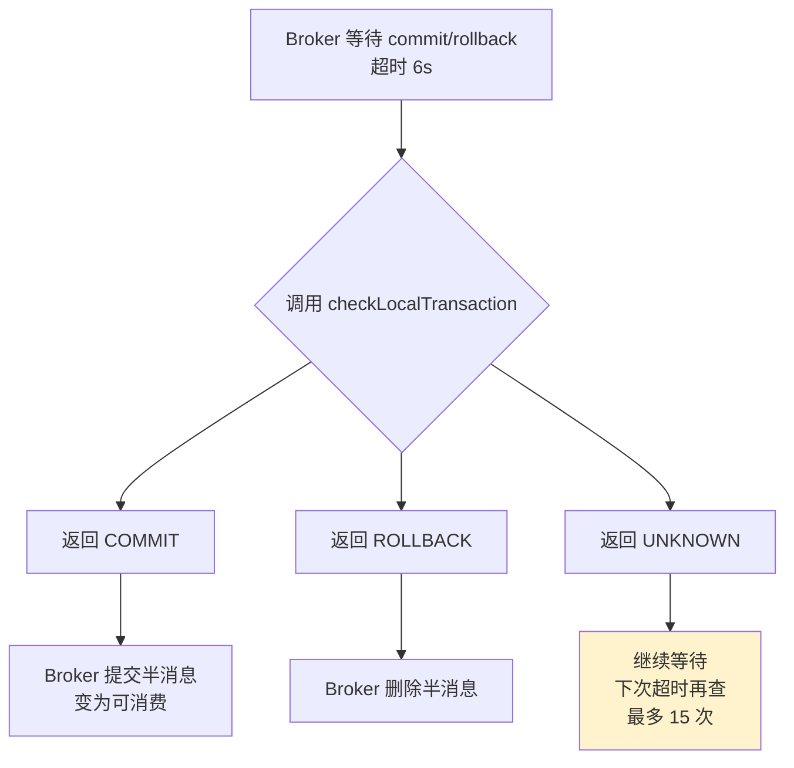

## 问题背景

2023年双十一，我们团队的支付系统在零点高峰期发生了一次严重的支付状态与订单状态不一致事故。

当时的架构是这样的：用户下单后，服务先创建订单（状态为待支付），然后发送消息到支付服务，支付服务完成扣款后回调订单服务修改状态。

```java
// 简化的事故代码
public void createOrder(Order order) {
    orderService.create(order);          // ① 创建订单
    paymentMQ.send("pay", order.getId()); // ② 发送支付消息
}
```

结果：订单表里有一批"已创建"的订单，但支付消息根本没发出去——原因是服务在①和②之间重启了，或者②抛出了网络异常但①已经提交了。

DBA 一查，发现有 347 笔订单处于"待支付"状态超过 30 分钟，客诉电话被打爆。排查了 2 小时才发现是消息发送失败但本地事务已经提交的 case。

这次事故之后，我们决定全面接入 RocketMQ 的事务消息。

【架构权衡】
事务消息不是万能药，它解决的是"发送方一致性"问题——要么消息和本地操作同时成功，要么同时失败。但消费方的幂等性仍然需要你自己设计。如果你的业务场景需要"消费方也必须严格一致"，光靠事务消息是不够的，还需要配合消费确认机制。

## 问题定义

这个问题在分布式架构中的本质是：**本地事务与消息发送无法保证原子性**。

传统解决方案是"消息表 + 轮询补偿"，但缺点明显：需要额外的轮询任务、延迟较高（补偿任务通常有分钟级延迟）、代码侵入性强。

RocketMQ 的事务消息提供了一种更优雅的解法——把消息发送纳入本地事务管理，用两阶段提交确保本地操作和消息发送的一致性。

## 方案演进

在介绍 RocketMQ 事务消息之前，我们先看看业界解决"本地事务 + 消息一致性"的几种方案及其取舍。

| 方案 | 优点 | 缺点 | 适用场景 |
|------|------|------|----------|
| 消息表 + 轮询补偿 | 实现简单，不依赖特定 MQ | 延迟高（分钟级）、消耗数据库资源、代码侵入 | 对延迟不敏感的业务 |
| 本地消息表（异步确认） | 可落地、最终一致 | 需要额外的消息表和补偿任务 | 中小规模系统 |
| RocketMQ 事务消息 | 原生支持、延迟低（毫秒级）、对业务代码侵入小 | 仅解决发送方一致、消费方需幂等、Broker 端单点 | 高并发交易系统 |
| Saga 模式 | 无锁设计、高并发友好 | 需要编写补偿逻辑、复杂度高 | 长链路业务流程 |

## 核心设计

### 半消息的实现原理

RocketMQ 事务消息的第一步是发送"半消息"（Half Message）。理解半消息的关键点是：**半消息的主题（Topic）和队列与普通消息完全一样，区别在于它对消费者不可见**。



RocketMQ 的 Broker 在收到半消息后，会做两件事：

1. **正常写入 CommitLog**——消息内容和普通消息没区别
2. **设置消息的 SYS_FLAG**——在消息属性中标记为 `TRANSACTION_PENDING`，ConsumeQueue 中虽然有记录，但 Consumer 过滤时会跳过

这就解释了为什么半消息"对消费者不可见"——不是消息丢了，而是通过标记位做了逻辑过滤。

:::tip 💡
半消息占用 Broker 的存储空间，和普通消息一样会落盘。这意味着：如果系统中存在大量悬挂（永远没被提交/回滚）的半消息，会持续消耗磁盘空间。生产环境中需要对 TransactionTimeout 设置合理值，并在监控平台上对"半消息堆积"做告警。
:::

### 两阶段提交流程

RocketMQ 事务消息的核心是**两阶段提交**：



具体来看 Producer 端的代码实现：

```java
public class OrderService {
    @Autowired
    private TransactionMQProducer producer;

    public void createOrder(Order order) {
        // ① 发送半消息，这里不会抛出异常
        // 如果抛异常，整个方法不会继续执行
        Message halfMsg = new Message("order-topic", order.toBytes());
        SendResult sendResult = producer.sendMessageInTransaction(halfMsg, order);
    }
}

// TransactionListener 的实现
@Component
public class OrderTransactionListener implements TransactionListener {
    @Override
    public LocalTransactionState executeLocalTransaction(Message msg, Object arg) {
        Order order = (Order) arg;
        try {
            // 这里执行的逻辑和上面的本地事务完全一致
            // 如果这里抛异常，RocketMQ 会回滚半消息
            orderMapper.insert(order);
            accountService.deduct(order.getUserId(), order.getAmount());
            return LocalTransactionState.COMMIT_MESSAGE; // 提交半消息
        } catch (Exception e) {
            log.error("本地事务执行失败", e);
            return LocalTransactionState.ROLLBACK_MESSAGE; // 回滚半消息
        }
    }

    @Override
    public LocalTransactionState checkLocalTransaction(MessageExt msg) {
        // 事务检查器——后文详解
        return LocalTransactionState.COMMIT_MESSAGE;
    }
}
```

`sendMessageInTransaction` 的语义是：**半消息发送和本地事务执行被捆绑在一个原子操作中**。如果半消息发送失败，事务监听器不会被调用。如果半消息发送成功但本地事务执行失败，监听器返回 `ROLLBACK_MESSAGE`，Broker 会删除半消息。

:::warning ⚠️
`sendMessageInTransaction` 是一个"尽力而为"的 API——它不保证半消息发送和本地事务的原子性。RocketMQ 的设计哲学是"只保证发送方一致性"，如果你的业务要求严格的两阶段原子性，这个方案不适合你。生产中常见的翻车点是：半消息发送成功后 JVM 重启了，此时本地事务状态未知，Broker 会进入回查流程。
:::

### 反查机制

这是 RocketMQ 事务消息中最容易让人困惑的部分。

当 Broker 发送半消息后，如果长时间（默认 6 秒，可配置）没有收到 Producer 的 `commit` 或 `rollback` 指令，会触发**反查**（Check）——调用 Producer 端的 `TransactionListener.checkLocalTransaction` 方法。



反查的核心目的是：**解决"半消息发了但不知道本地事务结果"的悬挂问题**。

在 `checkLocalTransaction` 中，你需要去查询本地业务的真实状态：

```java
@Override
public LocalTransactionState checkLocalTransaction(MessageExt msg) {
    // 从半消息中获取本地事务 ID
    String transactionId = msg.getTransactionId();

    // 去数据库查询这笔订单的真实状态
    Order order = orderMapper.selectByTransactionId(transactionId);
    if (order == null) {
        // 本地记录不存在，说明本地事务根本没执行
        // 可能是发送半消息前 JVM 就崩了
        return LocalTransactionState.UNKNOWN;
    }

    switch (order.getStatus()) {
        case "PAID":
            // 已支付，本地事务已成功，提交消息
            return LocalTransactionState.COMMIT_MESSAGE;
        case "FAILED":
            // 支付失败，回滚消息
            return LocalTransactionState.ROLLBACK_MESSAGE;
        default:
            // 还在处理中，返回未知，继续等待
            return LocalTransactionState.UNKNOWN;
    }
}
```

反查的重试策略由 Broker 控制：

- **最大检查次数**：默认 15 次
- **检查间隔**：指数退避，从 1s 开始，每次翻倍
- **总超时时间**：约 6 分钟（1+2+4+8+...，收敛很快）

:::details 📖 点击展开 Broker 端回查源码逻辑
```java
// Broker 端 TransactionStateService.java 核心逻辑
public void doCheck(long transactionCheckInterval) {
    while (this.isRunning()) {
        // 每 100ms 检查一次
        this.waitForRunning(transactionCheckInterval);
        // 遍历所有 pending 的事务消息
        this.transactionStore.scanOperations().forEach(msg -> {
            long diff = now - msg.getStoreTimestamp();
            if (diff > this.defaultMessageStore.getBrokerConfig().getTransactionTimeout()) {
                // 超过超时时间，触发回查
                this.brokerController.getTransactionBridge().checkTransactionState(msg);
            }
        });
    }
}
```
:::

## 生产避坑

### 坑一：事务超时时间设置不当

RocketMQ 的事务消息默认超时时间是 6 秒。这个值在大多数场景下是够的，但如果你的本地事务涉及 RPC 调用（如调用外部支付网关）、或者涉及多个数据库的分布式 SQL，很容易超时。

```yaml
# broker.conf
transactionTimeout=20  # 设置为 20 秒，给 RPC 调用留足时间
transactionCheckInterval=1000  # 检查间隔 1 秒
transactionCheckMax=20  # 最大回查次数
```

:::warning ⚠️
超时时间也不是越长越好。如果设置为 60 秒，万一本地事务hung住了（数据库锁等待、外部服务超时），这笔事务消息会占用 Broker 的大量 CommitLog 空间。建议结合业务事务的平均耗时，将超时时间设置为平均耗时的 2~3 倍。
:::

### 坑二：checkLocalTransaction 方法有副作用

很多开发者在 `checkLocalTransaction` 中不仅查状态，还做了业务操作（如更新订单状态）。这会导致一个问题：**反查可能执行多次**，每次都会触发你的业务代码，可能造成重复操作。

正确做法是：**checkLocalTransaction 必须是只读的**，只查状态，不做任何会改变状态的操作。

```java
// ❌ 错误：在 checkLocalTransaction 中做状态更新
@Override
public LocalTransactionState checkLocalTransaction(MessageExt msg) {
    Order order = orderMapper.selectByTransactionId(tid);
    if (order != null && order.getStatus().equals("PAID")) {
        orderMapper.updateStatus(order.getId(), "PAID"); // 不要这样做！
        return LocalTransactionState.COMMIT_MESSAGE;
    }
    return LocalTransactionState.UNKNOWN;
}

// ✅ 正确：只读操作
@Override
public LocalTransactionState checkLocalTransaction(MessageExt msg) {
    Order order = orderMapper.selectByTransactionId(tid);
    if (order == null) return LocalTransactionState.UNKNOWN;
    return "PAID".equals(order.getStatus())
        ? LocalTransactionState.COMMIT_MESSAGE
        : LocalTransactionState.UNKNOWN;
}
```

### 坑三：消费方未做幂等

RocketMQ 事务消息只保证**发送方一致性**，即"本地事务提交 → 消息对消费者可见"。但如果消费方在处理消息时失败（比如处理到一半数据库挂了），RocketMQ 会重发消息。如果消费方没有幂等设计，就会出现重复处理。

```java
// ✅ 消费方幂等设计：基于唯一键
@RocketMQMessageListener(topic = "order-topic", consumerGroup = "payment-group")
public class PaymentConsumer {
    @Override
    public void onMessage(Message msg) {
        Order order = deserialize(msg);
        // 基于订单 ID 做幂等检查
        if (paymentMapper.exists(order.getId())) {
            log.info("订单 {} 已处理，跳过", order.getId());
            return;
        }
        // 正常处理流程
        paymentService.process(order);
    }
}
```

## 工程代价

| 维度 | 评估 |
|------|------|
| 运维成本 | Broker 需要额外配置 transaction 参数；监控平台需对接 Transaction 指标 |
| 排障复杂度 | 悬挂的半消息需要通过 RocketMQ 管理后台或命令排查；回查日志需要开启 DEBUG 级别 |
| 扩展性 | 单机 Broker 的事务消息处理能力有限（每台约 1000 TPS），高并发场景需集群部署 |
| 回滚风险 | 低。事务消息的回滚只是删除半消息，不会产生垃圾数据 |

## 落地 Checklist

- [ ] 配置 Broker 的 `transactionTimeout`（建议 20 秒）
- [ ] 启用 Broker 的事务消息检查线程：`transactionCheckInterval`
- [ ] 实现 `TransactionListener`：executeLocalTransaction（写）和 checkLocalTransaction（只读）
- [ ] 本地事务方法中避免调用外部 HTTP/RPC 服务（如果必须调用，确保超时合理）
- [ ] 消费方必须实现幂等逻辑（基于唯一键去重）
- [ ] 配置半消息堆积监控告警（超过 10000 条需关注）
- [ ] 上线前用压力测试验证事务消息的吞吐量和延迟
- [ ] 在测试环境模拟"半消息发送成功但本地事务失败"场景，验证回滚流程
