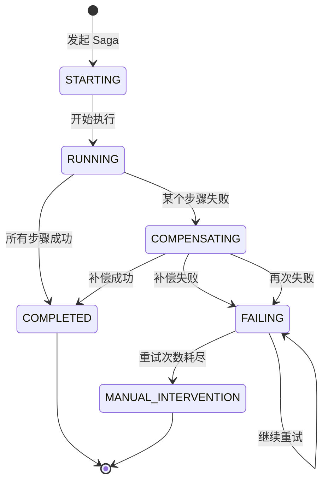

# Saga 正向/反向恢复：确保最终一致

## 快速自测：面试官最关心的 3 个问题

> 🟡 **中频常考**，P6/P7 面试可能问

1. **Saga 的正向恢复和反向恢复是什么？它们如何配合工作？**
2. **Saga 如何处理补偿失败？重试策略如何设计？**
3. **Saga 的状态机如何设计？有哪些状态需要管理？**

---

## 一、正向恢复与反向恢复

### 1.1 正向恢复（Forward Recovery）

**正向恢复**：当 Saga 的某个步骤失败时，不是立即回滚，而是重试该步骤直到成功。

```
正向恢复的场景：

1. 场景：临时性故障（如网络抖动、数据库暂时不可用）
2. 策略：重试当前步骤，而不是回滚
3. 适用：瞬时故障，不需要回滚的情况

示例：
- 支付服务临时不可用
- 等待后重试支付
- 不影响订单和库存
```

### 1.2 反向恢复（Backward Recovery）

**反向恢复**：当 Saga 的某个步骤失败时，通过执行补偿事务来回滚已完成的步骤。

```
反向恢复的场景：

1. 场景：永久性故障（如业务校验失败、数据不合法）
2. 策略：执行补偿事务，取消已完成的操作
3. 适用：业务错误，需要回滚的情况

示例：
- 余额不足导致支付失败
- 补偿：退还库存
- 补偿：取消订单
```

### 1.3 两种恢复策略的对比

| 维度 | 正向恢复 | 反向恢复 |
|------|---------|---------|
| **触发条件** | 临时性故障 | 永久性故障 |
| **恢复方式** | 重试当前步骤 | 补偿已完成步骤 |
| **数据影响** | 保持当前状态 | 回滚到之前状态 |
| **适用场景** | 网络抖动、暂时不可用 | 业务错误、校验失败 |

---

## 二、Saga 的状态机设计

### 2.1 核心状态



### 2.2 步骤级状态

| 状态 | 说明 |
|------|------|
| **PENDING** | 等待执行 |
| **RUNNING** | 执行中 |
| **COMPLETED** | 执行成功 |
| **COMPENSATING** | 补偿中 |
| **COMPENSATED** | 补偿成功 |
| **FAILED** | 执行/补偿失败 |
| **SKIPPED** | 跳过（前置步骤失败） |

### 2.3 状态持久化

```java
// Saga 状态表结构
// saga_id | status | current_step | created_at | updated_at
// ---------+--------+--------------+-------------+-------------
// 001     | RUNNING | step2       | 10:00:00   | 10:00:10
// 002     | COMPENSATING | step3 | 10:01:00   | 10:01:20

// saga_step_status 表
// saga_id | step_name | status | retry_count | error_message
// ---------+-----------+--------+-------------+--------------
// 001     | step1     | COMPLETED | 0         | -
// 001     | step2     | COMPLETED | 0         | -
// 001     | step3     | RUNNING   | 0         | -
```

---

## 三、补偿失败的应对策略

### 3.1 重试策略

```java
public class CompensationRetryPolicy {
    
    // 重试配置
    private final int maxRetries = 3;
    private final long initialDelayMs = 1000;
    private final double multiplier = 2.0;
    private final long maxDelayMs = 60000;
    
    public void compensateWithRetry(String sagaId, SagaStep step) {
        int retryCount = 0;
        long delay = initialDelayMs;
        
        while (retryCount < maxRetries) {
            try {
                step.compensate();
                updateStepStatus(sagaId, step.getName(), "COMPENSATED");
                return;
            } catch (Exception e) {
                retryCount++;
                if (retryCount >= maxRetries) {
                    handleRetryExhausted(sagaId, step, e);
                    return;
                }
                
                // 指数退避
                try {
                    Thread.sleep(delay);
                } catch (InterruptedException ie) {
                    Thread.currentThread().interrupt();
                }
                delay = Math.min(delay * multiplier, maxDelayMs);
            }
        }
    }
}
```

### 3.2 死信队列

当重试次数耗尽后，将失败的补偿放入死信队列，等待人工干预。

```java
public class DeadLetterQueueHandler {
    
    public void handleRetryExhausted(String sagaId, SagaStep step, Exception e) {
        // 1. 记录到死信队列
        deadLetterQueue.offer(DeadLetter.builder()
            .sagaId(sagaId)
            .stepName(step.getName())
            .compensationType(step.getClass().getSimpleName())
            .errorMessage(e.getMessage())
            .retryCount(maxRetries)
            .createdAt(Instant.now())
            .build());
        
        // 2. 更新 Saga 状态为需要人工干预
        sagaDao.updateStatus(sagaId, "MANUAL_INTERVENTION");
        
        // 3. 发送告警
        alertService.sendAlert("Saga 补偿失败需要人工干预", sagaId);
    }
}
```

### 3.3 人工干预机制

```java
public class ManualInterventionService {
    
    // 查看需要人工干预的 Saga
    public List<SagaIntervention> listPendingInterventions() {
        return deadLetterQueue.stream()
            .filter(dl -> dl.getStatus() == "PENDING")
            .map(this::toIntervention)
            .collect(Collectors.toList());
    }
    
    // 人工补偿
    @Transactional
    public void manualCompensate(String sagaId, String stepName, String action) {
        if ("SKIP".equals(action)) {
            // 跳过该步骤，继续后续步骤
            skipStep(sagaId, stepName);
        } else if ("EXECUTE".equals(action)) {
            // 手动执行补偿
            executeCompensation(sagaId, stepName);
        } else if ("ROLLBACK".equals(action)) {
            // 完全回滚
            fullRollback(sagaId);
        }
    }
}
```

---

## 四、面试题精讲

### 🟡 面试题 1：Saga 的正向恢复和反向恢复是什么？

**答案要点**��

1. **正向恢复**：失败后重试当前步骤（适用于临时性故障）
2. **反向恢复**：失败后执行补偿回滚（适用于永久性故障）

### 🟡 面试题 2：补偿失败后如何处理？

**答案要点**：

1. **重试机制**：指数退避重试补偿
2. **死信队列**：失败后放入死信队列
3. **人工干预**：最终兜底方案

---

## 扩展阅读

如果本文档对你有帮助，建议继续阅读：

- [Saga 事务](/distributed/transaction/saga)：Saga 基础概念
- [分布式事务方案选型](/distributed/transaction/selection)：完整选型指南