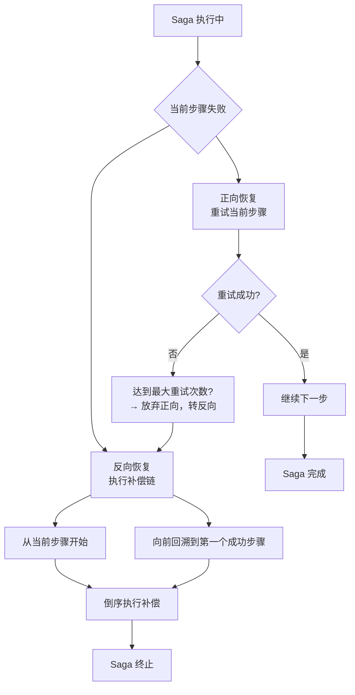
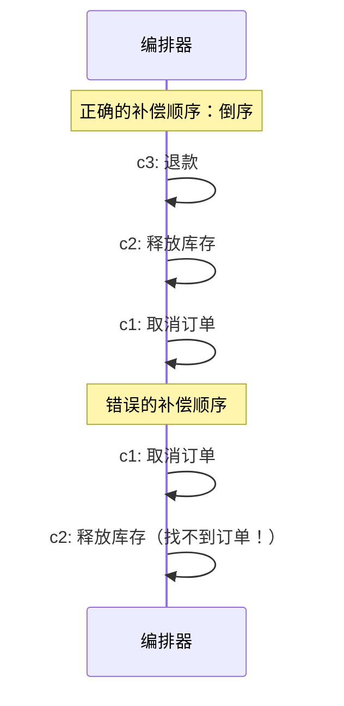
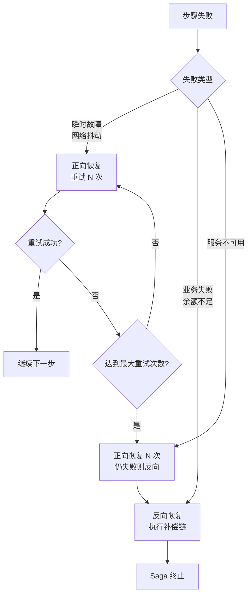

2023年"618"大促期间，团队的 Saga 事务出现了状态机混乱：

部分订单的步骤重试了 5~6 次（正向恢复失控），部分订单的补偿执行了多次（反向恢复幂等性问题），还有部分订单的补偿顺序错了（应该先退款再加库存，结果顺序反了）。

DBA 发现订单表里出现了"支付已退款"但"库存已加回"的诡异状态——用户既没付款，库存也没扣减，白白损失了潜在销量。

复盘发现：三个问题都是 Saga 恢复策略没设计好导致的。网络抖动时，正向恢复和反向恢复的边界没分清楚；补偿链执行时，顺序保证没做到；幂等性检查也漏了。

这一章，把 Saga 的恢复策略彻底讲清楚。

## 一、Saga 的两种恢复策略

Saga 事务在执行过程中可能失败。失败后的处理策略有两种：

- **正向恢复（Forward Recovery）**：失败后重试当前步骤，继续往前走
- **反向恢复（Backward Recovery）**：失败后执行补偿链，往回退



### 1.1 正向恢复（Forward Recovery）

正向恢复的定义：**当某个步骤失败时，自动重试该步骤，直到成功或达到最大重试次数。**

适用场景：
- 瞬时故障（网络抖动、服务短暂不可用）
- 幂等性有保证的服务
- 业务允许重复执行

```java
public class SagaOrchestrator {

    // 正向恢复配置
    private static final int MAX_RETRIES = 3;
    private static final long RETRY_INTERVAL_MS = 1000;

    public boolean executeStep(String stepName, Supplier<Boolean> action) {
        int attempts = 0;
        Exception lastException = null;

        while (attempts < MAX_RETRIES) {
            try {
                boolean result = action.get();
                if (result) {
                    return true;
                }
                attempts++;
                log.warn("步骤 {} 执行失败，重试 {}/{}", stepName, attempts, MAX_RETRIES);
            } catch (Exception e) {
                attempts++;
                lastException = e;
                log.warn("步骤 {} 执行异常，重试 {}/{}", stepName, attempts, MAX_RETRIES, e);
            }

            if (attempts < MAX_RETRIES) {
                try {
                    Thread.sleep(RETRY_INTERVAL_MS * attempts); // 指数退避
                } catch (InterruptedException ie) {
                    Thread.currentThread().interrupt();
                    return false;
                }
            }
        }

        // 达到最大重试次数，仍失败
        log.error("步骤 {} 达到最大重试次数 {}，放弃", stepName, MAX_RETRIES, lastException);
        return false;
    }
}
```

**正向恢复的前提**：当前步骤必须是幂等的。重试不会导致数据重复（比如"查询余额"可以重试，"扣减余额"必须幂等）。

### 1.2 反向恢复（Backward Recovery）

反向恢复的定义：**当某个步骤失败时，从失败步骤往前，依次执行已成功步骤的补偿操作。**

这是 Saga 最核心的恢复机制，也是与 TCC 本质的区别。

```java
public class SagaOrchestrator {

    /**
     * 反向恢复：执行补偿链
     * 关键点：倒序执行，遇到第一个成功的就停止
     */
    public void compensate(SagaContext ctx) {
        List<String> completedSteps = ctx.getCompletedStepsInReverseOrder();

        for (String stepName : completedSteps) {
            Compensable compensableAction = compensableActions.get(stepName);

            try {
                boolean result = compensableAction.compensate(ctx);
                if (result) {
                    ctx.markCompensated(stepName);
                    log.info("补偿 step={} 成功", stepName);
                } else {
                    // 补偿返回 false，需要重试
                    retryCompensate(stepName, ctx);
                }
            } catch (Exception e) {
                // 补偿失败，记录日志，重试或人工介入
                ctx.markCompensationFailed(stepName, e);
                log.error("补偿 step={} 失败，需要重试", stepName, e);
                throw e;
            }
        }
    }

    private void retryCompensate(String stepName, SagaContext ctx) {
        int maxRetries = 5;
        for (int i = 0; i < maxRetries; i++) {
            try {
                compensableActions.get(stepName).compensate(ctx);
                ctx.markCompensated(stepName);
                return;
            } catch (Exception e) {
                log.warn("补偿 step={} 重试 {}/{} 失败", stepName, i + 1, maxRetries, e);
                if (i < maxRetries - 1) {
                    sleep(1000L * (i + 1));
                }
            }
        }
        // 所有重试都失败，需要人工介入
        ctx.markRequiresManualIntervention(stepName);
        alertService.sendAlert("补偿失败需要人工介入", ctx.getSagaId(), stepName);
    }
}
```

【架构权衡】

正向恢复和反向恢复的选择，取决于故障类型和业务容忍度：

| 故障类型 | 推荐策略 | 原因 |
| --- | --- | --- |
| 瞬时故障（网络抖动） | 正向恢复 | 重试能解决，不需要补偿 |
| 持久故障（服务不可用） | 反向恢复 | 重试无效，需要补偿 |
| 业务失败（余额不足） | 反向恢复 | 必须补偿，不能重试 |
| 未知失败 | 先正向再反向 | 先重试 N 次，仍失败则补偿 |

## 二、补偿顺序的正确性

补偿链的顺序是 Saga 最容易出错的地方。

### 2.1 原则：倒序执行，遇到第一个成功的就停止

补偿必须**严格倒序**执行。因为前面的步骤可能依赖后面步骤的资源。

举例：T1 创建订单 -> T2 预扣库存 -> T3 支付。假设 T3 支付失败，需要补偿。

**正确的补偿顺序**：
1. c2：释放预扣库存（如果先补偿 T1 取消订单，后面的 c2 找不到订单）
2. c1：取消订单

**错误的补偿顺序**：
1. c1：取消订单
2. c2：释放预扣库存（此时订单已取消，c2 可能找不到相关数据）



### 2.2 补偿顺序错误的常见原因

**原因一：并发执行补偿**

有些开发者为了"加速"，把补偿操作并发执行。这可能导致顺序错乱。

```java
// 错误：并发执行补偿
public void compensateInParallel(List<CompensableAction> actions) {
    CompletableFuture.allOf(
        actions.stream()
            .map(a -> CompletableFuture.runAsync(() -> a.compensate()))
            .toArray(CompletableFuture[]::new)
    ).join();
}
```

**原因二：补偿依赖状态，但状态在另一个补偿中被改了**

```java
// 错误：补偿 c2 修改的状态，被 c1 依赖
public void compensate() {
    // c2: 释放库存 - 修改了 order.stock_status
    inventoryService.release(orderId, count);

    // c1: 取消订单 - 依赖 order.stock_status = "reserved"
    // 但此时已经被 c2 改了，cancel 可能失败
    orderService.cancel(orderId);
}
```

**原因三：补偿过程中新故障**

补偿执行到一半，补偿操作本身失败了。此时已经补偿了几个步骤，但后续补偿没执行完。

```java
// 问题：补偿执行到一半，新的故障发生了
public void compensate() {
    c3(); // 退款成功
    c2(); // 释放库存成功
    c1(); // 取消订单失败！（订单已被删除）
    // 此时状态：退款了，库存释放了，订单取消失败
    // 需要回滚 c3 和 c2，或者继续重试 c1
}
```

### 2.3 正确的补偿顺序实现

```java
public class SagaContext {
    private String sagaId;
    private Map<String, SagaStep> steps = new LinkedHashMap<>();
    private List<String> executionLog = new ArrayList<>();

    /**
     * 记录步骤执行（保持顺序）
     */
    public void recordStep(String name, SagaStep step) {
        steps.put(name, step);
        executionLog.add(name);
    }

    /**
     * 获取倒序的已完成步骤（用于补偿）
     */
    public List<String> getCompletedStepsInReverseOrder() {
        return executionLog.stream()
            .filter(name -> steps.get(name).getStatus() == StepStatus.COMPLETED)
            .collect(Collectors.collectingAndThen(
                Collectors.toList(),
                list -> {
                    Collections.reverse(list);
                    return list;
                }
            ));
    }
}

@Service
public class OrderSagaOrchestrator {

    public void compensate(SagaContext ctx) {
        List<String> toCompensate = ctx.getCompletedStepsInReverseOrder();

        for (String stepName : toCompensate) {
            SagaStep step = ctx.getStep(stepName);

            if (step.getCompensationStatus() == CompensationStatus.DONE) {
                // 已经补偿过了（幂等性）
                continue;
            }

            try {
                boolean success = executeCompensation(stepName, ctx);
                if (success) {
                    step.setCompensationStatus(CompensationStatus.DONE);
                } else {
                    // 补偿失败，停止补偿链，等待重试
                    log.error("补偿 step={} 失败，停止补偿链", stepName);
                    break;
                }
            } catch (Exception e) {
                // 补偿异常，停止补偿链
                step.setCompensationStatus(CompensationStatus.FAILED);
                step.setFailureReason(e.getMessage());
                log.error("补偿 step={} 异常，停止补偿链", stepName, e);
                break;
            }
        }
    }

    /**
     * 单个补偿执行（同步，不并发）
     */
    private boolean executeCompensation(String stepName, SagaContext ctx) {
        switch (stepName) {
            case "pay":
                return paymentService.refund(ctx.getOrder().getUserId(), ctx.getOrder().getAmount());
            case "deductInventory":
                return inventoryService.addBack(ctx.getOrder().getGoodsId(), ctx.getOrder().getCount());
            case "lockCoupon":
                return couponService.unlock(ctx.getOrder().getUserId(), ctx.getOrder().getCouponId());
            case "reserveInventory":
                return inventoryService.releaseReservation(ctx.getOrder().getGoodsId(), ctx.getOrder().getCount());
            case "createOrder":
                return orderService.cancel(ctx.getOrder().getId());
            default:
                return true;
        }
    }
}
```

## 三、混合恢复策略

实际生产环境，通常采用**混合策略**：正向优先，失败则反向。

### 3.1 策略选择逻辑



### 3.2 混合恢复代码实现

```java
public class AdaptiveSagaOrchestrator {

    private static final int TRANSIENT_FAILURE_MAX_RETRIES = 3;
    private static final int PERSISTENT_FAILURE_MAX_RETRIES = 1;

    public boolean executeWithRecovery(SagaContext ctx, String stepName, Supplier<Boolean> action) {
        // 第一次尝试：正向恢复
        FailureType failureType = executeWithForwardRecovery(stepName, action, TRANSIENT_FAILURE_MAX_RETRIES);

        if (failureType == FailureType.NONE) {
            return true; // 成功
        }

        if (failureType == FailureType.TRANSIENT) {
            // 瞬时故障达到最大重试次数，转反向恢复
            log.warn("步骤 {} 瞬时故障达到最大重试次数，转为反向恢复", stepName);
            compensate(ctx);
            return false;
        }

        if (failureType == FailureType.PERSISTENT) {
            // 业务失败，直接反向恢复
            log.warn("步骤 {} 业务失败，执行反向恢复", stepName);
            compensate(ctx);
            return false;
        }

        return false;
    }

    private FailureType executeWithForwardRecovery(String stepName, Supplier<Boolean> action, int maxRetries) {
        for (int attempt = 0; attempt < maxRetries; attempt++) {
            try {
                boolean result = action.get();
                if (result) {
                    return FailureType.NONE;
                } else {
                    // 业务返回 false，通常是业务失败（非瞬时）
                    return FailureType.PERSISTENT;
                }
            } catch (TransientException e) {
                // 瞬时故障（网络、服务暂不可用）
                log.warn("步骤 {} 瞬时故障，重试 {}/{}", stepName, attempt + 1, maxRetries, e);
                if (attempt < maxRetries - 1) {
                    sleep(calculateBackoff(attempt));
                }
            } catch (PersistentException e) {
                // 持久故障（余额不足、业务规则冲突）
                return FailureType.PERSISTENT;
            } catch (Exception e) {
                // 未知异常，按瞬时故障处理
                log.error("步骤 {} 未知异常", stepName, e);
                return FailureType.PERSISTENT;
            }
        }
        return FailureType.TRANSIENT; // 达到最大重试次数
    }

    private long calculateBackoff(int attempt) {
        // 指数退避：1s, 2s, 4s...
        return 1000L * (1L << attempt);
    }
}
```

【架构权衡】

混合恢复策略的核心挑战是**如何判断故障类型**：

| 故障类型 | 判断方式 | 常见异常 |
| --- | --- | --- |
| 瞬时故障 | 服务可连接，只是响应慢或超时 | `TimeoutException`, `SocketException`, `ServiceUnavailableException` |
| 业务失败 | 服务正常响应，但业务逻辑不通过 | `BalanceInsufficientException`, `StockNotEnoughException` |
| 持久故障 | 服务不可用，或数据状态异常 | `ConnectionException`, `DataIntegrityViolationException` |

工程实现上，建议对异常做分类：

```java
public class SagaExceptionClassifier {

    public static FailureType classify(Throwable e) {
        // 网络超时：瞬时故障
        if (e instanceof TimeoutException || e instanceof SocketTimeoutException) {
            return FailureType.TRANSIENT;
        }

        // 服务不可用：瞬时故障
        if (e instanceof ServiceUnavailableException || e instanceof CircuitBreakerOpenException) {
            return FailureType.TRANSIENT;
        }

        // 业务规则冲突：业务失败
        if (e instanceof BalanceInsufficientException || e instanceof StockNotEnoughException) {
            return FailureType.PERSISTENT;
        }

        // 资源不存在：持久故障
        if (e instanceof ResourceNotFoundException || e instanceof DataDeletedException) {
            return FailureType.PERSISTENT;
        }

        // 未知异常，默认按瞬时处理（留给正向恢复机会）
        return FailureType.TRANSIENT;
    }
}
```

## 四、状态持久化与断点恢复

Saga 事务可能持续很长时间（几分钟到几小时），中间可能出现进程重启、机器宕机。**状态持久化**是断点恢复的基础。

### 4.1 Saga 状态表设计

```sql
CREATE TABLE SAGA_INSTANCE (
    id BIGINT PRIMARY KEY AUTO_INCREMENT,
    saga_id VARCHAR(64) NOT NULL UNIQUE COMMENT 'Saga实例ID',
    current_step VARCHAR(64) COMMENT '当前执行步骤',
    status TINYINT NOT NULL COMMENT '状态：0=RUNNING, 1=COMPLETED, 2=COMPENSATING, 3=COMPENSATED, 4=FAILED',
    gmt_start TIMESTAMP,
    gmt_end TIMESTAMP,
    context_data TEXT COMMENT 'Saga上下文JSON（用于断点恢复）',
    retry_count INT DEFAULT 0,
    last_error TEXT,
    INDEX idx_saga_id (saga_id),
    INDEX idx_status (status)
) ENGINE=InnoDB DEFAULT CHARSET=utf8mb4 COMMENT='Saga实例表';

CREATE TABLE SAGA_STEP_LOG (
    id BIGINT PRIMARY KEY AUTO_INCREMENT,
    saga_id VARCHAR(64) NOT NULL,
    step_name VARCHAR(64) NOT NULL,
    step_order INT NOT NULL COMMENT '步骤顺序',
    status TINYINT NOT NULL COMMENT '状态：0=PENDING, 1=EXECUTING, 2=COMPLETED, 3=COMPENSATING, 4=COMPENSATED, 5=FAILED',
    gmt_execute TIMESTAMP,
    gmt_compensate TIMESTAMP,
    compensation_status TINYINT COMMENT '补偿状态',
    error_message TEXT,
    UNIQUE KEY uk_saga_step (saga_id, step_name),
    INDEX idx_saga_id (saga_id)
) ENGINE=InnoDB DEFAULT CHARSET=utf8mb4 COMMENT='Saga步骤日志表';
```

### 4.2 断点恢复实现

```java
@Service
public class SagaRecoveryService {

    @Autowired
    private SagaInstanceMapper sagaMapper;
    @Autowired
    private SagaStepLogMapper stepLogMapper;

    /**
     * 应用启动时，恢复未完成的 Saga
     */
    @PostConstruct
    public void recoverUnfinishedSagas() {
        // 查找状态为 RUNNING 或 COMPENSATING 的 Saga
        List<SagaInstance> unfinished = sagaMapper.selectByStatusIn(
            Arrays.asList(SagaStatus.RUNNING, SagaStatus.COMPENSATING)
        );

        for (SagaInstance saga : unfinished) {
            log.info("恢复未完成的 Saga，sagaId={}, status={}", saga.getSagaId(), saga.getStatus());

            try {
                if (saga.getStatus() == SagaStatus.RUNNING) {
                    // 断点恢复：继续执行
                    resumeSaga(saga);
                } else if (saga.getStatus() == SagaStatus.COMPENSATING) {
                    // 断点恢复：继续补偿
                    resumeCompensation(saga);
                }
            } catch (Exception e) {
                log.error("恢复 Saga 失败，sagaId={}", saga.getSagaId(), e);
                saga.setStatus(SagaStatus.FAILED);
                saga.setLastError(e.getMessage());
                sagaMapper.updateById(saga);
            }
        }
    }

    /**
     * 断点恢复：继续执行
     */
    private void resumeSaga(SagaInstance saga) {
        String currentStep = saga.getCurrentStep();
        List<SagaStepLog> stepLogs = stepLogMapper.selectBySagaId(saga.getSagaId());

        // 找到最后一个 COMPLETED 的步骤
        String lastCompletedStep = findLastCompletedStep(stepLogs);

        if (lastCompletedStep != null) {
            log.info("Saga {} 已完成到步骤 {}，从下一步继续", saga.getSagaId(), lastCompletedStep);
            // 从下一步开始执行
            executeFromStep(saga, lastCompletedStep);
        } else {
            // 没有任何步骤完成过，重新开始
            executeFromStep(saga, null);
        }
    }

    /**
     * 断点恢复：继续补偿
     */
    private void resumeCompensation(SagaInstance saga) {
        List<SagaStepLog> stepLogs = stepLogMapper.selectBySagaId(saga.getSagaId());

        // 找到最后一个 COMPENSATED 的步骤
        String lastCompensatedStep = findLastCompensatedStep(stepLogs);

        if (lastCompensatedStep != null) {
            log.info("Saga {} 已补偿到步骤 {}，从下一步继续", saga.getSagaId(), lastCompensatedStep);
            compensateFromStep(saga, lastCompensatedStep);
        } else {
            // 没有任何补偿完成过，从头开始补偿
            compensateFromStep(saga, null);
        }
    }
}
```

## 五、与 TCC Confirm/Cancel 的对比

Saga 的正向/反向恢复，与 TCC 的 Confirm/Cancel 有相似之处，但本质不同：

| 维度 | TCC Confirm/Cancel | Saga 正向/反向恢复 |
| --- | --- | --- |
| 触发时机 | 协调者主动决策 | 失败时自动触发 |
| 执行次数 | 每个阶段最多一次 | 可能多次（重试机制） |
| 隔离性 | 好（Try 阶段预留资源） | 差（无预留，中间状态可见） |
| 复杂度 | 中（三个阶段语义清晰） | 高（需要处理重试、幂等、断点） |
| 补偿语义 | 解冻/确认（确定性的） | 补偿（需要业务设计） |

【架构权衡】

Saga 的恢复策略选择，取决于业务特性，没有万能方案：

| 业务场景 | 推荐策略 | 原因 |
| --- | --- | --- |
| 订单履约（步骤多、链路长） | 混合策略 | 瞬时故障重试，业务失败补偿 |
| 支付退款（步骤少、要求快） | 反向恢复优先 | 不值得重试，直接补偿更快 |
| 营销发放（可重复执行） | 正向恢复优先 | 允许重复，补偿反而麻烦 |
| 不可逆操作（如发短信） | 失败即终止 | 无法补偿，记录日志告警 |

:::tip
Saga 恢复策略的核心设计原则：**正向恢复给瞬时故障机会，反向恢复兜底业务失败。** 但关键是正确分类故障类型——把瞬时故障当业务失败会白做补偿，把业务失败当瞬时故障会无限重试。
:::

## 六、工程代价评估

| 维度 | 评估 |
| --- | --- |
| 运维成本 | 高。需要监控每个 Saga 实例的状态、重试次数、补偿执行情况。 |
| 排障复杂度 | 高。补偿链可能很长，断点恢复需要精确的状态记录。 |
| 扩展性 | 好。步骤可并行，无锁竞争。 |
| 回滚风险 | 中高。补偿逻辑复杂，容易写错；补偿顺序错误会导致数据不一致。 |
| 数据恢复 | 好。状态持久化支持断点恢复。 |

【架构权衡】

Saga 恢复策略的最大挑战是**故障类型分类**和**补偿顺序保证**。这两个问题没有标准答案，需要根据业务特性精心设计：

1. **故障类型分类**：需要对每种异常做分类，判断是瞬时故障还是持久故障。分类错误会导致错误的恢复策略。
2. **补偿顺序**：补偿链必须严格倒序，中途不能有新故障。如果补偿本身失败，需要有兜底机制。
3. **幂等性**：正向和反向恢复都可能被重复调用，必须保证幂等。

对于长链路场景（10+ 步骤），Saga 的复杂度会指数级上升。如果你的业务链路超过 5 个步骤，建议评估：
- 能否拆分成多个短 Saga？
- 能否用消息队列解耦部分步骤？
- 是否真的需要 Saga，还是用最终一致方案就够了？

:::warning
Saga 的补偿链越长，出错的概率越高。实践中最容易出的问题是：(1) 补偿顺序写错了；(2) 补偿执行到一半新故障发生了；(3) 补偿逻辑和正向逻辑不一致。建议补偿逻辑和正向逻辑一起写、一起测试，甚至用自动化测试验证补偿的正确性。
:::

## 七、面试回答范式

面试时 Saga 恢复策略的回答结构：

```
1. 正向恢复 vs 反向恢复（2句话）
   "正向恢复是失败后重试当前步骤继续往前走，反向恢复是失败后
    倒序执行补偿链往回退。实际用混合策略：瞬时故障正向恢复，
    业务失败反向恢复。"

2. 补偿顺序的关键（1句话）
   "补偿必须严格倒序执行，遇到第一个成功的就停止。
    前面的步骤可能依赖后面步骤的资源，顺序错了会出大问题。"

3. 故障分类（1句话）
   "需要正确分类故障类型：瞬时故障（网络超时）重试，
    业务失败（余额不足）直接补偿。分类错误会导致错误的恢复策略。"

4. 断点恢复（1句话）
   "Saga 状态必须持久化，进程重启后从最后一个完成的步骤继续。
    需要状态表记录每个步骤的执行和补偿状态。"
```
