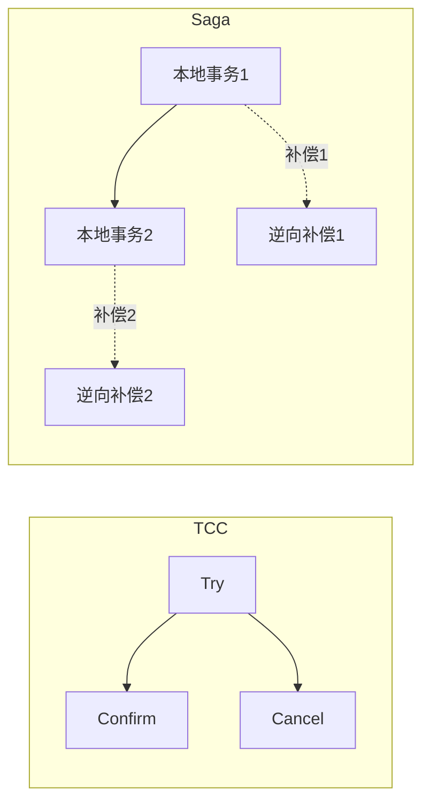
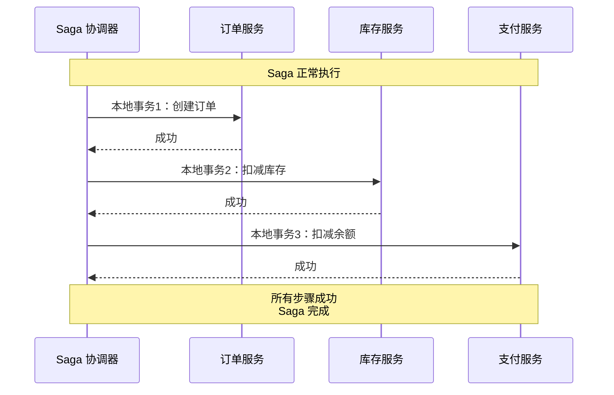
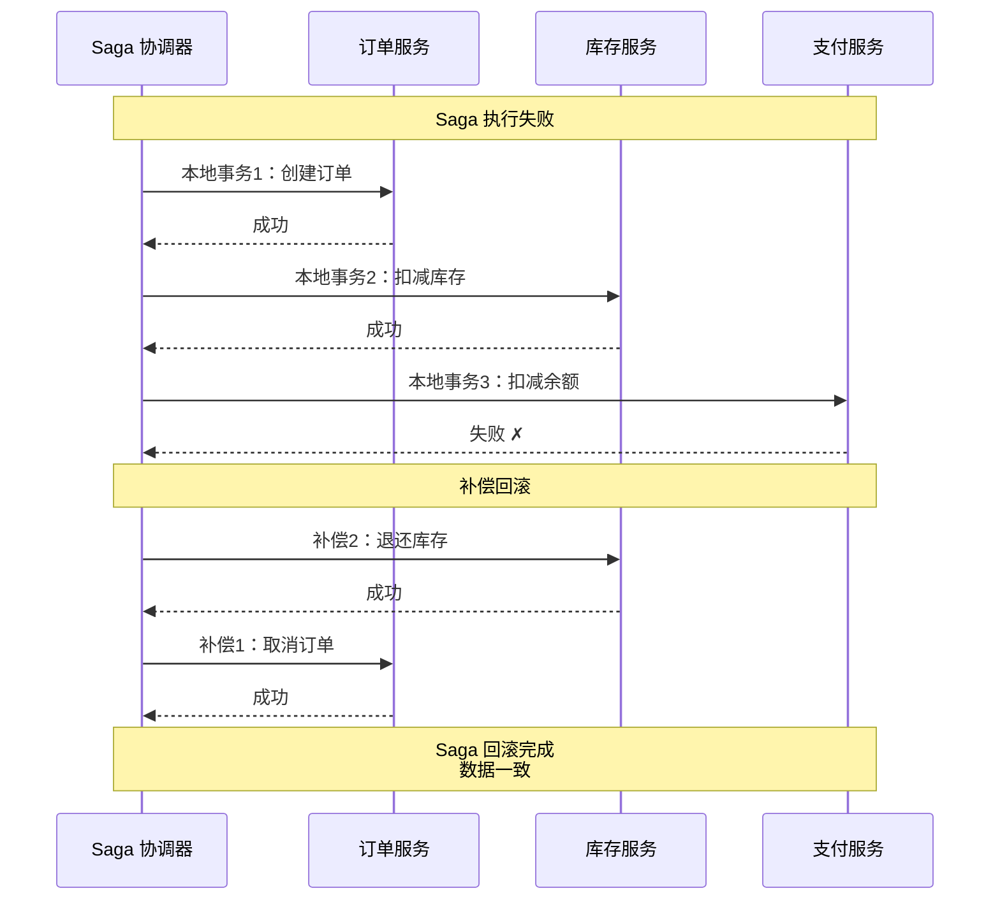
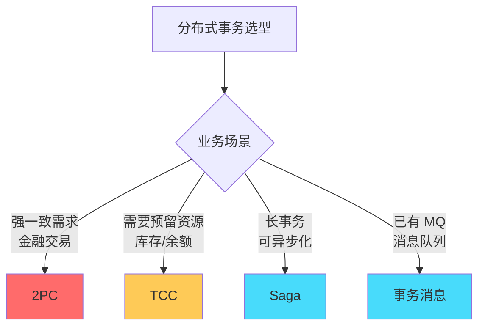

# Saga 事务：长事务的拆分与补偿

## 快速自测：面试官最关心的 3 个问题

> 🔴 **高频必考**，P6/P7 面试必问

1. **什么是 Saga 模式？它和 TCC 有什么区别？**
2. **Saga 的正向补偿和反向补偿是什么？如何设计补偿逻辑？**
3. **Saga 如何处理部分失败？如何实现回滚？**

---

## 一、Saga 的核心思想

### 1.1 什么是 Saga

Saga 模式将长事务拆分为多个本地事务，每个本地事务都有对应的补偿事务。当某个步骤失败时，通过执行前面的补偿事务来实现回滚。

```
Saga 的核心概念：

1. 长事务拆分
   - 订单服务：创建订单
   - 库存服务：扣减库存
   - 支付服务：扣减余额
   - 积分服务：发放积分

2. 本地事务 + 补偿
   - 每个步骤都是独立的本地事务
   - 每个步骤都有对应的补偿事务
   - 失败时执行补偿事务回滚

3. 最终一致
   - 不保证实时一致
   - 通过补偿实现最终一致
```

### 1.2 Saga vs TCC 对比



| 维度 | TCC | Saga |
|------|-----|------|
| **控制层面** | 资源层面 | 服务层面 |
| **资源锁定** | Try 阶段预留资源 | 无预留，直接扣减 |
| **补偿方式** | Confirm/Cancel | 逆向补偿 |
| **业务侵入** | 高（需要实现三个接口） | 中（只需实现补偿） |
| **适用场景** | 资源预留场景 | 长事务、异步场景 |
| **性能** | 中 | 高 |

---

## 二、Saga 的执行流程

### 2.1 正常流程



### 2.2 失败与补偿流程



---

## 三、Saga 的补偿设计

### 3.1 补偿的定义

```java
// Saga 步骤定义
public class SagaStep {
    private String name;           // 步骤名称
    private Runnable execute;     // 执行逻辑
    private Runnable compensate;  // 补偿逻辑
    
    public SagaStep(String name, Runnable execute, Runnable compensate) {
        this.name = name;
        this.execute = execute;
        this.compensate = compensate;
    }
}
```

### 3.2 补偿逻辑示例

```java
public class OrderSagaService {
    
    public void createOrderSaga(String orderId, BigDecimal amount) {
        // 定义 Saga 步骤
        List<SagaStep> steps = Arrays.asList(
            // 步骤 1：创建订单
            new SagaStep(
                "createOrder",
                () -> orderService.create(orderId),
                () -> orderService.cancel(orderId)
            ),
            
            // 步骤 2：扣减库存
            new SagaStep(
                "deductInventory",
                () -> inventoryService.deduct(orderId, 1),
                () -> inventoryService.refund(orderId, 1)
            ),
            
            // 步骤 3：扣减余额
            new SagaStep(
                "deductBalance",
                () -> accountService.deduct(orderId, amount),
                () -> accountService.refund(orderId, amount)
            )
        );
        
        // 执行 Saga
        sagaCoordinator.execute(steps);
    }
}
```

### 3.3 补偿的设计原则

```
补偿逻辑设计的注意事项：

1. 补偿必须是幂等的
   - 补偿可能被执行多次
   - 需要检查状态，防止重复补偿

2. 补偿应该是反向的
   - 扣减 → 退还
   - 创建 → 删除
   - 发送 → 撤回

3. 补偿应该是可重试的
   - 补偿可能失败
   - 需要有重试机��

4. 补偿可能也失败
   - 需要有最终兜底方案
   - 人工干预或死信队列
```

---

## 四、Saga 协调器实现

### 4.1 简单协调器

```java
public class SimpleSagaCoordinator {
    
    public void execute(List<SagaStep> steps) {
        List<SagaStep> completedSteps = new ArrayList<>();
        
        try {
            // 1. 按顺序执行所有步骤
            for (SagaStep step : steps) {
                step.execute();
                completedSteps.add(step);
            }
        } catch (Exception e) {
            // 2. 如果失败，执行补偿
            compensate(completedSteps);
        }
    }
    
    private void compensate(List<SagaStep> completedSteps) {
        // 3. 逆序执行补偿
        Collections.reverse(completedSteps);
        
        for (SagaStep step : completedSteps) {
            try {
                step.compensate();
            } catch (Exception e) {
                // 补偿失败，记录日志，等待重试
                log.error("补偿失败: {}", step.getName(), e);
                saveToRetryQueue(step);
            }
        }
    }
}
```

### 4.2 状态持久化协调器

```java
public class PersistentSagaCoordinator {
    
    private final SagaLogDao sagaLogDao;
    
    public void execute(List<SagaStep> steps) {
        String sagaId = UUID.randomUUID().toString();
        
        // 1. 记录 Saga 开始
        sagaLogDao.saveSaga(SagaLog.builder()
            .sagaId(sagaId)
            .status("STARTED")
            .build());
        
        List<SagaStep> completedSteps = new ArrayList<>();
        
        try {
            for (SagaStep step : steps) {
                // 2. 执行步骤前记录状态
                sagaLogDao.saveStep(sagaId, step.getName(), "EXECUTING");
                
                step.execute();
                
                // 3. 执行成功后记录
                sagaLogDao.saveStep(sagaId, step.getName(), "COMPLETED");
                completedSteps.add(step);
            }
            
            // 4. 所有步骤完成
            sagaLogDao.updateSagaStatus(sagaId, "COMPLETED");
            
        } catch (Exception e) {
            // 5. 失败时进入补偿流程
            sagaLogDao.updateSagaStatus(sagaId, "COMPENSATING");
            compensate(sagaId, completedSteps);
        }
    }
    
    private void compensate(String sagaId, List<SagaStep> completedSteps) {
        Collections.reverse(completedSteps);
        
        for (SagaStep step : completedSteps) {
            try {
                sagaLogDao.saveStep(sagaId, step.getName(), "COMPENSATING");
                step.compensate();
                sagaLogDao.saveStep(sagaId, step.getName(), "COMPENSATED");
            } catch (Exception e) {
                sagaLogDao.saveStep(sagaId, step.getName(), "COMPENSATE_FAILED");
                // 记录失败，等待重试
                scheduleRetry(sagaId, step);
            }
        }
    }
}
```

---

## 五、Saga vs 2PC/TCC 对比

### 5.1 完整对比表

| 维度 | 2PC | TCC | Saga |
|------|-----|-----|------|
| **一致性** | 强一致 | 最终一致 | 最终一致 |
| **实现复杂度** | 中 | 高 | 中 |
| **业务侵入** | 低 | 高 | 中 |
| **性能** | 低 | 中 | 高 |
| **资源锁定** | 数据库锁 | 业务预留 | 无锁 |
| **回滚方式** | 自动回滚 | Confirm/Cancel | 逆向补偿 |
| **适用场景** | 强一致 | 资源预留 | 长事务 |

### 5.2 选择指南



---

## 六、面试题精讲

### 🔴 面试题 1：Saga 模式是什么？和 TCC 有什么区别？

**答案要点**：

1. **Saga**：将长事务拆分为多个本地事务 + 补偿
2. **TCC**：Try-Confirm-Cancel，需要业务预留资源
3. **核心区别**：TCC 在资源层面控制，Saga 在服务层面控制

**追问链**：

> **第一层**：Saga 的原理是什么？
> **第二层**：Saga 和 TCC 有什么区别？
> **第三层**：Saga 适用于什么场景？

### 🔴 面试题 2：Saga 的补偿逻辑如何设计？

**答案要点**：

1. **补偿必须是幂等的**：可能被执行多次
2. **补偿应该是反向的**：扣减→退还，创建→删除
3. **补偿应该可重试**：失败后需要重试

---

## 七、实战思考题

### 思考题 1：Saga 的补偿失败处理

如果补偿在重试后仍然失败，应该如何处理？

### 思考题 2：Saga 与 Seata

Seata 的 Saga 模式是如何实现的？

---

## 扩展阅读

如果本文档对你有帮助，建议继续阅读：

- [Saga 恢复机制](/distributed/transaction/saga-recovery)：Saga 的正向/反向恢复
- [TCC 原理](/distributed/transaction/tcc)：TCC 模式详解
- [分布式事务方案选型](/distributed/transaction/selection)：完整的选型指南