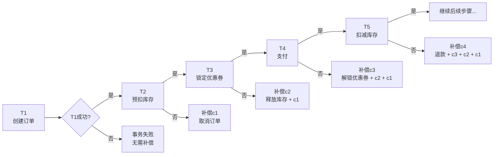
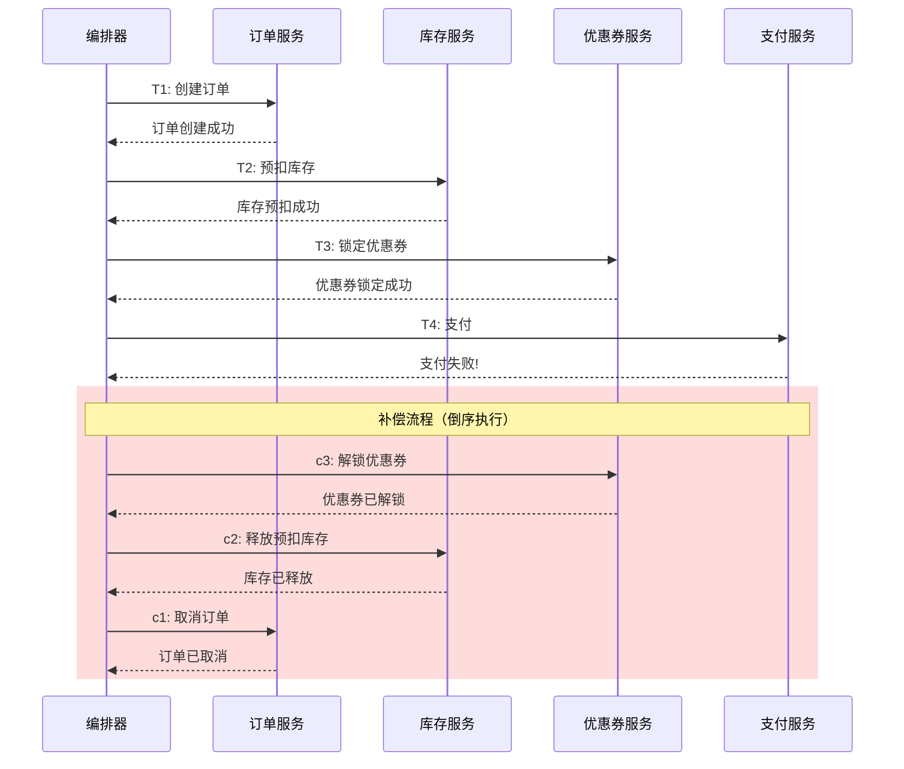
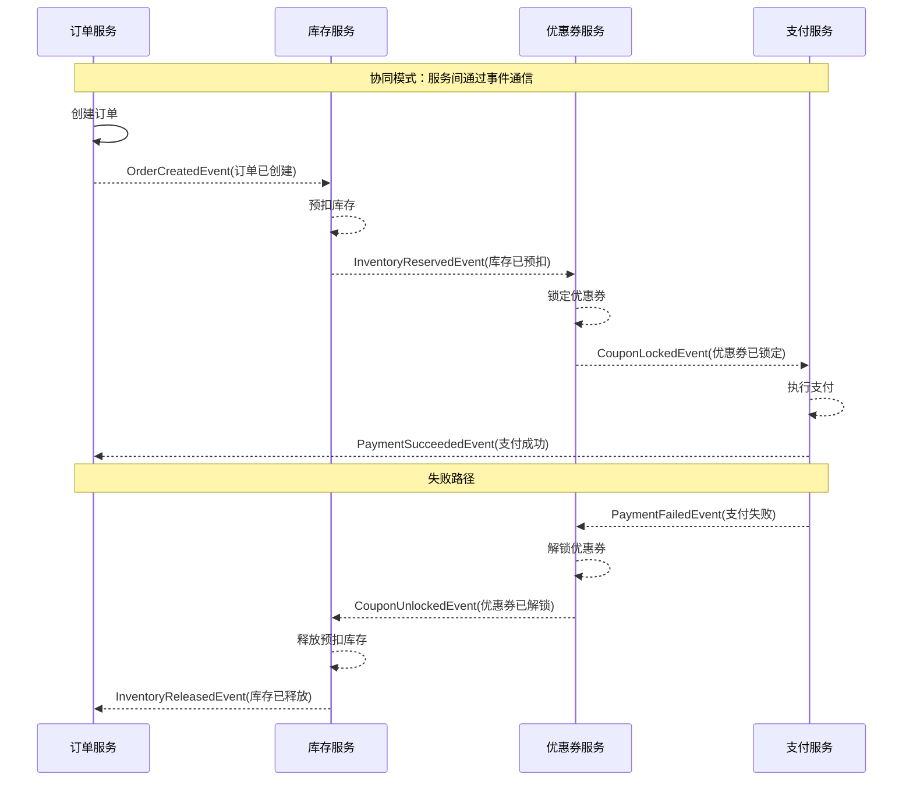
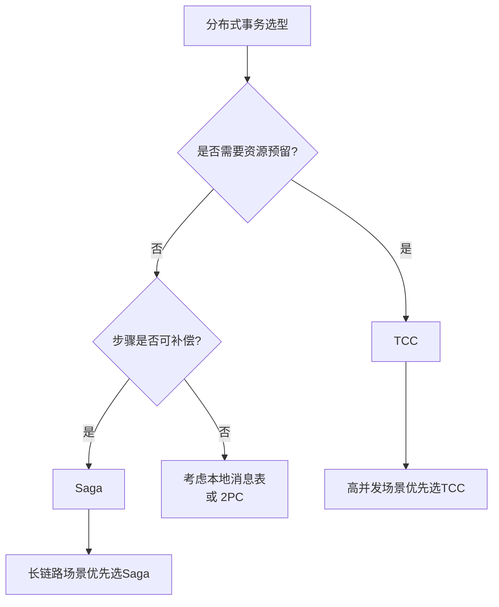

2022年，我们团队上线了一个新的订单履约系统。订单创建后，要依次经过 12 个步骤：创建订单 -> 预扣库存 -> 锁定优惠券 -> 支付 -> 扣减库存 -> 生成物流单 -> 通知商家 -> 通知仓库 -> 发送短信 -> 更新会员积分 -> 记录日志 -> 完成履约。

任何一个步骤失败，前面的步骤都要回滚。

当时的方案是 TCC。开发到一半，团队发现一个问题：优惠券服务、会员积分服务根本不适合做 TCC——它们的设计是"操作即生效"，没法"预留"和"确认"。

最后换成了 Saga。12 个步骤，每个步骤对应一个补偿操作：支付失败就退款、库存扣了就加回去、优惠券锁了就解锁。逻辑清晰，改造成本也低。

这就是 Saga 的核心：**不追求"回滚"，而是追求"补偿"。**

## 一、Saga 的核心思想

### 1.1 起源：1987 年的论文

Saga 模式最早由 Hector Garcia-Molina 和 Kenneth Salem 在 1987 年的 SIGMOD 论文《Sagas》中提出。论文的核心观点是：**对于长时间运行的事务（Long Running Transaction，LRT），不需要持有锁直到事务结束，可以用一系列短事务 + 补偿操作来代替。**

这在当时是革命性的观点。因为传统数据库事务需要长时间持有锁，对于"订单履约"这种可能持续几小时甚至几天的业务流程，锁等待是不可接受的。

### 1.2 Saga 的定义

Saga 把一个长事务拆分成 `N` 个本地事务，每个本地事务有对应的补偿操作：

```
T1 -> T2 -> T3 -> T4 -> ... -> Tn
     c1   c2   c3   ...   cn-1
```

- `T1, T2, ... Tn` 是依次执行的本地事务
- `c1, c2, ... cn-1` 是对应的补偿操作（不是回滚，是新操作）
- 如果 `Ti` 失败了，执行 `c(i-1), c(i-2), ..., c1` 逆向补偿



【架构权衡】

Saga 和 TCC 的根本区别在于**资源管理的哲学**：

- **TCC**：资源"预留"模式。Try 阶段冻结资源，Confirm 确认扣减，Cancel 解冻释放。资源在 Try 阶段就被锁定了。
- **Saga**：资源"补偿"模式。每个步骤直接操作资源，失败后用补偿操作"undo"。资源只在操作执行的瞬间被锁定。

TCC 的优点是隔离性好（资源预留后，其他操作无法访问）。缺点是需要业务支持"预留-确认-取消"三阶段语义，很多现有服务做不到。

Saga 的优点是业务侵入性低（只需提供补偿操作）。缺点是隔离性差（补偿执行前，数据已经变了，其他操作可能读到"中间状态"）。

### 1.3 补偿操作 ≠ 回滚

这是 Saga 最重要也是最容易混淆的概念。

**回滚**（Rollback）：撤销操作，使数据回到事务开始前的状态。数据库事务的回滚是通过 undo log 实现的。

**补偿**（Compensation）：执行一个新的操作，抵消前一个操作的影响。补偿不是"回到过去"，而是"走向未来"。

举例：用户支付了 100 元，支付成功后 Saga 需要补偿（退款）。补偿不是"把支付记录删掉"，而是"再执行一次退款操作"。

```java
// 补偿操作示例：支付失败的补偿不是"删除支付记录"
public class PaymentSaga {

    // T4: 支付
    public boolean pay(Order order, int amount) {
        paymentService.deduct(order.getUserId(), amount);
        order.setStatus(OrderStatus.PAID);
        orderMapper.update(order);
        return true;
    }

    // c4: 支付失败的补偿 = 退款
    public boolean compensatePay(Order order, int amount) {
        // 补偿不是"删除支付记录"
        // 补偿是"执行一次退款"
        paymentService.refund(order.getUserId(), amount);
        order.setStatus(OrderStatus.PAY_FAILED);
        orderMapper.update(order);
        return true;
    }
}
```

为什么补偿不是回滚？因为很多业务操作本身不可逆（比如短信已发送、邮件已发出），只能用补偿操作来"中和"效果。

## 二、Saga 的两种编排模式

### 2.1 编排模式（Orchestration）

编排模式有一个**编排器**（Orchestrator）来统一管理整个 Saga 的执行流程。



**编排器实现示例**：

```java
@Service
public class OrderSagaOrchestrator {

    @Autowired
    private OrderService orderService;
    @Autowired
    private InventoryService inventoryService;
    @Autowired
    private CouponService couponService;
    @Autowired
    private PaymentService paymentService;

    @Autowired
    private SagaStateMapper sagaMapper;

    /**
     * 执行订单履约 Saga
     */
    public boolean execute(OrderDTO order) {
        String sagaId = UUID.randomUUID().toString();
        SagaContext context = new SagaContext(sagaId);

        try {
            // T1: 创建订单
            step(context, "createOrder", () -> orderService.create(order));

            // T2: 预扣库存
            step(context, "reserveInventory", () -> inventoryService.reserve(order.getGoodsId(), order.getCount()));

            // T3: 锁定优惠券
            if (order.getCouponId() != null) {
                step(context, "lockCoupon", () -> couponService.lock(order.getUserId(), order.getCouponId()));
            }

            // T4: 支付
            step(context, "pay", () -> paymentService.pay(order.getUserId(), order.getAmount()));

            // T5-T12: 其他步骤...

            return true;

        } catch (SagaStepException e) {
            // 某个步骤失败，执行补偿链
            compensate(context);
            return false;
        }
    }

    private void step(SagaContext ctx, String stepName, Supplier<Boolean> action) {
        // 记录步骤开始
        ctx.recordStep(stepName, SagaStepStatus.EXECUTING);
        try {
            boolean result = action.get();
            if (result) {
                ctx.recordStep(stepName, SagaStepStatus.COMPLETED);
            } else {
                throw new SagaStepException(stepName + " returned false");
            }
        } catch (Exception e) {
            ctx.recordStep(stepName, SagaStepStatus.FAILED);
            throw new SagaStepException(stepName + " failed", e);
        }
    }

    /**
     * 补偿链：倒序执行已成功步骤的补偿操作
     */
    private void compensate(SagaContext ctx) {
        List<String> completedSteps = ctx.getCompletedSteps(); // 倒序

        for (String stepName : completedSteps) {
            try {
                switch (stepName) {
                    case "pay":
                        paymentService.refund(ctx.getOrder().getUserId(), ctx.getOrder().getAmount());
                        break;
                    case "lockCoupon":
                        couponService.unlock(ctx.getOrder().getUserId(), ctx.getOrder().getCouponId());
                        break;
                    case "reserveInventory":
                        inventoryService.release(ctx.getOrder().getGoodsId(), ctx.getOrder().getCount());
                        break;
                    case "createOrder":
                        orderService.cancel(ctx.getOrder().getId());
                        break;
                }
                ctx.recordCompensation(stepName, SagaCompensationStatus.DONE);
            } catch (Exception e) {
                ctx.recordCompensation(stepName, SagaCompensationStatus.FAILED);
                log.error("补偿 step={} 失败，sagaId={}", stepName, ctx.getSagaId(), e);
                // 补偿失败需要重试或人工介入
                throw e;
            }
        }
    }
}
```

### 2.2 协同模式（Choreography）

协同模式没有中央编排器，每个服务通过发布/订阅事件来驱动整个流程。



**协同模式实现示例**：

```java
// 订单服务：发布创建事件
@Service
public class OrderService {

    @Autowired
    private EventPublisher eventPublisher;

    public void createOrder(Order order) {
        orderMapper.insert(order);
        eventPublisher.publish("OrderCreatedEvent", order);
    }

    // 监听库存释放事件
    @Subscribe("InventoryReleasedEvent")
    public void onInventoryReleased(InventoryReleasedEvent event) {
        orderService.updateStatus(event.getOrderId(), OrderStatus.CANCELLED);
    }
}

// 库存服务：监听订单创建，执行业务
@Service
public class InventoryService {

    @Autowired
    private EventPublisher eventPublisher;

    @Subscribe("OrderCreatedEvent")
    public void onOrderCreated(OrderCreatedEvent event) {
        boolean reserved = inventoryService.reserve(event.getGoodsId(), event.getCount());
        if (reserved) {
            eventPublisher.publish("InventoryReservedEvent", event);
        } else {
            eventPublisher.publish("InventoryReserveFailedEvent", event);
        }
    }

    @Subscribe("PaymentFailedEvent")
    public void onPaymentFailed(PaymentFailedEvent event) {
        // 补偿：释放预扣库存
        inventoryService.release(event.getGoodsId(), event.getCount());
        eventPublisher.publish("InventoryReleasedEvent", event);
    }
}
```

### 2.3 编排 vs 协同：选型对比

| 维度 | 编排模式 | 协同模式 |
| --- | --- | --- |
| 复杂度 | 中等（中心化编排器） | 高（分布式状态机） |
| 可视性 | 好（编排器知道全流程状态） | 差（状态分散在多个服务） |
| 耦合度 | 低（服务只依赖编排器） | 更低（服务只发布/订阅事件） |
| 事务边界 | 清晰（编排器定义边界） | 模糊（通过事件链传递） |
| 调试难度 | 低 | 高 |
| 适用场景 | 流程固定、步骤可控 | 流程灵活、服务独立演进 |

【架构权衡】

编排模式和协同模式没有绝对的优劣，关键看业务场景：

- **步骤多、流程固定**：用编排模式。编排器把所有步骤串起来，可视性好，调试方便。
- **步骤多、服务独立演进**：用协同模式。服务之间通过事件通信，耦合度更低，但调试困难。

我们的订单履约系统有 12 个步骤，流程相对固定，所以选择了编排模式。编排器的代码虽然多，但所有异常处理、补偿逻辑都集中在一处，出问题好排查。

## 三、与 TCC 的关键区别

Saga 和 TCC 都是分布式事务的解决方案，但设计哲学和适用场景有显著差异：

| 维度 | TCC | Saga |
| --- | --- | --- |
| 资源管理 | 预留模式（Try 冻结资源） | 补偿模式（直接操作+补偿） |
| 业务侵入 | 高（需实现 Try/Confirm/Cancel） | 中（只需实现正向+补偿） |
| 隔离性 | 好（资源预留后隔离） | 差（无预留，数据可能脏读） |
| 适用场景 | 资源预留场景（库存、余额） | 长链路、可补偿场景（履约、营销） |
| 一致性 | 准强一致（可做到） | 最终一致（默认） |
| 补偿复杂度 | 低（Cancel 解冻即可） | 高（需要写补偿逻辑） |
| 架构师评价 | 性能好但改造成本高 | 改造成本低但隔离性差 |



:::tip
选 Saga 还是 TCC，有个简单的判断标准：**你的业务操作是否支持"预留-确认-取消"三阶段语义？**

如果支持（比如库存扣减、余额冻结），选 TCC，性能和隔离性更好。

如果不支持（比如优惠券核销、短信发送、会员积分更新），选 Saga，用补偿操作代替回滚。
:::

## 四、Saga 的适用场景

Saga 最适合的场景：**长链路、可异步化、业务步骤可补偿。**

### 4.1 典型场景

**场景一：订单履约链路**

```
创建订单 -> 预扣库存 -> 锁定优惠券 -> 支付 -> 扣减库存 -> 生成物流单 -> 通知商家 -> ... -> 完成
```

每个步骤都对应一个补偿：取消订单、释放预扣库存、解锁优惠券、退款、加回库存、取消物流单……

**场景二：营销活动链路**

```
发放优惠券 -> 扣除用户积分 -> 记录活动参与 -> 发送通知 -> 发放奖励 -> 完成
```

优惠券发出去了但积分不够扣？补偿：收回优惠券、退回积分。

**场景三：金融开户链路**

```
用户注册 -> 实名认证 -> 开户 -> 绑定银行卡 -> 设置支付密码 -> 完成
```

任何一步失败，前面的步骤依次补偿。

### 4.2 不适合 Saga 的场景

- **强一致性要求**：Saga 是最终一致，不是强一致。如果业务要求"扣款和扣库存必须同时成功或同时失败"，Saga 不适合。
- **不可补偿的操作**：比如发送验证码、写入日志、发送短信（用户已经收到了），这些操作无法补偿。
- **嵌套事务**：Saga 不支持嵌套子事务，所有步骤是扁平的。

:::warning
Saga 有一个致命的弱点：**隔离性差。** 在补偿执行前，数据已经变了，其他操作可能读到"中间状态"。

比如：T4 支付成功了，T5 扣减库存失败了。补偿执行前，用户的账户已经扣了钱，但订单还没完成。此时用户查询订单状态，看到的是"已支付"但"库存未扣减"。

TCC 通过资源预留避免了这个问题（资源被冻结后，其他操作无法访问）。Saga 没有这个机制，需要业务层自行兜底（比如悲观锁、乐观锁、或者接受短暂的数据不一致）。
:::

## 五、工程代价评估

| 维度 | 评估 |
| --- | --- |
| 运维成本 | 高。需要监控每个 Saga 实例的状态、补偿执行情况。 |
| 排障复杂度 | 高。补偿链可能很长，需要分布式链路追踪。 |
| 扩展性 | 好。步骤可并行（无锁），性能随参与者线性扩展。 |
| 回滚风险 | 中。补偿逻辑写错会导致数据不一致。 |
| 业务改造 | 中等。需要实现正向操作和补偿操作，不需要预留语义。 |

【架构权衡】

Saga 的核心优势是**业务侵入性低**。相比于 TCC 需要改造每个服务实现 Try/Confirm/Cancel，Saga 只需要：

1. 写正向操作（业务代码，本来就要写）
2. 写补偿操作（新增，成本可控）

所以对于**长链路履约场景**，Saga 往往是比 TCC 更务实的选择。我们的 12 步订单履约链路，用 TCC 改造需要改 6~8 个服务，每个服务加 3 个接口。用 Saga 改造只需要改编排器 + 补偿逻辑，服务本身的改动很小。

代价是 Saga 需要开发者**精心设计补偿操作**——补偿逻辑写错了，数据就会不一致。这比 TCC 的"Cancel 解冻"要复杂得多。

:::tip
Saga 选型前问自己三个问题：(1) 每个步骤都是可补偿的吗？(2) 业务能接受最终一致而非强一致吗？(3) 有能力维护复杂的补偿链吗？如果三个答案都是"是"，Saga 是个好选择。
:::

## 六、面试回答范式

面试时 Saga 相关问题的回答结构：

```
1. Saga 是什么（1句话）
   "Saga 把长事务拆成一连串本地事务，每个事务有对应的补偿操作，
    失败后逆序执行补偿。"

2. 与 TCC 的区别（2句话）
   "TCC 是资源预留模式，Try 冻结资源，Confirm 确认，Cancel 解冻；
    Saga 是补偿模式，正向直接操作，失败后用补偿操作 undo。
    Saga 业务侵入性更低，但隔离性更差。"

3. 补偿不是回滚（1句话）
   "补偿是执行一个新操作来抵消前一个操作的影响，不是回滚。
    比如支付失败的补偿是退款，不是删除支付记录。"

4. 适用场景（1句话）
   "Saga 适合长链路、可异步化、步骤可补偿的场景，如订单履约链路。
    不适合强一致性要求或不可补偿操作的场景。"
```
