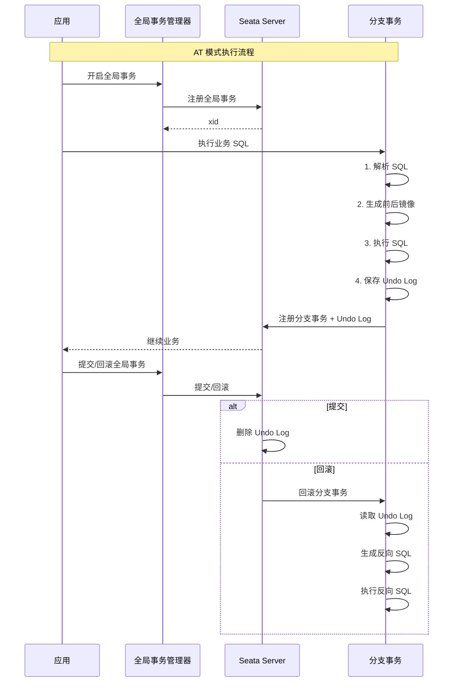
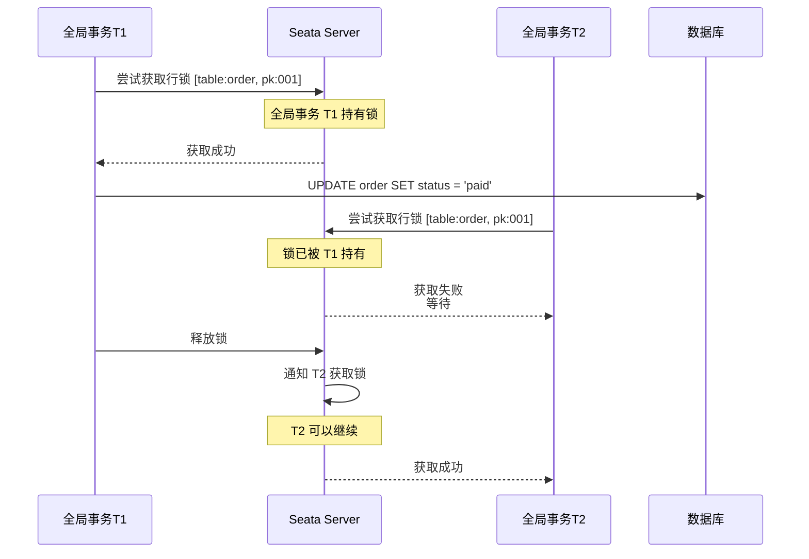

# Seata AT 模式：自动补偿的分布式事务

## 快速自测：面试官最关心的 3 个问题

> 🟡 **中频常考**，P6/P7 面试可能问

1. **Seata AT 模式是如何工作的？它和 TCC 有什么区别？**
2. **AT 模式的回滚日志表是什么？全局锁的作用是什么？**
3. **AT 模式适用于什么场景？有什么局限性？**

---

## 一、Seata AT 模式概述

### 1.1 什么是 AT 模式

Seata AT 模式是一种自动补偿的分布式事务模式，用户只需关注业务 SQL，Seata 会自动生成回滚日志并执行补偿。

```
AT 模式的核心思想：

1. 用户编写业务 SQL（和本地事务一样）
2. Seata 自动拦截 SQL，记录前后镜像
3. 生成回滚日志（Undo Log）
4. 事务失败时自动回滚
```

### 1.2 AT vs TCC

| 维度 | AT 模式 | TCC 模式 |
|------|---------|---------|
| **开发体验** | 好（像本地事务） | 一般（需实现三个接口） |
| **侵入性** | 低 | 高 |
| **性能** | 高 | 中 |
| **一致性** | 最终一致 | 最终一致 |
| **适用场景** | SQL 场景 | 非 SQL 场景 |
| **资源锁定** | 全局锁 | 业务预留 |

---

## 二、AT 模式的工作原理

### 2.1 执行流程



### 2.2 前后镜像（Before/After Image）

```sql
-- 业务 SQL
UPDATE order SET status = 'paid' WHERE id = 'order-001' AND user_id = 'user-001';

-- Seata 自动生成前后镜像：

-- 执行前查询（Before Image）
SELECT id, status, user_id FROM order WHERE id = 'order-001';

-- 执行���查询（After Image）
SELECT id, status, user_id FROM order WHERE id = 'order-001';

-- Undo Log 记录：
{
    "beforeImage": {
        "rows": [{"id": "order-001", "status": "pending", "user_id": "user-001"}]
    },
    "afterImage": {
        "rows": [{"id": "order-001", "status": "paid", "user_id": "user-001"}]
    }
}
```

### 2.3 回滚日志表结构

```sql
-- 回滚日志表结构
CREATE TABLE undo_log (
    id BIGINT NOT NULL AUTO_INCREMENT PRIMARY KEY,
    branch_id BIGINT NOT NULL,
    xid VARCHAR(100) NOT NULL,
    context VARCHAR(500) NOT NULL,
    rollback_info LONGBLOB NOT NULL,  -- 前后镜像数据
    log_status INT NOT NULL,
    log_created TIMESTAMP NOT NULL DEFAULT CURRENT_TIMESTAMP,
    log_modified TIMESTAMP NOT NULL DEFAULT CURRENT_TIMESTAMP ON UPDATE CURRENT_TIMESTAMP,
    UNIQUE KEY uidx_xid (xid, branch_id)
);
```

---

## 三、全局锁机制

### 3.1 全局锁的作用

Seata AT 模式使用全局锁来保证隔离性，防止脏写。

```
全局锁的作用：

1. 防止脏写
   - 分支事务 A 在修改某行
   - 全局事务 B 不能同时修改同一行
   
2. 实现隔离性
   - 类似 MVCC，但范围更大
   - 需要全局范围内的排他锁
```

### 3.2 全局锁的获取



### 3.3 全局锁的局限性

```
全局锁的性能问题：

1. 锁粒度大
   - 全局锁范围覆盖整个集群
   - 而不是单个数据库实例
   
2. 并发度下降
   - 跨全局事务的并发写入受限
   - 高并发场景可能成为瓶颈
   
3. 死锁风险
   - 多个全局事务可能死锁
   - 需要 Seata Server 检测和处理
```

---

## 四、AT 模式的使用示例

### 4.1 配置 Seata

```yaml
# application.yml
spring:
  datasource:
    driver-class-name: com.mysql.cj.jdbc.Driver
    url: jdbc:mysql://localhost:3306/seata-demo?useSSL=false
    username: root
    password: password

# Seata 配置
seata:
  enabled: true
  application-id: seata-demo
  tx-service-group: my-test-tx-group
  config:
    type: nacos
    nacos:
      namespace: ""
      server-addr: 127.0.0.1:8848
  registry:
    type: nacos
    nacos:
      application: seata-server
      server-addr: 127.0.0.1:8848
```

### 4.2 业务代码

```java
@GlobalTransactional
public void createOrder(OrderDTO order) {
    // 1. 创建订单
    Order orderEntity = new Order();
    orderEntity.setId(order.getId());
    orderEntity.setStatus("CREATED");
    orderEntity.setAmount(order.getAmount());
    orderDao.insert(orderEntity);
    
    // 2. 扣减库存（自动生成 Undo Log）
    inventoryDao.deductStock(order.getProductId(), order.getQuantity());
    
    // 3. 扣减余额（自动生成 Undo Log）
    accountDao.deductBalance(order.getUserId(), order.getAmount());
    
    // 4. 任何一步失败，Seata 会自动回滚
}
```

### 4.3 AT 模式的特点

```
AT 模式的优点：
1. 对业务代码无侵入
2. 使用简单，类似本地事务
3. 自动生成回滚日志

AT 模式的缺点：
1. 只能支持关系型数据库
2. 全局锁可能影响性能
3. 不支持高并发写入同一行
```

---

## 五、面试题精讲

### 🟡 面试题 1：Seata AT 模式是如何工作的？

**答案要点**：

1. **自动生成 Undo Log**：拦截 SQL，记录前后镜像
2. **全局锁**：保证隔离性，防止脏写
3. **自动回滚**：事务失败时，根据 Undo Log 生成反向 SQL

### 🟡 面试题 2：AT 模式和 TCC 模式有什么区别？

**答案要点**：

1. **侵入性**：AT 低，TCC 高
2. **实现方式**：AT 自动生成，TCC 手动实现
3. **资源锁定**：AT 全局锁，TCC 业务预留

---

## 扩展阅读

如果本文档对你有帮助，建议继续阅读：

- [Seata TCC 模式](/distributed/transaction/seata-tcc)：Seata TCC 实现
- [分布式事务方案选型](/distributed/transaction/selection)：完整选型指南