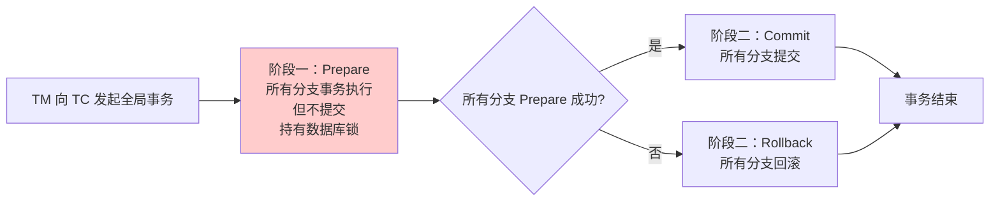
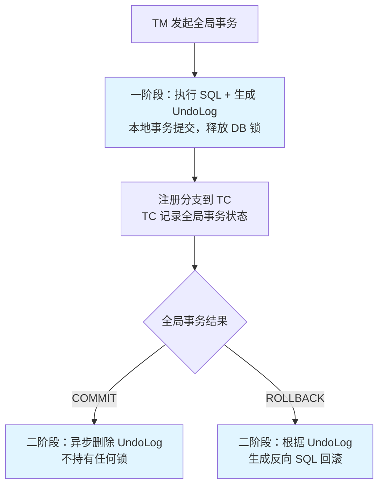
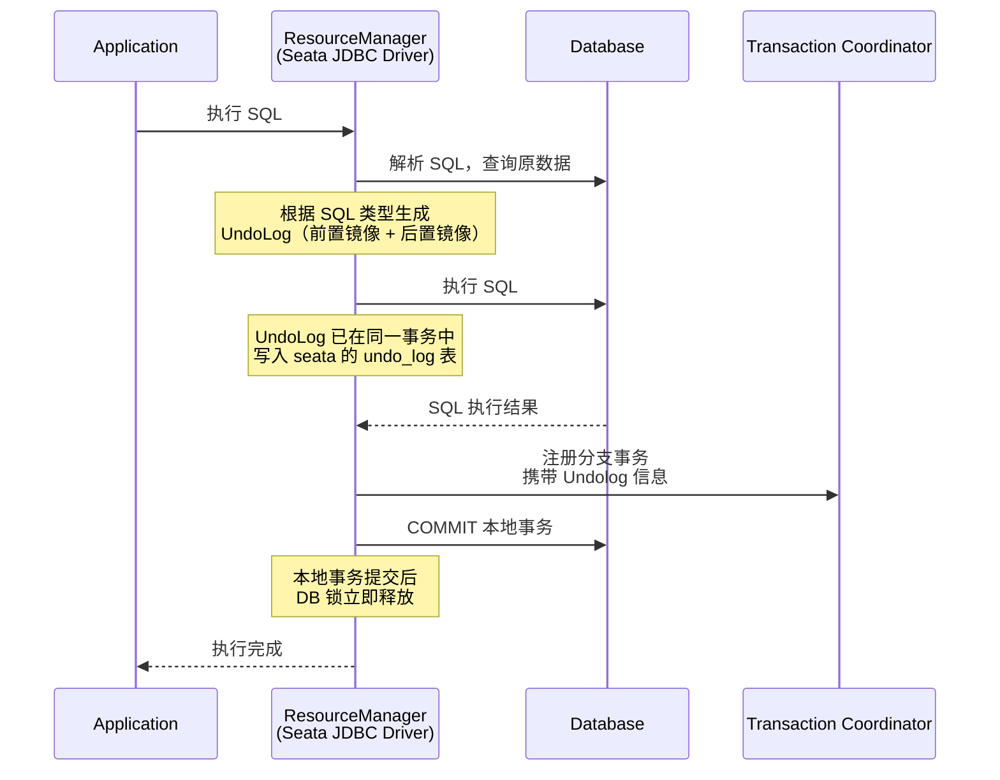
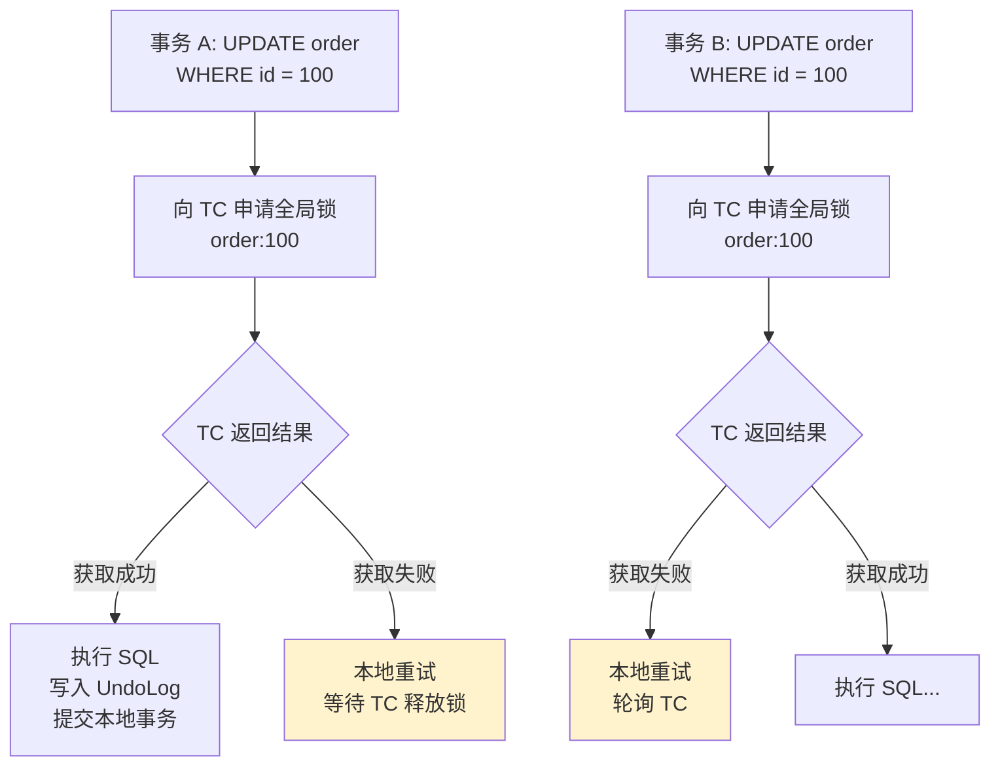
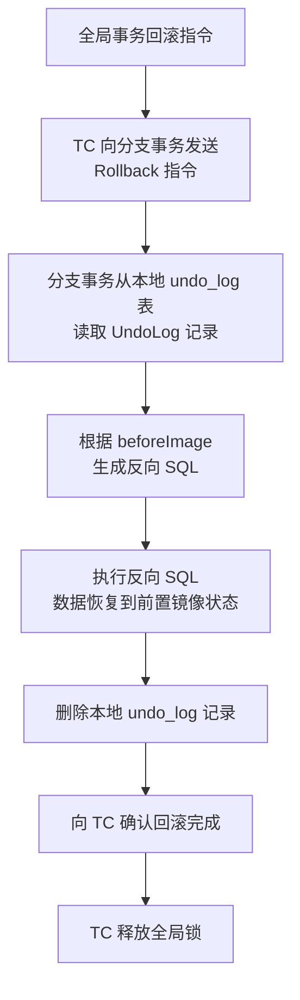

## 问题背景

2024年618大促前夕，我们团队将订单服务迁移到 Seata AT 模式来处理分布式事务。灰度第一天晚上，运维告警发现订单服务的 RT（响应时间）从 20ms 飙升到 800ms，DBA 报告数据库出现了大量锁等待。

更诡异的是：数据库里只有 3 个表，总共不到 100 个连接池，但锁等待的数量超过了 500。

排查了一整夜才发现根因：两个用户同时下单，触发了跨库的分布式事务。A 分支事务持有表 A 的某行锁，B 分支事务持有表 B 的某行锁，但两个事务互相等待对方的全局锁——经典的死锁，但这次死的是**全局锁**，而不是数据库本地锁。

```java
// 事故代码
@Transactional(rollbackFor = Exception.class)
public void placeOrder(OrderDTO dto) {
    orderService.create(dto);       // 分支事务 1: 操作 order 表
    inventoryService.deduct(dto);   // 分支事务 2: 操作 inventory 表
    paymentService.charge(dto);     // 分支事务 3: 操作 payment 表
}
```

三个分支事务分别持有各自数据库的本地锁，同时等待 TC（Transaction Coordinator）颁发的全局锁。由于 Seata AT 模式的全局锁是 **First-Begin-Wins** 策略，两个并发事务都在等待对方的锁，形成了**循环等待**，最终死锁。

这次事故让我们彻底重新审视了 Seata AT 模式的设计原理和局限性。

【架构权衡】
AT 模式最大的卖点是"业务无感知"——你像写普通 SQL 一样写代码，Seata 自动帮你管理分布式事务。但代价是**全局锁**。这把双刃剑在高并发场景下会严重限制吞吐量。理解 AT 模式的本质，是正确使用它的前提。

## 问题定义

Seata AT 模式解决的是"如何在不改变业务代码的情况下，实现分布式事务的一致性"。

传统的分布式事务方案（如 2PC/TCC）对业务代码侵入严重——你需要显式编写分支事务的提交/回滚逻辑。而 AT 模式通过**解析 SQL + 自动生成 UndoLog** 的方式，让业务代码完全不用改。

但 AT 模式不是 2PC！这是面试和实际使用中最容易混淆的点。

## AT 模式与 2PC 的本质区别

2PC（两阶段提交）的事务流程是：



2PC 的核心问题是：**阶段一（Prepare）会持有数据库锁直到阶段二结束**。如果 TC 在阶段一和阶段二之间挂了，所有分支事务的数据库锁都会悬挂，系统hang住。

AT 模式的本质是**一阶段执行 + 二阶段异步删除 UndoLog**：



**关键区别**：AT 模式在**一阶段就提交了本地事务、释放了数据库锁**。二阶段只是善后操作（删 UndoLog 或执行回滚），不需要再持有数据库锁。

:::tip 💡
这就是 AT 模式比传统 2PC 性能好的根本原因：数据库本地锁的持有时间极短（只有 SQL 执行的时间，通常毫秒级），大部分时间锁是在 TC 的协调器层面管理的，而不是在数据库层面。
:::

## 核心设计

### 分支事务的执行流程

AT 模式的分支事务执行分为四个步骤：



具体来看一条 Update SQL 的 UndoLog 是怎么生成的：

```java
// Seata AT 模式会自动拦截你的 SQL
// 假设你执行了这条 SQL：
UPDATE order SET status = 'PAID' WHERE id = 100;

// Seata 的 DataSourceProxy 会：
// ① 执行前查询：SELECT * FROM order WHERE id = 100;
//    → 生成前置镜像 (before_image)
// ② 执行这条 UPDATE
// ③ 执行后查询：SELECT * FROM order WHERE id = 100;
//    → 生成后置镜像 (after_image)
// ④ 将两个镜像写入 undo_log 表（在同一个本地事务中）
```

生成的 UndoLog 结构：

```json
{
  "id": "uuid-xxx",
  "transactionId": "global-tx-id",
  "branchId": "branch-1",
  "undoItems": [
    {
      "tableName": "order",
      "beforeImage": {
        "id": 100,
        "status": "PENDING",
        "amount": 100.00
      },
      "afterImage": {
        "id": 100,
        "status": "PAID",
        "amount": 100.00
      }
    }
  ]
}
```

当全局事务需要回滚时，Seata 会根据 `beforeImage` 生成反向 SQL：

```sql
-- Seata 自动生成的反向 SQL
UPDATE order SET status = 'PENDING' WHERE id = 100;
```

### 全局锁的设计

Seata AT 模式引入了一个**全局锁**的概念，这是理解 AT 模式性能问题的关键。

全局锁由 TC（Transaction Coordinator）维护，不是数据库的本地锁。TC 维护了一个全局锁表：

```sql
-- 全局锁表（Seata Server 侧）
lock_table (
    row_key,         -- 锁定行的唯一标识: 表名:主键值 (如 order:100)
    xid,             -- 全局事务 ID
    branch_id,       -- 分支事务 ID
    resource_id,     -- 数据库资源 ID
    table_name,      -- 表名
    pk               -- 主键值
)
```



全局锁的获取发生在**一阶段执行 SQL 之前**。这意味着：即使数据库本地锁在一阶段结束后就释放了，全局锁仍然被持有，直到全局事务结束。

:::warning ⚠️
这就是我们团队618翻车的根因：两个并发事务分别持有不同表（order 和 inventory）的全局锁，但它们各自还需要获取对方的全局锁才能继续——形成了循环等待。Seata 的全局锁不检测死锁，只按申请顺序排队，导致死锁发生。
:::

**全局锁的隔离级别**：AT 模式提供的是**读已提交（Read Committed）** 级别的全局一致性，而不是可串行化（Serializable）。不同全局事务可以同时修改不同行的数据，但同一行数据在同一时刻只能被一个全局事务修改。

### 回滚机制

AT 模式的回滚完全依赖 UndoLog，不需要网络通信去其他节点协调：



回滚是**纯本地操作**，不需要访问其他数据库或服务。这使得 AT 模式的回滚速度非常快，通常在毫秒级完成。

## AT 模式 vs TCC 模式

很多团队在选型时会纠结用 AT 还是 TCC。来看对比：

| 维度 | AT 模式 | TCC 模式 |
|------|---------|----------|
| 代码侵入 | 无（自动解析 SQL） | 高（需实现 Try/Confirm/Cancel） |
| 一致性 | 强最终一致（全局锁保障） | 强最终一致（资源预留） |
| 性能 | 中等（全局锁是瓶颈） | 高（无锁设计） |
| 全局锁 | 需要 | 不需要 |
| 回滚方式 | 自动（基于 UndoLog） | 手动（开发者编写） |
| 适用场景 | Java + SQL 的业务 | 所有语言、所有资源类型 |
| 跨语言支持 | 仅 Java（依赖 JDBC） | 支持（RPC 调用即可） |
| 故障恢复 | 自动（UndoLog 在本地） | 需处理悬挂、空回滚 |

【架构权衡】
AT 模式的本质是"**用全局锁换业务无感知**"。如果你追求极致的性能和跨语言支持，选择 TCC。如果你追求开发效率和代码简洁，且业务场景不涉及极端高并发，选择 AT。需要注意的是，AT 模式不支持以下场景：跨库事务（两个不同数据库实例的事务）、非 DB 资源（Redis、MQ 等）、不支持的 SQL 语法（不支持触发器、存储过程、批量条件更新）。

## 生产避坑

### 坑一：全局锁导致的并发退化

这是 AT 模式最常见的问题。在高并发场景下，全局锁会成为系统的性能瓶颈。

**症状**：数据库连接池使用正常，但 RT 飙升，大量 SQL 执行时间正常但整体响应极慢。

**根因**：全局锁排队。QPS 越高，等待全局锁的事务就越多。

**解决方案**：

1. **降低全局事务的复杂度**——减少单个全局事务涉及的分支数量
2. **使用低粒度的主键**——避免范围查询（如 `WHERE status = 'PENDING'`）锁定大量行
3. **开启分支事务异步执行**——Seata 支持 AT 模式的分支事务异步注册，但需要评估数据一致性风险
4. **切到 TCC 模式**——对于性能要求极高的场景

```java
// ❌ 低效：范围查询会锁定大量行
@GlobalTransactional
public void batchUpdate() {
    orderMapper.updateStatusByCondition("PENDING", "PROCESSING");
}

// ✅ 高效：逐行更新，每次只锁一行
@GlobalTransactional
public void batchUpdate() {
    List<Order> orders = orderMapper.selectByStatus("PENDING");
    for (Order order : orders) {
        order.setStatus("PROCESSING");
        orderMapper.update(order);
    }
}
```

### 坑二：undo_log 表膨胀

在高频写入场景下，undo_log 表会快速膨胀。如果清理策略不当，会占用大量存储空间。

```yaml
# seata server 配置
store:
  db:
    globalTable: global_table
    branchTable: branch_table
    lockTable: lock_table
    undolog:
      undoLogTableName: undo_log
      undoLogDeletePeriod: 86400000  # 24 小时清理一次 UndoLog
```

### 坑三：与读写分离数据源冲突

如果你的数据库配置了**读写分离**（主库写入、从库读取），Seata AT 模式必须使用 `DataSourceProxy`，且所有事务操作必须路由到**主库**。否则会导致读取不到已写入的数据（主从延迟）或 UndoLog 和业务数据不在同一个数据库实例中。

```java
// ✅ 正确：使用 DataSourceProxy 确保所有操作走主库
public DataSourceProxy dataSourceProxy(DataSource dataSource) {
    return new DataSourceProxy(dataSource);
}

// ❌ 错误：读写分离的数据源没有包裹 DataSourceProxy
@Bean
public DataSource routingDataSource(...) {
    // 这个会被 Seata 拦截，但读写分离逻辑可能失效
}
```

## 工程代价

| 维度 | 评估 |
|------|------|
| 运维成本 | 高。需要额外部署 Seata Server（TC）；TC 本身也需要高可用部署；undo_log 表需要定时清理 |
| 排障复杂度 | 中等。Seata 提供 Web 控制台查看全局事务状态；但全局锁等待没有很好的监控指标 |
| 扩展性 | 受全局锁限制。高并发场景下 TC 和全局锁会成为瓶颈。Seata 推荐全局事务控制在 20 个分支以内 |
| 回滚风险 | 低。UndoLog 在本地，TC 挂了不影响分支事务的本地执行 |

## 落地 Checklist

- [ ] 部署 Seata Server（TC），推荐至少 3 节点高可用
- [ ] 所有业务数据库创建 undo_log 表（Seata 提供建表 SQL）
- [ ] 将业务 DataSource 替换为 DataSourceProxy
- [ ] 全局事务方法添加 `@GlobalTransactional` 注解
- [ ] 设置合理的 `lockRetryTimeout`（全局锁获取超时，默认 3000ms）
- [ ] 评估业务场景是否适合 AT 模式（不支持跨库、非 DB 资源）
- [ ] 配置 undo_log 表的定时清理任务
- [ ] 在监控平台配置全局事务成功率和 RT 告警
- [ ] 上线前做全局锁的压测，确认不会成为瓶颈
