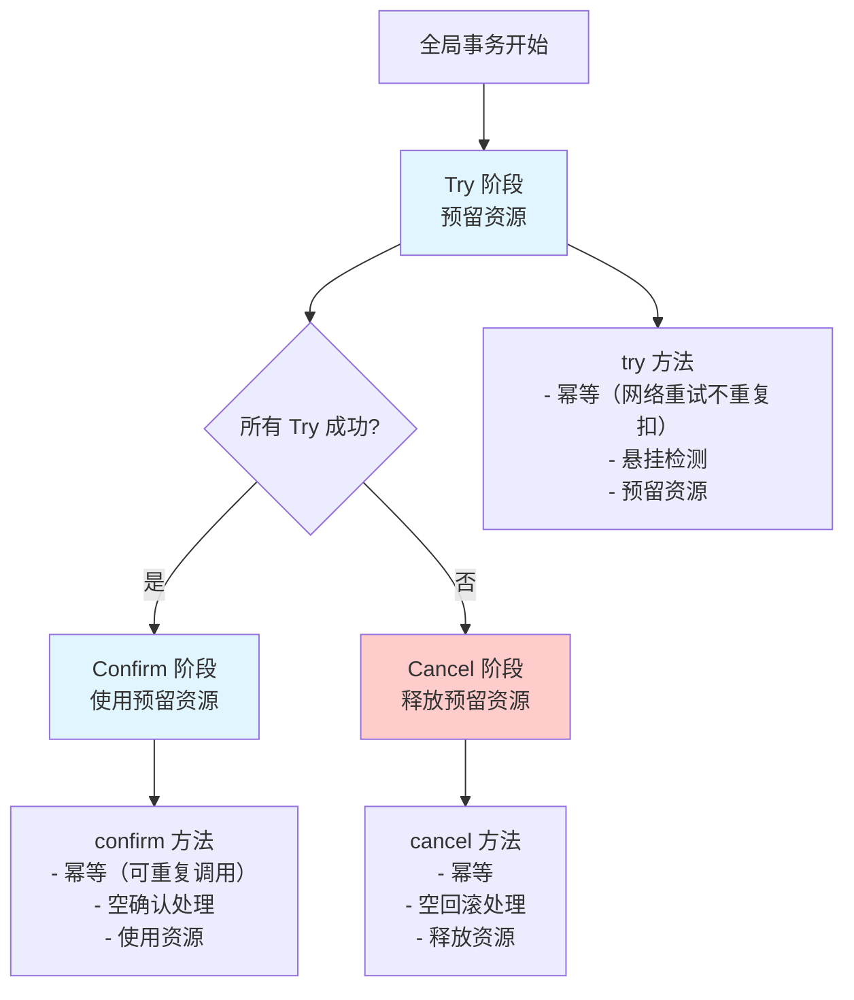
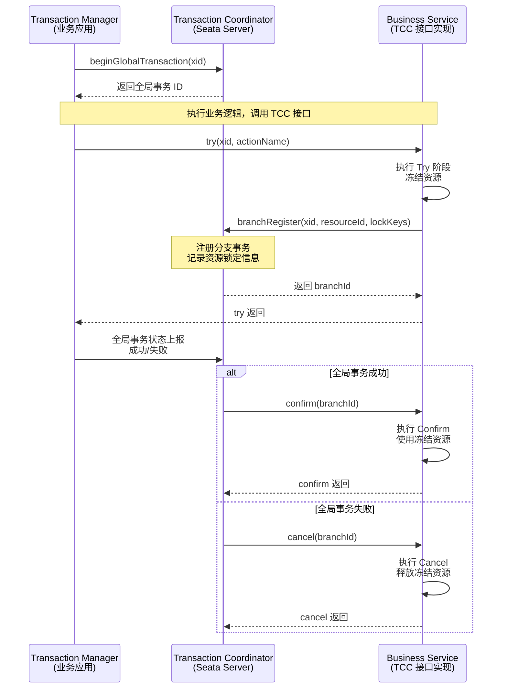
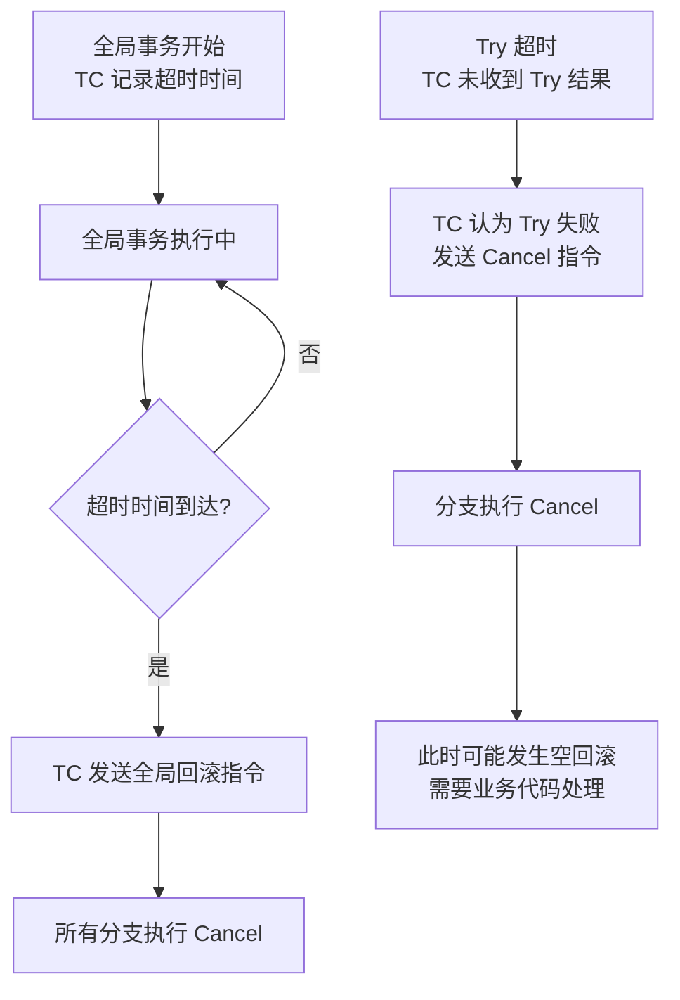

## 问题背景

2024年3月，我们团队在一个库存扣减场景中引入了 Seata TCC 模式。业务逻辑是：用户下单时，预扣库存 -> 创建订单 -> 扣减账户余额。设计初衷是 TCC 模式没有全局锁，性能应该比 AT 模式好。

灰度上线第三天，运营同学发现了一个诡异的问题：有一批订单的库存被扣了，但订单状态是"已取消"。更诡异的是，这些订单的取消时间是**早于下单时间**的。

排查了 4 个小时，终于定位到根因——**空回滚**。

```java
// 库存 TCC 接口实现
@LocalTCC
public interface InventoryTccService {
    @TwoPhaseBusinessAction(
        name = "deductInventory",
        commitMethod = "confirm",
        rollbackMethod = "cancel"
    )
    boolean try(DeductDTO dto, BusinessActionContext context);

    boolean confirm(BusinessActionContext context);
    boolean cancel(BusinessActionContext context);
}

// ❌ 错误的 cancel 实现
@Override
public boolean cancel(BusinessActionContext context) {
    Long productId = Long.parseLong(context.getActionName());
    // 这里直接执行了"归还库存"操作
    // 但问题是：try 阶段可能根本没执行成功
    inventoryMapper.restore(productId, 1);
    return true;
}
```

问题的时序是这样的：

1. Try 阶段超时或失败，TC 认为分支事务失败，向参与者发送 Cancel 指令
2. 但实际上 Try 的网络包已经到达了库存服务，只是响应超时了
3. 库存服务收到 Cancel 时，**实际的库存扣减已经发生了**（Try 执行成功，只是回包丢了）
4. Cancel 执行了"归还库存"操作，导致**库存被多还了 1 个**

这次事故让我们意识到：TCC 模式虽然看起来简单（Try/Confirm/Cancel 三个接口），但空回滚和防悬挂的处理比想象中复杂得多。

【架构权衡】
Seata TCC 与独立 TCC（如 Hmily、ByteTCC）的核心区别在于**TC 的统一协调能力**。Seata TC 提供了全局事务管理、状态持久化、可视化监控等基础设施，让 TCC 的落地门槛大幅降低。但这也意味着你需要理解 Seata TC 的工作原理，否则会踩到空回滚、悬挂等经典 TCC 陷阱。

## 问题定义

TCC（Try-Confirm-Cancel）是一种**补偿式**的分布式事务方案。其核心思想是：将一个分布式事务拆分为三个阶段：

- **Try**：预留资源（锁定资源、预扣库存等），所有参与者的 Try 都成功，整个事务才能进入 Confirm 阶段
- **Confirm**：确认执行，使用 Try 阶段预留的资源（真正扣减库存、真正转账等）
- **Cancel**：取消执行，释放 Try 阶段预留的资源（归还库存、撤销冻结金额等）

TCC 与 AT 模式的关键区别在于：**TCC 不依赖数据库锁**，资源的锁定和释放完全由业务代码控制。

## 核心设计

### TCC 三个接口的设计原则

TCC 的三个接口各有明确的职责和幂等性要求：



**Try 接口的职责**：

```java
@TwoPhaseBusinessAction(
    name = "deductInventory",
    commitMethod = "confirm",
    rollbackMethod = "cancel",
    commitArgs = {},       // 传给 confirm 的参数
    rollbackArgs = {}      // 传给 cancel 的参数
)
public boolean try(DeductDTO dto, BusinessActionContext context) {
    // ① 幂等检查：如果这笔 Try 已经执行过，直接返回成功
    if (tccLogService.exists(context.getXid(), context.getBranchId())) {
        return true;
    }

    // ② 悬挂检查：如果 cancel 已经执行过，try 不应该再执行
    // 通过查询 TCC 日志判断
    if (tccLogService.isCancelled(context.getXid())) {
        return false;
    }

    // ③ 预留资源：冻结库存，而非直接扣减
    inventoryMapper.freeze(dto.getProductId(), dto.getQuantity());

    // ④ 记录 TCC 日志（用于幂等和悬挂检测）
    tccLogService.save(context.getXid(), context.getBranchId(), "TRY");

    return true;
}
```

**Confirm 接口的职责**：

```java
public boolean confirm(BusinessActionContext context) {
    // ① 幂等检查：如果已经 confirm 过，直接返回成功
    if (!tccLogService.exists(context.getXid(), context.getBranchId())) {
        return true; // 说明 Try 失败了，没进入 confirm 是正常的
    }

    // ② 使用预留资源：将冻结的库存转为真正扣减
    Long productId = Long.parseLong(context.getActionName());
    Integer quantity = (Integer) context.getActionContext().get("quantity");

    // confirm 只需要执行一次：将 frozen 减掉，actual 扣减
    inventoryMapper.confirmDeduct(productId, quantity);

    // ③ 更新 TCC 日志状态
    tccLogService.updateStatus(context.getXid(), context.getBranchId(), "CONFIRMED");

    return true;
}
```

**Cancel 接口的职责**：

```java
public boolean cancel(BusinessActionContext context) {
    // ① 幂等检查
    TccLog log = tccLogService.get(context.getXid(), context.getBranchId());
    if (log == null) {
        // ② 空回滚：TCC 日志不存在，说明 Try 没执行过
        // 此时应该什么都不做，而不是归还库存！
        return true;
    }
    if ("CANCELLED".equals(log.getStatus())) {
        return true; // 已经是 CANCELLED 状态，幂等返回
    }

    // ③ 释放预留资源：解冻库存，而非增加库存
    Long productId = Long.parseLong(context.getActionName());
    Integer quantity = (Integer) context.getActionContext().get("quantity");

    // 注意：这里是解冻（unfreeze），不是增加（increment）！
    inventoryMapper.unfreeze(productId, quantity);

    // ④ 更新 TCC 日志状态
    tccLogService.updateStatus(context.getXid(), context.getBranchId(), "CANCELLED");

    return true;
}
```

:::warning ⚠️
TCC 模式最常见的三个陷阱：
1. **空回滚**：Try 没执行但收到了 Cancel。解决方案：使用 TCC 日志或数据库状态来检测。
2. **幂等性**：Try/Confirm/Cancel 都会被 TC 多次调用。解决方案：每个方法都要有幂等检查。
3. **悬挂**：Cancel 先执行了，Try 后执行。解决方案：Try 执行前检查是否已经 Cancel 过。
:::

### Seata TCC 的注册流程

Seata TCC 与独立 TCC 框架（如 Hmily）的一个核心区别是：**Seata TC 负责全局事务的协调和状态管理**。



### 超时控制

Seata TC 维护了全局事务的超时时间（默认 60 秒）：

```yaml
# seata server 配置
server:
  undoLogHistory:
    enable: true
  maxRollbackRetryTimeoutUndo::
    enable: true
```



当全局事务超时（默认 60 秒）时，TC 会自动触发回滚。但如果 Try 阶段本身执行较慢（比如外部支付网关调用），可能会在 Cancel 执行时，Try 刚刚完成——导致**Cancel 和 Try 的结果同时到达**，引发数据不一致。

:::tip 💡
对于涉及外部服务的 Try 操作，建议将全局事务超时时间设置得足够长（如 120 秒），同时在 Try 方法内部设置合理的超时（如 HTTP 调用设置 10 秒超时）。这样可以避免"Try 还在执行但全局超时已经到了"的情况。
:::

### 空回滚与防悬挂的完整实现

空回滚和防悬挂是 TCC 模式的两个经典问题。Seata 提供了 `@TwoPhaseBusinessAction` 注解来简化处理，但业务代码仍需配合：

```java
@LocalTCC
public interface OrderTccService {

    @TwoPhaseBusinessAction(
        name = "createOrder",
        commitMethod = "confirm",
        rollbackMethod = "cancel"
    )
    boolean try(
        CreateOrderDTO dto,
        BusinessActionContext actionContext,
        @BusinessActionContextParameter(paramName = "orderId") Long orderId
    );

    boolean confirm(BusinessActionContext actionContext);

    boolean cancel(BusinessActionContext actionContext);
}

@Service
public class OrderTccServiceImpl implements OrderTccService {

    @Autowired
    private OrderMapper orderMapper;
    @Autowired
    private TccLogMapper tccLogMapper;

    @Override
    public boolean try(CreateOrderDTO dto, BusinessActionContext ctx, Long orderId) {
        // ① 悬挂检查：查询 TCC 日志，判断是否已经 Cancel 过
        TccLog log = tccLogMapper.selectByXidAndBranchId(
            ctx.getXid(), ctx.getBranchId()
        );

        if (log != null && "CANCELLED".equals(log.getStatus())) {
            // 已经 Cancel 过了，Try 不应该再执行
            // 这是悬挂场景，直接返回 false
            log.warn("检测到悬挂，回绝 Try: xid={}, branchId={}",
                ctx.getXid(), ctx.getBranchId());
            return false;
        }

        // ② 幂等检查
        if (log != null && "TRY".equals(log.getStatus())) {
            return true; // 已经执行过 Try，幂等返回
        }

        // ③ 正常执行业务
        Order order = new Order();
        order.setId(orderId);
        order.setStatus("PENDING");
        order.setUserId(dto.getUserId());
        order.setAmount(dto.getAmount());
        order.setXid(ctx.getXid()); // 关联全局事务 ID
        order.setBranchId(ctx.getBranchId());
        orderMapper.insert(order);

        // ④ 记录 TCC 日志
        tccLogMapper.insert(new TccLog(ctx.getXid(), ctx.getBranchId(), "TRY"));

        return true;
    }

    @Override
    public boolean confirm(BusinessActionContext ctx) {
        // 幂等：直接更新状态即可
        orderMapper.updateStatusByXid(ctx.getXid(), "CONFIRMED");
        return true;
    }

    @Override
    public boolean cancel(BusinessActionContext ctx) {
        // ① 空回滚检查：如果 TCC 日志不存在，说明 Try 没执行过
        TccLog log = tccLogMapper.selectByXidAndBranchId(
            ctx.getXid(), ctx.getBranchId()
        );
        if (log == null) {
            // 空回滚场景：日志不存在，不做任何操作
            return true;
        }
        if ("CANCELLED".equals(log.getStatus())) {
            return true; // 幂等
        }

        // ② 正常取消：更新订单状态为取消
        orderMapper.updateStatusByXid(ctx.getXid(), "CANCELLED");

        // ③ 更新 TCC 日志
        log.setStatus("CANCELLED");
        tccLogMapper.update(log);

        return true;
    }
}
```

## AT 模式与 TCC 模式对比

| 维度 | AT 模式 | TCC 模式 |
|------|---------|----------|
| 资源锁定方式 | 全局锁（TC 管理） | 业务层预留/冻结 |
| 锁持有时间 | 短（一阶段结束后释放 DB 锁） | 长（从 Try 到 Confirm/Cancel） |
| 并发性能 | 中等（全局锁竞争） | 高（无全局锁，但业务层有资源竞争） |
| 代码侵入 | 无（自动解析 SQL） | 高（显式实现 Try/Confirm/Cancel） |
| 全局锁 | 需要 | 不需要 |
| 回滚复杂度 | 低（自动生成反向 SQL） | 高（开发者手写） |
| 适用场景 | SQL 为主、一致性要求高 | 非 DB 资源、外部服务调用 |
| 故障恢复 | 自动（UndoLog 在本地） | 需处理悬挂、空回滚 |

【架构权衡】
Seata TCC 的优势在于**没有全局锁**，适合高并发场景。但代价是代码侵入性高、开发和维护成本大。在实际项目中，我建议：**核心交易链路用 TCC（库存、余额等高频资源）**，**辅助流程用 AT 或 Saga（查询、统计等）**。

## 生产避坑

### 坑一：Try 阶段的资源预留要"假扣"

TCC 的 Try 阶段不能直接扣减资源，而是"预留"或"冻结"。

```java
// ❌ 错误：Try 阶段直接扣减库存
public boolean try(DeductDTO dto) {
    inventoryMapper.decrement(dto.getProductId(), dto.getQuantity());
    return true;
}

// ✅ 正确：Try 阶段冻结库存
public boolean try(DeductDTO dto) {
    // 冻结：available -= quantity, frozen += quantity
    inventoryMapper.freeze(dto.getProductId(), dto.getQuantity());
    return true;
}

// ✅ 正确：Confirm 阶段执行真正扣减
public boolean confirm(DeductDTO dto) {
    // 确认：frozen -= quantity, actual -= quantity
    inventoryMapper.confirmDeduct(dto.getProductId(), dto.getQuantity());
    return true;
}

// ✅ 正确：Cancel 阶段释放冻结
public boolean cancel(DeductDTO dto) {
    // 解冻：frozen -= quantity, available += quantity
    inventoryMapper.unfreeze(dto.getProductId(), dto.getQuantity());
    return true;
}
```

库存表的设计需要增加 `frozen` 字段：

```sql
CREATE TABLE inventory (
    id BIGINT PRIMARY KEY,
    product_id BIGINT NOT NULL,
    available INT NOT NULL DEFAULT 0,  -- 可用库存
    frozen INT NOT NULL DEFAULT 0,       -- 冻结库存
    total INT NOT NULL DEFAULT 0,       -- 总库存
    version INT NOT NULL DEFAULT 0      -- 乐观锁
);
```

### 坑二：Confirm 和 Cancel 的超时处理

如果 TC 向分支发送了 Confirm 指令但分支没响应（网络分区），TC 会重试 Confirm。这要求 Confirm 必须是幂等的。

但更危险的是**悬挂问题**：如果 Cancel 先执行了，然后 Try 才执行（因为 Try 之前被网络延迟了），会导致资源被错误预留。

**解决方案**：在 Try 方法中检查 TCC 日志状态。如果已经 Cancel 过，直接拒绝 Try 并返回 false。

### 坑三：TCC 日志不能省

很多团队为了简化实现，省略了 TCC 日志（用于记录 Try/Confirm/Cancel 状态的表）。在没有日志的情况下，空回滚和幂等性都无法保证。

```sql
-- TCC 日志表（Seata 推荐使用 undolog 表存储，逻辑等价）
CREATE TABLE tcc_branch_log (
    xid VARCHAR(64) NOT NULL,
    branch_id BIGINT NOT NULL,
    action_name VARCHAR(64) NOT NULL,
    status VARCHAR(16) NOT NULL,  -- TRY / CONFIRMED / CANCELLED
    gmt_created TIMESTAMP DEFAULT CURRENT_TIMESTAMP,
    gmt_modified TIMESTAMP DEFAULT CURRENT_TIMESTAMP ON UPDATE CURRENT_TIMESTAMP,
    PRIMARY KEY (xid, branch_id),
    INDEX idx_xid (xid)
);
```

## 工程代价

| 维度 | 评估 |
|------|------|
| 运维成本 | 高。需要实现 Try/Confirm/Cancel 三个接口；TCC 日志表需要维护；幂等和防悬挂逻辑需要仔细设计 |
| 排障复杂度 | 高。TCC 的悬挂和空回滚问题难以通过监控发现；需要配合 Seata 控制台和业务日志联合排查 |
| 扩展性 | 高。无全局锁，高并发友好。但 Try 阶段的业务逻辑需要考虑分布式锁 |
| 回滚风险 | 中等。Cancel 逻辑错误会导致数据不一致；建议在 Test 环境做大量的异常场景测试 |

## 落地 Checklist

- [ ] 设计支持"冻结/解冻"状态的业务表结构（库存表增加 `frozen` 字段等）
- [ ] 实现 TCC 三个接口，确保幂等性、防空回滚、防悬挂
- [ ] 创建 TCC 日志表（或复用 Seata 的 undolog 表）
- [ ] 配置全局事务超时时间（建议 120 秒）
- [ ] 在 Try 阶段做悬挂检查（查询 TCC 日志）
- [ ] 在 Cancel 阶段做空回滚处理（TCC 日志不存在则直接返回）
- [ ] Confirm 和 Cancel 必须是幂等的（可重复调用不产生副作用）
- [ ] 单元测试覆盖：正常流程、空回滚流程、幂等重试流程、悬挂流程
- [ ] 压测验证 Try/Confirm/Cancel 的 RT 和吞吐量
- [ ] 在 Seata 控制台配置全局事务监控告警
