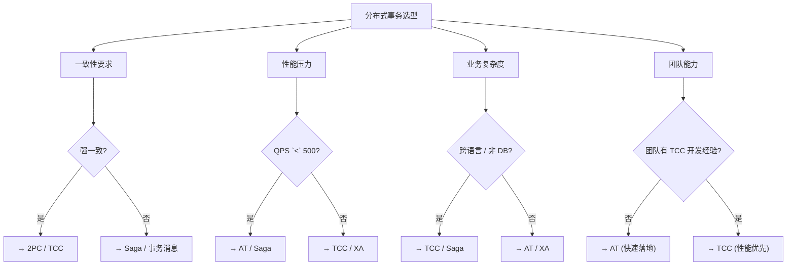
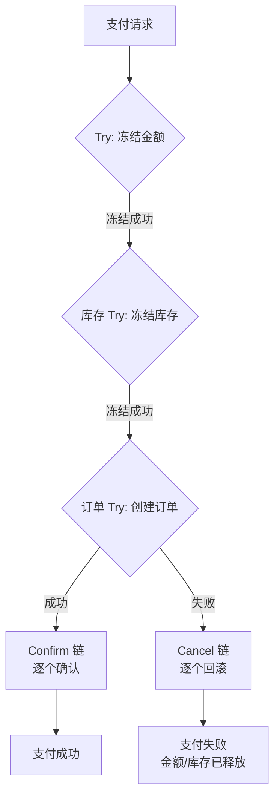
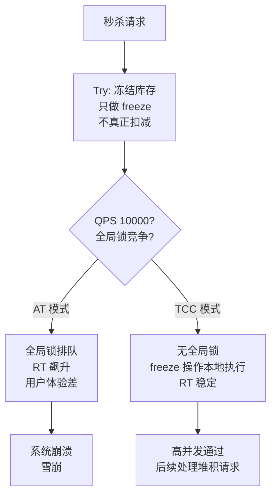

## 问题背景

2022年，我们团队启动了一个供应链系统的重构项目。当时的需求是：订单服务、库存服务、支付服务之间需要保证事务一致性。团队里有两个人分别推荐了不同的方案——

一位推荐 Seata AT 模式，说"开箱即用，代码零侵入"；另一位推荐自研 Saga 编排，说"性能最好，腾讯都是这么做的"。

吵了两周，最后拍板用了 Seata AT。理由是：工期紧，代码侵入越小越好。

结果呢？系统上线三个月后，库存服务的 QPS 从 2000 降到了 600——因为 AT 模式的全局锁在高并发扣减库存时形成了严重的瓶颈。DBA 每周都要来问我："你们的全局锁怎么这么多？"

六个月的二次重构，换成了 TCC 模式。团队熬了三个月，上线后库存服务的 QPS 恢复到 1800（接近理论上限），延迟从 500ms 降到了 30ms。

这次选型失误的成本：**6 个月的开发人力 + 3 个月的系统不稳定期 + 无数客诉**。

【架构权衡】
选型没有银弹。AT/TCC/Saga/事务消息各有各的适用场景，脱离业务场景谈方案优劣毫无意义。正确的选型姿势是：**先定义业务对一致性的真实需求，再评估性能压力和团队能力，最后才是在满足约束的方案中做权衡**。

## 问题定义

分布式事务的选型，本质上是在**一致性、性能、开发成本**三个维度上做权衡。

| 一致性维度 | 描述 |
|------------|------|
| 强一致性 | 任何时刻，所有节点的数据完全一致 |
| 弱一致性 | 不保证立即一致，但最终会达到一致状态 |
| 最终一致性 | 允许短暂不一致，但保证在有限时间内收敛 |

在分布式系统中，CAP 定理告诉我们： Consistency（一致性）、Availability（可用性）、Partition tolerance（分区容错性）三者不可兼得。分布式事务方案，本质上是在 CP（强一致）和 AP（最终一致）之间做选择。

## 四维评估模型

分布式事务选型不是一道选择题，而是一道**多约束优化题**。我建议从四个维度评估：



### 维度一：一致性要求

这是最关键的维度。回答这个问题：**你的业务能容忍数据不一致吗？能容忍多久？**

| 一致性要求 | 典型业务场景 | 推荐方案 |
|------------|------------|----------|
| 强一致性（实时） | 金融转账、证券交易、账户扣款 | TCC / 2PC（需接受性能损失） |
| 最终一致（秒级） | 电商下单、订单状态同步、库存扣减 | AT / Saga / 事务消息 |
| 最终一致（分钟级） | 日志同步、数据统计、消息通知 | 定时任务 + 补偿 |

### 维度二：性能压力

第二个维度是系统的并发量。不同的方案在高并发下的表现差异巨大：

| QPS 范围 | 方案选择 | 理由 |
|----------|----------|------|
| QPS `<` 500 | AT / Saga / 本地消息表 | 全局锁竞争不明显，开发成本低 |
| 500 `<=` QPS `<` 3000 | TCC / Saga | 需要注意锁持有时间，可通过异步化优化 |
| QPS `>=` 3000 | TCC 资源预留 / 无锁 Saga | 避免全局锁成为瓶颈，资源预留是关键技术 |

:::warning ⚠️
性能压力不只是看 QPS，还要看**单个全局事务涉及的分支数量**。如果一个全局事务涉及 10 个分支，即使每个分支只需要 10ms，全局事务的 RT 也是 100ms起步。Seata 推荐单个全局事务的分支数量控制在 **20 个以内**。
:::

### 维度三：业务复杂度

第三个维度是业务的复杂程度和资源类型：

| 业务特征 | 推荐方案 | 说明 |
|----------|----------|------|
| 纯 SQL 操作，同一个数据库实例 | AT | 自动解析 SQL，零侵入 |
| 跨数据库实例 | TCC / Saga | 需要业务层处理分库分表 |
| 涉及外部 HTTP/RPC 服务 | TCC | AT 不支持外部服务调用 |
| 非 DB 资源（Redis、MQ、ES） | TCC | 业务层控制预留/回滚 |
| 长链路业务流程（10+ 步骤） | Saga 编排 | 补偿链可能过长，TCC 不适合 |

### 维度四：团队能力

最后一个维度是**团队是否具备相应的技术储备**：

| 团队情况 | 推荐方案 | 说明 |
|----------|----------|------|
| 新团队，技术储备不足 | 本地消息表 / AT | 入门简单，社区文档丰富 |
| 有 Java 经验，无分布式事务经验 | AT | Seata AT 接入成本低 |
| 有分布式事务经验 | TCC / Saga | 追求性能和可控性 |
| 多语言团队 | Saga / 事务消息 | TCC 需要多语言 SDK，Seata 已支持 |

## 完整选型矩阵

综合四个维度，以下是各方案的完整对比：

| 方案 | 一致性 | QPS 上限 | 代码侵入 | 锁策略 | 回滚方式 | 适用场景 |
|------|--------|----------|----------|--------|----------|----------|
| **2PC** | 强一致 | `~1000` | 高 | 全局 DB 锁 | 自动 | 低并发、强一致的简单场景 |
| **AT** | 最终一致 | `~2000` | 无 | 全局 TC 锁 | 自动 | Java + SQL，高并发以下 |
| **TCC** | 强一致 | `~5000` | 高 | 业务层预留 | 手动 | 高并发、跨资源、外部服务 |
| **Saga** | 最终一致 | `~10000` | 中 | 无锁 | 补偿 | 长链路业务流程 |
| **本地消息表** | 最终一致 | `~500` | 中 | 无 | 轮询补偿 | 中小规模，延迟不敏感 |
| **事务消息** | 最终一致 | `~3000` | 中 | 无 | 消费幂等 | MQ 为主，发送方一致性 |
| **MySQL XA** | 强一致 | `~800` | 中 | 全局 DB 锁 | 自动 | MySQL 原生，多语言友好 |

【架构权衡】
在选型时，我有一个核心原则：**能用最终一致性解决的问题，绝不用强一致性**。因为强一致性方案（2PC/TCC）的代价是性能损耗和运维复杂度。除非你的业务明确要求"钱不能多扣/不能少扣，且必须实时一致"，否则都应该优先考虑最终一致性方案。

## 典型场景分析

### 场景一：金融支付（强一致 → TCC）

金融支付是分布式事务最严苛的场景。每一笔支付必须**精确扣款**，不能多扣也不能少扣。

```java
// TCC 模式实现支付扣款
@LocalTCC
public interface PaymentTccService {
    @TwoPhaseBusinessAction(
        name = "deduct",
        commitMethod = "confirm",
        rollbackMethod = "cancel"
    )
    boolean try(DeductDTO dto, BusinessActionContext ctx,
        @BusinessActionContextParameter(paramName = "accountId") Long accountId,
        @BusinessActionContextParameter(paramName = "amount") BigDecimal amount);

    boolean confirm(BusinessActionContext ctx);
    boolean cancel(BusinessActionContext ctx);
}
```



:::tip 💡
金融场景中，TCC 的 Confirm 和 Cancel 都需要**幂等设计**。因为网络分区可能导致 Confirm 被执行多次。如果每次 Confirm 都真的扣款，用户会被多扣钱。解决方案是 Confirm 只执行"状态变更"，检查账户是否已经处于"已扣款"状态。
:::

### 场景二：电商下单（最终一致 → AT 或 Saga）

电商下单的一致性要求比金融支付低一些——允许短暂的状态不一致，只要最终一致即可。

```java
// 方案 A：AT 模式（简单场景）
@GlobalTransactional
public void placeOrder(OrderDTO dto) {
    orderService.create(dto);       // 分支事务 1
    inventoryService.deduct(dto);   // 分支事务 2
    paymentService.charge(dto);     // 分支事务 3
}

// 方案 B：Saga 模式（复杂场景，如涉及外部促销系统）
public class OrderSaga {
    // Saga 编排器的每个步骤都是独立的补偿单元
    @SagaStart
    public void createOrder() { ... }

    @Compensable(compensationMethod = "cancelInventory")
    public void deductInventory() { ... }

    @Compensable(compensationMethod = "cancelPayment")
    public void chargePayment() { ... }
}
```

### 场景三：长链路履约（Saga 编排）

当业务流程涉及 10+ 个步骤时，TCC 模式会变得难以维护——每个步骤都需要写 Try/Confirm/Cancel 三个方法，光是方法数量就难以接受。


这种长链路场景，Saga 是最佳选择。**Saga 的核心是"正向操作 + 补偿操作"，没有悬挂和空回滚的问题**（因为没有 Try 阶段）。

```java
// Saga 模式：正向操作 + 补偿操作
public class InventorySaga {

    // 正向操作：扣减库存
    public void deductInventory(Long productId, Integer quantity) {
        inventoryMapper.decrement(productId, quantity);
    }

    // 补偿操作：归还库存
    public void compensateInventory(Long productId, Integer quantity) {
        inventoryMapper.increment(productId, quantity);
    }
}
```

:::warning ⚠️
Saga 的局限性是**没有 Try 阶段**，意味着正向操作失败后，补偿操作也可能失败（比如库存归还时数据库挂了）。这种情况下需要人工介入。设计 Saga 流程时，必须评估每个步骤的失败概率，并为高风险步骤设计**重试策略**或**人工补偿**机制。
:::

### 场景四：高并发秒杀（TCC 资源预留）

秒杀场景的核心挑战是：**超卖**和**性能**。AT 模式的全局锁在秒杀场景下会被打爆，必须使用 TCC 的资源预留模式。



TCC 的资源预留模式本质是：**用业务层的"冻结"代替数据库锁**。冻结操作是纯业务逻辑，不需要全局协调，因此可以支撑极高的并发。

## 避坑指南

### 坑一：不要为了技术而技术

很多团队引入分布式事务框架，纯粹是"觉得不用就落后了"。实际上，如果你的系统拆分后，不同服务之间**没有强一致性需求**，用最终一致性和本地补偿就够了。

**判断标准**：你的业务能接受"下单成功但库存还没扣"吗？如果能，就不需要分布式事务，用本地消息表或定时任务补偿即可。

### 坑二：不要在小系统中引入复杂框架

Seata 的运维成本不低：需要额外部署 TC Server、配置高可用、维护 undo_log 表。如果你的系统只有 3~5 个服务，日请求量不超过 1000，用**本地消息表 + 定时任务**完全够用。

| 系统规模 | 推荐方案 |
|----------|----------|
| 单体或 2~3 个服务 | 本地消息表 + 定时任务 |
| 3~10 个服务，中等并发 | AT / Saga |
| 10+ 个服务，高并发 | TCC / 分层 Saga |

### 坑三：不要混用多种方案

很多团队在同一个系统中混用了 AT、TCC、Saga 三种方案——原因是不同的业务场景选了不同的方案。这会导致：

1. 运维复杂度爆炸：需要同时维护 AT 的 TC + TCC 的 TCC 日志 + Saga 的补偿表
2. 调试困难：一个全局事务可能跨越 AT 和 TCC 两种模式
3. 一致性语义混乱：团队成员对"什么场景用哪种方案"没有共识

**建议**：在架构设计阶段确定**一种主方案**，只有当该方案明显不适用时（如库存扣减用 AT 性能不够），才在特定场景引入第二种方案，并明确标注边界。

### 坑四：全局事务的粒度控制

无论选择哪种方案，**单个全局事务涉及的分支数量越少越好**。建议：

- 单个全局事务的分支数量控制在 **10 个以内**（Seata 推荐 20 个以内）
- 跨服务调用优先使用**异步消息**而非同步 RPC
- 长时间-running 的业务操作（如支付回调）不要放在全局事务中

```java
// ❌ 低效：全局事务包含大量分支
@GlobalTransactional
public void createOrder(OrderDTO dto) {
    orderService.create(dto);           // 分支 1
    inventoryService.deduct(dto);        // 分支 2
    paymentService.charge(dto);          // 分支 3
    couponService.use(dto);              // 分支 4
    pointsService.grant(dto);           // 分支 5
    messageService.notify(dto);          // 分支 6
    smsService.send(dto);               // 分支 7 ← 这个放全局事务就是浪费
}

// ✅ 高效：消息通知等异步操作移出全局事务
@GlobalTransactional
public void createOrder(OrderDTO dto) {
    orderService.create(dto);           // 分支 1
    inventoryService.deduct(dto);        // 分支 2
    paymentService.charge(dto);          // 分支 3
    couponService.use(dto);              // 分支 4
    pointsService.grant(dto);           // 分支 5
}

// 消息通知等异步执行，不参与全局事务
@Async
public void sendNotifications(OrderDTO dto) {
    messageService.notify(dto);
    smsService.send(dto);
}
```

## 开源框架对比

| 框架 | 语言 | AT 支持 | TCC 支持 | Saga 支持 | XA 支持 | 推荐度 |
|------|------|---------|----------|-----------|---------|--------|
| Seata | Java | 原生 | 原生 | 原生 | 原生 | `⭐⭐⭐⭐⭐` |
| ShardingSphere | Java | 否 | 否 | 否 | 原生 | `⭐⭐⭐` |
| Hmily | Java | 否 | 原生 | 否 | 否 | `⭐⭐` |
| Apache ServiceComb | Java | 否 | 原生 | 原生 | 否 | `⭐⭐⭐` |
| MySQL XA | 多语言 | 否 | 否 | 否 | 原生 | `⭐⭐⭐` |

**推荐 Seata 作为首选方案**。原因：社区活跃（Apache 顶级项目）、功能最全（四种模式全覆盖）、文档完善、与 Spring Cloud/Dubbo 集成良好。

## 工程代价

| 维度 | 2PC | AT | TCC | Saga | 本地消息表 |
|------|-----|----|----|------|------------|
| 运维成本 | 高 | 高 | 中 | 中 | 低 |
| 开发成本 | 高 | 低 | 高 | 中 | 中 |
| 排障复杂度 | 高 | 中 | 中 | 中 | 低 |
| 性能影响 | 高 | 中 | 低 | 低 | 低 |
| 跨语言支持 | 中 | 否 | 部分 | 是 | 是 |

## 落地 Checklist

- [ ] **明确一致性需求**：与业务方确认业务能容忍的最大不一致时间
- [ ] **评估性能压力**：压测确定 QPS 峰值和平均 RT
- [ ] **审计业务场景**：识别所有涉及多服务协作的业务流程
- [ ] **选择主方案**：根据四维评估模型确定主要方案
- [ ] **设计异常路径**：每种方案都需要设计空回滚、幂等、悬挂的处理逻辑
- [ ] **制定监控策略**：全局事务成功率、RT 分布、锁等待时间
- [ ] **编写测试用例**：覆盖正常流程 + 各异常分支（超时、网络分区、服务宕机）
- [ ] **制定回滚预案**：当新方案出现问题时，如何快速回滚到之前的状态
- [ ] **团队培训**：确保所有开发人员理解所选方案的工作原理和注意事项
- [ ] **灰度发布**：先在小比例流量上验证，再全量上线
