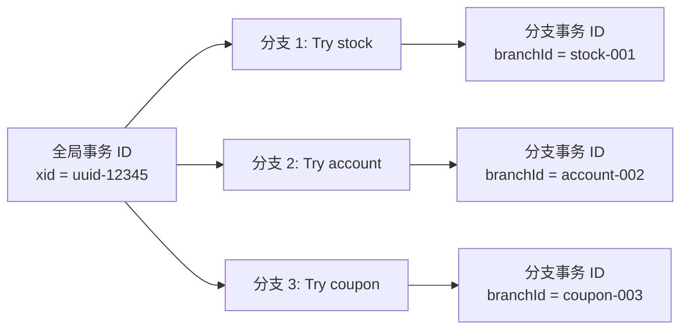
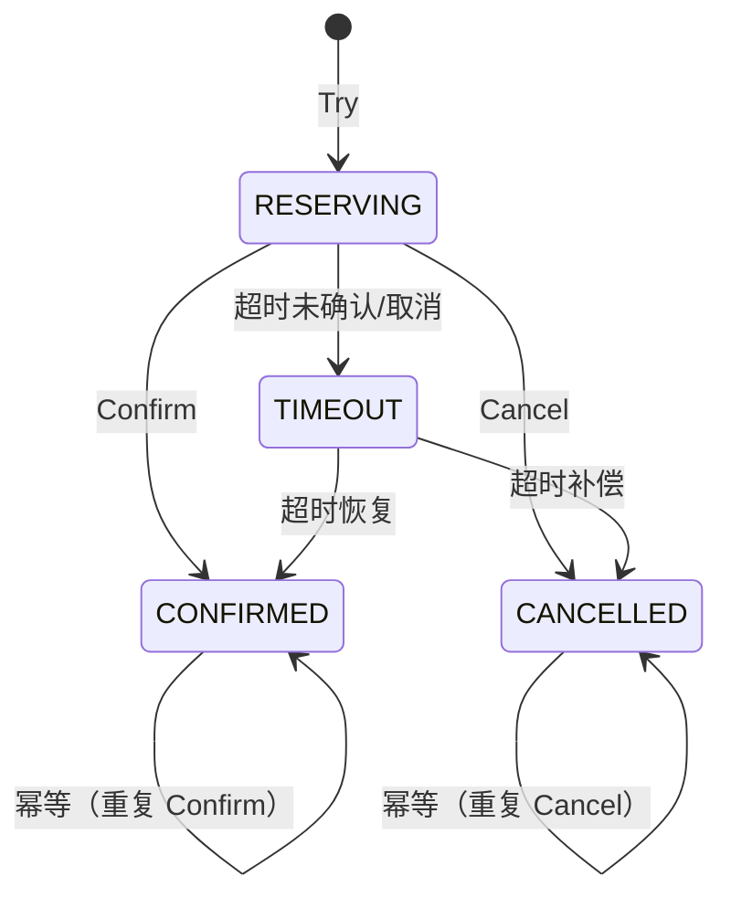

## 问题背景

2024年618大促，我们的库存服务经历了两次惊心动魄的故障。

第一次：TCC 事务超时后重试，但补偿操作执行了两次，导致库存被扣了两次。

第二次：更诡异——库存被扣了，但订单状态一直是"处理中"，用户打电话投诉。

两次故障有一个共同根因：**TCC 的幂等性设计不完整**。

TCC 模式的核心问题是：Try/Confirm/Cancel 三个接口可能被调用多次（网络超时导致重试），每次调用必须产生相同的最终状态。幂等性是 TCC 正确性的基石——没有幂等性，TCC 的任何优势都不存在。

今天这篇，我们把 TCC 幂等性设计彻底讲透。

## 一、TCC 幂等性的核心问题

TCC 的三个接口（Try/Confirm/Cancel）都面临同一个问题：**可能被重复调用**。

```
调用链路分析：
客户端 → TCC 服务
    ↓ 网络超时/重试
    ↓ 可能多次调用
TCC 服务 → 资源服务（Try/Confirm/Cancel）
    ↓
最终状态必须一致
```

网络超时导致重试是最常见的场景：
1. 客户端调用 Try，超时未收到响应
2. 客户端重试，Try 被执行第二次
3. Confirm 被调用时，Try 可能被执行了两次

如果不解决幂等性：
- Try 执行两次 → 库存被冻结两次？金额被预扣两次？
- Confirm 执行两次 → 库存被扣两次？金额被转出两次？
- Cancel 执行两次 → 库存被解冻两次？金额被退回两次？

【架构权衡】

幂等性是 TCC 的"隐形需求"——不在接口定义里体现，但一旦缺失就是生产故障。设计 TCC 接口时，必须假设每个接口都会被调用 N 次（N `>=` 1），并保证最终状态相同。

## 二、幂等性实现的核心：分支事务ID

幂等性的基础是**分支事务ID（Branch ID / XID）**。

每个 TCC 事务有一个全局唯一的**全局事务ID（Transaction ID / XID）**，每个分支操作有一个**分支事务ID（Branch ID）**。



所有幂等性设计都围绕分支事务ID展开：
- **状态记录**：用分支事务ID记录 Try/Confirm/Cancel 的执行状态
- **去重判断**：根据状态判断操作是否已经执行过
- **防悬挂**：根据 Try 的执行状态决定是否执行 Cancel

## 三、TCC 三种接口的幂等设计

### 3.1 Try 的幂等设计

Try 接口负责**预留资源**（冻结库存、预扣金额）。幂等性要求：多次 Try 调用产生的预留状态相同。

**方案：预留状态表**

```sql
CREATE TABLE `tcc_reserve` (
    `id` BIGINT PRIMARY KEY AUTO_INCREMENT,
    `branch_id` VARCHAR(64) NOT NULL COMMENT '分支事务ID',
    `xid` VARCHAR(64) NOT NULL COMMENT '全局事务ID',
    `resource_type` VARCHAR(32) NOT NULL COMMENT '资源类型：stock/account',
    `resource_id` VARCHAR(64) NOT NULL COMMENT '资源ID：sku_id/account_id',
    `reserve_amount` DECIMAL(19,4) NOT NULL COMMENT '预留金额',
    `status` TINYINT NOT NULL DEFAULT 0 COMMENT '状态：0-预留中 1-确认 2-取消',
    `create_time` DATETIME DEFAULT CURRENT_TIMESTAMP,
    `update_time` DATETIME DEFAULT CURRENT_TIMESTAMP ON UPDATE CURRENT_TIMESTAMP,
    UNIQUE KEY `uk_branch_id` (`branch_id`),
    KEY `idx_xid` (`xid`),
    KEY `idx_resource` (`resource_type`, `resource_id`)
);
```

```java
// Try 接口的幂等实现
@TwoPhaseBusinessAction(name = "stockTry")
public class StockTccAction implements BusinessAction {
    @Override
    public boolean tryExecute(StockDTO stockDTO) {
        String branchId = businessActionContext.getBranchId();
        String xid = businessActionContext.getXid();

        // 幂等检查：是否已经执行过 Try
        TccReserve existing = tccReserveMapper.selectByBranchId(branchId);
        if (existing != null) {
            // 已执行过，根据状态判断
            if (existing.getStatus() == ReserveStatus.CONFIRMED) {
                // Try 已确认（Confirm 已执行），返回成功
                return true;
            }
            if (existing.getStatus() == ReserveStatus.RESERVING) {
                // 预留中，正常处理
            }
        }

        // 执行预留操作
        try {
            // 冻结库存（预留）
            stockService.freezeStock(stockDTO.getSkuId(), stockDTO.getQuantity());
        } catch (InsufficientStockException e) {
            // 库存不足是业务异常，不是幂等失败
            return false;
        }

        // 记录预留状态（幂等保证）
        TccReserve reserve = new TccReserve();
        reserve.setBranchId(branchId);
        reserve.setXid(xid);
        reserve.setResourceType("stock");
        reserve.setResourceId(stockDTO.getSkuId());
        reserve.setReserveAmount(new BigDecimal(stockDTO.getQuantity()));
        reserve.setStatus(ReserveStatus.RESERVING);
        tccReserveMapper.insert(reserve);

        return true;
    }

    @Override
    public boolean confirm(StockDTO stockDTO) {
        // Confirm 逻辑见下一节
    }

    @Override
    public boolean cancel(StockDTO stockDTO) {
        // Cancel 逻辑见第4节
    }
}
```

### 3.2 Confirm 的幂等设计

Confirm 接口负责**真正执行**（扣减库存、转账）。幂等性要求：多次 Confirm 调用产生相同的最终状态（资源被扣减一次）。

```java
// Confirm 接口的幂等实现
@Override
public boolean confirm(StockDTO stockDTO) {
    String branchId = businessActionContext.getBranchId();

    // 幂等检查：根据分支事务ID查询状态
    TccReserve reserve = tccReserveMapper.selectByBranchId(branchId);
    if (reserve == null) {
        // 记录不存在：Try 未执行或已取消
        // 由于幂等性设计，这种情况不应该发生
        log.warn("TCC reserve not found for branchId={}, treating as idempotent success", branchId);
        return true;
    }

    if (reserve.getStatus() == ReserveStatus.CONFIRMED) {
        // 已确认，直接返回成功（幂等）
        return true;
    }

    if (reserve.getStatus() == ReserveStatus.CANCELLED) {
        // 已取消，不应该执行 Confirm
        log.error("TCC confirm called on cancelled reserve, branchId={}", branchId);
        return false;
    }

    // 执行真正的扣减
    stockService.deductFrozenStock(
        reserve.getResourceId(),
        reserve.getReserveAmount().intValue()
    );

    // 更新状态为已确认
    reserve.setStatus(ReserveStatus.CONFIRMED);
    tccReserveMapper.updateById(reserve);

    return true;
}
```

【架构权衡】

Confirm 幂等的核心是**先查后改**（Check-Before-Set）：先查询当前状态，根据状态决定是否执行。这种方式在单机数据库下是原子的，但在分布式环境下需要注意：

- 查询和更新之间可能有并发修改
- 解决方案：用乐观锁（version 字段）或分布式锁

```sql
-- 乐观锁版本
UPDATE tcc_reserve
SET status = 1, version = version + 1
WHERE branch_id = ? AND status = 0 AND version = ?
-- 返回 affected_rows，如果为0说明有并发修改
```

### 3.3 Cancel 的幂等设计

Cancel 接口负责**释放预留**（解冻库存）。幂等性要求：多次 Cancel 调用产生相同的最终状态（资源被解冻一次）。

Cancel 的幂等性比 Confirm 更复杂，因为 Cancel 还需要处理**空回滚**问题（Try 未执行就执行 Cancel）。

```java
// Cancel 接口的幂等实现
@Override
public boolean cancel(StockDTO stockDTO) {
    String branchId = businessActionContext.getBranchId();

    // 幂等检查
    TccReserve reserve = tccReserveMapper.selectByBranchId(branchId);
    if (reserve == null) {
        // 记录不存在：Try 未执行（空回滚）
        // 幂等处理：插入一条"空回滚记录"
        log.info("Empty rollback detected for branchId={}, recording cancel", branchId);
        recordEmptyCancel(branchId);
        return true;
    }

    if (reserve.getStatus() == ReserveStatus.CANCELLED) {
        // 已取消，直接返回成功（幂等）
        return true;
    }

    if (reserve.getStatus() == ReserveStatus.CONFIRMED) {
        // 已确认，不应该取消
        log.error("TCC cancel called on confirmed reserve, branchId={}", branchId);
        return false;
    }

    // 执行解冻
    stockService.unfreezeStock(
        reserve.getResourceId(),
        reserve.getReserveAmount().intValue()
    );

    // 更新状态为已取消
    reserve.setStatus(ReserveStatus.CANCELLED);
    tccReserveMapper.updateById(reserve);

    return true;
}
```

## 四、悬挂问题的幂等处理

### 4.1 悬挂的定义

**悬挂（Hanging）**：Cancel 比 Try 先执行，或者 Try 执行后既没有 Confirm 也没有 Cancel，导致资源永远被锁定。

```
悬挂场景：
T1: Try 开始执行（freeze stock = 10）
T2: Cancel 被调用（但 Try 还没完成）
T3: Cancel 检查状态，发现没有预留记录，认为是空回滚
T4: Cancel 返回成功
T5: Try 执行完成，写入预留记录
→ 预留记录永远处于 RESERVING 状态，库存被永久冻结
```

### 4.2 悬挂检测机制

解决悬挂的核心是**事务控制表**：记录全局事务的状态，Confirm/Cancel 执行前检查 Try 是否已经完成。

```sql
CREATE TABLE `tcc_transaction` (
    `id` BIGINT PRIMARY KEY AUTO_INCREMENT,
    `xid` VARCHAR(64) NOT NULL COMMENT '全局事务ID',
    `status` TINYINT NOT NULL DEFAULT 0 COMMENT '状态：0-尝试中 1-已完成 2-已取消',
    `create_time` DATETIME DEFAULT CURRENT_TIMESTAMP,
    `update_time` DATETIME DEFAULT CURRENT_TIMESTAMP ON UPDATE CURRENT_TIMESTAMP,
    UNIQUE KEY `uk_xid` (`xid`)
);
```

```
悬挂检测流程：
1. Try 执行前，在 tcc_transaction 插入一条状态为"尝试中"的记录
2. Try 执行后，更新状态为"已完成"（或"已取消"）
3. Cancel 执行前，查询 tcc_transaction 的状态
   - 如果状态是"尝试中"：说明 Try 还没执行完，Cancel 需要等待（不能执行空回滚）
   - 如果状态不存在：说明 Try 没执行过，执行空回滚
   - 如果状态是"已完成"：说明 Confirm 已执行，Cancel 应该拒绝
   - 如果状态是"已取消"：说明 Cancel 已执行，幂等返回
```

### 4.3 防悬挂的 Cancel 实现

```java
@Override
public boolean cancel(StockDTO stockDTO) {
    String branchId = businessActionContext.getBranchId();
    String xid = businessActionContext.getXid();

    // 第一步：检查全局事务状态（防悬挂）
    TccTransaction tx = tccTransactionMapper.selectByXid(xid);
    if (tx == null) {
        // 全局事务不存在：这是一个孤立调用，忽略
        log.warn("TCC transaction not found for xid={}, ignoring cancel", xid);
        return true;
    }

    if (tx.getStatus() == TccStatus.CONFIRMED) {
        // Try 已确认，不能 Cancel
        log.error("Cannot cancel confirmed transaction, xid={}", xid);
        return false;
    }

    if (tx.getStatus() == TccStatus.CANCELLED) {
        // 已取消，幂等返回
        return true;
    }

    // 状态是"尝试中"：需要检查 Try 是否已经完成
    TccReserve reserve = tccReserveMapper.selectByBranchId(branchId);
    if (reserve == null) {
        // Try 确实没执行过：空回滚
        recordEmptyCancel(branchId, xid);
        return true;
    }

    // Try 已执行但未确认：执行真正的 Cancel
    stockService.unfreezeStock(reserve.getResourceId(), ...);
    reserve.setStatus(ReserveStatus.CANCELLED);
    tccReserveMapper.updateById(reserve);

    // 更新全局事务状态
    tccTransactionMapper.updateStatus(xid, TccStatus.CANCELLED);
    return true;
}
```

【架构权衡】

防悬挂的关键是**全局事务状态的可见性**。如果全局事务状态不可见，Cancel 无法判断 Try 是否已经执行。Seata 的 TCC 模式正是通过 TC（Transaction Coordinator）来维护这个全局状态，解决了悬挂问题。

但 Seata 的方案也有代价：TC 本身是一个单点，需要高可用部署。每次 Cancel 都需要查询 TC，增加了网络开销。在超低延迟场景下，这个开销可能不可接受。

## 五、幂等性的终极保障：TCC 状态机

将所有幂等性逻辑封装在一个**TCC 状态机**中，保证每个分支事务的状态转换是严格定义的。



**状态转换规则**：
1. `RESERVING` 可以转到 `CONFIRMED` 或 `CANCELLED`
2. `CONFIRMED` 是终态，所有操作幂等返回
3. `CANCELLED` 是终态，所有操作幂等返回
4. 任何非终态都可以响应超时检测，触发补偿

```java
// 状态机转换的原子保证
public boolean transitionState(String branchId, TccStatus from, TccStatus to) {
    // 原子更新：只有当前状态是 from 时才能转到 to
    int affected = tccReserveMapper.atomicTransition(branchId, from, to);
    return affected == 1;
}

// 使用
if (transitionState(branchId, RESERVING, CONFIRMED)) {
    // 状态转换成功，执行确认逻辑
    doConfirm();
} else {
    // 状态转换失败，可能是：
    // 1. 已经转换过了（幂等）
    // 2. 已经被取消了
    return true; // 幂等返回
}
```

## 六、生产避坑

### 6.1 幂等表的主键冲突

如果用 `branch_id` 作为主键，在重复插入时会抛出 `DuplicateKeyException`。需要 try-catch 捕获，并判断是否为幂等场景。

```java
try {
    tccReserveMapper.insert(reserve);
} catch (DuplicateKeyException e) {
    // 主键冲突：幂等返回
    return true;
}
```

### 6.2 幂等检查的性能问题

每次 Try/Confirm/Cancel 都需要查询状态表，如果状态表在数据库中，高并发下可能成为瓶颈。

解决方案：
- 状态表和业务表放在同一个数据库，用本地事务保证原子性
- 状态表放在 Redis 中，减少数据库压力
- 使用 Seata/Apache DTM 等成熟框架，它们已经处理了这些问题

### 6.3 幂等性的边界：全局超时

即使有幂等性设计，如果事务超时后一直没有 Confirm/Cancel，资源会一直处于"预留"状态。

解决方案：
- TCC 服务定期扫描超时的预留记录，执行补偿
- 设置合理的超时时间（建议：`业务预估时间 × 2`）
- 使用"伪删除"标记，保留审计记录

【架构权衡】

幂等性设计的目标不是"完全消除重复"，而是"让重复执行产生相同的最终结果"。完美的幂等性需要额外的存储和计算成本，要根据业务容忍度来权衡：

- 金融支付：不允许任何重复，幂等性必须完美
- 普通电商：允许少量重复（库存多扣了 1 件，用售后处理），幂等性可以适当简化
- 日志采集：允许大量重复（消息队列本身支持重试），可以不实现幂等性

## 七、工程代价评估

| 维度 | 评估 |
| --- | --- |
| 开发成本 | 高（需要为每个资源设计状态表 + 幂等逻辑） |
| 存储成本 | 中（预留状态表需要持久化） |
| 运维成本 | 高（状态补偿、对账、悬挂检测） |
| 性能开销 | 中（每次操作多一次状态查询） |
| 框架支持 | Seata/Apache DTM 提供开箱即用的幂等支持 |

## 八、落地 Checklist

- [ ] 为每个 TCC 分支事务设计唯一 `branch_id`
- [ ] 设计预留状态表，包含 `branch_id`、`xid`、`status` 字段
- [ ] Try/Confirm/Cancel 三个接口都实现幂等检查
- [ ] 实现全局事务状态表，防止悬挂
- [ ] 设计状态转换的状态机，保证状态转换的原子性
- [ ] 实现超时补偿机制，处理异常路径
- [ ] 编写幂等性测试用例，覆盖所有重试场景
- [ ] 监控预留状态的堆积情况（可能有悬挂或超时）
