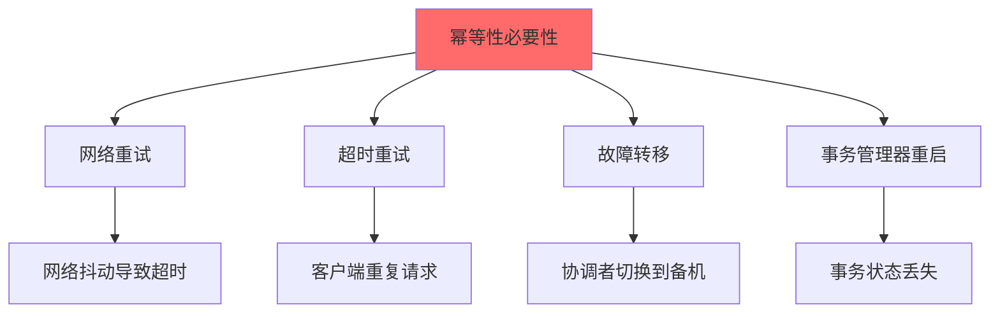

# TCC 幂等性：确保重复执行不会出错

## 快速自测：面试官最关心的 3 个问题

> 🟡 **中频常考**，P6/P7 面试可能问

1. **TCC 中哪些操作需要幂等？为什么 Confirm/Cancel 可能被重复调用？**
2. **如何设计幂等机制来保证 TCC 的可靠性？**
3. **TCC 的幂等性和 Saga 的幂等性有什么区别？**

---

## 一、为什么 TCC 需要幂等性

### 1.1 幂等性的必要性

**TCC 中，Confirm 和 Cancel 可能被多次调用**，原因如下：



```
幂等性问题：

1. Confirm/Cancel 可能被执行多次
   - 事务管理器重试
   - 客户端超时后重试
   - 协调者切换后重试

2. 非幂等操作会导致数据错误
   - 库存扣减 2 次 → 库存变负
   - 余额扣减 2 次 → 余额变负

3. 必须保证幂等性
   - 无论执行多少次，结果一致
```

### 1.2 幂等性的定义

```
幂等性的定义：
- 一个操作无论执行多少次，结果都是一样的
- 适用于：HTTP GET、PUT、DELETE
- 不适用于：HTTP POST（非幂等）

在 TCC 中：
- Try：通常幂等（创建订单可以检查是否已存在）
- Confirm：必须幂等（确认扣减不能重复执行）
- Cancel：必须幂等（取消回滚不能重复执行）
```

---

## 二、幂等性实现方案

### 2.1 方案一：唯一键 + 状态检查

**核心思路**：使用唯一键标记事务，每次操作前检查状态。

```java
public class IdempotentTCCService {
    
    private final TransactionLogDao transactionLogDao;
    
    @Override
    public boolean confirm(BusinessActionContext context) {
        String xid = context.getXid();
        
        // 1. 检查状态
        TransactionStatus status = transactionLogDao.getStatus(xid);
        
        // 2. 如果已确认，直接返回（幂等）
        if (status == TransactionStatus.CONFIRM) {
            return true;
        }
        
        // 3. 如果状态不是 TRY_SUCCESS，不允许确认
        if (status != TransactionStatus.TRY_SUCCESS) {
            throw new TCCException("事务状态不正确，无法确认: " + status);
        }
        
        // 4. 执行确认逻辑
        doConfirm(xid);
        
        // 5. 更新状态
        transactionLogDao.updateStatus(xid, TransactionStatus.CONFIRM);
        
        return true;
    }
    
    @Override
    public boolean cancel(BusinessActionContext context) {
        String xid = context.getXid();
        
        // 1. 检查状态
        TransactionStatus status = transactionLogDao.getStatus(xid);
        
        // 2. 如果已取消，直接返回（幂等）
        if (status == TransactionStatus.CANCEL) {
            return true;
        }
        
        // 3. 执行回滚逻辑
        doCancel(xid);
        
        // 4. 更新状态
        transactionLogDao.updateStatus(xid, TransactionStatus.CANCEL);
        
        return true;
    }
}
```

### 2.2 方案二：分布式锁

**核心思路**：在执行操作前获取分布式锁，确保只有一个线程执行。

```java
public class DistributedLockTCCService {
    
    private final RedisTemplate redisTemplate;
    
    @Override
    public boolean confirm(BusinessActionContext context) {
        String xid = context.getXid();
        String lockKey = "tcc:confirm:" + xid;
        
        // 1. 尝试获取锁
        Boolean acquired = redisTemplate.opsForValue()
            .setIfAbsent(lockKey, "1", Duration.ofMinutes(5));
        
        if (!acquired) {
            // 已有人在执行，等待或直接返回
            return true;
        }
        
        try {
            // 2. 检查状态
            if (isConfirmed(xid)) {
                return true;
            }
            
            // 3. 执行确认逻辑
            doConfirm(xid);
            
            // 4. 更新状态
            markConfirmed(xid);
            
            return true;
        } finally {
            // 5. 释放锁
            redisTemplate.delete(lockKey);
        }
    }
}
```

### 2.3 方案三：幂等表

**核心思路**：记录每次操作的执行历史，通过检查历史防止重复执行。

```java
public class IdempotentTableService {
    
    private final IdempotentRecordDao idempotentRecordDao;
    
    @Override
    public boolean confirm(BusinessActionContext context) {
        String xid = context.getXid();
        String operation = "confirm";
        
        // 1. 检查是否已执行
        IdempotentRecord record = idempotentRecordDao.findByXidAndOperation(xid, operation);
        if (record != null && "SUCCESS".equals(record.getResult())) {
            return true; // 已成功执行，直接返回
        }
        
        // 2. 执行幂等插入（防止并发插入）
        try {
            idempotentRecordDao.insert(IdempotentRecord.builder()
                .xid(xid)
                .operation(operation)
                .status("PROCESSING")
                .build());
        } catch (DuplicateKeyException e) {
            // 已有记录，说明正在执行或已完成
            return true;
        }
        
        // 3. 执行确认逻辑
        try {
            doConfirm(xid);
            idempotentRecordDao.updateResult(xid, operation, "SUCCESS");
        } catch (Exception e) {
            idempotentRecordDao.updateResult(xid, operation, "FAILED");
            throw e;
        }
        
        return true;
    }
}
```

---

## 三、TCC vs Saga 幂等性对比

### 3.1 对比表

| 维度 | TCC | Saga |
|------|-----|------|
| **补偿操作** | Confirm/Cancel | 逆向补偿 |
| **幂等要求** | 高（可能重复调用） | 高（重试导致） |
| **实现方式** | 状态检查 | 版本号检查 |
| **复杂度** | 中 | 低 |

### 3.2 Saga 的幂等性实现

Saga 的幂等性通常通过「补偿版本号」实现：

```java
public class SagaCompensableService {
    
    private final CompensationDao compensationDao;
    
    public void compensate(String transactionId, String actionName, int version) {
        // 1. 查询当前的补偿版本
        Compensation current = compensationDao.findByTransactionId(transactionId);
        
        // 2. 如果当前版本 >= 要执行的版本，说明已执行过（幂等）
        if (current != null && current.getVersion() >= version) {
            return; // 已执行过，直接返回
        }
        
        // 3. 执行补偿逻辑
        doCompensate(transactionId, actionName);
        
        // 4. 更新版本号
        compensationDao.upsert(transactionId, actionName, version);
    }
}
```

---

## 四、面试题精讲

### 🟡 面试题 1：TCC 中哪些操作需要幂等？

**答案要点**：

1. **Try**：通常幂等（检查资源是否存在）
2. **Confirm**：必须幂等（确认执行不能重复）
3. **Cancel**：必须幂等（回滚执行不能重复）

### 🟡 面试题 2：如何保证 TCC 的幂等性？

**答案要点**：

1. **状态检查**：通过事务状态表检查是否已执行
2. **唯一键约束**：使用数据库唯一键防止重复插入
3. **分布式锁**：通过 Redis/ZooKeeper 获取执行锁

---

## 五、实战思考题

### 思考题 1：幂等性与性能

幂等性检查会增加系统延迟，如何平衡幂等性和性能？

### 思考题 2：幂等性与一致性

在分布式环境下，如何保证幂等性检查和实际执行的一致性？

---

## 扩展阅读

如果本文档对你有帮助，建议继续阅读：

- [TCC 原理](/distributed/transaction/tcc)：TCC 基础概念
- [TCC 空回滚与防悬挂](/distributed/transaction/tcc-pitfalls)：TCC 的常见问题
- [Saga 恢复机制](/distributed/transaction/saga-recovery)：Saga 的补偿机制