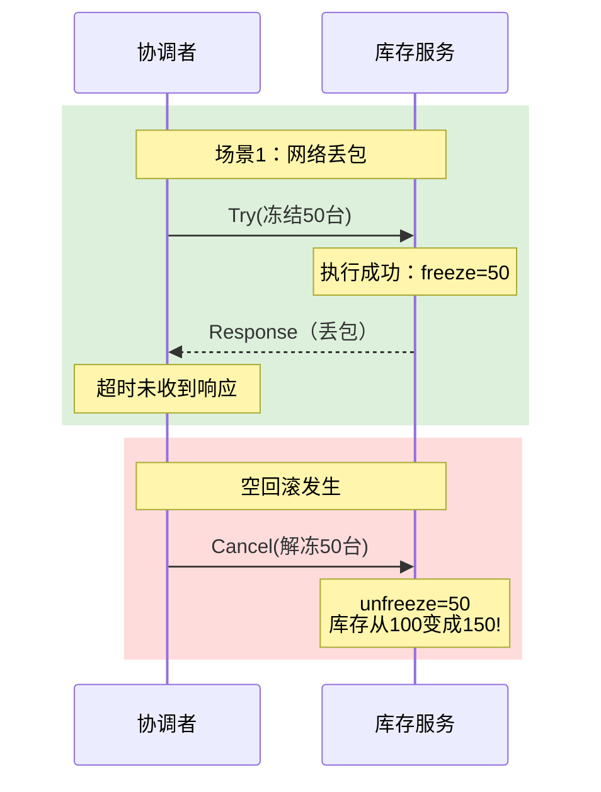
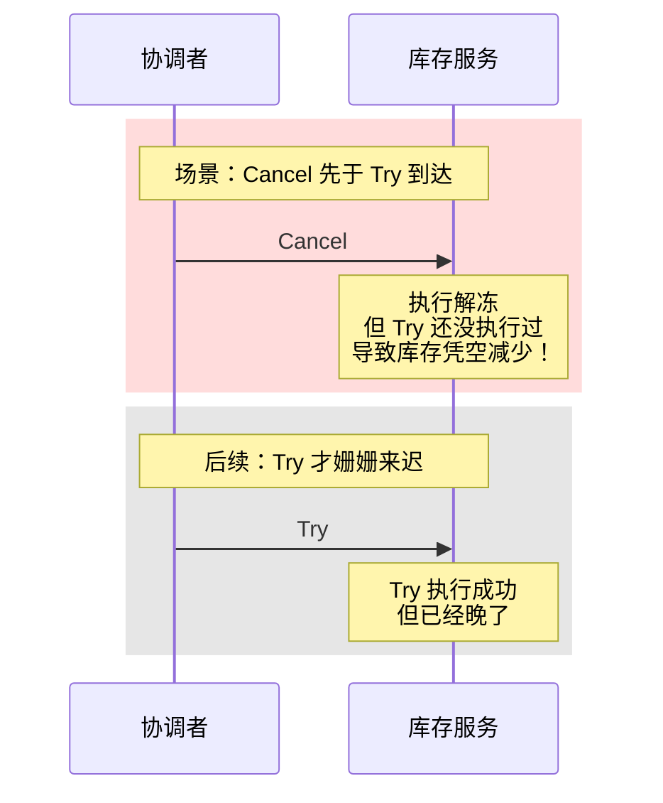
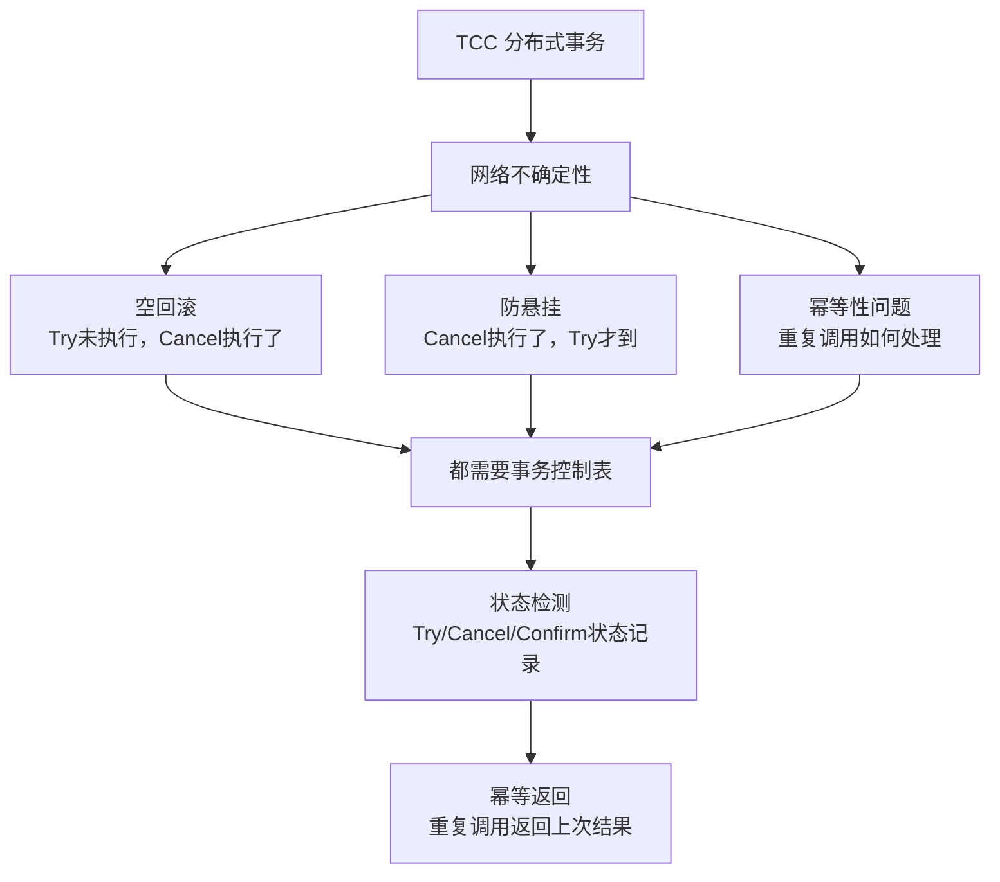

2021年双十一，团队的交易系统出现了一笔诡异的订单：用户下单购买手机，库存显示扣减成功，但订单创建失败了。按照 TCC 的设计，失败应该触发 Cancel 回滚库存。

结果库存从 100 变成了 150——凭空多出了 50 台手机。

复盘发现：库存服务的 Try 接口超时了（网络抖动），协调者认为 Try 失败，发起了 Cancel。但此时库存服务的 Try 其实已经执行成功了（只是响应丢了）。Cancel 把已经冻结的 50 台库存"解冻"了，导致库存凭空增多。

这就是 TCC 最经典的**空回滚**问题。这不是代码 bug，是网络不确定性的必然产物。

## 一、空回滚：TCC 的第一道坎

### 1.1 什么是空回滚

空回滚（Empty Rollback）的定义：**Try 阶段没有执行或没有成功，但 Cancel 阶段被调用了。**

触发条件通常有三种：

1. **网络丢包**：Try 请求发过去了，服务也执行了，但响应在网络传输中丢了。协调者没收到响应，认为 Try 失败，发起 Cancel。
2. **网络重排序**：Cancel 的响应先于 Try 的响应到达协调者，协调者看到 Cancel 成功了，误以为 Try 失败了。
3. **超时误判**：Try 接口响应慢，协调者的超时计时器先触发了，发起 Cancel。



### 1.2 空回滚的危害

空回滚不是"无效操作"，它会真正修改数据：

- Try 阶段的资源预留（如冻结库存）已经生效了，Cancel 会把它回滚掉
- 如果 Try 超时后根本没有执行，Cancel 会把"不存在的资源"状态改掉
- 在某些业务逻辑里，这会导致数据直接乱掉

更隐蔽的危害是**悬挂（Hanging）**——后面会讲到。

### 1.3 空回滚的解决方案：事务控制表

解决空回滚的核心思路是：**在 Try 执行时记录状态，让 Cancel 知道"我是不是空回滚"。**

最常见的方案是**事务控制表**（Transaction Control Table）：

```sql
-- 事务控制表结构
CREATE TABLE TCC_TRANSACTION (
    xid VARCHAR(64) PRIMARY KEY,        -- 全局事务ID
    action_name VARCHAR(64),            -- 动作名称（inventory-try/confirm/cancel）
    status INT,                          -- 状态：0=Trying, 1=Confirmed, 2=Cancelled
    gmt_create TIMESTAMP,
    gmt_modified TIMESTAMP,
    UNIQUE KEY uk_xid_action (xid, action_name)
);
```

```java
@Service
public class InventoryTccActionImpl {

    @Autowired
    private TccTransactionMapper tccMapper;

    @Override
    public boolean try(GlobalTransaction tx, int count) {
        // 1. 检查库存
        Inventory inv = inventoryMapper.selectById(goodsId);
        if (inv.getStock() < count) {
            return false;
        }

        // 2. 冻结库存
        inventoryMapper.freeze(goodsId, count);

        // 3. 记录 Try 状态到事务控制表（关键！）
        TccTransaction tcc = new TccTransaction();
        tcc.setXid(tx.getXid());
        tcc.setActionName("inventory-try");
        tcc.setStatus(0); // Trying
        tcc.setGmtCreate(new Date());
        tccMapper.insert(tcc);

        return true;
    }

    @Override
    public boolean cancel(GlobalTransaction tx) {
        // 4. 检查 Try 是否执行过（解决空回滚的关键）
        TccTransaction tcc = tccMapper.selectByXidAndAction(tx.getXid(), "inventory-try");

        if (tcc == null) {
            // Try 从未执行过，这是空回滚！
            // 记录空回滚日志，但不要做任何业务操作
            log.warn("空回滚检测到，xid={}, action=inventory-cancel", tx.getXid());
            return true; // 依然返回 true，避免无限重试
        }

        if (tcc.getStatus() == 2) {
            // 已经被 Cancel 过了（幂等性保障）
            return true;
        }

        // 正常 Cancel：解冻库存
        inventoryMapper.unfreeze(goodsId, count);

        // 更新状态
        tcc.setStatus(2); // Cancelled
        tccMapper.updateById(tcc);

        return true;
    }
}
```

:::tip
空回滚检测的关键是：Cancel 执行前，先查事务控制表，确认 Try 是否真正执行过。如果 Try 没执行过，记录日志后直接返回 true（避免重试），但不执行业务操作。
:::

## 二、防悬挂：TCC 的第二道坎

### 2.1 什么是悬挂

悬挂（Hanging）的定义：**Cancel 执行了，但后续的 Try 才到达。** 此时事务处于一种"半死不活"的状态。

悬挂的根因是**网络重排序**：Cancel 的请求先于 Try 到达服务，或者 Try 超时时 Cancel 已经执行了。



### 2.2 悬挂的危害

悬挂比空回滚更隐蔽，危害也更大：

- 资源被错误释放（Cancel 先执行，Try 后执行，Try 的预留操作找不到资源）
- 事务状态机混乱：Confirm 和 Cancel 都执行过了，但 Try 记录的状态不对
- 后续的 Confirm 可能执行在错误的状态上，导致数据不一致

### 2.3 防悬挂的解决方案：悬挂检测

防悬挂的核心思路是：**当 Cancel 执行时，检查 Try 是否已经执行过。如果 Try 还没执行过，Cancel 也不执行。**

这需要结合事务控制表：

```java
@Override
public boolean cancel(GlobalTransaction tx) {
    TccTransaction tcc = tccMapper.selectByXidAndAction(tx.getXid(), "inventory-try");

    if (tcc == null) {
        // Try 从未执行过：空回滚 or 悬挂？

        // 关键判断：检查 Try 是否正在执行中（通过时间窗口判断）
        // 如果是悬挂（Try 还在路上），不执行 Cancel
        // 如果是空回滚（Try 确定失败了），可以执行 Cancel

        // 常见做法：使用"防悬挂检测"
        // 思路：Cancel 执行时，插入一条 Cancel 记录
        // 如果后续 Try 到达，发现已有 Cancel 记录，则跳过执行
        TccTransaction cancelRecord = tccMapper.selectByXidAndAction(tx.getXid(), "inventory-cancel");
        if (cancelRecord != null) {
            // 已经有 Cancel 记录了，说明是悬挂，Try 不应该执行
            // 但 Try 已经到达了，这种情况需要人工介入
            log.error("检测到悬挂异常，xid={}", tx.getXid());
            throw new悬挂异常();
        }

        // 空回滚：Try 确定失败了，执行 Cancel
        return true;
    }

    // Try 已执行，正常 Cancel
    inventoryMapper.unfreeze(goodsId, count);
    tcc.setStatus(2);
    tccMapper.updateById(tcc);
    return true;
}
```

【架构权衡】

防悬挂比空回滚更难处理，因为：

1. **空回滚**可以事后检测：Cancel 时发现 Try 没执行，记录日志返回 true 即可
2. **防悬挂**需要事前判断：Cancel 执行时，Try 可能正在路上，怎么判断它是"还没到"还是"确定不会到"？

工程上没有完美的解决方案，常见的trade-off是：

| 方案 | 思路 | 优点 | 缺点 |
| --- | --- | --- | --- |
| 时间窗口 | 等固定时间后再判断 | 实现简单 | 延迟增加，可能误判 |
| 状态机 | 用状态字段标记 Try/Cancel 的执行顺序 | 精确 | 需要额外的状态管理 |
| 人工兜底 | 悬挂发生时告警，人工介入 | 兜底 | 需要人工处理 |

## 三、幂等性：TCC 的第三道坎

### 3.1 为什么要幂等

TCC 的三个阶段（Try/Confirm/Cancel）都可能被调用多次：

- 网络重试：请求超时后，协调者重试
- 超时补偿：协调者超时后，发起重试
- 部分失败：某些参与者成功了，协调者对失败者重试

每个阶段的代码**必须能处理重复调用**，且结果必须幂等。

### 3.2 幂等性实现方案

幂等性的核心是**去重**：记录每次调用的结果，重复调用时直接返回上次的结果。

```java
@Override
public boolean confirm(GlobalTransaction tx) {
    // 幂等性检查：检查是否已经 Confirm 过
    TccTransaction record = tccMapper.selectByXidAndAction(tx.getXid(), "inventory-confirm");
    if (record != null && record.getStatus() == 1) {
        // 已经 Confirm 过了，直接返回成功
        return true;
    }

    // 执行 Confirm 操作
    inventoryMapper.confirmDeduct(goodsId, count);

    // 记录 Confirm 状态
    if (record == null) {
        TccTransaction newRecord = new TccTransaction();
        newRecord.setXid(tx.getXid());
        newRecord.setActionName("inventory-confirm");
        newRecord.setStatus(1); // Confirmed
        newRecord.setGmtCreate(new Date());
        tccMapper.insert(newRecord);
    } else {
        record.setStatus(1);
        tccMapper.updateById(record);
    }

    return true;
}

@Override
public boolean cancel(GlobalTransaction tx) {
    // 幂等性检查：检查是否已经 Cancel 过
    TccTransaction record = tccMapper.selectByXidAndAction(tx.getXid(), "inventory-cancel");
    if (record != null && record.getStatus() == 2) {
        return true;
    }

    // 执行 Cancel 操作
    inventoryMapper.unfreeze(goodsId, count);

    // 记录 Cancel 状态
    if (record == null) {
        TccTransaction newRecord = new TccTransaction();
        newRecord.setXid(tx.getXid());
        newRecord.setActionName("inventory-cancel");
        newRecord.setStatus(2); // Cancelled
        newRecord.setGmtCreate(new Date());
        tccMapper.insert(newRecord);
    } else {
        record.setStatus(2);
        tccMapper.updateById(record);
    }

    return true;
}
```

### 3.3 幂等性的性能问题

每次调用都要查事务控制表，这会带来性能开销。在高并发场景下，可以考虑：

1. **本地缓存**：使用 ConcurrentHashMap 缓存已处理的结果（注意容量控制）
2. **批量查询**：一次查询多个 xid 的状态
3. **异步记录**：Confirm/Cancel 执行成功后，异步写入状态表（但要保证不丢）

```java
// 优化：使用 ConcurrentHashMap 做本地缓存
private final ConcurrentHashMap<String, TccStatus> localCache = new ConcurrentHashMap<>();

@Override
public boolean confirm(GlobalTransaction tx) {
    String key = tx.getXid() + ":inventory-confirm";

    // 先查本地缓存
    TccStatus cached = localCache.get(key);
    if (cached != null && cached == TccStatus.CONFIRMED) {
        return true;
    }

    // 查数据库
    TccTransaction record = tccMapper.selectByXidAndAction(tx.getXid(), "inventory-confirm");
    if (record != null && record.getStatus() == 1) {
        localCache.put(key, TccStatus.CONFIRMED);
        return true;
    }

    // 执行确认...
    // 更新缓存
    localCache.put(key, TccStatus.CONFIRMED);
    return true;
}
```

## 四、TCC 三大陷阱的关系

空回滚、幂等性、防悬挂，这三个问题不是独立的，而是相互关联的：



【架构权衡】

TCC 的这三个问题是"三位一体"的——解决任何一个都需要事务控制表，而事务控制表本身就带来了额外的复杂度和性能开销。

所以在实际选型时，要问自己一个问题：**我愿意为 TCC 的可靠性付出多少工程代价？**

| 维度 | 评估 |
| --- | --- |
| 工程复杂度 | 高。需要实现 Try/Confirm/Cancel 三个接口 + 事务控制表 + 幂等性逻辑 |
| 运维成本 | 高。需要监控每个分支事务的状态、空回滚次数、防悬挂告警 |
| 性能开销 | 中等。每次调用多一次数据库查询 |
| 适用场景 | 高并发、性能敏感、核心链路、团队有能力维护全套方案的系统 |

:::warning
TCC 的空回滚、幂等性、防悬挂问题，在工程上是可以解决的，但没有一个是"加个注解"就能搞定的。每个问题都需要精心设计的状态管理和幂等性保障。如果你的团队没有能力维护这套复杂度，建议直接用 Seata 的 TCC 模式，它已经帮你封装好了大部分逻辑。
:::

## 五、Seata TCC 的实现

Seata（阿里开源的分布式事务框架）提供了完整的 TCC 实现，封装了空回滚、防悬挂、幂等性的处理逻辑。

### 5.1 使用 Seata TCC

```java
@LocalTCC
public interface InventoryTccAction {

    @TwoPhaseBusinessAction(name = "inventoryTccAction", commitMethod = "confirm", rollbackMethod = "cancel")
    boolean try(
        BusinessActionContext actionContext,
        @BusinessActionContextParameter(paramName = "goodsId") Long goodsId,
        @BusinessActionContextParameter(paramName = "count") int count
    );

    boolean confirm(BusinessActionContext actionContext);

    boolean cancel(BusinessActionContext actionContext);
}

@Service
public class InventoryTccActionImpl implements InventoryTccAction {

    @Override
    public boolean try(BusinessActionContext context, Long goodsId, int count) {
        // Seata 自动处理 Try 状态记录
        inventoryService.freeze(goodsId, count);
        return true;
    }

    @Override
    public boolean confirm(BusinessActionContext context) {
        // Seata 自动处理幂等性：只有从未 Confirm 过的才会执行
        inventoryService.confirmDeduct(
            context.getActionContext("goodsId", Long.class),
            context.getActionContext("count", Integer.class)
        );
        return true;
    }

    @Override
    public boolean cancel(BusinessActionContext context) {
        // Seata 自动处理空回滚和防悬挂：
        // - 如果 Try 未执行，Cancel 是空回滚，跳过业务操作
        // - 如果 Try 已执行，正常 Cancel
        Long goodsId = context.getActionContext("goodsId", Long.class);
        Integer count = context.getActionContext("count", Integer.class);
        if (goodsId != null && count != null) {
            inventoryService.unfreeze(goodsId, count);
        }
        return true;
    }
}
```

### 5.2 Seata 的空回滚处理

Seata 的 TCC 模式通过 **Branch Session**（分支会话）管理每个参与者的状态：

1. Try 执行时，向 TC（Transaction Coordinator）注册分支事务，状态为 Trying
2. TC 记录了"哪些分支执行了 Try"，Cancel 时检查分支是否存在
3. 如果分支不存在，说明 Try 没执行过，这是空回滚，跳过业务操作

### 5.3 Seata 的防悬挂处理

Seata 通过**悬挂检测**防止悬挂：

1. Cancel 执行时，检查对应的 Try 分支是否存在且状态为 Trying
2. 如果 Try 还未执行（超时中），但 Cancel 先执行了，Seata 会记录 Cancel 状态
3. 后续 Try 执行时，发现已有 Cancel 记录，抛出异常，阻止 Try 执行

## 六、生产避坑指南

### 6.1 事务控制表的设计

事务控制表是 TCC 的"命根子"，设计时要注意：

```sql
CREATE TABLE TCC_TRANSACTION (
    id BIGINT PRIMARY KEY AUTO_INCREMENT,
    xid VARCHAR(128) NOT NULL COMMENT '全局事务ID',
    action_name VARCHAR(64) NOT NULL COMMENT '动作名称',
    status TINYINT NOT NULL COMMENT '状态：0=TRYING, 1=CONFIRMED, 2=CANCELLED',
    biz_id VARCHAR(128) COMMENT '业务ID（如库存ID）',
   gmt_create DATETIME NOT NULL,
    gmt_modified DATETIME NOT NULL,
    UNIQUE KEY uk_xid_action (xid, action_name),
    KEY idx_xid (xid),
    KEY idx_status (status)
) ENGINE=InnoDB DEFAULT CHARSET=utf8mb4 COMMENT='TCC事务控制表';
```

关键点：
- `xid + action_name` 联合唯一索引，保证幂等性
- `status` 字段记录当前状态，用于幂等性检查
- 定期清理历史数据，避免表膨胀

### 6.2 定时任务补偿

TCC 协调者可能因为各种原因（如机器重启、网络抖动）漏掉 Confirm 或 Cancel。定时任务负责扫描"超时未完成"的分支事务：

```java
@Scheduled(fixedDelay = 30000)
public void compensateUnfinishedTransactions() {
    // 查找状态为 TRYING 且超时的分支
    List<TccTransaction> unfinished = tccMapper.selectUnfinished(System.currentTimeMillis() - 60000);

    for (TccTransaction tcc : unfinished) {
        // 根据事务状态决定执行 Confirm 还是 Cancel
        if (shouldConfirm(tcc)) {
            tccAction.confirm(tcc.getXid());
        } else {
            tccAction.cancel(tcc.getXid());
        }
    }
}
```

### 6.3 监控告警

生产环境必须监控以下指标：

| 指标 | 告警阈值 | 含义 |
| --- | --- | --- |
| 空回滚次数 | `>` 10次/分钟 | 可能存在大量 Try 超时，需要排查网络 |
| 悬挂异常次数 | `>` 5次/小时 | 存在悬挂问题，可能导致数据不一致 |
| 分支事务堆积 | `>` 100条/服务 | 定时补偿任务可能有积压 |
| Confirm/Cancel 重试次数 | `>` 3次/条 | 某个服务可能存在持久性问题 |

:::tip
TCC 的监控不只是"看日志"，更重要的是监控异常模式。如果空回滚次数突然增加，说明网络质量在恶化；如果悬挂异常出现，说明事务状态机有逻辑漏洞。主动监控比被动救火效率高 10 倍。
:::

## 七、工程代价评估

| 维度 | 评估 |
| --- | --- |
| 运维成本 | 高。需要监控 TCC 分支状态、空回滚、防悬挂告警。 |
| 排障复杂度 | 高。涉及多服务状态协调，需要分布式链路追踪。 |
| 扩展性 | 好。Confirm/Cancel 可并行，性能随参与者线性下降。 |
| 回滚风险 | 中。Cancel 失败会导致资源泄漏，但有幂等性保障。 |
| 业务改造 | 极高。每个参与者都要实现 Try/Confirm/Cancel + 事务控制表。 |

【架构权衡】

TCC 的三大陷阱（空回滚、幂等性、防悬挂）在工程上是可以解决的，但代价是显著增加了系统复杂度：

1. **事务控制表**：每个参与者都需要一张状态表，记录 Try/Confirm/Cancel 的执行状态
2. **幂等性逻辑**：每个阶段都要做去重检查，多一次数据库查询
3. **防悬挂检测**：需要额外的状态管理和异常处理
4. **定时补偿**：需要后台任务扫描超时事务并补偿

这套复杂度下来，开发成本是"普通方案"的 3~5 倍。所以 TCC 只适合：
- 高并发、性能敏感的核心链路
- 团队有能力投入大量开发和维护工作
- 参与者数量少（`< 10` 个）

如果不是这种情况，Saga 或本地消息表可能是更务实的选择。
