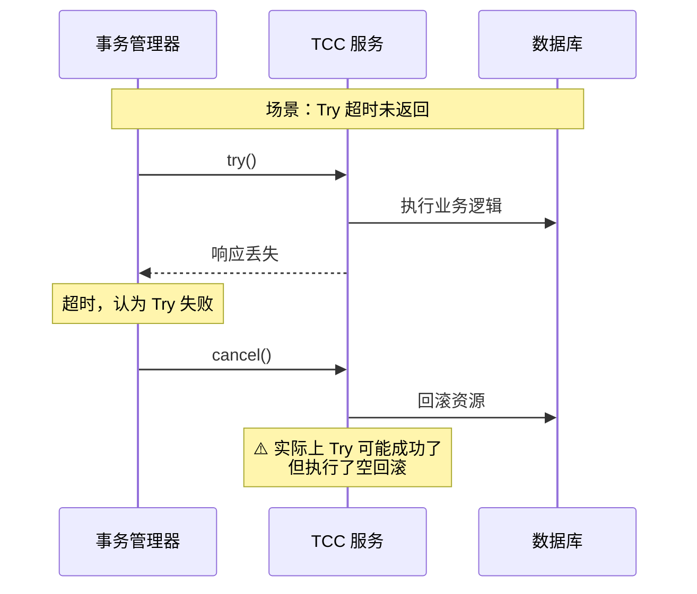
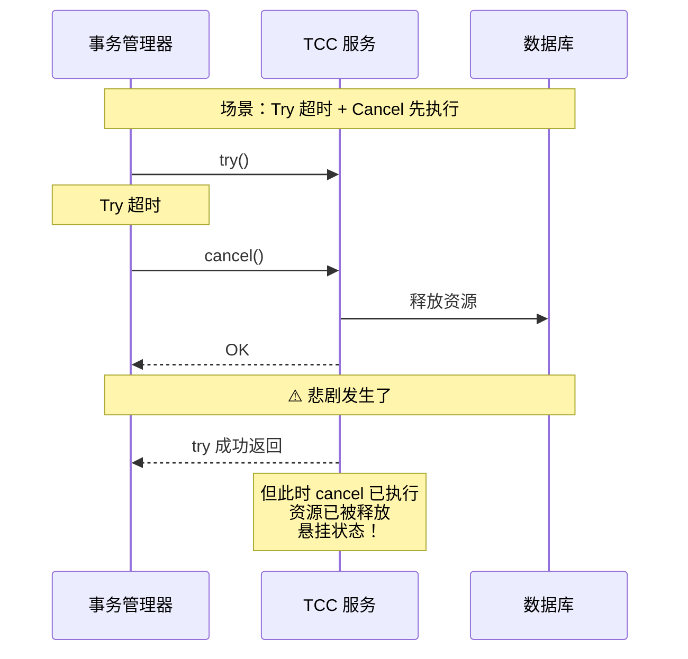
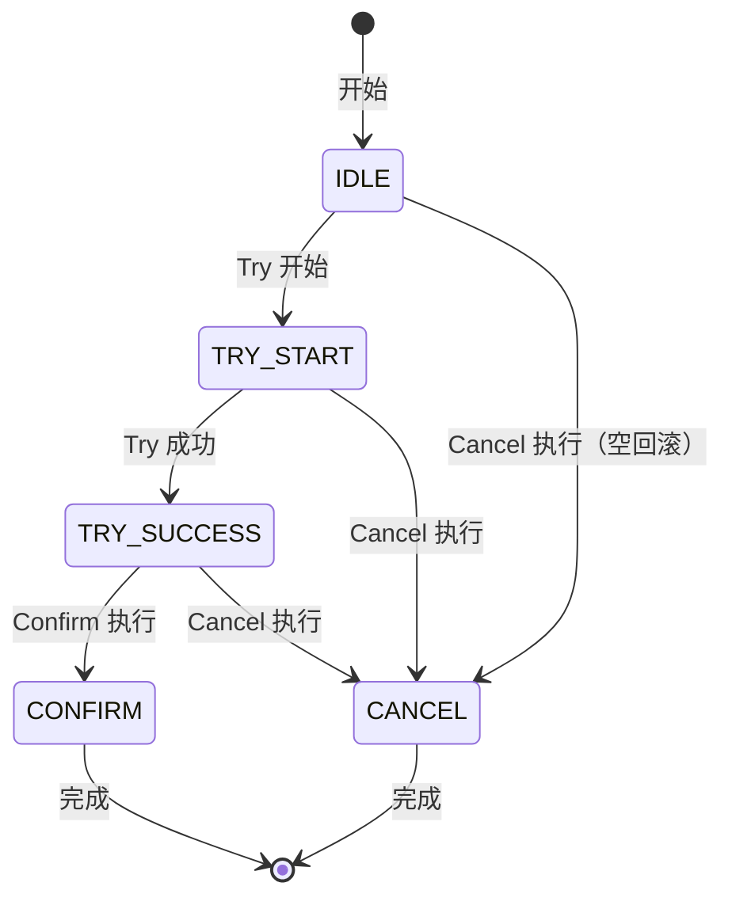

# TCC 空回滚与防悬挂：TCC 的两大陷阱

## 快速自测：面试官最关心的 3 个问题

> 🔴 **高频必考**，P6/P7 面试必问

1. **什么是 TCC 的空回滚？为什么会发生空回滚？如何在代码中处理？**
2. **什么是 TCC 的防悬挂？为什么 Try 超时会导致悬挂？如何避免？**
3. **如何设计 TCC 的状态机来同时解决空回滚和防悬挂问题？**

---

## 一、空回滚问题详解

### 1.1 什么是空回滚

**空回滚**：在 Try 未执行或执行失败时，Cancel 不应该回滚任何资源，但由于网络等原因，Cancel 仍然被执行了。

```
空回滚的定义：
- Try 阶段没有成功预留资源
- 但 Cancel 阶段被调用并尝试回滚
- 回滚操作本身没有资源可回滚，但可能引发其他问题
```

### 1.2 空回滚的发生场景



### 1.3 空回滚的问题

```
空回滚可能引发的问题：

1. 数据不一致
   - Try 已成功预留资源
   - Cancel 执行了真正的回滚操作
   - 导致资源被错误释放

2. 业务逻辑错误
   - Cancel 假设 Try 已执行
   - 但 Try 实际上未执行或失败
   - 可能导致状态机混乱

3. 重复操作
   - 空回滚不应该修改业务状态
   - 但如果代码逻辑不当，可能产生副作用
```

### 1.4 空回滚的解决方案

**核心思路**：通过事务状态表记录 Try 的执行状态。

```java
public class OrderTCCService {
    
    // 事务状态表（简化）
    // order_id | status | created_at | updated_at
    // ---------+--------+-------------+-------------
    // 001     | TRY   | 10:00:00    | 10:00:05
    
    @Autowired
    private TransactionLogDao transactionLogDao;
    
    @Override
    public boolean tryCreateOrder(String orderId, BigDecimal amount) {
        // 1. 记录事务状态为 TRY_START
        transactionLogDao.save(TransactionLog.builder()
            .orderId(orderId)
            .status("TRY_START")
            .build());
        
        try {
            // 2. 执行业务逻辑
            // - 冻结库存
            // - 冻结余额
            // - 创建订单
            
            // 3. 更新状态为 TRY_SUCCESS
            transactionLogDao.updateStatus(orderId, "TRY_SUCCESS");
            
            return true;
        } catch (Exception e) {
            // Try 失败，状态保持为 TRY_START
            // 或更新为 TRY_FAILED
            transactionLogDao.updateStatus(orderId, "TRY_FAILED");
            throw e;
        }
    }
    
    @Override
    public boolean cancel(BusinessActionContext context) {
        String orderId = context.getActionContext().get("orderId", String.class);
        
        // 1. 查询事务状态
        TransactionLog log = transactionLogDao.findByOrderId(orderId);
        
        // 2. 如果状态为空或 TRY_START，说明 Try 未执行成功
        if (log == null || "TRY_START".equals(log.getStatus())) {
            // 空回滚：只记录日志，不执行业务回滚
            logEmptyCancel(orderId);
            return true;
        }
        
        // 3. 如果状态为 TRY_SUCCESS，执行真正的回滚
        if ("TRY_SUCCESS".equals(log.getStatus())) {
            doRealCancel(orderId);
            transactionLogDao.updateStatus(orderId, "CANCEL_SUCCESS");
        }
        
        // 4. 如果状态为 CANCEL，说明已经回滚过
        if ("CANCEL_SUCCESS".equals(log.getStatus())) {
            return true; // 幂等返回
        }
        
        return true;
    }
    
    private void logEmptyCancel(String orderId) {
        transactionLogDao.saveLog(orderId, "CANCEL_EMPTY", "Try 未执行或失败，Cancel 为空回滚");
    }
}
```

---

## 二、防悬挂问题详解

### 2.1 什么是防悬挂

**防悬挂**：确保 Cancel 一定在 Try 之前执行，防止悬挂状态的发生。

```
防悬挂的定义：
- Cancel 已执行完成
- 但 Try 随后执行成功
- 导致资源永远无法被处理

悬挂状态：
- Try 成功了
- 但事务已经结束
- 资源被永久「悬挂」在那里
```

### 2.2 防悬挂的发生场景



### 2.3 防悬挂的问题

```
悬挂状态可能引发的问题：

1. 资源泄漏
   - Try 成功预留的资源被浪费
   - 无法被后续事务使用

2. 数据不一致
   - 业务状态显示「已预留」
   - 但实际资源已释放

3. 业务逻辑混乱
   - 订单状态为「待支付」
   - 但库存已释放
   - 无法追单
```

### 2.4 防悬挂的解决方案

**核心思路**：通过状态机确保 Try 只在合法状态下执行。

```java
@Override
public boolean tryCreateOrder(String orderId, BigDecimal amount) {
    // 1. 查询事务状态
    TransactionLog log = transactionLogDao.findByOrderId(orderId);
    
    // 2. 如果状态为 CANCEL，说明已被取消，不能再执行 Try
    // 这是防悬挂的关键
    if (log != null && "CANCEL".equals(log.getStatus())) {
        // 悬挂场景：Cancel 已执行，Try 不应该再成功
        // 抛出异常，让 Try 失败
        throw new TCCException("事务已被取消，禁止 Try 执行（防悬挂）");
    }
    
    // 3. 如果状态为空，说明事务刚开始，记录状态
    if (log == null) {
        transactionLogDao.save(TransactionLog.builder()
            .orderId(orderId)
            .status("TRY_START")
            .build());
    }
    
    // 4. 执行正常的 Try 逻辑
    doTry(orderId, amount);
    
    // 5. Try 成功后，更新状态
    transactionLogDao.updateStatus(orderId, "TRY_SUCCESS");
    
    return true;
}
```

### 2.5 状态机设计



---

## 三、空回滚与防悬挂的完整解决方案

### 3.1 核心思路

```
两个问题的核心：

1. 空回滚：Cancel 执行时，Try 未成功
   → 解决：检查事务状态，只在 TRY_SUCCESS 时回滚

2. 防悬挂：Try 执行时，Cancel 已执行
   → 解决：检查事务状态，TRY 已结束时禁止 Try 执行
```

### 3.2 完整状态机实现

```java
public enum TCCTransactionStatus {
    IDLE,           // 初始状态
    TRY_START,      // Try 开始执行
    TRY_SUCCESS,    // Try 执行成功
    TRY_FAILED,      // Try 执行失败
    CONFIRM,         // Confirm 完成
    CANCEL,          // Cancel 完成
}
```

### 3.3 完整代码实现

```java
public class OrderTCCService {
    
    private final TransactionLogDao transactionLogDao;
    private final OrderDao orderDao;
    private final InventoryService inventoryService;
    private final AccountService accountService;
    
    @Override
    public boolean tryCreateOrder(String orderId, String userId, BigDecimal amount) {
        // ====== 防悬挂：检查是否已被 Cancel ======
        TransactionLog log = transactionLogDao.findByOrderId(orderId);
        if (log != null && TCCTransactionStatus.CANCEL.name().equals(log.getStatus())) {
            throw new TCCException("事务已被取消，禁止 Try 执行");
        }
        
        // ====== 记录状态为 TRY_START ======
        transactionLogDao.saveOrUpdate(orderId, TCCTransactionStatus.TRY_START);
        
        try {
            // ====== 冻结库存（Try）======
            boolean stockFrozen = inventoryService.freezeStock(orderId, 1);
            if (!stockFrozen) {
                throw new BusinessException("库存不足");
            }
            
            // ====== 冻结余额（Try）======
            boolean balanceFrozen = accountService.freezeBalance(userId, amount);
            if (!balanceFrozen) {
                inventoryService.unfreezeStock(orderId, 1);
                throw new BusinessException("余额不足");
            }
            
            // ====== 更新状态为 TRY_SUCCESS ======
            transactionLogDao.saveOrUpdate(orderId, TCCTransactionStatus.TRY_SUCCESS);
            
            return true;
        } catch (Exception e) {
            transactionLogDao.saveOrUpdate(orderId, TCCTransactionStatus.TRY_FAILED);
            throw e;
        }
    }
    
    @Override
    public boolean confirm(BusinessActionContext context) {
        String orderId = context.getActionContext().get("orderId", String.class);
        
        // ====== 幂等检查 ======
        TransactionLog log = transactionLogDao.findByOrderId(orderId);
        if (TCCTransactionStatus.CONFIRM.name().equals(log.getStatus())) {
            return true;
        }
        
        // ====== 确认扣减库存 ======
        inventoryService.confirmDeduct(orderId);
        
        // ====== 确认扣减余额 ======
        accountService.confirmDeduct(orderId);
        
        // ====== 创建订单 ======
        orderDao.create(orderId);
        
        // ====== 更新状态为 CONFIRM ======
        transactionLogDao.saveOrUpdate(orderId, TCCTransactionStatus.CONFIRM);
        
        return true;
    }
    
    @Override
    public boolean cancel(BusinessActionContext context) {
        String orderId = context.getActionContext().get("orderId", String.class);
        
        // ====== 查询事务状态 ======
        TransactionLog log = transactionLogDao.findByOrderId(orderId);
        
        // ====== 幂等检查 ======
        if (log != null && TCCTransactionStatus.CANCEL.name().equals(log.getStatus())) {
            return true;
        }
        
        // ====== 空回滚处理 ======
        // 如果状态为空或 TRY_START 或 TRY_FAILED，说明 Try 未成功，直接返回
        if (log == null || 
            TCCTransactionStatus.TRY_START.name().equals(log.getStatus()) ||
            TCCTransactionStatus.TRY_FAILED.name().equals(log.getStatus())) {
            
            transactionLogDao.saveOrUpdate(orderId, TCCTransactionStatus.CANCEL);
            return true;
        }
        
        // ====== 真正的回滚 ======
        inventoryService.unfreezeStock(orderId, 1);
        accountService.unfreezeBalance(orderId);
        
        // ====== 更新状态为 CANCEL ======
        transactionLogDao.saveOrUpdate(orderId, TCCTransactionStatus.CANCEL);
        
        return true;
    }
}
```

---

## 四、面试题精讲

### 🔴 面试题 1：什么是 TCC 的空回滚？如何处理？

**答案要点**：

1. **空回滚定义**：Try 未成功执行时，Cancel 仍被执行
2. **处理方法**：通过事务状态表检查 Try 的执行状态，只在 TRY_SUCCESS 时执行真正的回滚

**追问链**：

> **第一层**：什么是空回滚？
> **第二层**：空回滚会导致什么问题？
> **第三层**：如何通过代码解决空回滚？

### 🔴 面试题 2：什么是 TCC 的防悬挂？如何避免？

**答案要点**：

1. **防悬挂定义**：Cancel 执行后，Try 不应该再执行
2. **避免方法**：在 Try 开始时检查事务状态，如果已是 CANCEL，则抛出异常

**追问链**：

> **第一层**：什么是防悬挂？
> **第二层**：防悬挂会导致什么问题？
> **第三层**：如何设计状态机来同时解决空回滚和防悬挂？

### 🟡 面试题 3：TCC 的状态机如何设计？

**答案要点**：

1. **状态定义**：IDLE、TRY_START、TRY_SUCCESS、CONFIRM、CANCEL
2. **Try 检查**：如果状态为 CANCEL，禁止执行
3. **Cancel 检查**：如果状态不为 TRY_SUCCESS，直接返回

---

## 五、实战思考题

### 思考题 1：状态表的分布式一致性

事务状态表本身也是分布式的，如何保证状态表的一致性？

### 思考题 2：与 Saga 的状态机对比

TCC 的状态机设计和 Saga 的补偿状态机有什么异同？

---

## 扩展阅读

如果本文档对你有帮助，建议继续阅读：

- [TCC 原理](/distributed/transaction/tcc)：TCC 基础概念
- [TCC 幂等性](/distributed/transaction/tcc-idempotency)：TCC 的幂等性保证
- [Saga 事务](/distributed/transaction/saga)：Saga 的补偿机制