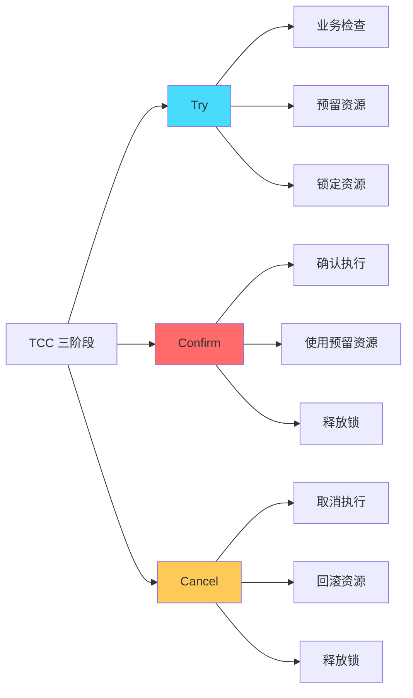
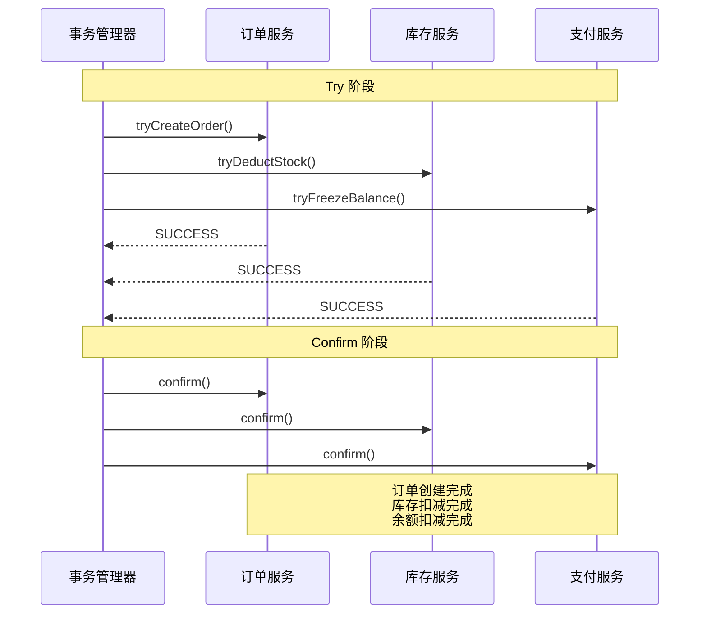
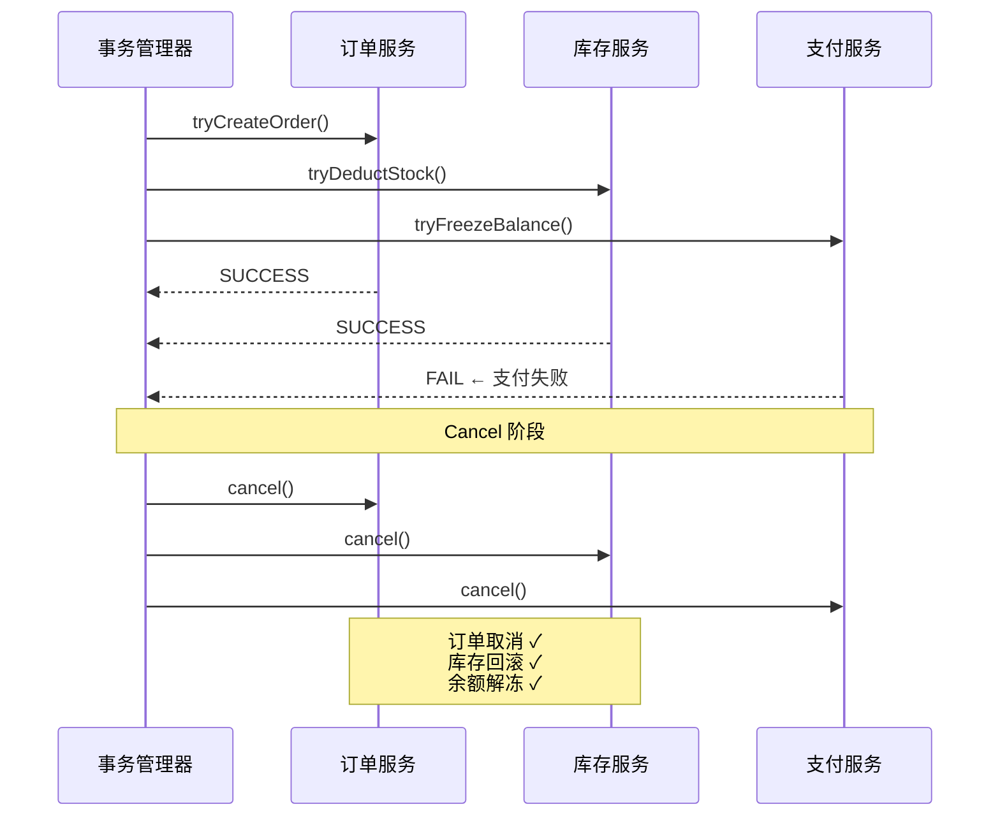
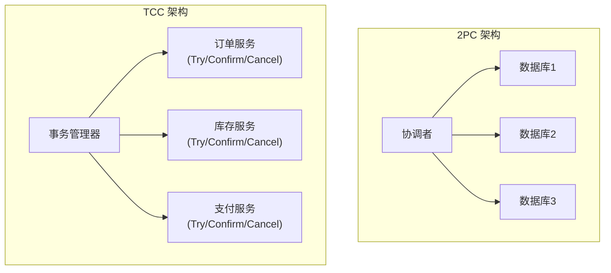

# TCC 原理：应用层控制的柔性事务

## 快速自测：面试官最关心的 3 个问题

> 🔴 **高频必考**，P6/P7 面试必问

1. **TCC 的三个阶段是什么？Try-Confirm-Cancel 分别做什么？**
2. **TCC 和 2PC 有什么区别？为什么说 TCC 是「业务层面」的实现？**
3. **TCC 有哪些常见的问题？空回滚、防悬挂、幂等性如何解决？**

---

## 一、TCC 的核心思想

### 1.1 什么是 TCC

TCC（Try-Confirm-Cancel）是一种应用层的柔性事务模式，需要业务方实现 Try、Confirm、Cancel 三个接口。

```
TCC vs 2PC 的本质区别：

2PC：在数据库层面实现
     - 协调者控制数据库提交/回滚
     - 业务层不需要改动
     
TCC：在业务层面实现
     - 业务方实现 Try-Confirm-Cancel
     - 资源锁定在业务层完成
     - 更灵活，但需要更多业务代码
```

### 1.2 TCC 的三个阶段



| 阶段 | 含义 | 业务动作 |
|------|------|---------|
| **Try** | 预留资源 | 检查业务可行性 + 锁定资源 |
| **Confirm** | 确认执行 | 使用预留资源 + 执行业务 |
| **Cancel** | 取消执行 | 回滚预留资源 + 恢复状态 |

---

## 二、TCC 的工作流程

### 2.1 正常流程



### 2.2 异常流程：Cancel



---

## 三、TCC 的接口定义

### 3.1 TCC 接口示例

```java
// TCC 接口定义
@LocalTCC
public interface OrderTCCService {
    
    /**
     * Try 阶段：创建订单 + 冻结库存 + 冻结余额
     */
    @TwoPhaseBusinessAction(
        name = "orderTcc",
        commitMethod = "confirm",
        rollbackMethod = "cancel"
    )
    boolean tryCreateOrder(
        @BusinessActionContextParameter(paramName = "orderId") String orderId,
        @BusinessActionContextParameter(paramName = "userId") String userId,
        @BusinessActionContextParameter(paramName = "amount") BigDecimal amount
    );
    
    /**
     * Confirm 阶段：确认订单
     */
    boolean confirm(BusinessActionContext context);
    
    /**
     * Cancel 阶段：取消订单
     */
    boolean cancel(BusinessActionContext context);
}
```

### 3.2 Try 阶段的实现

```java
@LocalTCC
public class OrderTCCServiceImpl implements OrderTCCService {
    
    @Override
    public boolean tryCreateOrder(String orderId, String userId, BigDecimal amount) {
        // 1. 检查订单是否已存在
        Order existingOrder = orderDao.findById(orderId);
        if (existingOrder != null) {
            throw new BusinessException("订单已存在");
        }
        
        // 2. 冻结库存（预留资源）
        boolean stockFrozen = inventoryService.freezeStock(orderId, 1);
        if (!stockFrozen) {
            throw new BusinessException("库存不足");
        }
        
        // 3. 冻结余额（预留资源）
        boolean balanceFrozen = accountService.freezeBalance(userId, amount);
        if (!balanceFrozen) {
            // 回滚库存
            inventoryService.unfreezeStock(orderId, 1);
            throw new BusinessException("余额不足");
        }
        
        // 4. 创建���单（状态：创建中）
        Order order = new Order();
        order.setId(orderId);
        order.setStatus(OrderStatus.PENDING);
        order.setUserId(userId);
        order.setAmount(amount);
        orderDao.insert(order);
        
        return true;
    }
    
    @Override
    public boolean confirm(BusinessActionContext context) {
        String orderId = context.getActionContext().get("orderId", String.class);
        
        // 1. 真正扣减库存（解除冻结，变为扣减）
        inventoryService.confirmDeduct(orderId);
        
        // 2. 真正扣减余额（解除冻结，变为扣减）
        accountService.confirmDeduct(orderId);
        
        // 3. 更新订单状态为已完成
        orderDao.updateStatus(orderId, OrderStatus.COMPLETED);
        
        return true;
    }
    
    @Override
    public boolean cancel(BusinessActionContext context) {
        String orderId = context.getActionContext().get("orderId", String.class);
        
        // 1. 回滚库存（解除冻结）
        inventoryService.unfreezeStock(orderId, 1);
        
        // 2. 回滚余额（解除冻结）
        accountService.unfreezeBalance(orderId);
        
        // 3. 更新订单状态为已取消
        orderDao.updateStatus(orderId, OrderStatus.CANCELLED);
        
        return true;
    }
}
```

---

## 四、TCC vs 2PC：核心区别

### 4.1 本质区别

| 维度 | 2PC | TCC |
|------|-----|-----|
| **实现层面** | 数据库层面 | 业务层面 |
| **资源锁定** | 数据库锁 | 业务资源预留 |
| **代码侵入** | 低 | 高 |
| **灵活性** | 低 | 高 |
| **性能** | 较低（锁时间长） | 较高（锁时间短） |
| **适用场景** | 强一致需求 | 柔性事务 |

### 4.2 架构对比图



### 4.3 性能对比

| 维度 | 2PC | TCC |
|------|-----|-----|
| **锁定时间** | 从 Prepare 到 Commit | 从 Try 到 Confirm/Cancel |
| **锁定范围** | 数据库行锁 | 业务层面的冻结/预留 |
| **并发能力** | 低（锁粒度大） | 高（资源解耦） |
| **吞吐量** | 低 | 高 |

---

## 五、TCC 的常见问题

### 5.1 空回滚

**问题**：Try 未执行时，Cancel 不应该回滚，但可能会执行。

```
场景：
1. Try 方法超时，未返回
2. 事务管理器认为 Try 失败，调用 Cancel
3. 但实际上 Try 可能已经执行成功了

这会导致：
- 空回滚：没有东西可回滚，但调用了 Cancel
```

**解决方案**：通过事务状态表记录状态。

```java
@Override
public boolean cancel(BusinessActionContext context) {
    String orderId = context.getActionContext().get("orderId", String.class);
    
    // 查询事务状态
    TransactionStatus status = transactionLogDao.getStatus(orderId);
    
    // 如果状态为空（Try 未执行），记录空回滚
    if (status == null) {
        transactionLogDao.save(new TransactionLog(orderId, "CANCEL_EMPTY"));
        return true;
    }
    
    // 如果状态为 TRY_SUCCESS，才执行真正的回滚
    if (status == TRY_SUCCESS) {
        doRealCancel(orderId);
        transactionLogDao.updateStatus(orderId, "CANCEL_SUCCESS");
    }
    
    return true;
}
```

### 5.2 防悬挂

**问题**：Try 超时未返回，事务管理器先调用 Cancel，后续 Try 执行时不应该再处理。

```
场景：
1. Try 方法超时
2. 事务管理器调用 Cancel
3. Cancel 执行完成
4. Try 方法返回成功

这会导致：
- 悬挂：Try 成功执行，但事务已经结束了
- 资源永远无法被释放
```

**解决方案**：通过状态机 + 检查。

```java
@Override
public boolean tryCreateOrder(String orderId, ...) {
    // 检查事务状态
    TransactionStatus status = transactionLogDao.getStatus(orderId);
    
    // 如果状态为 CANCEL，说明已被取消，不能再执行 Try
    if (status == TransactionStatus.CANCEL) {
        throw new BusinessException("事务已取消，不能再执行 Try");
    }
    
    // 如果状态为空，说明事务刚开始
    // 记录状态为 TRY_START
    transactionLogDao.saveStatus(orderId, TransactionStatus.TRY_START);
    
    // 执行正常的 Try 逻辑
    doTry(orderId, ...);
    
    // Try 成功后，记录状态为 TRY_SUCCESS
    transactionLogDao.updateStatus(orderId, TransactionStatus.TRY_SUCCESS);
    
    return true;
}
```

### 5.3 幂等性

**问题**：Confirm/Cancel 可能被重复调用，必须保证幂等。

```java
@Override
public boolean confirm(BusinessActionContext context) {
    String orderId = context.getActionContext().get("orderId", String.class);
    
    // 检查状态，防止重复执行
    TransactionStatus status = transactionLogDao.getStatus(orderId);
    
    // 如果已经 CONFIRM，说明执行过了，直接返回成功
    if (status == TransactionStatus.CONFIRM) {
        return true;
    }
    
    // 执行确认逻辑
    doConfirm(orderId);
    
    // 更新状态为 CONFIRM
    transactionLogDao.updateStatus(orderId, TransactionStatus.CONFIRM);
    
    return true;
}
```

---

## 六、TCC 的实现框架

### 6.1 Seata TCC

```java
// Seata TCC 示例
@LocalTCC
public interface InventoryTccService {
    
    @TwoPhaseBusinessAction(name = "inventory", commitMethod = "commit", rollbackMethod = "rollback")
    boolean prepare(
        @BusinessActionContextParameter(name = "inventoryId") String inventoryId,
        @BusinessActionContextParameter(name = "count") int count
    );
    
    boolean commit(BusinessActionContext context);
    
    boolean rollback(BusinessActionContext context);
}
```

### 6.2 hmily 框架

```yaml
# hmily 配置示例
hmily:
  server:
    port: 9097
  repos:
    type: zookeeper
    zookeeper:
      url: 127.0.0.1:2181
      session-timeout: 3000
  config:
    mode: cluster
```

---

## 七、面试题精讲

### 🔴 面试题 1：TCC 的三个阶段是什么？

**答案要点**：

1. **Try**：业务检查 + 预留资源（冻结库存、冻结余额）
2. **Confirm**：确认执行（真正扣减库存、扣减余额）
3. **Cancel**：取消执行（回滚预留的资源）

**追问链**：

> **第一层**：TCC 的三个阶段是什么？
> **第二层**：Try 和 Confirm 的区别是什么？
> **第三层**：为什么 TCC 需要业务方实现三个接口？

### 🔴 面试题 2：TCC 和 2PC 有什么区别？

**答案要点**：

1. **实现层面**：2PC 在数据库层面，TCC 在业务层面
2. **资源锁定**：2PC 锁数据库行，TCC 锁业务资源
3. **代码侵入**：2PC 低，TCC 高
4. **性能**：TCC 更好（锁时间短）

### 🟡 面试题 3：TCC 的空回滚和防悬挂是什么？

**答案要点**：

1. **空回滚**：Try 未执行时，Cancel 不应该回滚
2. **防悬挂**：Cancel 执行后，Try 不应该再执行
3. **解决方案**：通过事务状态表记录状态

---

## 八、实战思考题

### 思考题 1：TCC 的资源预留设计

在设计库�� TCC 时，如何实现「预留」和「确认/回滚」？

### 思考题 2：TCC 与��务解耦

如何在不影响业务代码的情况下引入 TCC？

---

## 扩展阅读

如果本文档对你有帮助，建议继续阅读：

- [TCC 空回滚与防悬挂](/distributed/transaction/tcc-pitfalls)：TCC 的常见问题
- [TCC 幂等性](/distributed/transaction/tcc-idempotency)：TCC 的幂等性保证
- [分布式事务方案选型](/distributed/transaction/selection)：完整的选型指南