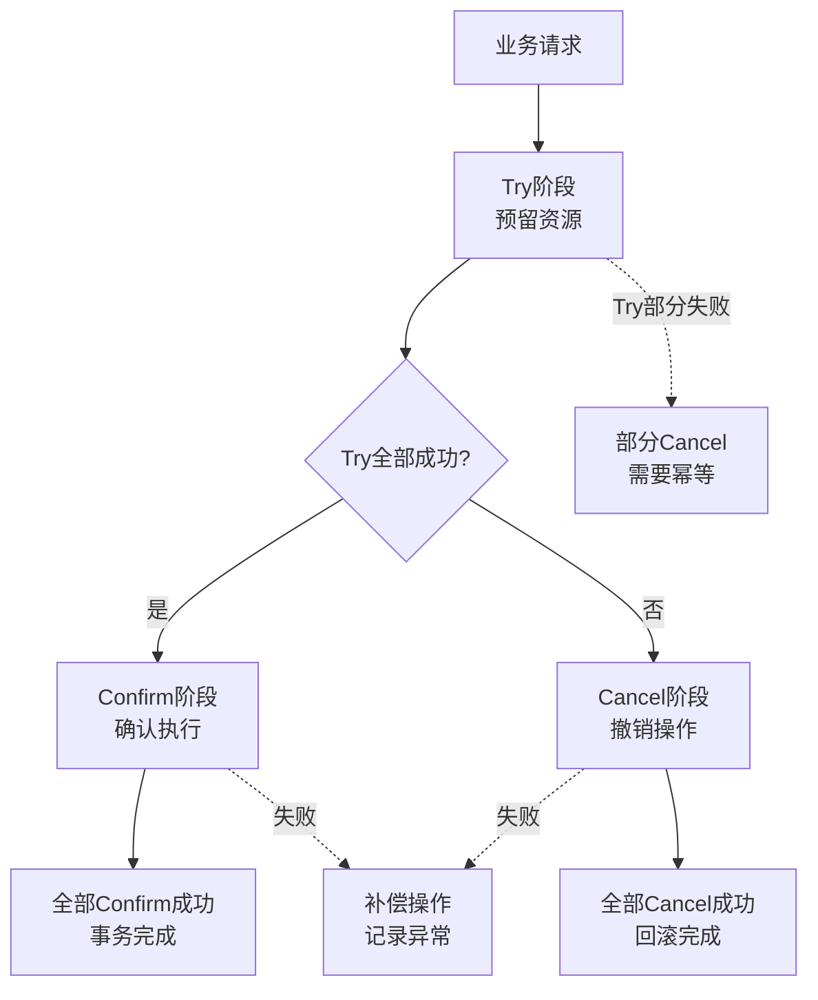
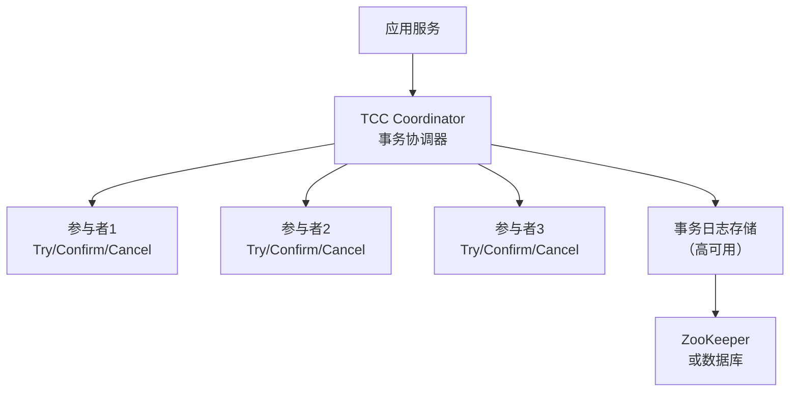

2019年双十一，团队上线了基于 TCC 的分布式事务方案。理论上：订单服务 Try 冻结库存 -> 支付服务 Confirm 扣款 -> 订单服务 Confirm 创建订单。如果任何一个环节失败，全部 Cancel。

结果大促当天，库存服务的一个 Cancel 接口超时了。业务系统的重试机制立刻重试，结果库存被**取消了两次**——库存从 100 变成了 98，而不是预期的 100。

事后复盘发现：库存服务的 Cancel 接口没有做幂等，第一次 Cancel 超时（但实际执行成功了），重试又执行了一遍。两条记录，两个 Cancel，库存就这样被多扣了。

这个 bug 听起来低级，但根因隐藏得很深：**TCC 的每一个阶段都需要幂等性保障，而幂等性需要精心设计，不是"加个唯一键"就能解决的。**

## 一、TCC 的核心思想

TCC（Try-Confirm-Cancel），由 Pat Helland 在 2007 年的论文《Life beyond Distributed Transactions: an Apostate's Opinion》中提出。与 2PC 的"数据库层面锁定"不同，TCC 是**业务层面的分布式事务协议**。

### 1.1 三阶段设计



**Try**：尝试执行业务，检查资源是否足够，预留资源（通常是冻结/锁定）。这个阶段**不真正扣减资源**，只是做准备工作。

**Confirm**：确认执行。真正扣减 Try 阶段预留的资源。这个阶段**必须成功**——如果 Confirm 失败，TCC 的设计假设是"可以无限重试直到成功"。

**Cancel**：取消操作。释放 Try 阶段预留的资源。这个阶段也**必须成功**——失败了就意味着资源泄漏。

【架构权衡】

TCC 和 2PC 的本质区别在于**在哪一层做协调**：

- **2PC**：在数据库层做协调（数据库自己的锁机制）。优点是对业务透明，缺点是阻塞时间长。
- **TCC**：在业务层做协调（业务自己实现 Try/Confirm/Cancel）。优点是性能好、不阻塞，缺点是业务侵入性强。

TCC 把"锁"从数据库层挪到了业务层。本质上是**用业务代码换性能**。

### 1.2 TCC 与 2PC 的对照

| 维度 | 2PC | TCC |
| --- | --- | --- |
| 协调层 | 数据库层（RM 自动处理） | 业务层（应用自己实现） |
| 资源锁定 | 数据库行锁/表锁 | 业务层资源冻结（如库存字段扣减） |
| 阻塞时间 | 长（从 Prepare 到 Commit） | 短（Try 很快完成，Confirm/Cancel 并行执行） |
| 业务侵入 | 低（数据库原生支持） | 高（每个服务都要实现 Try/Confirm/Cancel） |
| 一致性 | 强一致 | 最终一致（但可以做到准强一致） |
| 适用场景 | 低并发、一致性要求极高 | 高并发、性能敏感 |

## 二、TCC 的代码实现

### 2.1 接口定义

TCC 需要业务服务实现三个接口：

```java
@LocalTCC
public interface TccAction {
    /**
     * Try 阶段：检查资源，预留资源
     */
    @TwoPhaseBusiness(action = "tryAction")
    boolean try(BusinessContext context, int amount);

    /**
     * Confirm 阶段：确认执行，扣减预留的资源
     */
    @TwoPhaseBusiness(action = "confirmAction")
    boolean confirm(BusinessContext context);

    /**
     * Cancel 阶段：回滚，释放预留的资源
     */
    @TwoPhaseBusiness(action = "cancelAction")
    boolean cancel(BusinessContext context);
}
```

### 2.2 库存服务实现示例

```java
@Service
public class InventoryTccActionImpl implements InventoryTccAction {

    @Autowired
    private InventoryMapper inventoryMapper;

    @Override
    public boolean try(GlobalTransaction tx, int count) {
        // Try 阶段：检查库存是否足够
        Inventory inv = inventoryMapper.selectById(goodsId);
        if (inv.getStock() < count) {
            // 库存不足，Try 失败
            return false;
        }

        // 冻结库存（不是真正扣减）
        // inventory_freezed = count, inventory_available = stock - count
        inventoryMapper.freeze(goodsId, count);

        // 向 TCC 协调者注册分支事务
        tx.addBranch(TransactionContext.builder()
            .xid(tx.getXid())
            .actionName("inventory-try")
            .status(Status.TRYING)
            .build());

        return true;
    }

    @Override
    public boolean confirm(GlobalTransaction tx) {
        // Confirm 阶段：真正扣减冻结的库存
        // inventory_freezed = 0, inventory_deducted = count
        inventoryMapper.confirmDeduct(goodsId, count);
        return true;
    }

    @Override
    public boolean cancel(GlobalTransaction tx) {
        // Cancel 阶段：解冻库存
        // inventory_freezed = 0, inventory_available = stock
        inventoryMapper.unfreeze(goodsId, count);
        return true;
    }
}
```

### 2.3 订单服务编排 TCC

```java
@Service
public class OrderService {

    @Autowired
    private TccTransactionManager tccManager;

    public void createOrder(OrderDTO order) {
        // 开启全局 TCC 事务
        GlobalTransaction tx = tccManager.begin();

        try {
            // 1. 库存服务 Try
            boolean inventorySuccess = inventoryTccAction.try(tx, order.getCount());
            if (!inventorySuccess) {
                tx.rollback();
                throw new BusinessException("库存不足");
            }

            // 2. 支付服务 Try
            boolean paymentSuccess = paymentTccAction.try(tx, order.getAmount());
            if (!paymentSuccess) {
                tx.rollback();
                throw new BusinessException("支付失败");
            }

            // 3. 订单服务 Confirm
            boolean orderSuccess = orderTccAction.confirm(tx, order);
            if (!orderSuccess) {
                tx.rollback();
                throw new BusinessException("订单创建失败");
            }

            // 所有 Try 成功，手动触发 Confirm
            tx.commit();

        } catch (Exception e) {
            tx.rollback();
            throw e;
        }
    }
}
```

## 三、TCC 的核心问题

### 3.1 业务侵入性（最大问题）

TCC 要求每个参与者都实现 Try/Confirm/Cancel 三个接口。这意味着：
- 改造现有服务的成本极高
- 每个服务都要理解 TCC 协议
- 确认和取消逻辑需要和主业务逻辑保持一致

【架构权衡】

为什么 TCC 的业务侵入性是个大问题？

想象一下：你的系统有 50 个微服务，其中 20 个需要参与分布式事务。每个服务都要改代码、实现三个接口、测试三个接口的幂等性……这不是改代码，是**重写服务**。

所以 TCC 只适合：
1. 新系统，从一开始就按 TCC 设计
2. 核心链路上的少数几个服务
3. 愿意投入大量改造成本的系统

### 3.2 空回滚

如果 Try 方法因为网络问题没执行，但 Cancel 被调用了——这就是**空回滚**。Cancel 执行时发现没有任何资源需要释放，但 TCC 框架会认为这是正常的 Cancel 操作。

空回滚的危害：Cancel 修改了"不存在"的资源状态，可能导致数据不一致。

### 3.3 防悬挂

如果 Cancel 执行成功后，Try 请求才到达——这就是**防悬挂**（悬挂 = 已 Cancel 的事务又被 Confirm）。

防悬挂的根因是网络重排序：Cancel 的响应先于 Try 的请求到达协调者。

### 3.4 幂等性

Try/Confirm/Cancel 三个阶段都可能被调用多次（网络重试、超时重试）。每个阶段的代码**必须能处理重复调用**，且结果必须幂等。

```java
// Confirm 幂等实现示例
@Override
public boolean confirm(GlobalTransaction tx) {
    // 检查是否已经 Confirm 过
    TccBranchRecord record = tccRecordMapper.selectByXidAndAction(tx.getXid(), "inventory-confirm");
    if (record != null && record.getStatus() == Status.CONFIRMED) {
        // 已经 Confirm 过了，直接返回成功
        return true;
    }

    // 执行确认操作
    inventoryMapper.confirmDeduct(goodsId, count);

    // 记录 Confirm 状态
    tccRecordMapper.save(new TccBranchRecord(tx.getXid(), "inventory-confirm", Status.CONFIRMED));

    return true;
}
```

## 四、TCC 的实际架构

### 4.1 架构组件



TCC 协调器（TC）负责：
1. 管理全局事务状态
2. 调用各参与者的 Try/Confirm/Cancel
3. 处理超时和重试
4. 持久化事务日志（崩溃恢复用）

### 4.2 与 Seata 的结合

开源项目 Seata 提供了完整的 TCC 实现：

```java
@TwoPhaseBusiness(action = "reduce")
public boolean prepareReduce(BusinessActionContext actionContext,
                              @BusinessActionContextParameter(paramName = "count") int count) {
    // Try 逻辑
    int frozen = inventoryService.freeze(goodsId, count);
    return frozen > 0;
}

public boolean commitReduce(BusinessActionContext actionContext) {
    // Confirm 逻辑
    Long count = (Long) actionContext.getActionContext("count");
    inventoryService.confirmDeduct(goodsId, count);
    return true;
}

public boolean rollbackReduce(BusinessActionContext actionContext) {
    // Cancel 逻辑
    Long count = (Long) actionContext.getActionContext("count");
    inventoryService.unfreeze(goodsId, count);
    return true;
}
```

## 五、生产避坑指南

### 5.1 资源预留的设计

TCC 的 Try 阶段是"预留"，不是"真正扣减"。资源预留有几种策略：

**策略一：冻结字段（推荐）**
```sql
-- 库存表加字段
inventory: stock(总库存), frozen(冻结), available(可用)
-- Try: stock - count -> frozen
-- Confirm: frozen - count -> 扣减完成
-- Cancel: frozen - count -> available
```

**策略二：状态机**
```sql
-- 订单表加状态
order_status: PENDING -> CONFIRMED -> COMPLETED / CANCELLED
-- Try: 状态改为 PENDING（锁定）
-- Confirm: PENDING -> CONFIRMED
-- Cancel: PENDING -> CANCELLED
```

**策略三：乐观锁版本号**
```sql
-- 每次更新带版本号
UPDATE inventory SET stock = stock - #{count}, version = version + 1
WHERE id = #{id} AND version = #{expectedVersion}
```

【架构权衡】

资源预留方案的选择取决于业务特性：
- 高并发库存扣减：冻结字段 + 乐观锁
- 状态流转型（订单）：状态机
- 余额扣减：需要更精细的防超扣设计

### 5.2 确认和取消的超时处理

TCC 的 Confirm/Cancel 默认有重试机制。重试间隔通常是指数退避，避免雪崩。

```java
// Seata 的 TCC 重试配置
@Configuration
public class TCCConfig {
    @Bean
    public RetryCommittingInterceptor retryCommittingInterceptor() {
        RetryingTCCAdvisor advisor = new RetryingTCCAdvisor();
        advisor.setMaxAttempts(5);
        advisor.setBackOffMultiplier(2);
        advisor.setMaxInterval(30000); // 最大间隔 30 秒
        return advisor;
    }
}
```

:::warning
TCC 的 Confirm/Cancel 重试次数必须有限制。如果无限重试，可能导致资源永久锁定。比如库存被冻结后，Confirm 一直失败重试，这批库存就永远无法使用了。
:::

### 5.3 TCC 与 2PC 的性能对比

| 维度 | 2PC | TCC |
| --- | --- | --- |
| 锁持有时间 | 整个 Prepare 到 Commit 期间 | Try 阶段极短，Confirm/Cancel 并行 |
| 网络开销 | 2 轮（Prepare + Commit） | 3 轮（Try + Confirm + Cancel） |
| 数据库操作 | 1 次写（提交时） | 2 次写（Try冻结 + Confirm确认） |
| QPS（单链路） | 1000~2000 | 3000~5000 |

TCC 的 QPS 约为 2PC 的 2~3 倍，但实现复杂度是 2PC 的 5~10 倍。

## 六、工程代价评估

| 维度 | 评估 |
| --- | --- |
| 运维成本 | 高。需要监控每个分支事务的状态、重试次数、空回滚、防悬挂。 |
| 排障复杂度 | 高。涉及多个服务的状态协调，需要分布式链路追踪。 |
| 扩展性 | 好。Confirm/Cancel 可并行，性能随参与者线性下降。 |
| 回滚风险 | 低。但 Cancel 失败会导致资源泄漏。 |
| 业务改造 | 极高。每个参与者都要实现 Try/Confirm/Cancel。 |
| 适用场景 | 高并发、性能敏感、核心链路、有能力投入改造成本的系统。 |

【架构权衡】

TCC 适合这些场景：
1. 库存扣减、优惠券核销等**资源预留场景**
2. 高并发（万级 QPS 以上）的核心链路
3. 团队有能力投入大量改造工作
4. 服务数量少（`< 10` 个参与者）

TCC 不适合这些场景：
1. 参与者多（`>` 10 个）的长链路事务
2. 无法改造现有服务的遗留系统
3. 一致性要求不高、可以用消息队列解耦的场景

:::tip
选 TCC 前，先问自己："我愿意让每个服务都实现 Try/Confirm/Cancel 三个方法吗？" 如果答案是否定的，TCC 可能不是最优解。Saga 或本地消息表可能是更务实的选择。
:::

## 七、面试回答范式

面试时 TCC 相关问题的回答结构：

```
1. TCC 是什么（1句话）
   "TCC 是业务层的分布式事务协议，把数据库层的锁挪到了业务层，
    让业务自己实现 Try-Confirm-Cancel 三个阶段。"

2. 与 2PC 的区别（2句话）
   "2PC 在数据库层做协调，锁是数据库行锁，阻塞时间长；
    TCC 在业务层做协调，Try 阶段只做资源预留，锁是业务层的'冻结'，
    Confirm/Cancel 才真正操作资源，性能更好但业务侵入性更强。"

3. TCC 的三个核心问题（3句话）
   "第一，空回滚——Try 没执行但 Cancel 执行了；
    第二，防悬挂——Cancel 执行后 Try 才到达；
    第三，幂等性——Try/Confirm/Cancel 都可能被重复调用，必须幂等。
    这三个问题需要精心设计才能避免。"

4. 选型建议（1句话）
   "TCC 适合高并发、资源预留场景，但业务侵入性高，
    大多数场景用 Saga 或事务消息更务实。"
```
