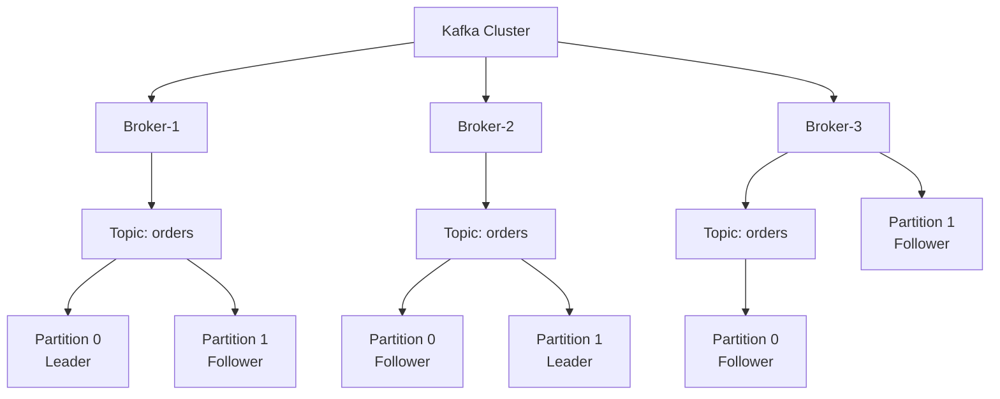

# Kafka 架构深度解析

候选人小赵在美团三面中被问到："Kafka 为什么能做到这么高的吞吐量？它的架构设计是怎样的？"

小赵胸有成竹："因为Kafka是顺序写磁盘，比随机写快很多。"

面试官点点头："那顺序写解决了什么问题？磁盘顺序写的IOPS大概是多少？跟内存比差多少数量级？"

小赵开始擦汗："这个...大概差几十倍？"

面试官追问："Kafka是怎么做到百万级TPS的？光靠顺序写够吗？"

小赵彻底答不上来了。

【面试官心理】

这道题我层层递进，想看的不是背书，是候选人有没有亲手压测过、有没有看过Kafka的perf test源码。"顺序写"是面试标准答案，但99%的人只知道这三个字，不知道它背后的IO模型、页缓存机制、零拷贝技术、批量处理和压缩。一个真正研究过Kafka的人，会说出页缓存、sendfile零拷贝、顺序写入的物理地址连续性，甚至能说出OS的预读算法对Kafka写入的影响。

## 一、核心问题：Kafka 高吞吐的架构密码 🔴

### 1.1 问题拆解

**第一层：怎么用？**
面试官问："Kafka的基本架构你了解吗？有哪些核心组件？"
候选人答："有Producer、Broker、Consumer，还有ZooKeeper..."
考察点：基本概念是否清晰

**第二层：底层实现**
面试官追问："Broker是怎么存储消息的？为什么能支持这么高的吞吐量？"
候选人答：...（核心拉开点）
考察点：存储机制、IO模型

**第三层：深度追问**
面试官追问："什么叫零拷贝？Kafka里的Zero-Copy是怎么实现的？"
候选人答：...
考察点：内核级理解

**第四层：生产调优**
面试官追问："如果线上Kafka吞吐量上不去，你怎么排查和调优？"
候选人答：...（P7区分点）
考察点：实战经验

### 1.2 错误示范

**候选人原话 A**："Kafka吞吐量高是因为它用内存存消息，读写特别快。"

**问题诊断**：
- 致命错误！Kafka的消息是持久化到磁盘的，不是存内存的
- 混淆了Kafka和Redis的应用场景
- 完全没有理解Kafka"磁盘速度够用"的设计哲学

**候选人原话 B**："Kafka用了零拷贝技术，就是把数据从磁盘拷贝到内存，再从内存拷贝到网络。"

**问题诊断**：
- 完全误解了零拷贝的含义
- 零拷贝恰恰是要减少内存拷贝次数，甚至避免用户态和内核态之间的切换
- 说出这话等于告诉面试官"我没真正理解过这个概念"

**候选人原话 C**："Kafka的吞吐量跟分区数线性相关，分区数越多越好。"

**问题诊断**：
- 知道分区可以并行消费是对的
- 但不知道分区过多带来的副作用：元数据压力、选举开销、重平衡延迟
- 没有生产调优经验

### 1.3 标准回答

Kafka的高吞吐量不是靠某个单一技术，而是五层架构的协同优化：

**第一层：顺序写磁盘 —— 利用磁盘的物理特性**

很多人以为Kafka用磁盘性能会差，实际上大错特错。关键在于"顺序写"。

```
随机写（传统数据库）：
磁头移动 → 写入 → 磁头移动 → 写入 → ...
每次写入都伴随seek操作，IOPS只有几百

顺序写（Kafka）：
磁头持续移动 → 顺序写入 → 顺序写入 → ...
顺序写入IOPS可达50万~100万次/秒
```

Kafka的消息写入磁盘时，是按追加顺序写入的，磁盘的顺序写入速度比内存随机读取慢不了多少（都在GB/秒级别）。更重要的是，顺序写跳过了磁盘寻道时间，磁头只朝一个方向移动。

但这里有个更深的知识点：Kafka利用了OS的页缓存（PageCache）机制。写消息时，Kafka先写到OS的页缓存（内存），然后由OS异步刷盘。读取时，如果热点数据在页缓存里，直接从内存返回，根本不碰磁盘。所以Kafka的"磁盘顺序写"实际上在大部分情况下就是"内存写"，速度极快。

**第二层：零拷贝 —— 减少内核态与用户态的数据搬运**

传统的消息消费流程，数据要经过多次拷贝：

```
传统方式（4次拷贝）：
磁盘文件 → 内核缓冲区 → 用户缓冲区 → Socket缓冲区 → 网卡
           拷贝1        拷贝2       拷贝3

Kafka零拷贝（2次拷贝）：
磁盘文件 → 内核缓冲区 → 网卡
           拷贝1

// 使用 Linux 的 sendfile 系统调用
// 数据从文件描述符直接传到 Socket，中间跳过用户态
```

Kafka在消费消息时调用Linux的`sendfile`系统调用，数据从磁盘文件直接传输到网卡缓冲区，全程在操作系统的内核空间完成，只有两次DMA（直接内存访问）拷贝，没有CPU参与。这比传统的"磁盘→内核→用户→Socket→网卡"路径快了2~3倍。

```java
// Kafka使用的零拷贝核心调用
// FileChannel.transferTo() 内部会使用 sendfile 系统调用
// 数据直接从 PageCache -> Socket Buffer -> NIC，全程零CPU拷贝
fileChannel.transferTo(position, remaining, socketChannel);
```

**第三层：批量处理 —— 用批量对抗网络开销**

单条消息的网络开销（TCP握手、请求头等）很大，Kafka把消息攒成批次再发送：

```
// Producer 批量发送伪代码
ProducerBatch batch = new ProducerBatch(topicPartition);
for (Message message : pendingMessages) {
    batch.add(message);  // 不断加入批次
    if (batch.isFull()) {
        sender.send(batch);  // 满了才发
    }
}
```

这样一条消息的平均网络开销被摊薄到几乎可以忽略。BatchSize越大，吞吐越高，但延迟也越大。

**第四层：消息压缩 —— 用CPU换网络带宽**

Kafka支持批量压缩，同一批消息放在一起压缩，压缩比可以达到5~10倍：

```
无压缩：每条消息单独发送，网络带宽成为瓶颈
批量压缩：多条消息拼成一个大块压缩，解压时整批一起解压
         CPU消耗略增，但网络带宽节省5~10倍
```

Kafka支持三种压缩算法：GZIP（压缩比高，CPU开销大）、Snappy（平衡型，Google出品）、LZ4（压缩解压速度最快，推荐）。

**第五层：分区并行 —— 水平扩展的核心**

Kafka的Topic可以分成多个Partition，每个Partition独立读写，可以分布在不同的Broker节点上：

```
Topic: order-events (4个分区)
  ├── Partition 0 → Broker-1
  ├── Partition 1 → Broker-2
  ├── Partition 2 → Broker-3
  └── Partition 3 → Broker-4

消费并行度 = 分区数量（最多等于消费者数量）
吞吐 = 单分区吞吐 × 分区数
```

这意味着Kafka的吞吐量可以随着集群规模线性扩展——加机器就能加吞吐。

【面试官心理】

这道题我能听出候选人的段位。说"顺序写"的占80%，能说出"页缓存+顺序写"的占50%，能解释清楚"sendfile零拷贝"的占20%，能把五层优化串起来讲的只有5%。P6以上的候选人，至少要能说出其中三层的原理和相互关系。

### 1.4 追问升级

**P6/P7 差距拉开点：**

面试官问："Kafka的Leader-Follower副本同步机制是什么？Follower挂了你怎么保证数据不丢？"

这道题的分水岭：
- P5：知道有副本，不知道ISR是什么
- P6：能说出ISR（In-Sync Replicas）机制，知道ack=all的含义
- P7：能从CAP理论解释Kafka的副本策略，能设计数据可靠性和性能的权衡方案

## 二、延伸问题：Kafka 的存储机制 🟡

### 2.1 Kafka 是怎么存消息的？

**面试官追问："Kafka的消息是怎么组织存储的？Partition内部是什么结构？"**

这个问题考察的是有没有看过Kafka的存储层源码。

Kafka的每个Partition在物理上对应一个目录，目录下有多个Segment文件：

```
/kafka-logs/orders-0/
  ├── 00000000000000000000.log      # 数据文件
  ├── 00000000000000000000.index   # 索引文件（稀疏索引）
  ├── 00000000000000000000.timeindex # 时间戳索引
  ├── 00000000000000123456.log      # 下一个Segment
  ├── 00000000000000123456.index
  └── 00000000000000123456.timeindex
```

每个Segment包含：
- `.log`：消息数据，按offset顺序存储
- `.index`：稀疏索引，按offset→物理位置映射
- `.timeindex`：按时间戳→offset的索引

稀疏索引的设计很巧妙：不是每条消息都建索引，而是每间隔若干条消息（比如4KB）建一条索引。这样索引文件很小，但查询时通过二分查找定位到附近，再顺序扫描。

**追问："Segment文件什么时候切分？"**

Segment切换有两个条件（满足任一即可）：
1. 当前Segment的日志文件大小超过`segment.bytes`（默认1GB）
2. 消息的时间戳超过了`segment.ms`（默认一周）

这个设计保证了日志文件不会无限增长，也方便做数据清理。

### 2.2 错误示范

**候选人原话**："Kafka把消息存在内存里，满了再刷到磁盘。"

**问题诊断**：完全错误！Kafka默认配置是异步刷盘，消息先写OS页缓存，定期刷到磁盘。且"满了再刷"这种表述暴露了对Kafka存储机制的无知。

## 三、Kafka 核心概念：完整分层视图

### 3.1 Broker、Topic、Partition、Replica 的关系



**AR、ISR、OWR 三个副本集合**：

```
AR（Assigned Replicas）：分区创建时分配的所有副本（Broker-1/Broker-2/Broker-3）
ISR（In-Sync Replicas）：与Leader保持同步的副本集合（Broker-1/Broker-2）
OWR（Out-of-Sync Replicas）：落后太多被踢出ISR的副本（Broker-3）

关系：AR = ISR + OWR
ISR 是 AR 的子集，只有 ISR 内的副本参与 Leader 选举
```

### 3.2 Controller 选举与职责

Kafka集群中有一个Controller（控制器），由ZooKeeper在Broker启动时选举产生：

```
Controller职责：
1. 主题管理（创建/删除/分区副本分配）
2. 分区Leader选举（当Leader宕机时）
3. Broker上下线处理（副本迁移）
4. 分区副本重分配
```

:::tip 💡
Controller选举机制：第一个在ZooKeeper的/controller节点创建临时节点的Broker成为Controller。如果Controller宕机，ZooKeeper会立即通知其他Broker重新竞选。Kafka 3.5+引入了KRaft模式，可以脱离ZooKeeper独立运行。

:::

### 3.3 ZooKeeper 在 Kafka 中的职责（3.5+ 变化）

ZooKeeper在Kafka 2.8之前扮演核心角色：

```
ZooKeeper在Kafka中的职责：
1. Broker注册：/brokers/ids/{brokerId} 临时节点，宕机自动消失
2. Controller选举：/controller 临时节点
3. Topic配置管理：/config/topics/{topic}
4. 消费者组offset存储（早期版本，0.9之前）
5. ACL权限管理

Kafka 3.5+ 的变化：
KRaft模式：用Raft协议替代ZooKeeper
→ Controller不再是外部选举，而是Broker之间通过Raft协议自举
→ 优势：减少部署依赖，降低运维复杂度
→ ZooKeeper不再是必须组件
```

:::warning ⚠️
Kafka 3.5+虽然引入了KRaft模式，但目前生产环境主流仍是ZooKeeper模式。面试中问到ZooKeeper相关问题，能说出从ZooKeeper到KRaft的演进路径，说明候选人对Kafka社区动态有关注。

:::

## 四、生产避坑：Kafka 线上调优核心参数

### 4.1 Producer 端调优

| 参数 | 默认值 | 推荐值 | 说明 |
| --- | --- | --- | --- |
| `acks` | 1 | `all`（高可靠场景） | 0=不等确认，1=Leader确认，all=ISR全部确认 |
| `batch.size` | 16KB | 32KB~64KB | 批次大小，越大吞吐越高但延迟越大 |
| `linger.ms` | 0ms | 5~10ms | 等待凑满batch的时间，0=立即发送 |
| `buffer.memory` | 32MB | 128MB+ | 生产者缓冲区，高吞吐场景要加大 |
| `retries` | 0 | `MAX_INT` | 重试次数，高可靠场景必须设 |
| `enable.idempotence` | `false` | `true` | 开启幂等，防止生产者重试导致重复消息 |

```java
// 生产者最佳实践配置
Properties props = new Properties();
props.put("bootstrap.servers", "kafka1:9092,kafka2:9092");
props.put("acks", "all");                    // 所有ISR副本确认
props.put("retries", Integer.MAX_VALUE);     // 无限重试
props.put("batch.size", 32768);              // 32KB批次
props.put("linger.ms", "10");                // 等待10ms凑满批次
props.put("buffer.memory", 134217728);        // 128MB缓冲区
props.put("enable.idempotence", "true");     // 幂等生产者
```

:::warning ⚠️

`acks=all` 会显著增加延迟，因为它要等所有ISR副本都确认才返回。吞吐和可靠性的权衡是Kafka永恒的话题。高吞吐场景（日志采集）用`acks=1`，高可靠场景（交易链路）用`acks=all`。

:::

### 4.2 Broker 端调优

```properties
# Kafka Broker 核心配置
num.network.threads=8        # 网络线程数，跟CPU核心数匹配
num.io.threads=16            # IO线程数，处理磁盘和网络读写
socket.send.buffer.bytes=102400   # Socket发送缓冲区
socket.receive.buffer.bytes=102400 # Socket接收缓冲区
log.dirs=/data/kafka-logs    # 数据目录，用SSD且和日志目录分开
num.partitions=8             # 默认分区数，按需调大
default.replication.factor=3 # 默认副本数，生产环境至少3
min.insync.replicas=2        # ISR最少副本数，配合acks=all使用
unclean.leader.election.enable=false  # 不允许从非ISR中选Leader
log.retention.hours=168      # 消息保留时间，默认7天
log.segment.bytes=1073741824  # Segment文件大小，1GB
```

:::tip 💡

`unclean.leader.election.enable=false` 是保证数据不丢的关键配置。设为true时，如果所有ISR副本都挂了，会从非ISR的落后副本中选Leader，这会导致消息丢失。金融级场景必须设为false，宁可不可用也不能丢数据。

:::

### 4.3 Consumer 端调优

```java
// 消费者最佳实践
Properties props = new Properties();
props.put("bootstrap.servers", "kafka1:9092");
props.put("group.id", "order-consumer-group");
props.put("enable.auto.commit", "false");        // 手动提交offset
props.put("auto.offset.reset", "earliest");       // 消费位点策略
props.put("fetch.min.bytes", "1024");            // 最小拉取数据量
props.put("fetch.max.wait.ms", "500");            // 最大等待时间
props.put("max.poll.records", "500");             // 单次拉取最大消息数
```

:::warning ⚠️

`enable.auto.commit=false` 是高可靠场景的标准配置。自动提交offset的问题在于：消息还没处理完就提交了offset，如果此时消费者宕机，会导致消息丢失。手动提交需要配合try-catch和重试机制，确保业务处理成功后才提交offset。

:::

## 五、工程选型：Kafka 适合的场景

### 5.1 Kafka 的最佳适用场景

**1. 日志采集与大数据实时分析**
Kafka最初就是LinkedIn用来处理日志的。它的持久化能力、海量吞吐和丰富的生态（Spark、Flink、ES都能直接对接）使其成为数据管道的首选。

**2. 活动/秒杀事件的流处理**
高并发写入是Kafka的核心优势。双十一零点的高峰流量，Kafka能扛住洪峰，让下游消费者按自己的速度消费。

**3. CDC数据同步（变更数据捕获）**
MySQL binlog → Kafka → 数据湖，这是目前最流行的实时数据同步架构。Kafka的Exactly-Once语义（配合事务）能保证数据不重不漏。

**4. 跨机房数据复制/灾备**
Kafka的MirrorMaker可以在集群之间复制数据，实现跨机房灾备。

### 5.2 Kafka 不擅长的场景

Kafka不是万能的，以下场景有更好的替代：

- **事务消息**：Kafka没有原生事务消息支持，如果需要"本地事务+消息发送"的原子性保障，要用RocketMQ或自研补偿机制
- **延迟/定时消息**：Kafka不支持消息延迟投递，只能用外部定时任务模拟
- **小消息高频消费**：Kafka的批量处理模型适合大吞吐，但单条消息的端到端延迟比RabbitMQ高

【面试官心理】

面试到最后，我会问一个开放问题："如果你来设计Kafka，你会怎么改进？"能回答出"增加事务消息支持"、"改善小消息延迟"、"优化元数据同步"的，是有架构思维的候选人。这种问题没有标准答案，我要看的是候选人的思考深度和技术好奇心。

