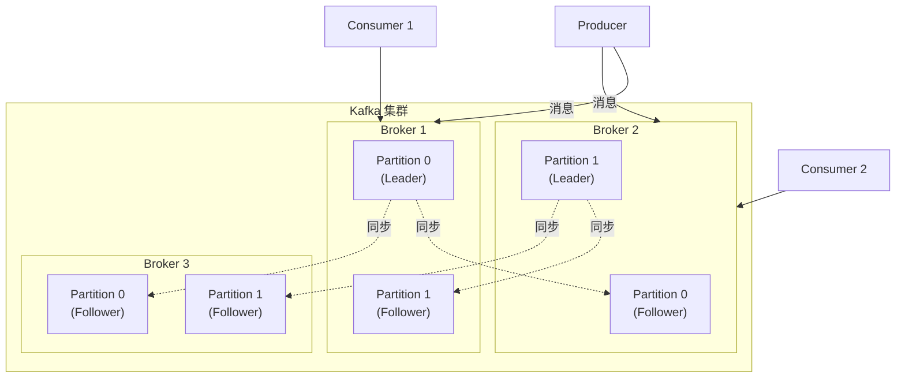
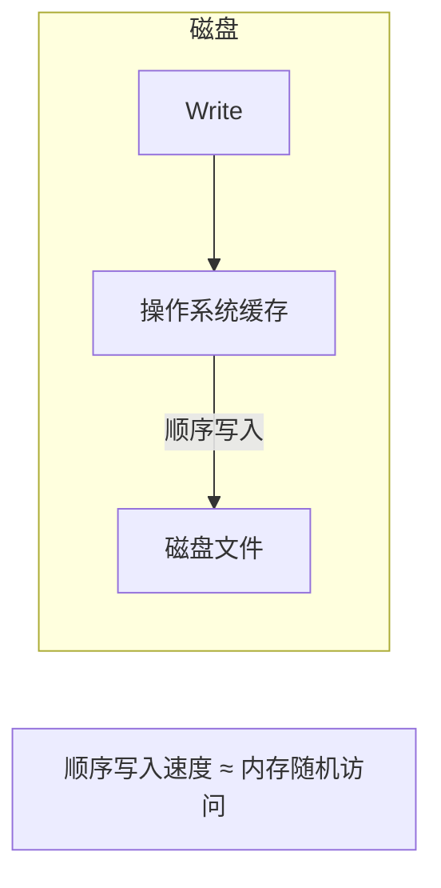
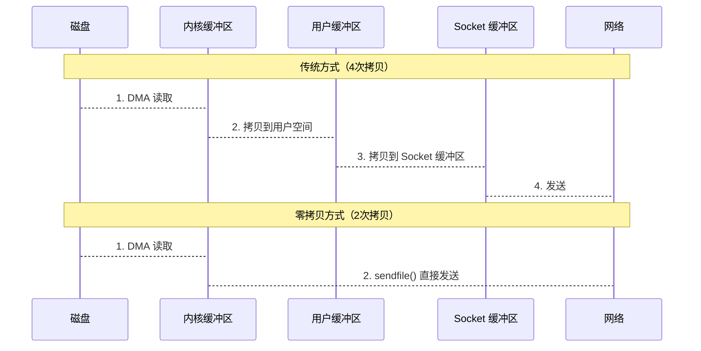
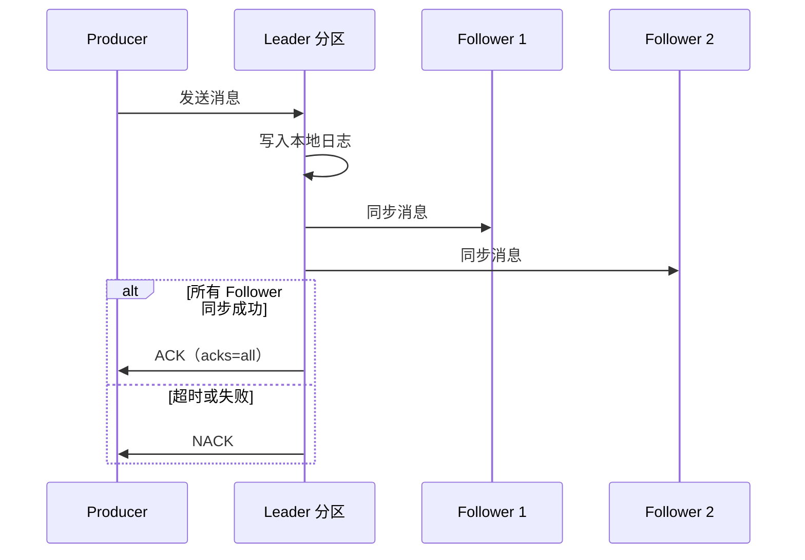
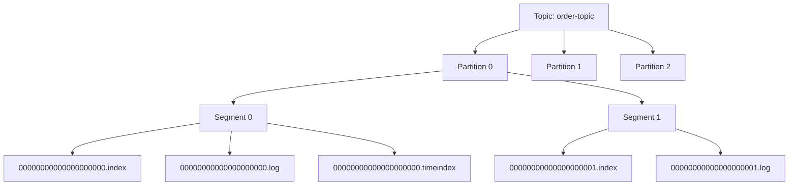

# Kafka 架构

> 目标级别：P6
>
> 面试命中率：90%

## 快速自测

1. Kafka 的核心组件有哪些？
2. Topic、Partition、Broker 之间的关系是什么？
3. Kafka 为什么能做到高吞吐量？

---

## 一、Kafka 核心概念

### 核心组件

| 组件 | 说明 |
| --- | --- |
| **Broker** | Kafka 集群中的节点，负责存储消息 |
| **Topic** | 消息主题，用于分类管理消息 |
| **Partition** | 分区，Topic 的物理存储单元 |
| **Producer** | 消息生产者 |
| **Consumer** | 消息消费者 |
| **Consumer Group** | 消费者组，多个消费者共享消费 |
| **Replica** | 副本，分区的备份 |
| **Leader** | 分区的Leader副本，处理读写请求 |
| **Follower** | 分区的 Follower 副本，同步 Leader 数据 |

---

## 二、Kafka 架构图



---

## 三、Topic 与 Partition

### 分区的作用

1. **并行处理**：一个 Topic 可以有多个 Partition，不同 Partition 可以并行写入
2. **负载均衡**：不同 Partition 分布在不同 Broker 上
3. **水平扩展**：可以通过增加 Partition 来提升并行度

### 分区分配策略

```java
// 默认分配策略：基于 AR（Assigned Replicas）顺序分配
// Broker 1: [P0, P3]
// Broker 2: [P1, P4]
// Broker 3: [P2, P5]
```

---

## 四、Kafka 高性能原理

### 1. 顺序写入



Kafka 采用顺序写入磁盘的方式，顺序写入的速度可以达到 600MB/s，远高于随机写入。

### 2. 页缓存（Page Cache）

```java
// Kafka 利用操作系统的 Page Cache 机制
// 写入的数据先进入 Page Cache，由操作系统异步刷盘
// 读取时优先从 Page Cache 获取
```

### 3. 零拷贝（Zero Copy）



### 4. 批量处理

- **批量发送**：Producer 积累一定量数据后批量发送
- **批量消费**：Consumer 一次拉取多条消息
- **压缩**：支持消息批量压缩（GZIP、Snappy、LZ4）

---

## 五、Kafka 副本机制

### 副本同步



### ISR（In-Sync Replicas）

```java
// ISR 列表：与 Leader 保持同步的副本集合
// 包含所有 follower.replica.lag.time.max.ms 内在内的副本
// 只有 ISR 中的副本才有资格被选为 Leader
```

---

## 六、Kafka 存储结构



每个 Partition 由多个 Segment 组成，每个 Segment 包含 `.index`、`.log`、`.timeindex` 三个文件。

---

## 七、高频面试题

### 🔴 第一层：Kafka 的核心组件有哪些？

**答案要点**：
1. Broker：Kafka 集群节点
2. Topic：消息主题
3. Partition：Topic 的分区
4. Producer/Consumer：生产者/消费者
5. Consumer Group：消费者组

### 🔴 第二层：Kafka 为什么能做到高吞吐量？

**答案要点**：
1. 顺序写入磁盘，利用磁盘顺序读写特性
2. 利用 Page Cache，减少磁盘 IO
3. 零拷贝技术，减少 CPU 和内存拷贝
4. 批量处理和压缩

### 🔴 第三层：Kafka 的副本同步机制是什么？

**答案要点**：
1. Leader 处理读写请求
2. Follower 主动从 Leader 拉取消息同步
3. 只有 ISR 中的副本才有资格成为 Leader
4. `acks=all` 时需要所有 ISR 副本同步成功才返回 ACK

---

## 八、常见陷阱

> ⚠️ **陷阱一**：Partition 数量设置过多

Partition 数量直接影响文件句柄数量，每个 Broker 默认打开的文件数是有限的。

> ⚠️ **陷阱二**：acks 设置不当

- `acks=0`：可能丢失消息，但性能最高
- `acks=1`：Leader 同步成功即返回，可能丢失消息
- `acks=all`：所有 ISR 同步成功，性能最差但最可靠

> ⚠️ **陷阱三**：Consumer Group 设置错误

同一个 Partition 只能被消费者组内一个消费者消费。消费者数量超过 Partition 数量时，多余的消费者会空闲。

---

## 九、对比总结

| 维度 | Kafka | RabbitMQ | RocketMQ |
| --- | --- | --- | --- |
| **吞吐量** | 极高 | 中等 | 高 |
| **持久化** | 文件系统 | 内存+磁盘 | 磁盘 |
| **延迟** | 毫秒级 | 微秒级 | 毫秒级 |
| **集群** | 原生支持 | 需要 Federation 插件 | 原生支持 |
| **多租户** | 支持 | 支持 | 支持 |

---

## 十、扩展思考

### 💡 Kafka 如何保证消息不丢失？

**答案**：
1. Producer 端：使用 `acks=all` + 重试机制
2. Broker 端：设置 `replication.factor >= 3` + `min.insync.replicas >= 2`
3. Consumer 端：关闭自动提交，手动处理完成后提交

### 💡 Kafka 的分区分配策略有哪些？

**答案**：
1. RangeAssignor：按 Topic 逐个分配
2. RoundRobinAssignor：轮询分配
3. StickyAssignor：保证消费者分配的稳定性
