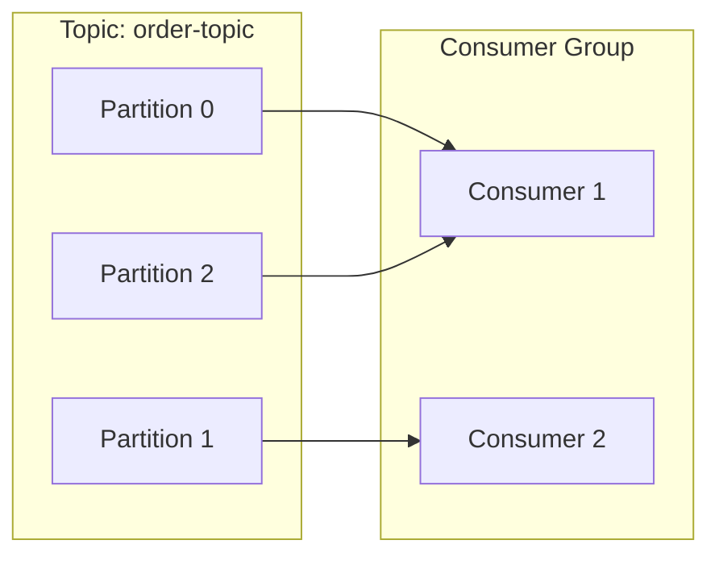
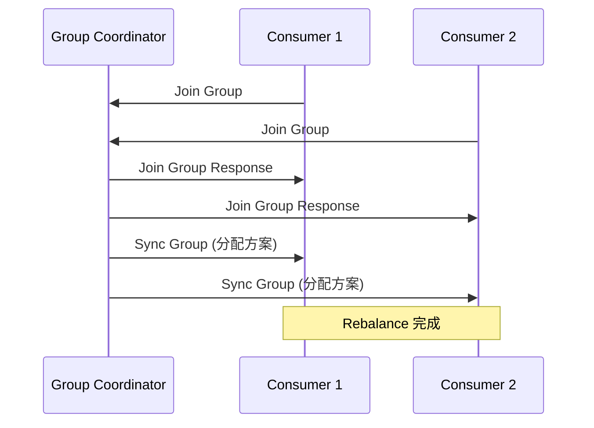

# Kafka 分区与消费者组

> 目标级别：P6
>
> 面试命中率：85%

## 快速自测

1. Kafka 的分区分配策略有哪些？
2. 消费者组和分区数的关系是什么？
3. 如何保证消息的顺序性？

---

## 一、分区分配策略

### 1. RangeAssignor（默认）

```java
// 按 Topic 逐个分配
// topic A 有 3 个 partition，消费者组有 2 个消费者
// C1: [P0, P1]
// C2: [P2]
```

### 2. RoundRobinAssignor

```java
// 所有 Topic 的 Partition 放在一起轮询分配
// topic A 有 3 个 partition，topic B 有 3 个 partition
// C1: [A-P0, A-P2, B-P1]
// C2: [A-P1, B-P0, B-P2]
```

### 3. StickyAssignor

```java
// 保证消费者分配的稳定性
// 尽量保持原有的分配，减少 Rebalance
```

---

## 二、消费者组机制

### 消费模型



### 分区与消费者的关系

| 场景 | 说明 |
| --- | --- |
| Partition 数 = Consumer 数 | 每个消费者消费一个分区 |
| Partition 数 > Consumer 数 | 部分消费者消费多个分区 |
| Partition 数 < Consumer 数 | 部分消费者空闲 |

---

## 三、Rebalance 机制

### 触发条件

1. 消费者加入或离开
2. 消费者心跳超时
3. 分区数量变化
4. 订阅的 Topic 发生变化

### Rebalance 过程



### 消费者配置

```java
properties.put("enable.auto.commit", true);
properties.put("auto.commit.interval.ms", 5000);
properties.put("session.timeout.ms", 30000);
properties.put("max.poll.interval.ms", 300000);
properties.put("heartbeat.interval.ms", 10000);
```

---

## 四、保证消息顺序

### 单分区有序

```mermaid
flowchart LR
    subgraph Topic
        P0["Partition 0"]
    end

    Producer1["Producer"] -->|msg1| P0
    Producer2["Producer"] -->|msg2| P0
    Producer3["Producer"] -->|msg3| P0

    P0 --> Consumer["Consumer"]

    Note: 单分区保证消息有序
```

### 消息有序的条件

1. **单分区**：所有消息发送到同一个 Partition
2. **单消费者**：同一个 Partition 只被一个 Consumer 消费
3. **不 Rebalance**：Rebalance 期间可能乱序

---

## 五、分区数计算

### 计算公式

```
分区数 = max(消费者数量, 峰值吞吐量 / 单消费者处理能力)
```

### 示例

```java
// 峰值 TPS：10000
// 单消费者处理能力：1000 TPS
// 需要的消费者数：10000 / 1000 = 10
// 分区数：max(10, 10) = 10
```

---

## 六、高频面试题

### 🔴 第一层：消费者组和分区数的关系是什么？

**答案要点**：
1. 同一个消费者组内的消费者共享分区
2. 每个分区只能被组内一个消费者消费
3. 消费者数量超过分区数时，多余消费者空闲

### 🔴 第二层：如何保证 Kafka 消息的顺序性？

**答案要点**：
1. 发送消息时指定 Partition
2. 相同 key 的消息发送到同一个 Partition
3. 消费时使用单线程消费

---

## 七、常见陷阱

> ⚠️ **陷阱一**：消费者数量超过分区数

多余的消费者会一直空闲，造成资源浪费。

> ⚠️ **陷阱二**：Rebalance 导致消息乱序

Rebalance 期间，不同消费者可能重新分配分区，导致消息乱序。

> ⚠️ **陷阱三**：max.poll.records 设置过大

一次拉取消息过多，处理时间过长可能导致 Rebalance。
