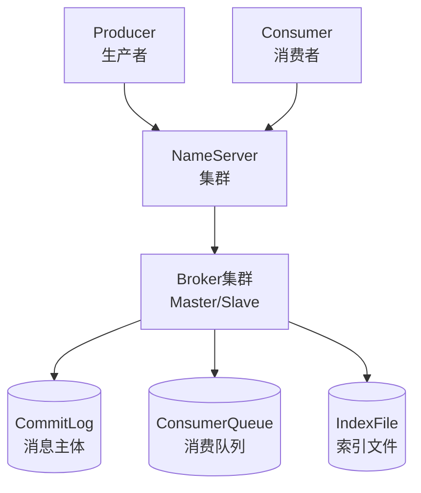

# RocketMQ 架构深度解析

候选人小陈在阿里三面中被问到："RocketMQ的架构和Kafka有什么不同？为什么阿里会选择自研RocketMQ？"

小陈想了想："RocketMQ用NameServer管理元数据，Kafka用ZooKeeper。"

面试官点点头："那RocketMQ的消息存储机制是什么？为什么它的CommitLog设计成这样？"

小陈愣住了："呃...消息存在磁盘上？"

面试官追问："CommitLog和ConsumerQueue是什么关系？为什么RocketMQ适合交易链路？"

小陈彻底答不上来了。

【面试官心理】

这道题我考察的是候选人对RocketMQ架构设计的深度理解。RocketMQ和Kafka的最大区别不在于"用NameServer代替ZooKeeper"这个表层答案，而在于消息存储模型——Kafka用Partition+Segment，RocketMQ用CommitLog+ConsumerQueue。这两种设计在顺序写、随机读、消息追溯上各有取舍。能说清这个区别的，才是真正理解了两者的架构差异。

## 一、核心问题：RocketMQ 的四层架构 🔴

### 1.1 问题拆解

**第一层：组件认知**
面试官问："RocketMQ有哪些核心组件？它们各自负责什么？"
候选人答："有NameServer、Broker、Producer、Consumer..."
考察点：基本概念

**第二层：架构特点**
面试官追问："RocketMQ为什么用NameServer而不是ZooKeeper？这两种方案有什么区别？"
候选人答：...（拉开点1）
考察点：架构设计权衡

**第三层：存储机制**
面试官追问："RocketMQ是怎么存储消息的？CommitLog、ConsumerQueue、IndexFile的作用是什么？"
候选人答：...（核心拉开点）
考察点：存储层设计

**第四层：适用场景**
面试官追问："RocketMQ适合什么场景？和Kafka比，它的优势在哪里？"
候选人答：...（P7区分点）
考察点：工程选型能力

### 1.2 错误示范

**候选人原话 A**："RocketMQ和Kafka差不多，都是用磁盘存消息。"

**问题诊断**：
- 两者架构差异巨大，从协调机制到存储模型都不一样
- 说"差不多"说明只用过表层API，不理解底层设计
- 面试官追问几个细节就会露馅

**候选人原话 B**："RocketMQ比Kafka好，因为它支持事务消息。"

**问题诊断**：
- 确实RocketMQ原生支持事务消息，但Kafka也可以通过幂等producer实现
- 只知其一不知其二
- 不理解事务消息的实现原理

**候选人原话 C**："NameServer是无状态的，比ZooKeeper更简单。"

**问题诊断**：
- NameServer无状态是对的，但这只是表象
- 不知道NameServer集群间不通信、各自为政的设计哲学
- 不知道这种设计的优缺点

### 1.3 标准回答

**RocketMQ 的四层架构**



**NameServer：无中心、互不通信**

```
NameServer集群的部署特点：
  Broker启动 → 向所有NameServer注册自己的信息（IP/端口/主题信息）
  NameServer之间不通信，不同步状态，各自维护Broker信息

这意味着：
  每个NameServer的数据可能不一致
  Producer/Consumer从多个NameServer随机选一个查询
  → 如果查到的Broker信息不同步，Producer会找到错误的Broker
  → 但实际上影响不大，因为Broker注册是定时心跳续约的

对比ZooKeeper：
  ZooKeeper是有中心共识协议（ZAB协议）
  所有Broker注册信息在ZooKeeper集群内强一致
  优点：数据一致性强
  缺点：运维复杂度高，ZooKeeper本身是单点性能瓶颈

RocketMQ选择NameServer的理由：
  简单：无共识协议，部署维护容易
  高可用：Broker向多个NameServer注册，单个NameServer挂了不影响
  牺牲：元数据一致性（但MQ场景下短暂不一致可接受）
```

**Broker：消息存储与转发的核心**

```
Broker的架构：
  Broker = Master + Slave（不是主从复制，是主备）

Broker角色：
  Master：处理读写请求（Producer写、Consumer读）
  Slave：只读，不处理写请求，但可以承担读请求（读流量分担）

消息同步方式：
  Master → Slave：同步复制（SyncMaster）或异步复制（AsyncMaster）

配置推荐：
  同步复制（SyncSlave）：保证强一致，数据不丢失，但延迟高
  异步复制（AsyncSlave）：延迟低，但极端情况下可能丢数据
```

:::tip 💡

RocketMQ的Master/Slave和Kafka的Leader/Follower本质上是同一套机制——都是主从副本。但区别在于：
- Kafka的Follower可以参与读写（ISR内的副本都算"活着"）
- RocketMQ的Slave不处理写请求，只做数据备份

:::

【面试官心理】

我追问NameServer vs ZooKeeper，其实是在考察候选人对分布式系统共识协议的理解深度。说"NameServer更好"或"ZooKeeper更好"都是片面的，关键是要知道取舍：RocketMQ牺牲元数据一致性换运维简单，Kafka用ZooKeeper保证一致性但运维复杂。

### 1.4 追问升级

**P6/P7 差距拉开点：**

面试官问："RocketMQ的Broker挂了会发生什么？消息会丢失吗？"

这道题的分水岭：
- P5：Broker挂了Consumer就收不到消息了
- P6：知道Slave可以接替，知道同步复制vs异步复制的区别
- P7：能说出Broker挂了后的故障转移流程、消息可靠性的配置策略、Dledger模式

## 二、延伸问题：消息存储机制 🟡

### 2.1 CommitLog：消息的"数据库"

**面试官追问："RocketMQ为什么设计CommitLog？它的读写模型是什么？"**

这是理解RocketMQ存储机制的核心问题。

```
RocketMQ的存储架构：

CommitLog（消息主体）：
  - 所有消息追加写入一个文件（顺序写）
  - 文件大小默认1GB，超过则创建新文件
  - 消息在CommitLog中的物理偏移量（physical offset）是全局唯一的

ConsumerQueue（消费队列）：
  - 按Topic+Queue维护，每个ConsumerQueue指向CommitLog中的消息
  - 每条记录 = CommitLog物理offset + 消息长度 + TagHashCode
  - Consumer只读ConsumerQueue，不直接读CommitLog

IndexFile（索引文件）：
  - 按消息Key建立哈希索引
  - 支持按Key查询消息
  - 用于消息追溯和重置消费位点
```

```
读写流程：

写入（顺序写）：
  消息 → CommitLog追加写入 → 获取physical offset
       → 根据Topic+Queue写入ConsumerQueue
       → 根据Key写入IndexFile
  写入速度极快，因为都是顺序追加

读取（随机读）：
  Consumer指定offset → 查ConsumerQueue找到physical offset
                    → 根据physical offset在CommitLog中定位
                    → 读取消息内容
  ConsumerQueue是顺序读取（按offset递增）
  CommitLog是随机读取（根据physical offset定位）

问题：为什么ConsumerQueue是顺序的但CommitLog是随机的？
  因为ConsumerQueue记录的是"消息在CommitLog中的位置"
  ConsumerQueue本身是按offset顺序排列的
  Consumer读取ConsumerQueue是顺序的（从小到大读offset）
  但根据physical offset去CommitLog定位是随机的
```

:::warning ⚠️

RocketMQ的读写模型和Kafka正好相反：
- Kafka：消息写入Partition（顺序），Consumer按offset顺序读Partition（顺序读）
- RocketMQ：消息写入CommitLog（顺序），Consumer读ConsumerQueue（顺序），再读CommitLog（随机读）

这意味着RocketMQ的读性能理论上不如Kafka，但RocketMQ通过"页缓存预读"机制弥补——OS会把ConsumerQueue附近的CommitLog数据预加载到PageCache，减少实际磁盘IO。

:::

### 2.2 刷盘策略：同步 vs 异步

Broker的消息刷盘策略直接影响可靠性和性能：

```properties
# Broker配置
flushDiskType = ASYNC_FLUSH  # 异步刷盘（默认），高性能
# flushDiskType = SYNC_FLUSH  # 同步刷盘，强一致

# 同步刷盘：消息写入PageCache后，立即刷到磁盘
#           返回成功时，数据已在磁盘上
#           代价：延迟增加（等待磁盘IO完成）

# 异步刷盘：消息写入PageCache后立即返回
#           OS在后台异步刷盘
#           代价：极端情况下可能丢失少量数据（PageCache未刷盘时宕机）
```

```
刷盘组合矩阵：

              Master刷盘方式
              同步刷盘        异步刷盘
Broker同步    强一致         高性能
复制方式      数据零丢失      可能丢少量数据
            （Dledger模式推荐）

              异步复制        同步复制
              Master异步写    Master同步写
Slave同步     延迟低          延迟高
            可能丢数据       数据零丢失
            （不推荐）       （推荐生产环境）
```

## 三、RocketMQ 特有功能

### 3.1 消息过滤（Tag + SQL92）

Kafka的消息过滤只能在Consumer端自己做（按key过滤或全量拉取再过滤）。

RocketMQ支持在Broker端过滤，减少无效数据传输：

```java
// 生产者：设置Tag
producer.send(new Message("order-topic", "TagA", orderJson.getBytes()));

// 消费者：按Tag过滤（简单过滤）
consumer.subscribe("order-topic", "TagA || TagB");  // 订阅TagA或TagB

// 消费者：按SQL92过滤（复杂过滤，推荐）
consumer.subscribe("order-topic",
    MessageSelector.bySql("orderType = 'vip' AND amount > 1000"));
// Broker在推送消息前先执行SQL，不符合条件的消息不推送
// 减少网络传输，提升Consumer效率
```

:::tip 💡

SQL92过滤是在Broker端执行的，这意味着过滤逻辑由Broker执行，减少了无效数据的传输。但要注意，过滤逻辑不要太重，否则会增加Broker的CPU压力。

:::

### 3.2 延迟消息：RocketMQ 原生支持

Kafka不支持延迟消息（只能靠外部定时任务模拟）。

RocketMQ原生支持延迟消息，通过延迟级别实现：

```java
// RocketMQ延迟消息示例
Message message = new Message("delay-topic", msg.getBytes());
message.setDelayTimeLevel(3);  // 设置延迟级别
// 延迟级别：1s, 5s, 10s, 30s, 1m, 2m, 3m, 4m, 5m, 6m, 8m, 10m, 20m, 30m, 1h, 2h

producer.send(message);
// 消息不会立即投递，而是进入延迟队列
// 到达指定时间后，消息才会被投递给Consumer
```

```
延迟消息的实现原理：

Broker收到延迟消息后：
1. 将消息写入SCHEDULE_TOPIC_XXXX（延迟队列的Topic）
2. 延迟级别对应不同的队列
3. 定时任务扫描延迟队列，到期后将消息投递到目标Topic

典型应用场景：
  订单超时未支付 → 30分钟后自动取消
  消息发送失败 → 5秒后重试
  限流触发 → 1分钟后恢复
```

## 四、生产避坑：RocketMQ 调优要点

### 4.1 Broker 核心配置

```properties
# Broker核心配置
brokerClusterName = RocketMQ-Cluster
brokerName = broker-a
brokerRole = ASYNC_MASTER  # 同步复制用SYNC_MASTER
flushDiskType = ASYNC_FLUSH  # 高吞吐场景用异步刷盘

# 高可靠场景配置
brokerRole = SYNC_MASTER
flushDiskType = SYNC_FLUSH
# 同步复制 + 同步刷盘 = 数据零丢失，延迟较高

# 存储配置
storePathRootDir = /data/rocketmq/store
commitLogSize = 1073741824  # CommitLog文件大小1GB
mapedFileSizeCommitLog = 1073741824
mapedFileSizeConsumeQueue = 30000000  # ConsumeQueue文件大小
```

### 4.2 Producer 核心配置

```java
// Producer最佳实践
DefaultMQProducer producer = new DefaultMQProducer("order-producer-group");
producer.setNamesrvAddr("name1:9876;name2:9876");
producer.setRetryTimesWhenSendFailed(3);  // 重试3次
producer.setSendLatencyFaultEnable(true);  // 延迟故障规避

// 事务消息配置
TransactionMQProducer txProducer = new TransactionMQProducer("tx-producer-group");
txProducer.setTransactionListener(new OrderTransactionListener());
```

【面试官心理】

面试RocketMQ这道题，我会根据候选人的回答深度判断其段位。说"NameServer代替ZooKeeper"的是基本操作；能说清"CommitLog顺序写+ConsumerQueue随机读"的模型差异的是P6+；能对比Kafka和RocketMQ存储模型、解释取舍原因的，是有架构视野的P7。

