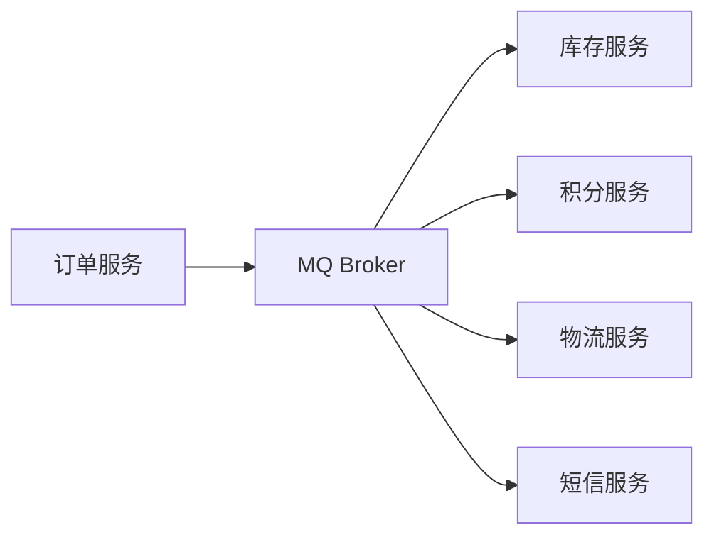

# 消息队列应用场景与选型

小张在字节二面中被问到："你们系统为什么要引入消息队列？直接调不行吗？"

小张想了想："因为...异步比较快？"

面试官追问："那什么场景必须用MQ？同步调用有哪些局限性？"

小张说："嗯...可能是不想等待？"

面试官又问："如果让你设计一个秒杀系统，MQ在架构里起什么作用？流量高峰怎么扛？"

小张彻底答不上来了。

【面试官心理】

这道题我考察的是候选人对消息队列本质的理解。90%的人会说"异步"、"解耦"、"削峰"，但说不清这三个词背后的业务含义和权衡取舍。能从具体业务场景出发讲清楚"为什么要用MQ"和"什么时候不该用MQ"的，才是真正理解了的。只会背概念的是P5，能落地分析的是P6，能做架构权衡的才是P7。

## 一、核心问题：MQ 解决了什么问题 🔴

### 1.1 问题拆解

**第一层：基本认知**
面试官问："消息队列的核心作用是什么？"
候选人答："异步、解耦、削峰..."
考察点：基本概念

**第二层：场景落地**
面试官追问："这三条在真实业务中分别对应什么场景？"
候选人答：...（拉开点1）
考察点：业务理解能力

**第三层：代价与权衡**
面试官追问："MQ不是银弹，它会带来哪些副作用？什么场景不适合用？"
候选人答：...（拉开点2）
考察点：工程判断力

**第四层：架构决策**
面试官追问："如果让你设计秒杀系统，怎么用MQ扛住洪峰？"
候选人答：...（P7区分点）
考察点：架构设计能力

### 1.2 错误示范

**候选人原话 A**："MQ可以提高系统的吞吐量，让系统更快。"

**问题诊断**：
- MQ本身不提高吞吐量，它只是把同步操作变成了异步
- 实际上是降低了同步等待时间，但总处理时间不变
- 完全误解了MQ的价值定位

**候选人原话 B**："我们公司所有模块之间都用MQ通信，接口调用都改成消息了。"

**问题诊断**：
- MQ不适合同步链路，用MQ做同步调用会增加延迟和复杂度
- 强依赖场景必须用同步调用，MQ只是补充
- 缺乏场景判断能力

### 1.3 标准回答

消息队列解决的是**系统间协作的三大矛盾**：

**矛盾一：速度不匹配 —— 削峰填谷**

```
没有MQ的秒杀：
用户下单 → 订单服务 → 库存服务 → 支付服务 → 数据库
                   ↑全部串行，数据库被打爆↑

有MQ的秒杀：
用户下单 → 写入MQ → 立即返回"下单成功"
库存服务  → 从MQ消费，慢慢扣库存
支付服务  → 从MQ消费，处理支付
数据库    → 峰值被平摊，稳如老狗
```

举例：双十一零点，订单量从1000 QPS瞬间飙升到10万 QPS。如果没有MQ，数据库连接池直接被打满；如果有MQ，消息进入队列，下游消费者按自己的速度消费，峰值被平摊到后续的分钟级。

**矛盾二：依赖关系复杂 —— 异步解耦**

```
没有MQ的订单系统：
订单服务 → 调用10个下游服务（用户服务、库存服务、支付服务、物流服务、积分服务、短信服务...）
任何一个下游挂了，整个下单流程就失败

有MQ的订单系统：
订单服务 → 发一条"订单创建"消息到MQ
各下游服务各自订阅，各管各的处理逻辑
下游挂了？没关系，MQ帮你暂存，等它恢复了继续消费
```

:::tip 💡
解耦的本质是**时间解耦**（不需要同时在线）和**空间解耦**（不需要知道下游是谁）。MQ把"同步调用"变成了"发布-订阅"，上游只管发，下游各取所需。

:::

**矛盾三：数据一致性要求高 —— 最终一致性**

强一致性场景用分布式事务，但代价高昂。更常见的做法是：本地事务+消息表，通过MQ保证消息最终送达，业务系统自行保证幂等。

```
典型场景：转账
A账户扣款 + 发送MQ消息（在一个本地事务中）
→ MQ消息消费者负责给B账户加款
→ 如果MQ消费失败，定时任务扫描未完成的转账记录，重试
→ 最终一致性达成
```

【面试官心理】

这道题我想听的是：候选人能不能从具体的业务数字出发（"双十一10万QPS"、"3个下游服务"），而不是空洞地背概念。能说出"削峰是让峰值延迟变现，不是减少总处理时间"的，说明真正理解了这个机制。

### 1.4 追问升级

**P6/P7 差距拉开点：**

面试官问："MQ这么好，那它会带来哪些新问题？"

这道题的分水岭：
- P5：不知道MQ有副作用
- P6：知道消息延迟、复杂度增加、消息丢失等问题，但说不深
- P7：能说出消息乱序、重复消费、消息积压的处理方案，能设计出一套完整的消息可靠性体系

## 二、延伸问题：五大典型应用场景 🟡

### 2.1 场景一：异步解耦（系统间通信）

**典型场景**：电商订单完成后，触发库存扣减、积分发放、短信通知、物流调度等多个操作。

**方案对比**：

| 方案 | 延迟 | 可靠性 | 复杂度 | 适用场景 |
| --- | --- | --- | --- | --- |
| 同步调用 | 低 | 高 | 低 | 强依赖，必须同步 |
| MQ解耦 | 有延迟 | 依赖MQ可靠性 | 中 | 弱依赖，允许延迟 |
| 定时任务 | 高 | 低（可能漏执行） | 低 | 低优先级任务 |



### 2.2 场景二：削峰填谷（流量控制）

**典型场景**：秒杀系统、活动报名、突发流量处理。

**核心指标**：
```
上游峰值：10万 QPS
下游处理能力：5000 QPS
MQ积压能力：按磁盘大小，积压百万条不成问题

设计思路：
1. 上游快速写入MQ，毫秒级响应
2. 下游按5000 QPS的速率消费
3. 峰值流量被"拉长"到20秒内慢慢处理
4. 数据库稳如泰山
```

:::warning ⚠️
削峰不是消除峰值，而是**延迟变现**。10万条消息还是要全部处理完，只是处理时间被拉长了。如果业务要求"秒杀结果立即可知"，需要配合预扣库存等策略。

:::

### 2.3 场景三：最终一致性（事务消息）

**典型场景**：分布式事务，银行转账、跨系统状态同步。

RocketMQ 支持事务消息，通过半消息机制实现：

```
1. 订单服务开启本地事务
2. 发送"半消息"（对消费者不可见）
3. 执行本地事务（扣库存）
4. 提交或回滚半消息
5. MQ投递消息给下游
6. 如果超时未确认，MQ回查订单服务
```

### 2.4 场景四：消息广播（配置变更推送）

**典型场景**：配置中心变更通知、灰度发布、热部署刷新。

```
配置中心 → 发布配置变更 → MQ广播
各服务实例各自订阅 → 收到消息 → 刷新本地缓存

对比轮询方案：
轮询：每个服务每秒请求配置中心 N 次，服务器压力巨大
MQ广播：配置中心发一次，所有服务收到，零轮询开销
```

### 2.5 场景五：顺序消息（FIFO）

**典型场景**：订单处理链（下单→支付→发货→签收），同一个订单的操作必须按顺序执行。

**实现要点**：
- Kafka：按 key（比如订单ID）发送到同一个 Partition，单 Partition 内保证有序
- RocketMQ：使用 MessageQueueSelector，按订单ID路由到同一个 Queue

:::tip 💡
顺序消息的代价是**牺牲并行度**。一个 Partition/Queue 同一时间只能被一个 Consumer 消费。如果对吞吐量要求极高，需要权衡：是用多个有序队列+应用层拼接，还是用全局顺序换并行度。

:::

## 三、生产避坑：MQ 使用的高频事故

### 3.1 坑一：消息丢失（最常见）

**场景**：上游发消息，下游没收到，系统数据不一致。

**根因分析**：

| 丢失环节 | 原因 | 解决方案 |
| --- | --- | --- |
| 生产端 | 网络抖动、Broker宕机 | acks=all + 幂等 producer |
| Broker端 | 副本同步未完成 | min.insync.replicas=2 |
| 消费端 | 自动提交offset后处理失败 | 手动提交 + 重试机制 |

### 3.2 坑二：消息重复消费

**场景**：消费者重启后，同一条消息被消费了两次。

**根因**：
- Producer 重试导致重复发送
- Consumer 重启后从未提交的 offset 重新消费

**解决方案**：业务幂等（唯一键去重、状态机校验）

### 3.3 坑三：消息积压

**场景**：消费者处理速度跟不上生产速度，消息在 MQ 里堆积。

**影响**：
- 消息延迟增大（分钟级甚至小时级）
- 积压过多可能导致 MQ 磁盘爆满
- 下游系统状态和上游严重不一致

**处理方案**：

```
紧急：消费者扩容（增加分区/增加实例）
中期：优化消费者处理逻辑（批量处理、异步化）
长期：分析积压原因（是消费者挂了？还是处理太慢？）
```

## 四、工程选型：什么时候选 MQ

### 4.1 MQ 的适用判断标准

**应该用 MQ**：
- 上下游系统之间是**弱依赖**（下游挂了不影响主流程）
- 可以接受**最终一致性**（不需要实时强一致）
- 有**峰值流量**需要平缓处理
- 需要**异步处理**耗时操作

**不应该用 MQ**：
- 需要**实时同步返回**结果（如查询类接口）
- 上下游是**强依赖**（下游失败主流程必须失败）
- 对**一致性要求极高**（金融交易类，考虑分布式事务）

### 4.2 MQ 选型一览

| 维度 | Kafka | RocketMQ | RabbitMQ |
| --- | --- | --- | --- |
| 吞吐量 | 百万级 | 十万级 | 万级 |
| 延迟 | 毫秒级 | 毫秒级 | 微秒级（最低） |
| 顺序消息 | 分区内有序 | 队列有序 | 单队列有序 |
| 事务消息 | 幂等生产者 | 原生支持 | 插件支持 |
| 延迟消息 | 不支持 | 支持 | 插件支持 |
| 适用场景 | 日志、大数据 | 交易链路 | 小型系统 |

【面试官心理】

面试到最后，我会问一个开放式问题："你们公司现在用的什么MQ？为什么选它？如果让你重新选型，你会考虑什么？"能说出选型依据、知道各MQ优缺点的，是有架构视野的候选人。只知道用什么不知道为什么的，是人云亦云型的P5。

