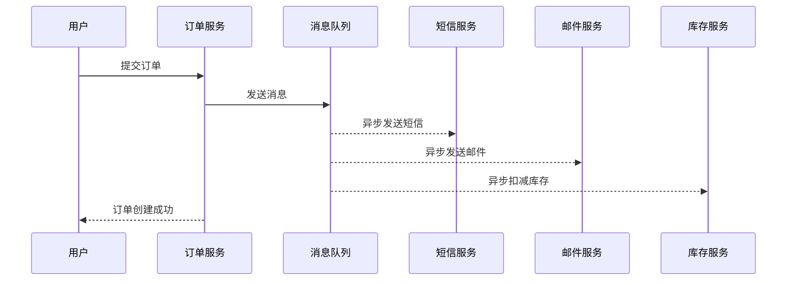
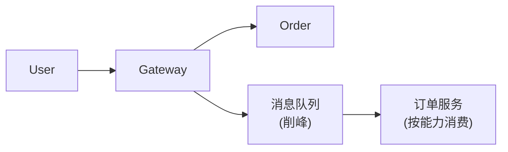
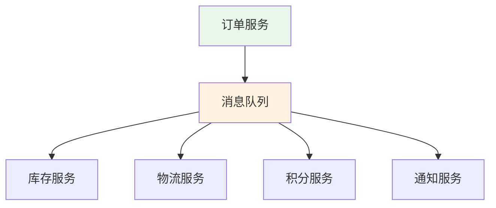

# 消息队列应用场景

> 目标级别：P6
>
> 面试命中率：85%

## 快速自测

1. 消息队列的主要应用场景有哪些？
2. 引入消息队列会带来哪些问题？
3. 如何选择合适的消息队列？

---

## 一、核心应用场景

### 1. 异步处理

将非核心流程异步化，提升系统响应速度：



### 2. 流量削峰

缓解瞬时流量压力，保护系统：



### 3. 系统解耦

降低系统间依赖，提高可维护性：



---

## 二、常见使用场景

| 场景 | 说明 | 示例 |
| --- | --- | --- |
| **异步处理** | 将非核心流程异步化 | 订单完成后发送通知 |
| **流量削峰** | 缓解瞬时流量压力 | 秒杀场景 |
| **系统解耦** | 降低系统间依赖 | 下单成功后通知多个下游 |
| **日志处理** | 异步收集和分析日志 | ELK 架构 |
| **消息推送** | 向客户端推送消息 | WebSocket + MQ |

---

## 三、引入消息队列的问题

### 消息队列的代价

| 问题 | 说明 | 解决方案 |
| --- | --- | --- |
| **系统复杂性增加** | 需要考虑消息丢失、重复消费等问题 | 引入消息确认机制 |
| **系统可用性降低** | MQ 崩溃影响整个系统 | 搭建 MQ 集群 |
| **数据一致性** | 分布式环境下的数据一致性 | 本地消息表、TCC |
| **运维成本** | 需要维护额外的中间件 | 容器化部署 |

### 引入前的评估

```java
// 问题：引入 MQ 前需要评估
// 1. 系统真的需要 MQ 吗？
// 2. MQ 的性能能否满足需求？
// 3. 如何保证消息不丢失？
// 4. 如何处理消息重复？
```

---

## 四、高频面试题

### 🔴 第一层：消息队列有哪些应用场景？

**答案要点**：
1. 异步处理：提升系统响应速度
2. 流量削峰：缓解瞬时流量压力
3. 系统解耦：降低系统间依赖
4. 日志处理：异步收集日志
5. 消息推送：实时推送消息

### 🔴 第二层：引入消息队列会带来哪些问题？

**答案要点**：
1. 系统复杂性增加
2. 系统可用性降低
3. 数据一致性问题
4. 运维成本增加

---

## 五、Kafka vs RabbitMQ vs RocketMQ

| 特性 | Kafka | RabbitMQ | RocketMQ |
| --- | --- | --- | --- |
| **吞吐量** | 极高（百万级/秒） | 中等（十万级/秒） | 高 |
| **延迟** | 毫秒级 | 微秒级 | 毫秒级 |
| **事务支持** | 弱 | 中 | 强 |
| **顺序消息** | 支持分区有序 | 支持队列有序 | 支持消息有序 |
| **延迟消息** | 不支持 | 支持 | 支持 |
| **死信队列** | 不支持 | 支持 | 支持 |
| **适用场景** | 日志、大数据 | 小型系统、电商 | 电商、金融 |

---

## 六、常见陷阱

> ⚠️ **陷阱一**：消息丢失

网络故障、Broker 崩溃等都可能导致消息丢失。需要使用消息确认机制。

> ⚠️ **陷阱二**：消息重复消费

消费者处理失败导致消息重新投递，可能导致重复消费。需要做好幂等处理。

> ⚠️ **陷阱三**：消息顺序错乱

多消费者并发处理可能导致消息顺序错乱。如果需要保证顺序，需要使用单分区或消息组。

---

## 七、扩展思考

### 💡 什么时候不应该使用消息队列？

**答案**：
1. 业务强依赖消息的实时性（MQ 本身有延迟）
2. 对数据一致性要求极高的场景（直接同步调用更可靠）
3. 系统规模较小，同步调用已经足够

### 💡 如何评估是否需要引入 MQ？

**答案**：
1. 系统是否存在性能瓶颈（数据库、远程服务调用）
2. 是否存在可以异步化的业务流程
3. 系统间是否存在强耦合
4. 是否需要处理瞬时流量高峰
