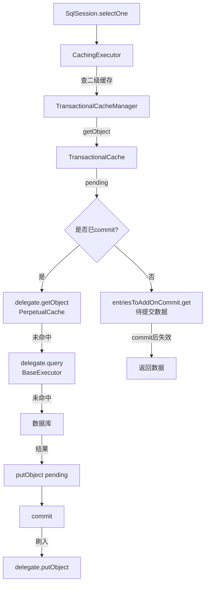
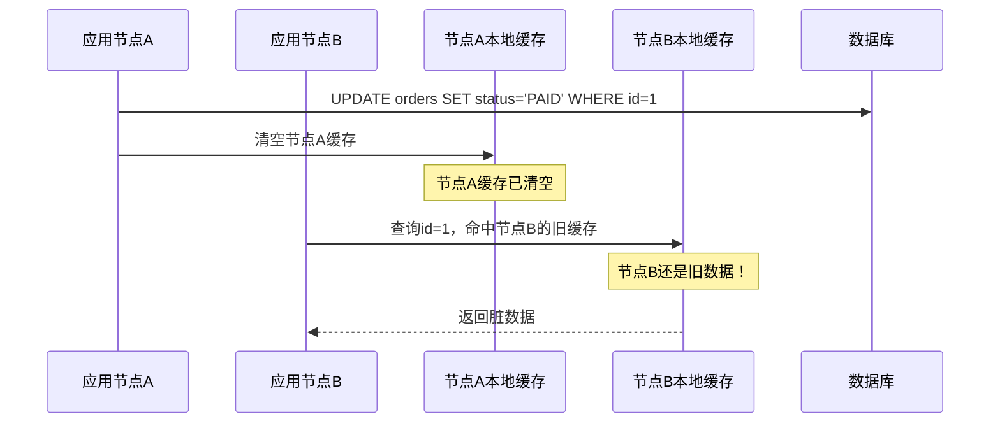

学员小陈上周找我复盘他的美团面试，他说在二面被问到 MyBatis 二级缓存的问题，前面答得还行，但面试官追问了一个场景：

"用户 A 在一个事务里修改了订单主表的数据，用户 B 在另一个节点上查询订单关联明细，此时会读到什么数据？"

小陈说："应该能读到最新数据吧..." 面试官追问："为什么？"

小陈没答好，二面没过。

后来他来找我复盘，我告诉他：这道题能答好的不超过 5%，因为大部分人对 MyBatis 二级缓存的理解只停留在"配置 `<cache/>` 就开启了"。

【面试官心理】
我出这道题，不是为了考记忆力。我是想看候选人有没有意识到二级缓存在生产环境中的三个核心问题：脏读、分布式不一致、序列化开销。能答出这三个问题的候选人，基本都有真实踩坑经历。

## 一、二级缓存的全貌

先上一张图，说明二级缓存在 MyBatis 执行链路中的位置：



**关键结论**：二级缓存命中时，**不走一级缓存，也不走数据库**。

### 1.1 Cache 接口与装饰器链 🔴

MyBatis 的二级缓存不是简单的 HashMap，而是一整套装饰器模式：

```java
public interface Cache {
    String getId();                          // Mapper 的 namespace
    void putObject(Object key, Object value);
    Object getObject(Object key);
    Object removeObject(Object key);
    void clear();                            // 清空缓存
    int getSize();                           // 缓存大小
    default void lock() {}                   // 锁（空实现）
    default void unlock() {}
    default void readWriteDataSource() {}    // 读写数据源
}
```

默认实现是 `PerpetualCache`，内部就是一个 `HashMap`。其他装饰器在此基础上增加功能：

```java
// 装饰器链（cache 标签的 eviction 属性决定用哪个）
public class LruCache implements Cache {    // eviction="LRU"，默认
    private final Cache delegate;
    private Map<Object, Object> keyMap;    // LRU 淘汰

    @Override
    public void putObject(Object key, Object value) {
        delegate.putObject(key, value);
        cycleKeyMap(key);
    }

    private void cycleKeyMap(Object key) {
        keyMap.put(key, key);
        if (keyMap.size() > size) {
            // 淘汰最久未使用的
            Object oldestKey = keyMap.keySet().iterator().next();
            delegate.removeObject(oldestKey);
        }
    }
}

// 其他装饰器
public class FifoCache implements Cache {}   // 先进先出
public class SoftCache implements Cache {}   // 软引用，内存不足时回收
public class WeakCache implements Cache {}    // 弱引用，GC 时回收
public class ScheduledCache implements Cache {} // 定期清空
public class SerializedCache implements Cache {} // 序列化后存储
public class SynchronizedCache implements Cache {} // 线程安全
```

:::tip 💡
在 XML 中配置 `<cache eviction="LRU" flushInterval="60000" size="512"/>`，实际上是在构建一个装饰器链：`SynchronizedCache` -> `LoggingCache` -> `LruCache` -> `SerializedCache` -> `PerpetualCache`。
:::

## 二、脏读陷阱 — 最容易被忽略的坑 🔴

### 2.1 关联查询的缓存失效问题

```java
// 场景：订单主表和明细表关联查询，存入二级缓存
// Mapper: OrderMapper.xml
<select id="findOrderWithDetail" resultMap="OrderDetailMap" useCache="true">
    SELECT o.*, d.* FROM orders o
    LEFT JOIN order_detail d ON o.id = d.order_id
    WHERE o.id = #{id}
</select>

// 用户 A 更新订单主表
<update id="updateOrder">
    UPDATE orders SET status = 'PAID' WHERE id = #{id}
</update>

// 问题：updateOrder 会清空 OrderMapper 的二级缓存
// 但 findOrderWithDetail 的缓存还在！
// 其他用户 B 查询时，命中的是旧的关联数据
```

这就是 MyBatis 二级缓存最致命的缺陷：**缓存以 Mapper 为单位，一个 Mapper 的 update 只会清空自己的缓存，不会清空关联查询的缓存**。

### 2.2 TransactionalCache 的 pending 机制

```java
// TransactionalCache.putObject 的源码
public void putObject(Object key, Object value) {
    // 关键：不是直接 put 到 delegate，而是放入 pending map
    entriesToAddOnCommit.put(key, value);
}

// 只有 commit 时才真正写入
public void commit() {
    if (clearOnCommit) {
        delegate.clear();
    }
    // 把 pending 数据刷入底层缓存
    delegate.putObject(entriesToAddOnCommit);
    entriesToAddOnCommit.clear();
}
```

这个设计避免了事务未提交时数据被其他会话读到，但带来了新的问题：**如果事务回滚，pending 数据被丢弃，缓存不会更新**。长事务场景下缓存命中率极低。

## 三、分布式环境下的缓存一致性 🔴

### 3.1 本地缓存的问题



每个节点维护自己的二级缓存，节点之间完全隔离。这是 MyBatis 二级缓存在分布式场景下的原罪。

### 3.2 用 Ehcache 做二级缓存

```xml
<cache type="org.mybatis.caches.ehcache.EhcacheCache">
    <property name="maxEntriesLocalHeap" value="1000"/>
    <property name="maxEntriesLocalDisk" value="10000"/>
    <property name="eternal" value="false"/>
    <property name="timeToIdleSeconds" value="3600"/>
    <property name="timeToLiveSeconds" value="1800"/>
</cache>
```

Ehcache 解决了单节点的缓存淘汰策略问题，但**多节点之间仍然不一致**。

### 3.3 用 Redis 做二级缓存

```java
public class RedisCache implements Cache {
    private final String id;
    private final RedisTemplate<Object, Object> redisTemplate;

    public RedisCache(String id) {
        this.id = id;
        // 懒加载 RedisTemplate
        this.redisTemplate = RedisTemplateBuilder.getTemplate();
    }

    @Override
    public void putObject(Object key, Object value) {
        // 序列化后存入 Redis，过期时间设为 1 小时
        redisTemplate.opsForValue().set(
            id + ":" + key.toString(),
            serialize(value),
            1, TimeUnit.HOURS
        );
    }

    @Override
    public Object getObject(Object key) {
        byte[] bytes = redisTemplate.opsForValue().get(id + ":" + key.toString());
        return bytes == null ? null : deserialize(bytes);
    }

    @Override
    public void clear() {
        // 删除该 namespace 下的所有缓存
        Set<String> keys = redisTemplate.keys(id + ":*");
        if (keys != null && !keys.isEmpty()) {
            redisTemplate.delete(keys);
        }
    }
}
```

```xml
<cache type="com.xxx.config.RedisCache">
    <property name="host" value="10.0.0.100"/>
    <property name="port" value="6379"/>
</cache>
```

:::warning ⚠️
Redis 二级缓存解决了分布式一致性问题，但引入了新的开销：序列化/反序列化 + 网络通信。大数据量场景下性能可能不如本地缓存。
:::

## 四、脏读场景深度分析 🟡

### 4.1 多 SqlSession 的脏读

```java
// SqlSession1：开启事务，修改数据，未 commit
SqlSession session1 = factory.openSession();
OrderMapper mapper1 = session1.getMapper(OrderMapper.class);
Order order = mapper1.findById(1L);
order.setStatus("PAID");
mapper1.updateOrder(order);
// 此时数据已修改但未 commit

// SqlSession2：在另一个 session 中查询
SqlSession session2 = factory.openSession();
OrderMapper mapper2 = session2.getMapper(OrderMapper.class);
// 二级缓存的 getObject 先查 delegate（已提交数据），再查 pending
Order cached = mapper2.findById(1L);
// 不会读到 SqlSession1 未 commit 的数据
// 因为 putObject 时先放入了 pending，commit 后才写入 delegate
```

### 4.2 跨 Mapper 的脏读

```java
// 问题核心：OrderMapper 更新了 orders 表，但 OrderDetailMapper 的缓存不会失效
// 假设用户查过这个关联查询
List<OrderDetail> details = orderDetailMapper.findByOrderId(orderId);
// 存入 OrderDetailMapper 的二级缓存

// 之后 OrderMapper 更新了 orders 表
orderMapper.updateOrder(order);
// 只清空 OrderMapper 的缓存，OrderDetailMapper 的缓存还在！

// 再次查询，命中旧缓存
List<OrderDetail> oldDetails = orderDetailMapper.findByOrderId(orderId);
// 返回的是旧数据！
```

**解决方案**：

```xml
<!-- 方案一：使用 cache-ref 共享缓存 -->
<mapper namespace="com.xxx.OrderDetailMapper">
    <cache-ref namespace="com.xxx.OrderMapper"/>
</mapper>

<!-- 方案二：关联查询关闭二级缓存 -->
<resultMap id="OrderMap" type="Order">
    <association property="details"
        column="id"
        select="findDetailsByOrderId"
        fetchType="lazy"/>
</resultMap>
<!-- 在 select 标签中禁用缓存 -->
<select id="findDetailsByOrderId" resultType="Detail" useCache="false">
    SELECT * FROM order_detail WHERE order_id = #{orderId}
</select>

<!-- 方案三：使用 flushCache 强制刷新 -->
<update id="updateOrder" flushCache="true">
    UPDATE orders SET status = #{status} WHERE id = #{id}
</update>
```

## 五、❌ 错误示范

### 翻车点一：以为二级缓存是线程安全的

**候选人原话**："二级缓存是线程安全的，因为 MyBatis 用了 synchronized..."

实际上 `TransactionalCache` 的 `getObject`/`putObject` 有 `synchronized`，但底层 `PerpetualCache` 本身没有锁。更关键的是，在高并发写入时，`entriesToAddOnCommit` 和 `delegate` 之间可能存在竞态条件。

### 翻车点二：不知道 flushCache 和 useCache 的区别

**候选人原话**："useCache 用来控制是否使用缓存，flushCache 用来控制是否刷新缓存..."

`useCache="false"` 是针对查询的，表示不使用二级缓存（但仍使用一级缓存）。`flushCache="true"` 针对增删改（默认 true），表示执行后清空一二级缓存。查询时 `flushCache="true"` 会清空所有缓存后重新查询。

### 翻车点三：混淆一级缓存和二级缓存的失效条件

**候选人原话**："一级缓存和二级缓存都在 commit 时清空..."

一级缓存在 commit/rollback/close/update/insert 时清空。二级缓存只在任意增删改（增删改默认 flushCache=true）且 commit 时清空。

## 六、标准回答

### P5 级别：能说出基本概念

> MyBatis 的二级缓存是 Mapper 级别的，需要在 XML 中配置 `<cache/>` 开启。它基于 Cache 接口实现，默认用 PerpetualCache 存储数据，支持 LRU/FIFO 等淘汰策略。二级缓存跨 SqlSession 共享，可以提升查询性能。

### P6 级别：能讲清脏读陷阱和生产风险

> 二级缓存的核心问题是脏读。MyBatis 的缓存以 Mapper 为粒度，一个 Mapper 的 update 只清空自己的缓存，不会影响其他 Mapper 的缓存。这在关联查询场景下非常危险：主表更新了，但关联查询的缓存还是旧的。
>
> TransactionalCache 的 pending 机制避免了事务未提交时数据被读到，但引入了另一个问题：事务回滚时 pending 数据被丢弃，缓存不会更新，长事务场景下缓存命中率极低。
>
> 生产环境中，MyBatis 本地二级缓存还有分布式一致性问题：多节点部署时每个节点维护自己的缓存，节点之间完全隔离。建议用 Redis 等分布式缓存替代本地缓存。

【面试官心理】
P6 能答到这个程度已经能应对大部分面试追问了。我通常会继续追问："如果让你设计一个分布式二级缓存同步方案，你会怎么做？"能答出"基于 Redis pub/sub 通知各节点清缓存"或"版本号 + 主动推送"的，是有系统设计思维的加分项。

### P7 级别：能从架构角度分析

> MyBatis 二级缓存的问题本质上是"缓存粒度"和"一致性"的矛盾。MyBatis 按 Mapper 粒度缓存是最简单的设计，但无法感知跨 Mapper 的数据依赖关系。更优的方案是：
> 1. 放弃 MyBatis 二级缓存，使用 Redis 等分布式缓存，按业务维度设计缓存 key
> 2. 使用 MyBatis-Plus 的缓存管理，配合 Redisson 实现分布式锁和缓存同步
> 3. 或者干脆不用二级缓存，依赖数据库本身的一致性保证

## 七、追问升级 🟡

### 追问1：Cache 接口的 lock/unlock 是干什么用的？

`lock()` 和 `unlock()` 是装饰器模式的扩展点，用来在缓存操作时加锁。`SynchronizedCache` 已经在所有方法上加了 `synchronized`，所以默认实现是空方法。**但这个锁是 JVM 级别的，在分布式环境下无效**。

### 追问2：CacheHitRate 是什么？

```java
// MyBatis 提供了缓存命中率统计
// 查看某个 Mapper 的缓存命中率
// 在日志中会打印：Cache Hit Ratio [com.xxx.OrderMapper]: 0.85
```

### 追问3：如何实现基于版本的缓存更新？

```java
// 自定义 Cache 实现，基于版本号的乐观锁
public class VersionedCache implements Cache {
    private final Cache delegate;
    private final Map<Object, VersionedValue> versionMap = new ConcurrentHashMap<>();

    @Override
    public void putObject(Object key, Object value) {
        VersionedValue vv = new VersionedValue(value, version++);
        versionMap.put(key, vv);
        delegate.putObject(key, vv);
    }

    @Override
    public Object getObject(Object key) {
        VersionedValue vv = (VersionedValue) delegate.getObject(key);
        if (vv == null) return null;
        // 校验版本号，不一致时强制刷新
        if (vv.version < versionMap.get(key).version) {
            delegate.removeObject(key);
            return null;
        }
        return vv.value;
    }
}
```

【面试官心理】
能答出"基于版本号的缓存更新"或"主动通知式缓存失效"的候选人凤毛麟角。这道题是 P7 级别的区分点，考察的是候选人对缓存一致性和架构设计的理解深度。
