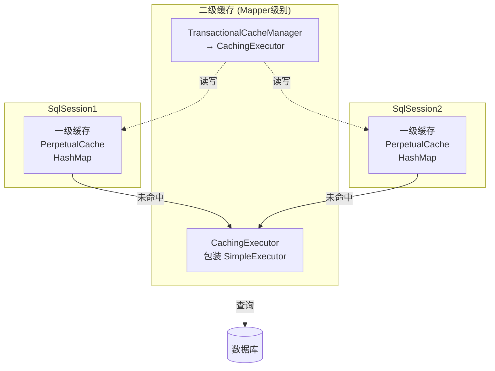
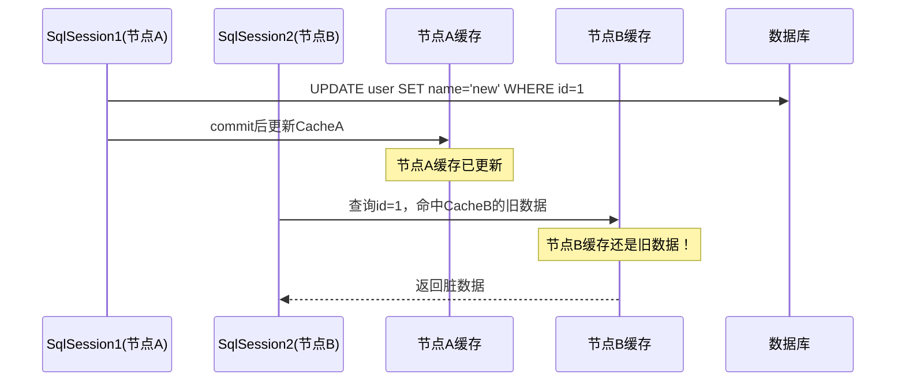

候选人小赵在面试阿里P6时，面试官问道：

"MyBatis 的一级缓存和二级缓存有什么区别？分别什么时候失效？"

小赵说："一级缓存是 SqlSession 级别的，二级缓存是 Mapper 级别的。第一次查询先查一级缓存，未命中再查二级缓存。"

面试官点点头："那二级缓存是线程安全的吗？多个 SqlSession 共享二级缓存时会有什么问题？"

小赵停顿了几秒："应该是线程安全的吧...共享的话可能有数据一致性问题？"

面试官继续追问："那如果我在一个 SqlSession 里执行了 update，然后立即在另一个 SqlSession 里查询，会读到脏数据吗？"

小赵彻底卡住了。

【面试官心理】
这道题我用来区分 P5 和 P6。知道一级缓存是 SqlSession 级别、二级缓存是 Mapper 级别，这是基本操作。但能说出缓存的数据结构、失效机制、线程安全问题、脏数据场景的才是真正理解的。我通常会追问到"二级缓存的 TransactionalCacheManager 怎么工作的"——这一层能答上来的不超过 10%。

## 一、两级缓存全景



### 1.1 一级缓存 — SqlSession 级别 🔴

先搞清楚一级缓存的数据结构。MyBatis 用的是一个极其简单的 `PerpetualCache`：

```java
public class PerpetualCache implements Cache {
    // 就是个 HashMap，别搞复杂了
    private final Map<Object, Object> cache = new HashMap<>();

    @Override
    public void putObject(Object key, Object value) {
        cache.put(key, value);
    }

    @Override
    public Object getObject(Object key) {
        return cache.get(key);
    }

    @Override
    public Object removeObject(Object key) {
        return cache.remove(key);
    }
}
```

**CacheKey 才是关键**：一级缓存的 key 不是简单的 SQL 字符串，而是由多个因素组合成的 CacheKey：

```java
// CacheKey 的构成
public class CacheKey implements Serializable {
    private final long checksum;    // 校验和
    private final int hashcode;      // hashCode
    private final int count;        // 参数数量
    private final List<Object> updateList;  // 更新列表

    // update 方法不断追加影响因素
    public void update(Object object) {
        int baseHashCode = object == null ? 1 : ArrayUtil.hashCode(object);
        this.hashcode = multiplier * this.hashcode + baseHashCode;
        this.checksum += baseHashCode;
        this.count++;
        updateList.add(object);
    }
}

// 在 Executor 中这样创建 CacheKey
CacheKey key = cacheExecutor.createCacheKey(ms, parameter, rowBounds, boundSql);
// 构成因素：MappedStatement.id + rowBounds.offset + rowBounds.limit
//         + 查询的 SQL 语句 + 参数值列表
```

这样设计的原因是：同一个 Mapper 方法，不同参数、不同分页条件应该命中不同的缓存。

**一级缓存的查询流程**：

```java
// BaseExecutor.query
public <E> List<E> query(MappedStatement ms, Object parameter, RowBounds rowBounds,
                          ResultHandler resultHandler) throws SQLException {
    // 1. 创建 CacheKey
    BoundSql boundSql = ms.getBoundSql(parameter);
    CacheKey key = createCacheKey(ms, parameter, rowBounds, boundSql);
    return query(ms, parameter, rowBounds, resultHandler, key, boundSql);
}

// 重载的 query 方法
public <E> List<E> query(MappedStatement ms, Object parameter, RowBounds rowBounds,
                          ResultHandler resultHandler, CacheKey key, BoundSql boundSql) {
    // 2. 先查一级缓存
    if (ms.isCacheEnabled()) {  // Mapper 级别的缓存开关
        List<E> cachedList = listCache.get(key);
        if (cachedList != null) {
            return cachedList;  // 命中一级缓存，直接返回
        }
    }
    // 3. 未命中，查询数据库
    List<E> result = doQuery(ms, parameter, rowBounds, resultHandler, boundSql);
    // 4. 存入一级缓存
    if (ms.isCacheEnabled()) {
        listCache.put(key, result);
    }
    return result;
}
```

**一级缓存的失效条件**（重点）：

```java
// 触发一级缓存清空的场景：
// 1. 调用了 commit() 或 rollback()
public void commit(boolean required) throws SQLException {
    if (required) {
        transaction.commit();
    }
    // commit 会清空一级缓存！防止脏读
    clearLocalCache();
}

// 2. 调用了 close()
public void close(boolean forceRollback) {
    if (forceRollback) {
        clearLocalCache();  // rollback 时也清空
    }
    // ...
}

// 3. 执行了 update/delete/insert（任意增删改）
public int update(MappedStatement ms, Object parameter) throws SQLException {
    // update 也会清空一级缓存
    clearLocalCache();
    return doUpdate(ms, parameter);
}
```

:::warning ⚠️
很多候选人背答案是"commit 时清空一级缓存"，但没理解为什么——因为 MyBatis 的一级缓存没有事务隔离，如果 commit 后还保留旧数据，就会出现"事务提交了但缓存还是旧数据"的脏读问题。所以 commit/rollback/update/insert 都会清空一级缓存。
:::

### 1.2 二级缓存 — Mapper 级别 🔴

二级缓存是**跨 SqlSession** 的，多个 SqlSession 可以共享同一个 Mapper 的缓存。

```java
// CachingExecutor.query
public <E> List<E> query(MappedStatement ms, Object parameter, RowBounds rowBounds,
                          ResultHandler resultHandler, CacheKey key, BoundSql boundSql) {
    // 1. 如果 Mapper 配置了 <cache/>，先查二级缓存
    if (ms.isCacheEnabled()) {
        Cache cache = ms.getCache();
        // 从 TransactionalCacheManager 获取
        List<E> cached = tcm.getObject(cache, key);
        if (cached != null) {
            return cached;  // 二级缓存命中
        }
    }
    // 2. 缓存未命中，查询数据库
    List<E> result = delegate.query(ms, parameter, rowBounds, resultHandler, key, boundSql);

    // 3. 写入二级缓存（注意：这里不是直接 put，而是放入 pending）
    if (ms.isCacheEnabled()) {
        tcm.putObject(cache, key, result);
    }
    return result;
}
```

**TransactionalCacheManager 才是二级缓存的核心**：

```java
public class TransactionalCacheManager {
    // 管理所有 TransactionalCache（一个 Mapper 对应一个 TransactionalCache）
    private final Map<Cache, TransactionalCache> transactionalCaches =
        new HashMap<>();

    public List<Object> getObject(Cache cache, CacheKey key) {
        return getTransactionalCache(cache).getObject(key);
    }

    public void putObject(Cache cache, CacheKey key, Object value) {
        // 关键：存入 TransactionalCache，但标记为 pending 状态
        getTransactionalCache(cache).putObject(key, value);
    }

    private TransactionalCache getTransactionalCache(Cache cache) {
        return transactionalCaches.computeIfAbsent(cache, TransactionalCache::new);
    }
}
```

**TransactionalCache 的 pending 机制**（面试高频深水区）：

```java
public class TransactionalCache implements Cache {
    private final Cache delegate;              // 底层缓存（通常是 PerpetualCache）
    private boolean clearOnCommit = false;     // 提交时是否清空
    private final Map<Object, Object> entriesToAddOnCommit =
        new HashMap<>();                       // 待提交的数据

    @Override
    public Object getObject(Object key) {
        // 1. 先查已提交的数据（直接从 delegate 中查）
        Object object = delegate.getObject(key);
        // 2. 再查 pending 的数据（在事务未提交时放入的）
        if (object == null) {
            object = entriesToAddOnCommit.get(key);
        }
        return object;
    }

    @Override
    public void putObject(Object key, Object value) {
        // 注意：这里不是直接 put 到 delegate，而是存入 pending map
        entriesToAddOnCommit.put(key, value);
    }

    public void commit() {
        // 提交时，才真正把 pending 的数据写入 delegate
        if (clearOnCommit) {
            delegate.clear();  // 清空
        }
        // 把所有待提交的数据刷入底层缓存
        delegate.putObject(entriesToAddOnCommit);
        // 清空 pending 状态
        entriesToAddOnCommit.clear();
        clearOnCommit = false;
    }
}
```

:::tip 💡
为什么要有 pending 机制？因为二级缓存要和事务配合。想象这个场景：你在一个事务里执行了 insert，但还没有 commit，此时另一个 SqlSession 来查询——它不应该读到这条未提交的数据。所以 putObject 时先放入 pending，只有 commit 后才真正写入 delegate。
:::

## 二、失效机制对比

| 维度 | 一级缓存 | 二级缓存 |
| --- | --- | --- |
| 作用域 | SqlSession | Mapper（跨 SqlSession） |
| 数据结构 | `PerpetualCache` (HashMap) | `TransactionalCache` 包装 `PerpetualCache` |
| 默认开启 | 是 | 否（需配置 `<cache/>`） |
| 失效条件 | commit/rollback/close/update/insert | 任意增删改 + commit |
| 线程安全 | 是（PerpetualCache 无锁） | 是（加了 synchronized） |
| 缓存 key | `CacheKey`（多因素组合） | `CacheKey`（同上） |

:::warning ⚠️
二级缓存的线程安全是相对的：`TransactionalCache` 的 `getObject`/`putObject` 有 `synchronized` 关键字，但底层 `PerpetualCache` 本身没有锁。如果有插件或其他线程直接操作底层缓存，仍然可能出问题。MyBatis 官方文档也承认二级缓存不是完全线程安全的。
:::

## 三、❌ 错误示范

### 翻车点一：把二级缓存当成天然的线程安全屏障

**候选人原话**："二级缓存是线程安全的，因为它是 Mapper 级别的..."

面试官追问："两个 SqlSession 同时执行查询，缓存还没写入，此时第三个查询进来会怎样？"

答不上来。

### 翻车点二：不知道 pending 机制

**候选人原话**："查询结果直接放入二级缓存，commit 时直接提交..."

实际上先放入 `entriesToAddOnCommit`，commit 时才合并到 `delegate`。

### 翻车点三：以为一级缓存会自动同步

**候选人原话**："一级缓存是 SqlSession 级别的，所以是隔离的..."

但如果同一个 SqlSession 执行了 update，一级缓存会被清空。这也是失效条件之一。

## 四、标准回答

### P5 级别：能区分基本概念

> MyBatis 有一级缓存和二级缓存。一级缓存是 SqlSession 级别的，默认开启，生命周期跟随 SqlSession。查询时先查一级缓存，未命中则查数据库并放入一级缓存。一级缓存在执行 commit/rollback/update/insert 时会失效。二级缓存是 Mapper 级别的，需要在 Mapper XML 中配置 `<cache/>`，跨 SqlSession 共享。二级缓存的查询流程是：先查二级缓存，未命中则查数据库并将结果写入二级缓存。

### P6 级别：能讲清实现机制和陷阱

> 一级缓存基于 `PerpetualCache`（内部 HashMap），CacheKey 由 MappedStatement.id + SQL + 参数 + RowBounds 构成。一级缓存在 commit/rollback/close 以及增删改操作时清空，防止脏读。**关键陷阱**：同一个 SqlSession 中先 query 再 update，缓存命中后 update 会清空一级缓存，下次同参数查询会重新打数据库。
>
> 二级缓存通过 `CachingExecutor` + `TransactionalCacheManager` + `TransactionalCache` 实现。查询时先通过 `TransactionalCache.getObject` 查缓存（先查已提交的 delegate，再查 pending 状态的 entriesToAddOnCommit），未命中则查询数据库并放入 `entriesToAddOnCommit`。只有 commit 后，pending 数据才真正写入 delegate。**关键陷阱**：二级缓存默认不存储 null 值（`cacheNulls=false`），且序列化/反序列化开销大，大数据量场景慎用。

### P7 级别：能从一致性和性能角度分析

> MyBatis 的两级缓存策略背后是性能和一致性的权衡。一级缓存无锁设计保证了单 SqlSession 的查询性能，但 commit 时清空是避免脏读的无奈之举（否则需要在每次 query 时都校验缓存是否过期）。二级缓存的 pending 机制本质上是"写时复制"的变体，避免事务未提交时数据被其他会话读到。但这也带来了新的问题：事务回滚时 pending 数据被丢弃，缓存不会更新——这意味着长事务场景下缓存命中率极低。
>
> 生产中，二级缓存的**脏数据问题**是最严重的坑：用户 A 和用户 B 同时登录，用户 A 修改了数据但未 commit，用户 B 查到了旧缓存数据；或者用户 A commit 后，用户 B 的缓存还是旧数据。这在关联查询场景下尤其致命——主表更新后关联查询的缓存不会自动失效。

【面试官心理】
追问二级缓存时，我最喜欢问"两个 SqlSession 的查询和更新顺序会怎样"。能答出 pending 机制和 commit 合并逻辑的人凤毛麟角。但更重要的是，我需要知道候选人有没有意识到二级缓存在生产环境中的脏数据风险——只知道用，不知道风险，是典型的 P5 思维。

## 五、追问升级 🟡

### 追问1：二级缓存和一级缓存的查询顺序？

```java
// CachingExecutor.query 的完整流程
public <E> List<E> query(MappedStatement ms, Object parameter, RowBounds rowBounds,
                          ResultHandler resultHandler, CacheKey key, BoundSql boundSql) {
    // 1. 二级缓存（Mapper 级别）
    if (ms.isCacheEnabled()) {
        List<E> cached = tcm.getObject(cache, key);
        if (cached != null) {
            return cached;  // 直接返回，不查一级缓存！
        }
    }
    // 2. 调用被包装的 Executor，它会查一级缓存
    List<E> result = delegate.query(ms, parameter, rowBounds, resultHandler, key, boundSql);
    // 3. 存入二级缓存（pending 状态）
    if (ms.isCacheEnabled()) {
        tcm.putObject(cache, key, result);
    }
    return result;
}
```

注意：**二级缓存命中时，一级缓存不会被查询**。

### 追问2：MyBatis 自带的缓存可以换成 Redis 吗？

可以。使用 `Cache` 接口的实现替换即可。常见方案：

```java
// 方案一：自定义 RedisCache 实现 Cache 接口
public class RedisCache implements Cache {
    private final String id;
    private final RedisTemplate<String, Object> redisTemplate;

    @Override
    public void putObject(Object key, Object value) {
        redisTemplate.opsForValue().set(key.toString(), value, 1, TimeUnit.HOURS);
    }

    @Override
    public Object getObject(Object key) {
        return redisTemplate.opsForValue().get(key.toString());
    }
    // ...
}
```

```xml
<cache type="com.xxx.RedisCache">
    <property name="host" value="localhost"/>
    <property name="port" value="6379"/>
</cache>
```

:::tip 💡
生产环境强烈建议用 Redis 作为二级缓存而不是 MyBatis 自带的内存缓存。MyBatis 原生缓存是 JVM 内存，多节点部署时各节点缓存不一致，且重启后缓存丢失。
:::

### 追问3：flushCache 属性怎么用？

```xml
<!-- 查询时清空缓存 -->
<select id="findById" resultType="User" flushCache="true">
    SELECT * FROM user WHERE id = #{id}
</select>

<!-- 增删改默认清空缓存 -->
<insert id="insert" flushCache="true">  <!-- 默认 true，可不写 -->
    INSERT INTO user VALUES (...)
</insert>
```

`flushCache="true"` 会同时清空一级和二级缓存。

## 六、生产避坑

### 坑一：二级缓存的脏数据问题

```java
// 场景：用户修改了数据，另一个请求读到了缓存中的旧数据
// SqlSession1
User user = mapper.findById(1L);    // 查询，存入二级缓存
user.setName("newName");
mapper.update(user);
sqlSession.commit();                // commit 后，二级缓存被更新

// SqlSession2（此时正在执行一个复杂的关联查询，刚好命中了旧的二级缓存）
List<User> users = mapper.findAll();  // 关联查询，命中了 commit 前的旧缓存
// 读到的是脏数据！
```

**解决方案**：对于关联查询，使用 `<cache-ref>` 引用同一个缓存，或者使用 MyBatis-Plus 的缓存管理，或者干脆关闭二级缓存。

### 坑二：序列化性能问题

MyBatis 二级缓存默认使用 `SerializablCache`，所有对象必须实现 `Serializable`：

```java
public class SerializedCache implements Cache {
    @Override
    public void putObject(Object key, Object value) {
        // 序列化后再存储
        delegate.putObject(key, serialize(value));
    }
}
```

如果缓存对象很大，序列化/反序列化的开销会严重影响性能。

### 坑三：分布式环境下的缓存不一致



多节点部署时，每个节点维护自己的二级缓存，节点之间完全隔离。这就是为什么生产环境强烈建议用分布式缓存（Redis）替代本地缓存。
