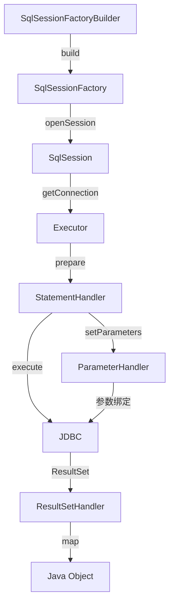
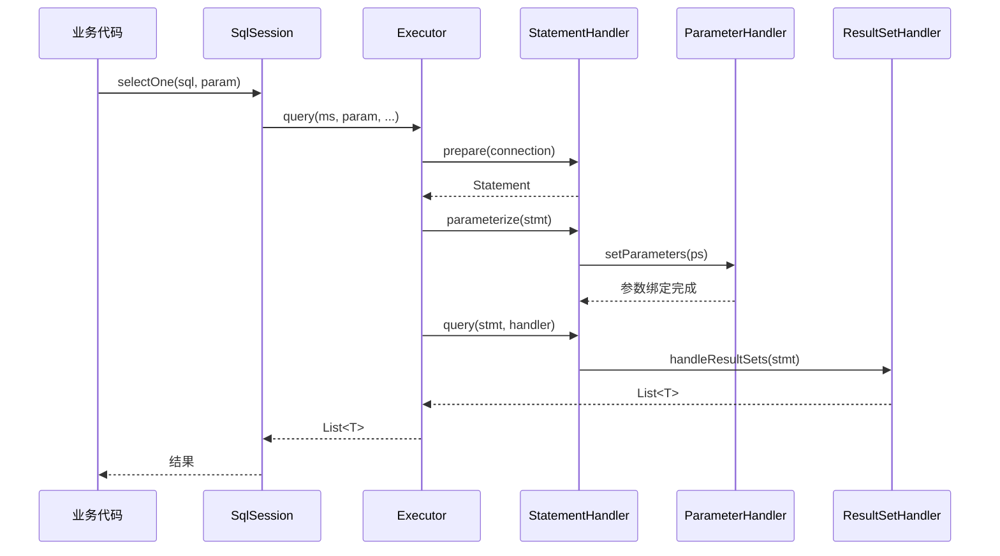

候选人小周在面试字节1-3时，面试官看了看简历上"熟悉 MyBatis 框架"，问道：

"MyBatis 的核心组件有哪些？它们之间的关系是什么？"

小周说："有 SqlSessionFactoryBuilder、SqlSessionFactory、SqlSession，还有 Executor、StatementHandler..."

面试官打断："那你说说 Executor、StatementHandler、ParameterHandler、ResultSetHandler 这几个 Handler 各自负责什么，什么时候被调用？"

小周支支吾吾："Executor 是执行器...StatementHandler 负责处理 SQL...其他的记不太清了..."

【面试官心理】
这道题我用来筛选"用过"和"理解过"的候选人。知道组件名字但说不清调用关系和职责边界的，占 80%。能画出示意图、讲清楚数据在组件间的流转过程的，不超过 20%。这道题是 P5 和 P6 的分水岭——P5 背名字，P6 画流转。

## 一、核心组件全景

MyBatis 有五大核心组件，数据从输入到输出要经过它们的协作：



### 1.1 组件职责速览 🔴

| 组件 | 职责 | 核心方法 |
| --- | --- | --- |
| `SqlSessionFactoryBuilder` | 解析配置文件，构建 SqlSessionFactory | `build(InputStream)` |
| `SqlSessionFactory` | 生产 SqlSession | `openSession()` |
| `SqlSession` | 对外提供 API，持有 Configuration 和 Executor | `selectOne/selectList/getMapper` |
| `Executor` | SQL 执行器，缓存管理、事务管理 | `query/update/flushStatements` |
| `StatementHandler` | JDBC Statement 管理 | `prepare/parameterize/query/update/batch` |
| `ParameterHandler` | 参数绑定 | `getParameterObject/setParameters` |
| `ResultSetHandler` | 结果集映射 | `handleResultSets/handleOutputParameters` |
| `TypeHandler` | JDBC 类型与 Java 类型转换 | `getColumnValue/setParameter` |

:::tip 💡
还有一个容易忽略的组件：**BoundSql**。它代表解析后的 SQL，包含动态标签替换后的最终 SQL 字符串和参数映射信息。每个组件之间传递的数据单元就是它。
:::

### 1.2 组件创建链路

```java
// 第一步：SqlSessionFactoryBuilder 解析 XML 配置
SqlSessionFactory factory = new SqlSessionFactoryBuilder()
    .build(Resources.getResourceAsStream("mybatis-config.xml"));

// 内部发生了什么？
// 1. XMLConfigBuilder 解析 mybatis-config.xml
// 2. 构建 Configuration（全局配置对象）
// 3. 解析所有 Mapper.xml，构建 MappedStatement
// 4. 返回 DefaultSqlSessionFactory
```

```java
// 第二步：SqlSessionFactory 打开 SqlSession
SqlSession sqlSession = factory.openSession();

// 内部发生了什么？
// 1. 根据配置创建 Transaction（事务）
// 2. 根据配置创建 Executor（Simple/Reuse/Batch）
// 3. 包装 Executor 为 CachingExecutor（如果开启了二级缓存）
// 4. 创建 DefaultSqlSession，持有 Configuration 和 Executor
```

## 二、Executor — SQL 执行器 🔴

Executor 是 MyBatis 的核心调度器，所有的 SQL 执行都要经过它。

### 2.1 三种 Executor 类型

```java
// 在 Configuration 中选择 Executor 类型
public class Configuration {
    protected ExecutorType defaultExecutorType = ExecutorType.SIMPLE;

    public Executor newExecutor(Transaction transaction, ExecutorType executorType) {
        executorType = executorType == null ? defaultExecutorType : executorType;
        Executor executor;
        if (ExecutorType.BATCH == executorType) {
            executor = new BatchExecutor(this, transaction);
        } else if (ExecutorType.REUSE == executorType) {
            executor = new ReuseExecutor(this, transaction);
        } else {
            executor = new SimpleExecutor(this, transaction);
        }
        // 二级缓存开启时，包装为 CachingExecutor
        if (cacheEnabled) {
            executor = new CachingExecutor(executor);
        }
        // 插件在这里拦截
        executor = (Executor) interceptorChain.pluginAll(executor);
        return executor;
    }
}
```

| 类型 | 特点 | 适用场景 |
| --- | --- | --- |
| `SimpleExecutor` | 每次执行都创建新的 PreparedStatement | 默认，生产常用 |
| `ReuseExecutor` | 复用 `PreparedStatement`，按 SQL 缓存 | 批量插入少、SQL 重复多 |
| `BatchExecutor` | 批量执行 SQL，最后一次 `executeBatch()` | 批量插入/更新，性能最高 |

```java
// SimpleExecutor 的 query 方法
public <E> List<E> doQuery(MappedStatement ms, Object parameter, RowBounds rowBounds,
                           ResultHandler resultHandler, BoundSql boundSql) {
    Statement stmt = null;
    try {
        // 1. 获取 StatementHandler
        StatementHandler handler = configuration.newStatementHandler(
            ms, parameter, rowBounds, resultHandler, boundSql);
        // 2. prepare：创建 JDBC Statement，设置超时等
        stmt = handler.prepare(connection);
        // 3. parameterize：设置参数
        handler.parameterize(stmt);
        // 4. query：执行并映射结果
        return handler.query(stmt, resultHandler);
    } finally {
        closeStatement(stmt);
    }
}
```

【面试官心理】
我通常会追问："为什么 BatchExecutor 需要额外调用 `flushStatements`？" 能答出"因为 BatchExecutor 不会立即执行，而是缓存 SQL，只有 flushStatements 才真正发送"的，说明是真的做过调优的。只会背名字的人在这一层就卡住了。

## 三、StatementHandler — JDBC Statement 管理 🔴

StatementHandler 负责 JDBC 层面的 Statement 管理，它有一个路由模式：`RoutingStatementHandler`。

### 3.1 路由机制

```java
// RoutingStatementHandler 不做具体的事，它根据 MappedStatement 的 statementType
// 决定创建哪种具体的 StatementHandler
public class RoutingStatementHandler implements StatementHandler {
    private final StatementHandler delegate;

    public RoutingStatementHandler(MappedStatement ms, Object parameter,
                                  RowBounds rowBounds, ResultHandler resultHandler,
                                  BoundSql boundSql) {
        switch (ms.getStatementType()) {
            case STATEMENT:
                delegate = new SimpleStatementHandler(ms, parameter, rowBounds,
                    resultHandler, boundSql);
                break;
            case PREPARED:
                delegate = new PreparedStatementHandler(ms, parameter, rowBounds,
                    resultHandler, boundSql);
                break;
            case CALLABLE:
                delegate = new CallableStatementHandler(ms, parameter, rowBounds,
                    resultHandler, boundSql);
                break;
            default:
                throw new ExecutorException("Invalid statement type: " +
                    ms.getStatementType());
        }
    }
}
```

绝大多数场景用的都是 `PREPARED`（即 PreparedStatement），它能防止 SQL 注入。

### 3.2 prepare 与 parameterize

```java
// PreparedStatementHandler.prepare
public Statement prepare(Connection connection) throws SQLException {
    // 拿到最终 SQL（此时已经过动态 SQL 处理）
    String sql = boundSql.getSql();
    Statement statement = connection.prepareStatement(sql);
    // 设置超时和fetchSize
    statement.setQueryTimeout(
        ms.getTimeout() == null ? configuration.getDefaultStatementTimeout()
                                : ms.getTimeout());
    statement.setFetchSize(ms.getFetchSize());
    return statement;
}

// PreparedStatementHandler.parameterize
public void parameterize(Statement statement) throws SQLException {
    // 交给 ParameterHandler 来绑定参数
    parameterHandler.setParameters((PreparedStatement) statement);
}
```

## 四、ParameterHandler 与 ResultSetHandler 🔴

### 4.1 ParameterHandler — 参数绑定

```java
public interface ParameterHandler {
    // 获取用户传入的原始参数对象
    Object getParameterObject();
    // 将参数设置到 PreparedStatement 中
    void setParameters(PreparedStatement ps) throws SQLException;
}

// DefaultParameterHandler.setParameters 核心逻辑
public void setParameters(PreparedStatement ps) {
    // 遍历所有参数映射
    for (ParameterMapping mapping : parameterMappings) {
        Object value;
        // 获取参数值（如果是 param1 等占位符，需要从参数对象中取）
        if (boundSql.hasAdditionalParameter(name)) {
            value = boundSql.getAdditionalParameter(name);
        } else if (parameterObject == null) {
            value = null;
        } else if (typeHandlerRegistry.hasTypeHandler(parameterObject.getClass())) {
            value = parameterObject;
        } else {
            // 关键：从 POJO 中通过反射获取属性值
            value = new BasicTypeRegistry().getTypeHandler(...).getValueOf(...);
        }

        // 找到对应的 TypeHandler，调用 setParameter
        TypeHandler typeHandler = mapping.getTypeHandler();
        typeHandler.setParameter(ps, i + 1, value, jdbcType);
    }
}
```

### 4.2 ResultSetHandler — 结果集映射

```java
public interface ResultSetHandler {
    // 处理 select 的结果集
    <E> List<E> handleResultSets(Statement stmt) throws SQLException;
    // 处理存储过程的输出参数
    <E> List<E> handleOutputParameters(Statement stmt) throws SQLException;
}

// DefaultResultSetHandler.handleResultSets
public <E> List<E> handleResultSets(Statement stmt) throws SQLException {
    List<E> multipleResults = new ArrayList<>();
    int resultSetCount = 0;

    ResultSetWrapper rsw = new ResultSetWrapper(resultSet, configuration);
    // 可能有多条 ResultSet（存储过程、多语句查询）
    while (rsw != null) {
        ResultMap resultMap = ms.getResultMap();
        // 关键：使用 ResultSetHandler 映射
        List<E> results = resultSetHandler.handleResultSet(rsw, resultMap,
            keyColumns, nestedResultMaps);
        multipleResults.add(results);
        rsw = getNextResultSet(stmt);
    }
    return multipleResults;
}
```

:::tip 💡
ResultSetHandler 的映射过程非常复杂：它要处理嵌套结果集（`association`/`collection`）、自动映射（`autoMapping`）、延迟加载（`lazy`）。这就是为什么 MyBatis 的嵌套查询和嵌套结果映射是面试高频深水区。
:::

## 五、组件调用时序



## 六、❌ 错误示范

### 翻车点一：把 Handler 混为一谈

**候选人原话**："StatementHandler、ParameterHandler、ResultSetHandler 都差不多，都是处理数据的..."

实际上三者的职责边界非常清晰：
- `StatementHandler` 管理 JDBC Statement 的创建和生命周期
- `ParameterHandler` 负责把 Java 参数绑定到 SQL 占位符
- `ResultSetHandler` 负责把 JDBC ResultSet 映射回 Java 对象

### 翻车点二：不知道 CachingExecutor 的包装

**候选人原话**："Executor 直接执行 SQL，和二级缓存没关系..."

实际上当二级缓存开启时，`CachingExecutor` 会包装原始的 `SimpleExecutor`/`BatchExecutor`。查询时先查二级缓存，未命中才调用被包装的 Executor 的 query 方法。

### 翻车点三：分不清 Configuration 和 MappedStatement

**候选人原话**："Configuration 负责存储所有 Mapper 的 SQL 配置..."

Configuration 是全局配置中心，而 MappedStatement 是每个 SQL 语句的配置单元（包含 SQL、结果映射、缓存配置等）。一个 Configuration 包含多个 MappedStatement。

## 七、标准回答

### P5 级别：能说出组件名字

> MyBatis 有 SqlSessionFactoryBuilder、SqlSessionFactory、SqlSession、Executor、StatementHandler、ParameterHandler、ResultSetHandler 等核心组件。SqlSessionFactoryBuilder 用来构建 SqlSessionFactory，SqlSessionFactory 用来创建 SqlSession，SqlSession 是对外的 API 入口。

### P6 级别：能讲清调用关系和职责边界

> 数据流转链路是：SqlSession 接收请求，委托给 Executor，Executor 创建 StatementHandler，StatementHandler 调用 ParameterHandler 绑定参数，然后通过 JDBC 执行。执行后由 ResultSetHandler 映射结果返回。这个链路中，每个组件各司其职：Executor 负责缓存和事务管理，StatementHandler 负责 Statement 的创建和 prepare，ParameterHandler 负责参数类型转换，ResultSetHandler 负责结果集到对象的映射。
>
> **关键细节**：Executor 有三种类型（Simple/Reuse/Batch），StatementHandler 有三种类型（Simple/Prepared/Callable），大多数场景用的是 PreparedStatement。CachingExecutor 是二级缓存开启时的包装层。

【面试官心理】
P6 能答到这个程度已经很不错了。我通常会在这里追问："MyBatis 的 TypeHandler 在这套流程里哪个环节被使用？" 能答出"ParameterHandler.setParameters 和 ResultSetHandler.handleResultSets 都会用"的，说明对类型转换体系有了解。

### P7 级别：能从执行计划和性能角度分析

> 这套组件体系的设计非常清晰，每个组件都是可插拔的。插件机制就是通过拦截 `Executor`、`StatementHandler`、`ParameterHandler`、`ResultSetHandler` 的方法来实现的。生产中常见的优化点包括：BatchExecutor 批量执行减少数据库交互次数，ReuseExecutor 减少 Statement 重复解析的开销。TypeHandler 体系则是 MyBatis 支持自定义类型转换的基础，通过实现 `TypeHandler<T>` 接口注册到 `TypeHandlerRegistry` 即可。

## 八、追问升级 🟡

### 追问1：为什么 MyBatis 要设计 StatementHandler 路由？

因为要支持三种 JDBC Statement 类型：
- `Statement`：普通 SQL，无法预编译，有 SQL 注入风险
- `PreparedStatement`：预编译 SQL，防止注入，性能好，**最常用**
- `CallableStatement`：调用存储过程

### 追问2：TypeHandler 怎么注册和使用？

```java
// 注册自定义 TypeHandler
@MappedTypes(String.class)
@MappedJdbcTypes(JdbcType.VARCHAR)
public class MyStringTypeHandler implements TypeHandler<String> {
    @Override
    public void setParameter(PreparedStatement ps, int i, String parameter,
                              JdbcType jdbcType) {
        ps.setString(i, parameter.toUpperCase());  // 存储时转大写
    }

    @Override
    public String getResult(ResultSet rs, String columnName) {
        return rs.getString(columnName);  // 读取时不变
    }
}
```

### 追问3：MappedStatement 的 statementType 默认值是什么？

默认是 `PREPARED`。所以 `select`/`insert`/`update`/`delete` 标签默认都用 `PreparedStatement`，不需要显式指定 `statementType="PREPARED"`。

【面试官心理】
如果候选人能说出"MappedStatement 是线程安全的不可变对象，在 Configuration 初始化阶段构建好，之后只有读操作没有写操作"，说明对 MyBatis 的整体设计有深入理解。这种理解是 P7 级别的加分项。
