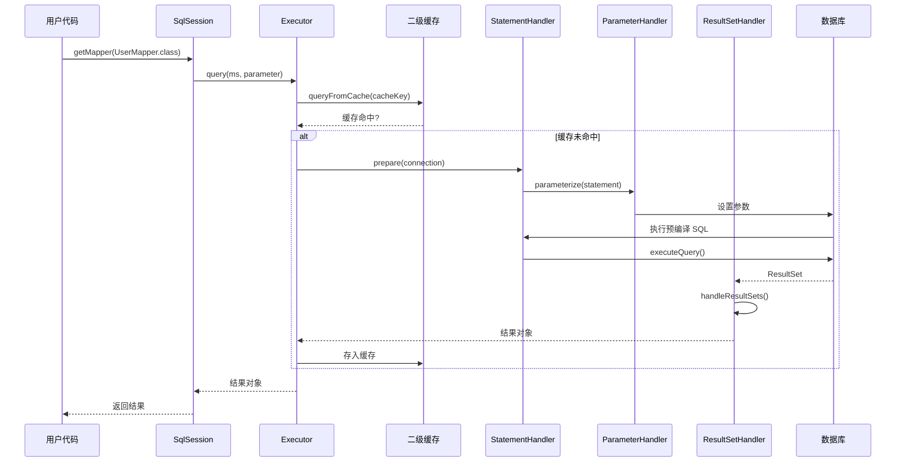

import { Badge } from '@rspress/core/theme';

# MyBatis 整体架构

凌晨 3 点，你被生产环境的数据库连接池耗尽问题叫醒。错误日志显示 `Unable to acquire JDBC Connection`，你第一反应是增加连接池大小。但真的是连接池的问题吗？

理解 MyBatis 的整体架构，你会发现问题可能出在别的地方——也许是 Statement 没有正确关闭，也许是 ResultSet 没有及时释放。而这一切，都与 MyBatis 的核心组件息息相关。

## MyBatis 架构分层

MyBatis 的整体架构可以分为三层：

```
┌─────────────────────────────────────────────────────────────┐
│                      接口层（API Layer）                      │
│         SqlSession 接口 → 定义了对数据库的操作方法             │
└─────────────────────────────────────────────────────────────┘
                              ↓
┌─────────────────────────────────────────────────────────────┐
│                    核心处理层（Core Layer）                   │
│  ┌──────────┐  ┌──────────────┐  ┌────────────────┐        │
│  │  Executor │→ │StatementHandler│→ │ParameterHandler│        │
│  └──────────┘  └──────────────┘  └────────────────┘        │
│         ↓               ↓                   ↓                │
│  ┌──────────┐  ┌──────────────┐  ┌────────────────┐        │
│  │  Cache   │  │ ResultSetHandler│ │   TypeHandler  │       │
│  └──────────┘  └──────────────┘  └────────────────┘        │
└─────────────────────────────────────────────────────────────┘
                              ↓
┌─────────────────────────────────────────────────────────────┐
│                   基础支撑层（Infrastructure Layer）          │
│      XML 解析 │ 注解处理 │ 日志 │ 数据源 │ 连接池管理           │
└─────────────────────────────────────────────────────────────┘
```

## 四大核心组件详解

### 1. Executor <Badge text="执行器" type="tip" />

Executor 是 SQL 执行的核心调度器，负责 SQL 语句的执行和缓存管理。

```java
public interface Executor {

    // 查询操作
    <E> List<E> query(MappedStatement ms, Object parameter, RowBounds rowBounds,
                      ResultHandler resultHandler, CacheKey cacheKey, BoundSql boundSql);

    // 更新操作（增删改）
    int update(MappedStatement ms, Object parameter);

    // 缓存管理
    void clearLocalCache();
    void commit(boolean required);
    void rollback(boolean required);

    // 事务管理
    Transaction getTransaction();
    void close(boolean forceRollback);
}
```

**三种执行器类型**：

| 执行器 | 类 | 特点 | 适用场景 |
|---|---|---|---|
| SimpleExecutor | `SimpleExecutor` | 每次查询创建新的 PreparedStatement | 单次操作、低并发 |
| ReuseExecutor | `ReuseExecutor` | 复用 Statement 对象 | 批量操作、重复 SQL |
| BatchExecutor | `BatchExecutor` | 批量执行，合并同 SQL 的更新 | 批量插入、批量更新 |

```java title="Configuration.java"
public class Configuration {

    // 创建执行器
    protected Executor newExecutor(Transaction transaction, ExecutorType execType) {
        Executor executor;

        // 根据执行器类型创建
        if (ExecutorType.BATCH == execType) {
            executor = new BatchExecutor(this, transaction);
        } else if (ExecutorType.REUSE == execType) {
            executor = new ReuseExecutor(this, transaction);
        } else {
            executor = new SimpleExecutor(this, transaction);
        }

        // 缓存插件装饰
        if (cacheEnabled) {
            executor = new CachingExecutor(executor);
        }

        // 插件拦截器链装饰
        executor = (Executor) interceptorChain.pluginAll(executor);
        return executor;
    }
}
```

### 2. StatementHandler <Badge text="语句处理器" type="tip" />

StatementHandler 负责 JDBC Statement 的创建、SQL 预编译和参数设置。

```java
public interface StatementHandler {

    // 准备 Statement
    Statement prepare(Connection connection) throws SQLException;

    // 参数绑定
    void parameterize(Statement statement) throws SQLException;

    // 执行查询
    <E> List<E> query(Statement statement, ResultHandler resultHandler)
            throws SQLException;

    // 执行更新
    int update(Statement statement) throws SQLException;

    // 执行批量
    List<BatchResult> batch(Statement statement) throws SQLException;
}
```

**StatementHandler 的实现类层次**：

```
StatementHandler (接口)
    │
    ├── RoutingStatementHandler  ← 路由分发，根据 MappedStatement.statementType 选择
    │       │
    │       ├── SimpleStatementHandler
    │       ├── PreparedStatementHandler  ← 最常用
    │       └── CallableStatementHandler
```

```java title="RoutingStatementHandler.java"
public class RoutingStatementHandler implements StatementHandler {

    private final StatementHandler delegate;

    public RoutingStatementHandler(MappedStatement ms, Object parameter,
                                     RowBounds rowBounds, ResultHandler resultHandler,
                                     BoundSql boundSql) {
        // 根据 statementType 选择具体的 Handler
        switch (ms.getStatementType()) {
            case STATEMENT:
                delegate = new SimpleStatementHandler(...);
                break;
            case PREPARED:
                delegate = new PreparedStatementHandler(...);  // 最常用
                break;
            case CALLABLE:
                delegate = new CallableStatementHandler(...);
                break;
            default:
                throw new ExecutorException("Unknown statement type: " + ms.getStatementType());
        }
    }
}
```

### 3. ParameterHandler <Badge text="参数处理器" type="tip" />

ParameterHandler 负责将 Java 参数转换为 JDBC 参数，是实现 `#{}` 预编译参数绑定的关键。

```java
public interface ParameterHandler {

    // 获取参数对象
    Object getParameterObject();

    // 设置参数到 Statement
    void setParameters(PreparedStatement ps) throws SQLException;
}
```

```java title="DefaultParameterHandler.java"
public class DefaultParameterHandler implements ParameterHandler {

    private final TypeHandlerRegistry typeHandlerRegistry;
    private final MappedStatement mappedStatement;
    private final Object parameterObject;
    private final BoundSql boundSql;
    private final Configuration configuration;

    @Override
    public void setParameters(PreparedStatement ps) {
        // 获取参数元信息
        List<ParameterMapping> parameterMappings = boundSql.getParameterMappings();

        if (parameterMappings == null || parameterMappings.isEmpty()) {
            return;
        }

        for (ParameterMapping parameterMapping : parameterMappings) {
            if (parameterMapping.getMode() != ParameterMode.OUT) {
                Object value;
                String propertyName = parameterMapping.getProperty();

                // 获取参数值
                if (valueHandler.hasNestedMapping(propertyName)) {
                    value = valueHandler.getNestedValue(propertyName);
                } else if (typeHandlerRegistry.hasTypeHandler(parameterObject.getClass())) {
                    value = parameterObject;
                } else {
                    // 从对象属性中获取值
                    MetaObject metaObject = configuration.newMetaObject(parameterObject);
                    value = metaObject.getValue(propertyName);
                }

                // 获取类型处理器
                TypeHandler<?> typeHandler = parameterMapping.getTypeHandler();
                JdbcType jdbcType = parameterMapping.getJdbcType();

                // 设置参数
                typeHandler.setParameter(ps, parameterMapping.getJdbcTypeIndex() + 1,
                        value, jdbcType);
            }
        }
    }
}
```

### 4. ResultSetHandler <Badge text="结果集处理器" type="tip" />

ResultSetHandler 负责将 JDBC ResultSet 转换为 Java 对象，是结果映射的核心。

```java
public interface ResultSetHandler {

    // 处理查询结果
    <E> List<E> handleResultSets(Statement statement) throws SQLException;

    // 处理输出参数（存储过程）
    <E> List<E> handleOutputParameters(Statement statement) throws SQLException;
}
```

```java title="DefaultResultSetHandler.java"
public class DefaultResultSetHandler implements ResultSetHandler {

    // 结果集包装器
    private ResultSetWrapper getFirstResultSet(Statement statement) throws SQLException {
        ResultSet rs = statement.getResultSet();
        return rs == null ? null : new ResultSetWrapper(rs, configuration);
    }

    // 处理结果映射
    @SuppressWarnings("unchecked")
    private <E> List<E> handleResultSet(Statement statement, ResultSetWrapper rsw,
                                         ResultMap resultMap, ResultHandler<?> resultHandler,
                                         NestedResultMapping nestedResultMapping) throws SQLException {
        List<E> resultList;

        // 如果没有结果处理器且有嵌套映射
        if (resultHandler == null) {
            DefaultResultHandler internalResultHandler = new DefaultResultHandler(resultMap);
            applyResultMap(rsw, resultMap, internalResultHandler, combinedKey);
            resultList = internalResultHandler.getResultList();
        } else {
            applyResultMap(rsw, resultMap, (ResultHandler<E>) resultHandler, combinedKey);
            resultList = ((ResultHandler<E>) resultHandler).getResultList();
        }

        return resultList;
    }

    // 应用 resultMap 进行映射
    private void applyResultMap(ResultSetWrapper rsw, ResultMap resultMap,
                                 ResultHandler<?> resultHandler, CombinedResultMapping combinedResultMapping)
            throws SQLException {

        // 处理自动映射
        applyAutomaticMapping(rsw, resultMap, resultHandler, combinedResultMapping);

        // 处理显式映射
        for (ResultMapping resultMapping : resultMap.getPropertyResultMappings()) {
            // 处理 association 和 collection
            if (resultMapping.getNestedQueryId() != null) {
                // 嵌套查询
                handleNestedQuery(resultMapping);
            } else {
                // 普通属性
                Object value = getPropertyValue(rsw, resultMapping);
                resultHandler.handleResult(resultMapping, value);
            }
        }
    }
}
```

## 四大组件的协作流程

完整的查询流程如下：



## 为什么需要这么多组件？

面试官可能会问：为什么 MyBatis 要设计这么多组件？一个组件完成所有工作不行吗？

**分层设计的核心价值**：

| 设计原则 | 说明 |
|---|---|
| **单一职责** | 每个组件只负责一件事，便于维护和扩展 |
| **开闭原则** | 插件可以在不修改核心代码的情况下增强功能 |
| **可替换性** | 不同场景可以选择不同的实现（Reuse vs Batch） |
| **可测试性** | 组件解耦后可以单独测试 |

## 各组件的面试重点

| 组件 | 面试重点 | 追问方向 |
|---|---|---|
| Executor | 三种执行器的区别、缓存装饰器模式 | 缓存什么时候写入？什么时候失效？ |
| StatementHandler | 路由分发、SQL 预编译 | PreparedStatement vs Statement 的区别？ |
| ParameterHandler | 参数绑定、TypeHandler | #{} 和 ${} 在这有什么区别？ |
| ResultSetHandler | 结果映射、嵌套查询 | association 和 collection 的区别？ |

---

## 延伸思考

MyBatis 的四大组件都实现了接口，便于插件扩展。你知道 MyBatis 的插件机制是如何利用责任链模式拦截这些组件的吗？

提示：每个组件都暴露了 `setInterceptor` 方法，插件通过动态代理包装这些方法，在执行前后插入自定义逻辑。

> 这一章理解了架构，下一章我们深入到初始化流程，看看配置是如何一步步加载的。
