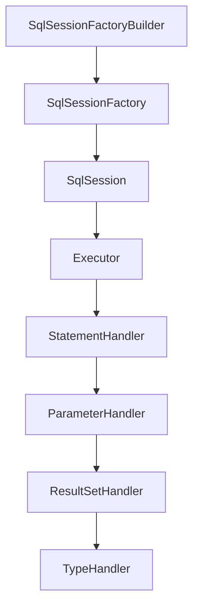
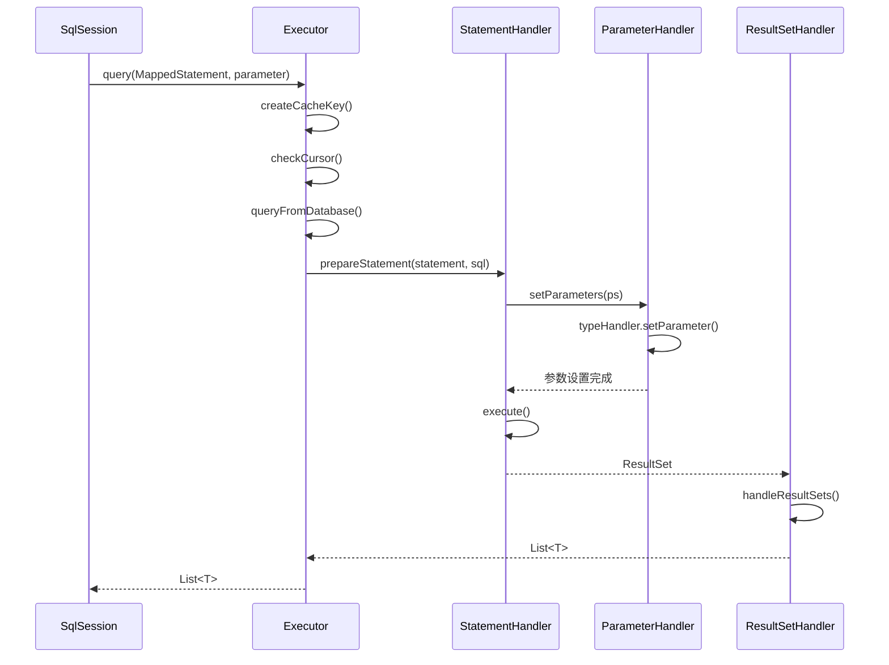

# MyBatis 持久层框架

候选人小王在面试时被问到："MyBatis 是怎么把 SQL 查询结果映射成 Java 对象的？"

他回答："用 ResultMap..."面试官追问："那 association 和 collection 有什么区别？嵌套查询和嵌套结果呢？"

小王支支吾吾，说不清楚。

【面试官心理】
我问他结果映射，不是想听他背标签名字。我想知道的是：他有没有真正写过复杂的嵌套查询，有没有遇到过 N+1 问题，怎么解决的。

---

## 一、MyBatis 整体架构 🔴

### 1.1 问题拆解

**第一层：怎么用？**
面试官问："MyBatis 和 Hibernate 的区别是什么？"
候选人答："Hibernate 是全自动，MyBatis 是半自动..."（基本概念）

**第二层：核心组件**
面试官追问："MyBatis 有哪些核心组件？SqlSessionFactory 是怎么创建的？"
候选人答：...（架构理解）

**第三层：执行流程**
面试官追问："一次 SQL 执行经历了哪些组件？"
候选人答：...（P6 分水岭）

### 1.2 错误示范

**候选人原话**："MyBatis 是半自动 ORM 框架，通过 XML 或注解配置 SQL..."

**问题诊断**：
- 只知道基本概念，不知道底层怎么工作
- 分不清各个组件的作用
-没看过源码，不知道设计模式

**面试官内心 OS**："这个候选人肯定没看过 MyBatis 源码..."

### 1.3 标准回答

**MyBatis 核心架构**：



**各组件职责**：

| 组件 | 职责 |
| --- | --- |
| SqlSessionFactoryBuilder | 构建 SqlSessionFactory |
| SqlSessionFactory | 创建 SqlSession |
| SqlSession | 对外提供 API，是门面 |
| Executor | 执行 SQL，缓存管理 |
| StatementHandler | 处理 SQL 语句 |
| ParameterHandler | 参数处理 |
| ResultSetHandler | 结果集映射 |
| TypeHandler | 类型转换 |

**SqlSessionFactory 创建流程**：

```java
// 第一步：读取配置文件
InputStream inputStream = Resources.getResourceAsStream("mybatis-config.xml");
SqlSessionFactoryBuilder builder = new SqlSessionFactoryBuilder();
// 第二步：构建 Configuration
XMLConfigBuilder parser = new XMLConfigBuilder(inputStream);
Configuration config = parser.parse();
// 第三步：创建 SqlSessionFactory
SqlSessionFactory factory = new DefaultSqlSessionFactory(config);
```

---

## 二、SQL 执行流程 🟡

### 2.1 问题拆解

**第一层：怎么用？**
面试官问："MyBatis 一次 select 查询经历了哪些步骤？"
候选人答："创建 SqlSession，调用 selectOne..."（表面）

**第二层：源码流程**
面试官追问："Executor 做了什么？StatementHandler 呢？"
候选人答：...（开始深入）

**第三层：插件机制**
面试官追问："MyBatis 插件是怎么实现的？为什么要用动态代理？"
候选人答：...（P6/P7 分水岭）

### 2.2 标准回答

**SQL 执行时序图**：



**Executor 详解**：

```java
// CachingExecutor 装饰了 BaseExecutor
public class CachingExecutor implements Executor {
    private final Executor delegate;
    private final TransactionalCacheManager tcm = new TransactionalCacheManager();

    @Override
    public <E> List<E> query(MappedStatement ms, Object parameter, RowBounds rowBounds,
                            ResultHandler resultHandler, CacheKey key, BoundSql boundSql) {
        // 一级缓存查询
        if (ms.isFlushCacheRequired()) {
            flushStatements();
        }
        // 二级缓存查询
        Cache cache = ms.getCache();
        if (cache != null) {
            if (FlushCachePolicy.TRUE.equals(cache.getFlushInterval())) {
                flushStatements();
            }
            if (BoundSql.NONE.equals(resultHandler)) {
                List<E> cached = cache.getObject(key);
                if (cached != null) {
                    return cached;
                }
            }
        }
        // 委托给 BaseExecutor
        List<E> list = delegate.query(ms, parameter, rowBounds, resultHandler, key, boundSql);
        // 放入二级缓存
        if (cache != null) {
            cache.putObject(key, list);
        }
        return list;
    }
}
```

【面试官心理】
我追问他 Executor 的缓存管理，是想看他有没有理解 MyBatis 的缓存设计。一级缓存和二级缓存的区别是高频追问点。

---

## 三、缓存机制 🔴

### 3.1 问题拆解

**第一层：怎么用？**
面试官问："MyBatis 有一级缓存和二级缓存？区别是什么？"
候选人答："一级缓存是 SqlSession 级别，二级缓存是 Mapper 级别..."（基本概念）

**第二层：作用域**
面试官追问："一级缓存什么时候失效？什么情况下会导致缓存不命中？"
候选人答：...（细节问题）

**第三层：缓存穿透击穿**
面试官追问："MyBatis 缓存穿透怎么办？击穿呢？"
候选人答：...（P6 分水岭）

### 3.2 错误示范

**候选人原话**："MyBatis 二级缓存是 Application 级别的缓存..."

**问题诊断**：
- 不知道二级缓存实际上是 Mapper 级别的
- 不理解缓存共享范围
- 没遇到过缓存相关问题

**面试官内心 OS**："这个候选人肯定没排查过缓存问题..."

### 3.3 标准回答

**一级缓存原理**：

```java
// BaseExecutor 的一级缓存
public abstract class BaseExecutor implements Executor {
    // 一级缓存：PerpetualCache，自定义 HashMap
    protected final PerpetualCache localCache = new PerpetualCache("LocalCache");

    @Override
    public <E> List<E> query(MappedStatement ms, Object parameter, RowBounds rowBounds,
                            ResultHandler resultHandler, CacheKey key, BoundSql boundSql) {
        // 1. 查一级缓存
        List<E> cached = localCache.getObject(key);
        if (cached != null) {
            return cached;
        }
        // 2. 缓存没命中，查询数据库
        List<E> list = queryFromDatabase(ms, parameter, rowBounds, resultHandler, key, boundSql);
        // 3. 结果放入一级缓存
        localCache.putObject(key, list);
        return list;
    }

    // 缓存失效的情况：
    // 1. SqlSession 关闭或提交
    // 2. 执行 update/delete/insert
    // 3. 调用 clearCache()
    // 4. 查询条件不同（CacheKey 不同）
}
```

**一级缓存失效场景**：

```java
SqlSession sqlSession = sqlSessionFactory.openSession();
try {
    User user1 = sqlSession.selectOne("selectById", 1L);  // 查数据库
    User user2 = sqlSession.selectOne("selectById", 1L);  // 走缓存
    // 结果一样，第二次不查数据库

    User user3 = sqlSession.selectOne("selectById", 1L);  // clearCache 后查数据库
    sqlSession.clearCache();

    sqlSession.commit();  // 提交后缓存失效

    sqlSession.update("updateUser", user);  // 更新后缓存失效
} finally {
    sqlSession.close();
}
```

**二级缓存配置**：

```xml
<!-- Mapper XML 中开启二级缓存 -->
<cache
    eviction="LRU"
    flushInterval="60000"
    size="512"
    readOnly="true"/>

<!-- useCache=false 禁用缓存 -->
<select id="selectById" resultMap="BaseResultMap" useCache="false">
    SELECT * FROM user WHERE id = #{id}
</select>
```

:::warning ⚠️
二级缓存的坑：
1. **跨 SqlSession**：二级缓存是 Mapper 级别的，不同 SqlSession 可以共享
2. **脏数据**：`selectById` 缓存了，用户 A 更新了，用户 B 查到的还是旧数据
3. **序列化开销**：`readOnly=false` 时每次复制对象，开销大

解决方案：分布式缓存不用 MyBatis 二级缓存，用 Redis！
:::

**MyBatis 缓存与 Redis 对比**：

| 维度 | MyBatis 二级缓存 | Redis 分布式缓存 |
| --- | --- | --- |
| 作用范围 | 单 JVM | 分布式多 JVM |
| 存储介质 | 内存 | Redis |
| 序列化 | Java 序列化 | 可选 JSON/Proto |
| 过期策略 | LRU/FIFO/SOFT/WEAK | 配置过期时间 |
| 分布式一致性 | 不支持 | 支持 |

【面试官心理】
我追问他缓存穿透击穿，是想看他有没有实际排查过性能问题。能说清 Redis 缓存和 MyBatis 缓存配合使用的，基本都有缓存实战经验。

---

## 四、插件开发 🟡

### 4.1 问题拆解

**第一层：怎么用？**
面试官问："MyBatis 插件是怎么用的？"
候选人答："用 @Intercepts 注解..."（基本使用）

**第二层：原理**
面试官追问："为什么要用动态代理？插件是怎么拦截的？"
候选人答：...（核心原理）

**第三层：实战**
面试官追问："写过什么自定义插件吗？"
候选人答：...（P6/P7 分水岭）

### 4.2 标准回答

**插件原理：责任链 + 动态代理**：

```java
// MyBatis 四大对象都可能被插件拦截
// Executor (update, query, flushStatements, close)
// StatementHandler (prepare, parameterize, batch, update)
// ParameterHandler (getParameterObject, setParameters)
// ResultSetHandler (handleResultSets, handleOutputParameters)

// 插件使用动态代理拦截
public class MyPlugin implements Interceptor {
    @Override
    public Object intercept(Invocation invocation) throws Throwable {
        // 获取被拦截的方法
        Method method = invocation.getMethod();
        Object[] args = invocation.getArgs();

        // 拦截前处理
        System.out.println("SQL 执行前...");

        // 执行目标方法
        Object result = invocation.proceed();

        // 拦截后处理
        System.out.println("SQL 执行后...");

        return result;
    }

    @Override
    public Object plugin(Object target) {
        // 为目标对象创建代理
        return Plugin.wrap(target, this);
    }

    @Override
    public void setProperties(Properties properties) {
        // 读取配置参数
    }
}
```

**自定义分页插件示例**：

```java
@Intercepts({
    @Signature(type = StatementHandler.class, method = "prepare", args = {Connection.class, Integer.class})
})
public class PaginationInterceptor implements Interceptor {
    @Override
    public Object intercept(Invocation invocation) throws Throwable {
        StatementHandler sh = (StatementHandler) invocation.getTarget();
        // 反射获取 SQL
        MetaObject metaObject = SystemMetaObject.forObject(sh);
        String originalSql = (String) metaObject.getValue("delegate.boundSql.sql");

        // 获取分页参数
        PageHelper page = PageHelper.start();
        if (page != null) {
            // 改写 SQL
            String pageSql = buildPageSql(originalSql, page);
            metaObject.setValue("delegate.boundSql.sql", pageSql);
        }

        return invocation.proceed();
    }

    private String buildPageSql(String sql, PageHelper page) {
        // MySQL 分页
        return sql + " LIMIT " + page.getOffset() + "," + page.getLimit();
    }
}
```

【面试官心理】
我追问他自定义插件，是想看他有没有扩展过 MyBatis。能写出一个分页插件或性能监控插件的，基本都有过解决特殊需求的实战经验。

---

## 五、复杂映射 🟡

### 5.1 问题拆解

**第一层：怎么用？**
面试官问："association 和 collection 有什么区别？"
候选人答："一对一用 association，一对多用 collection..."（基本概念）

**第二层：嵌套方式**
面试官追问："嵌套查询和嵌套结果有什么区别？N+1 问题是什么？"
候选人答：...（核心问题）

**第三层：延迟加载**
面试官追问："延迟加载的原理是什么？什么情况下会触发？"
候选人答：...（P6 分水岭）

### 5.2 标准回答

**嵌套查询 vs 嵌套结果**：

```xml
<!-- 嵌套查询：分两次查询 -->
<resultMap id="OrderWithUser" type="Order">
    <id property="id" column="id"/>
    <association property="user" column="user_id"
                 select="com.example.UserMapper.selectById"/>
</resultMap>

<!-- 嵌套结果：一次 JOIN 查询 -->
<resultMap id="OrderWithUser" type="Order">
    <id property="id" column="id"/>
    <association property="user" column="user_id"
                 resultMap="UserResultMap"/>
</resultMap>
```

**N+1 问题详解**：

```java
// 嵌套查询的 N+1 问题
List<Order> orders = orderMapper.selectAll();
// SQL 1: SELECT * FROM orders
// 如果有 10 个订单，每个订单查用户
// SQL 2-11: SELECT * FROM user WHERE id = ?
// 总共执行 1 + 10 = 11 条 SQL！

// 嵌套结果一次搞定
List<Order> orders = orderMapper.selectAllWithUser();
// SQL: SELECT o.*, u.* FROM orders o LEFT JOIN user u ON o.user_id = u.id
// 只执行 1 条 SQL
```

:::warning ⚠️
N+1 是 MyBatis 的高频踩坑点：
- **嵌套查询**：简单，但会产生 N+1 条 SQL
- **嵌套结果**：复杂，但只有 1 条 SQL
- **建议**：关联查询少用嵌套查询，关联多时用嵌套结果

**延迟加载触发条件**：嵌套查询 + `fetchType="lazy"` + 在另一个 SqlSession 中使用（需要配置）
:::

**延迟加载原理**：

```java
// MyBatis 用 javassist 或 cglib 生成代理对象
// 调用 getUser() 时触发懒加载
public class UserProxy extends User {
    private Loader delegate;  // 懒加载加载器
    private User user;  // 实际对象

    public User getUser() {
        if (user == null) {
            // 触发懒加载
            user = delegate.loadUser(userId);
        }
        return user;
    }
}
```

---

## 六、常见面试题分类

| 级别 | 高频问题 | 期望回答 |
| --- | --- | --- |
| P5 | MyBatis/Hibernate 区别、缓存概念 | 能说清基本概念 |
| P6 | 一级/二级缓存区别、N+1 问题、插件原理 | 能回答追问 |
| P7 | 缓存穿透击穿、自定义插件、SQL 执行优化 | 有实战经验 |

---

## 七、学习路径指引

| 阶段 | 内容 | 目标 |
| --- | --- | --- |
| 入门 | 基本 CRUD、XML 配置 | 能完成单表操作 |
| 进阶 | 动态 SQL、复杂映射 | 能处理关联查询 |
| 高级 | 插件开发、缓存机制 | 能自定义组件 |
| 精通 | 源码阅读、SQL 调优 | 能排查性能问题 |

:::tip 💡
MyBatis 面试的核心是"缓存"和"映射"。建议准备时多想想"这条 SQL 查了数据库还是缓存？"、"这个关联查询会产生几条 SQL？"。
:::

---

## 八、生产避坑总结

| 场景 | 问题 | 解决方案 |
| --- | --- | --- |
| N+1 查询 | 嵌套查询产生大量 SQL | 改用嵌套结果 |
| 缓存脏读 | 分布式环境下缓存不一致 | 不用 MyBatis 缓存，用 Redis |
| 批量插入 | 逐条插入性能差 | 用 `<foreach>` 批量插入 |
| 分页踩坑 | limit offset 过大性能差 | 记录上次查询最大 ID |
| 分页总数 | count(*) 慢 | 用缓存或覆盖索引 |
