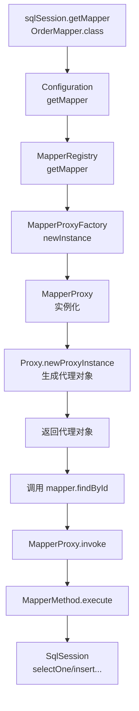

候选人小钱在面试字节1-3时，面试官看了他的项目经验，问了一个简单的问题：

"MyBatis 的 getMapper 方法返回的是什么？你怎么通过接口调用 SQL？"

小钱说："返回的是一个代理对象，通过 JDK 动态代理实现的。"

面试官点点头："那你说说 MapperProxy.invoke 里面做了什么？"

小赵说："调用 SqlSession 的方法..."

面试官追问："具体的分发逻辑呢？methodCache 是干什么用的？为什么 MyBatis 不用 CGLIB 代理？"

小钱卡在了 invoke 方法的细节和 CGLIB 的区别上。

【面试官心理】
这道题我用来筛选"用过接口"和"理解代理原理"的候选人。知道 getMapper 返回代理对象是基本操作，能讲清 MapperProxy.invoke 的完整链路、methodCache 的作用、以及为什么选 JDK 动态代理而不是 CGLIB 的，不超过 20%。P6 和 P5 的差距就在这些细节上。

## 一、getMapper 的完整链路 🔴



### 1.1 入口：SqlSession.getMapper

```java
// DefaultSqlSession.getMapper
public <T> T getMapper(Class<T> type) {
    return configuration.getMapper(type, this);
}

// Configuration.getMapper
public <T> T getMapper(Class<T> type, SqlSession sqlSession) {
    return mapperRegistry.getMapper(type, sqlSession);
}
```

### 1.2 核心：MapperRegistry 与 MapperProxyFactory

```java
// MapperRegistry 管理所有 Mapper 接口的代理工厂
public class MapperRegistry {
    private final Map<Class<?>, MapperProxyFactory<?>> knownMappers =
        new HashMap<>();

    public <T> void addMapper(Class<T> type) {
        // Mapper 必须是接口
        knownMappers.put(type, new MapperProxyFactory<>(type));
    }

    @SuppressWarnings("unchecked")
    public <T> T getMapper(Class<T> type, SqlSession sqlSession) {
        // 拿到该接口对应的代理工厂
        MapperProxyFactory<T> mapperProxyFactory =
            (MapperProxyFactory<T>) knownMappers.get(type);
        if (mapperProxyFactory == null) {
            throw new BindingException(
                "Type " + type + " is not known to the MapperRegistry.");
        }
        // 用代理工厂创建代理实例
        return mapperProxyFactory.newInstance(sqlSession);
    }
}

// MapperProxyFactory 创建代理对象
public class MapperProxyFactory<T> {
    private final Class<T> mapperInterface;
    private final Map<Method, MapperMethod> methodCache = new ConcurrentHashMap<>();

    @SuppressWarnings("unchecked")
    public T newInstance(SqlSession sqlSession) {
        // 创建 MapperProxy（包含 sqlSession 的引用）
        final MapperProxy<T> mapperProxy = new MapperProxy<>(sqlSession,
            mapperInterface, methodCache);
        // 用 JDK 动态代理创建代理对象
        return (T) Proxy.newProxyInstance(
            mapperInterface.getClassLoader(),
            new Class[]{mapperInterface},
            mapperProxy
        );
    }
}
```

## 二、MapperProxy.invoke 全链路解析 🔴

```java
public class MapperProxy<T> implements InvocationHandler {
    private final SqlSession sqlSession;
    private final Class<T> mapperInterface;
    private final Map<Method, MapperMethod> methodCache;  // 方法缓存

    @Override
    public Object invoke(Object proxy, Method method, Object[] args)
            throws Throwable {
        // 关键1：Object 的方法不走代理（equals/hashCode/toString）
        if (Object.class.equals(method.getDeclaringClass())) {
            return method.invoke(this, args);
        }

        // 关键2：从缓存中获取 MapperMethod，避免重复解析
        final MapperMethod mapperMethod = cachedMapperMethod(method);
        // 关键3：执行 MapperMethod
        return mapperMethod.execute(sqlSession, args);
    }

    private MapperMethod cachedMapperMethod(Method method) {
        return methodCache.computeIfAbsent(method,
            k -> new MapperMethod(mapperInterface, method, sqlSession.getConfiguration()));
    }
}
```

### 2.1 为什么需要 methodCache？

```java
// methodCache 的核心作用：避免重复创建 MapperMethod
// MapperMethod 的构造过程包括：
// 1. 解析方法签名（返回类型、参数类型）
// 2. 从 Configuration 中获取对应的 MappedStatement
// 3. 构建 SqlCommand 对象（SQL 类型 + MappedStatement id）

// 如果没有缓存，每次方法调用都要重新解析
// 这是一个 O(n) 的查找优化为 O(1) 的典型案例
```

### 2.2 MapperMethod.execute 分发逻辑

```java
public class MapperMethod {
    private final SqlCommand command;  // SQL 命令信息
    private final MethodSignature method;  // 方法签名

    public Object execute(SqlSession sqlSession, Object[] args) {
        Object result = null;

        switch (command.getType()) {
            case SELECT:
                // 根据返回类型分发
                if (method.returnsVoid() && method.hasResultHandler()) {
                    sqlSession.select(command.getName(), args,
                        method.getResultHandler());
                } else if (method.returnsMany()) {
                    result = sqlSession.selectList(command.getName(), args);
                } else if (method.returnsMap()) {
                    result = sqlSession.selectMap(command.getName(), args,
                        method.getMapKey());
                } else if (method.returnsCursor()) {
                    result = sqlSession.selectCursor(command.getName(), args);
                } else {
                    // 单个对象
                    Object param = method.convertArgsToSqlCommandParam(args);
                    result = sqlSession.selectOne(command.getName(), param);
                }
                break;
            case INSERT:
                result = sqlSession.insert(command.getName(), args);
                break;
            case UPDATE:
                result = sqlSession.update(command.getName(), args);
                break;
            case DELETE:
                result = sqlSession.delete(command.getName(), args);
                break;
        }

        // 如果方法返回基本类型但结果是 null，抛异常
        if (result == null && method.returnsPrimitive() && !method.returnsVoid()) {
            throw new BindingException(
                "Mapper method " + command.getName() + " returned null. " +
                "But the return type is a primitive type.");
        }
        return result;
    }
}
```

## 三、为什么选择 JDK 动态代理而非 CGLIB 🔴

### 3.1 核心原因：Mapper 必须是接口

```java
// MapperProxyFactory.newInstance 的源码注释已经说明原因
// Mapper 必须是接口，CGLIB 通过继承被子类代理
// 但接口没有子类，只能通过 JDK 动态代理实现

// JDK 动态代理的要求：
// 1. 被代理的类必须实现接口（MapperProxy 实现了被代理接口）
// 2. 生成代理类时，代理类实现被代理的接口

// CGLIB 动态代理的要求：
// 1. 被代理的类不能是 final
// 2. 通过继承被子类代理
// 3. 无法代理接口，只能代理类
```

**MyBatis 的设计约束**：所有 Mapper 必须是接口。这意味着：
- CGLIB 无法代理接口，只能代理类
- JDK 动态代理可以代理接口，生成的代理类实现被代理接口
- 因此 MyBatis **必须**使用 JDK 动态代理

### 3.2 如果 Mapper 不是接口呢？

```java
// 实际上 MyBatis 在 addMapper 时就做了校验
public <T> void addMapper(Class<T> type) {
    if (type.isInterface()) {  // 必须校验——如果不是接口就报错
        // ...
    }
}

// 如果尝试 addMapper 一个类（非接口）
// 抛出 BindingException: "Type xxx is not known to the MapperRegistry."
// "Only an interface can be mapped with MyBatis."
```

### 3.3 两者的对比

| 维度 | JDK 动态代理 | CGLIB 动态代理 |
| --- | --- | --- |
| 代理方式 | 实现接口，生成实现类 | 继承父类，生成子类 |
| 性能 | 反射调用，略慢 | 字节码生成，更快 |
| 限制 | 被代理类必须实现接口 | 被代理类不能是 final |
| MyBatis 适用性 | 必须用（Mapper 是接口） | 不适用 |

:::tip 💡
在 MyBatis-Spring 整合中，情况不同。Spring 使用 `MapperFactoryBean`，它通过 `SqlSession.getMapper` 获取代理对象。但 Spring 的事务管理通过 AOP（可以是 CGLIB）包装整个 DAO 层，间接影响 SqlSession 的生命周期。
:::

## 四、注解 SQL 的解析 🔴

MyBatis 不仅支持 XML 配置 SQL，还支持在接口方法上用注解配置：

```java
public interface UserMapper {
    @Select("SELECT * FROM user WHERE id = #{id}")
    User findById(Long id);

    @Insert("INSERT INTO user(name, email) VALUES(#{name}, #{email})")
    @Options(useGeneratedKeys = true, keyProperty = "id")
    int insert(User user);

    @Update("UPDATE user SET name = #{name} WHERE id = #{id}")
    int update(User user);

    @Delete("DELETE FROM user WHERE id = #{id}")
    int delete(Long id);

    @SelectProvider(type = UserSqlProvider.class, method = "buildFindByCondition")
    List<User> findByCondition(User user);
}
```

```java
// MapperAnnotationBuilder 解析注解 SQL
public class MapperAnnotationBuilder {
    public void parse() {
        // 遍历所有方法
        for (Method method : type.getMethods()) {
            // 检查是否有 @Select/@Insert/@Update/@Delete/@SelectProvider 等注解
            if (method.isAnnotationPresent(Select.class)) {
                parseSelectAnnotation(method, method.getAnnotation(Select.class));
            } else if (method.isAnnotationPresent(Insert.class)) {
                parseInsertAnnotation(method, method.getAnnotation(Insert.class));
            }
            // ...
        }
    }

    private void parseSelectAnnotation(Method method, Select select) {
        String id = type.getName() + "." + method.getName();
        SqlSource sqlSource = buildSqlSource(method, select.value(),
            SQL_STATEMENT_TYPE.SELECT);
        // 构建 MappedStatement 并注册到 Configuration
        assistant.addMappedStatement(id, sqlSource, SQL_STATEMENT_TYPE.SELECT,
            select.flushCache() ? FlushCachePolicy.TRUE : FlushCachePolicy.FALSE,
            select.useCache() ? true : false,
            // ... 更多配置
        );
    }
}
```

### 4.1 @SelectProvider 的动态 SQL

```java
// 复杂的动态 SQL 可以用 @SelectProvider
@SelectProvider(type = UserSqlProvider.class, method = "buildFindByCondition")
List<User> findByCondition(User user);

// Provider 类
public class UserSqlProvider {
    public String buildFindByCondition(User user) {
        return new SQL() {{
            SELECT("*");
            FROM("user");
            WHERE("status = 'ACTIVE'");
            if (user.getName() != null) {
                WHERE("name = '" + user.getName() + "'");  // 注意：这里有 SQL 注入风险
            }
        }}.toString();
    }
}
```

:::warning ⚠️
**@SelectProvider 的 SQL 注入风险**：在 Provider 方法中拼接 SQL 字符串时，如果直接拼接用户输入，会导致 SQL 注入。正确做法是使用 `#{param}` 占位符或 `SQL` 类的 `WHERE` 方法（自动处理引号）。
:::

## 五、SqlSession 的方法分发

MapperMethod.execute 调用的 SqlSession 方法，最终路由到 Executor：

```java
// DefaultSqlSession.selectOne（实际调用 selectList 并取第一个）
public <T> T selectOne(String statement, Object parameter) {
    List<T> list = selectList(statement, parameter);
    if (list.size() == 1) {
        return list.get(0);
    } else if (list.size() > 1) {
        throw new TooManyResultsException(
            "Expected one result but found " + list.size());
    }
    return null;
}

public <E> List<E> selectList(String statement, Object parameter) {
    return executor.query(
        ms, parameter, RowBounds.DEFAULT, Executor.NO_RESULT_HANDLER);
}
```

## 六、❌ 错误示范

### 翻车点一：把代理对象当成实现类

**候选人原话**："getMapper 返回的是 OrderMapper 接口的实现类对象..."

实际上返回的是 `Proxy.newProxyInstance` 生成的代理对象，该对象实现了 OrderMapper 接口。当调用接口方法时，实际上是调用 `MapperProxy.invoke`。

### 翻车点二：不知道 methodCache 的作用

**候选人原话**："methodCache 用来缓存方法调用结果..."

实际上 methodCache 缓存的是 `MapperMethod` 对象（封装了 SQL 命令和方法签名），避免每次方法调用都重新解析和创建 MapperMethod。

### 翻车点三：混淆 JDK 代理和 CGLIB 的使用场景

**候选人原话**："MyBatis 用 CGLIB 因为性能更好..."

实际上 MyBatis 必须用 JDK 动态代理，因为 Mapper 是接口（不是类），CGLIB 无法代理接口。如果 MyBatis 支持类级别的 Mapper，才可能用 CGLIB。

### 翻车点四：注解和 XML 不能共存

**候选人原话**："用了注解 SQL 就不能写 XML 配置了..."

实际上可以共存。MyBatis 先解析 XML 中的 `<select>` 等标签，再解析注解。两者都支持时，XML 的优先级更高（因为 XML 解析在注解解析之前）。

## 七、标准回答

### P5 级别：能说出基本流程

> MyBatis 的 getMapper 方法返回的是一个 JDK 动态代理对象。调用接口方法时，实际执行的是 MapperProxy.invoke 方法，它会委托给 SqlSession 执行对应的 SQL。

### P6 级别：能讲清 invoke 全链路

> 完整链路是：`sqlSession.getMapper(UserMapper.class)` -> `MapperRegistry.getMapper` -> `MapperProxyFactory.newInstance` -> `Proxy.newProxyInstance`。生成的代理对象实现了 UserMapper 接口，方法是 `MapperProxy.invoke`。invoke 方法先判断是否是 Object 类的方法（equals/hashCode/toString），然后从 methodCache 中获取或创建 MapperMethod，最后调用 `mapperMethod.execute(sqlSession, args)`。execute 根据 SQL 类型（SELECT/INSERT/UPDATE/DELETE）和返回类型分发到 `sqlSession.selectOne`/`selectList`/`insert`/`update`/`delete`。
>
> **关键设计**：methodCache 是 `ConcurrentHashMap<Method, MapperMethod>`，避免重复解析同一方法。MyBatis 只能用 JDK 动态代理，因为 Mapper 必须是接口，CGLIB 无法代理接口。

【面试官心理】
P6 能答到这个程度已经超过 80% 的候选人了。我通常会追问："如果有两个 Mapper 接口的方法签名完全相同，会发生什么？"能答出"方法签名相同意味着同一个 MappedStatement id 可能被两个接口共享，需要确保 namespace + method name 的组合唯一"的，说明对 MyBatis 的整体设计有深入理解。

### P7 级别：能从架构设计角度分析

> MyBatis 选择 JDK 动态代理而不是 CGLIB，是设计约束和灵活性的权衡。约束是 Mapper 必须是接口（这本身是好的设计——接口和实现分离），决定了只能用 JDK 动态代理。好处是：接口定义清晰，SQL 配置和接口绑定明确，IDE 可以做类型检查。methodCache 的设计也是一个性能优化——将方法解析的成本从每次调用 O(n) 降为 O(1)。如果 Mapper 接口方法很多（比如超过 100 个），methodCache 可以显著减少反射和对象创建的开销。

## 八、追问升级 🟡

### 追问1：MapperMethod 的构造过程

```java
// MapperMethod 的构造
public MapperMethod(Class<?> mapperInterface, Method method,
                    Configuration config) {
    this.command = new SqlCommand(config, mapperInterface, method);
    this.method = new MethodSignature(config, mapperInterface, method);
}

// SqlCommand 解析 SQL 类型和 MappedStatement id
public SqlCommand(Configuration config, Class<?> mapperInterface, Method method) {
    String statementId = mapperInterface.getName() + "." + method.getName();
    MappedStatement ms = config.getMappedStatement(statementId);
    this.name = ms.getId();
    this.type = ms.getSqlCommandType();
}

// MethodSignature 解析返回类型和参数
public MethodSignature(Configuration config, Class<?> mapperInterface,
                        Method method) {
    // 解析返回类型：void/primitive/wrapper/collection/map/cursor/...
    // 解析 @Param 注解的参数
    // 解析 @ResultMap/@ResultType
}
```

### 追问2：Object 方法的特殊处理

```java
// MapperProxy.invoke 中对 Object 方法的处理
if (Object.class.equals(method.getDeclaringClass())) {
    // 只有 toString/equals/hashCode 三个方法特殊处理
    // 其他 Object 方法（如 wait/notify）抛出 UnsupportedOperationException
    switch (method.getName()) {
        case "equals":
            return method.equals(args[0]);
        case "hashCode":
            return method.hashCode();
        case "toString":
            return method.invoke(this, args);
    }
}
```

### 追问3：注解和 XML 的优先级

MyBatis 解析顺序是：XML 先于注解。如果同一个 id（namespace.methodName）既有 XML 配置又有注解配置，XML 会覆盖注解。`MapperAnnotationBuilder` 在解析注解时会跳过已存在的 MappedStatement。

【面试官心理】
能答出"XML 配置会覆盖注解配置"的候选人，说明对 MyBatis 的解析机制有了解。但如果追问"如果 XML 配置了 resultMap，注解 SQL 如何使用？"，能答出"注解 SQL 可以通过 @ResultMap 引用 XML 中定义的 resultMap"的，说明对 MyBatis 整体设计有全局视野，这是 P7 级别的加分项。
