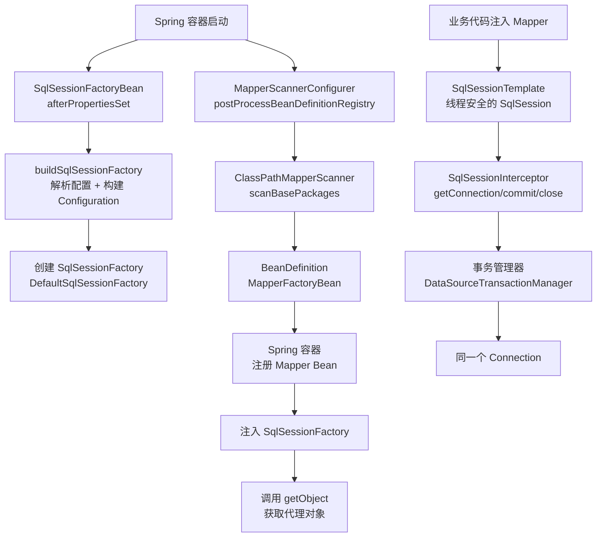
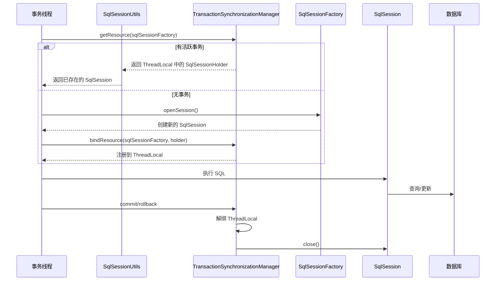

候选人小林在面试阿里P6时，面试官看了看他的项目经验，问了一个看似简单的问题：

"MyBatis 和 Spring 整合时，SqlSessionFactory 是怎么创建的？Mapper 接口是怎么被注册到 Spring 容器中的？"

小林说："配置了 SqlSessionFactoryBean，然后配置 MapperScannerConfigurer 扫描 Mapper 接口..."

面试官追问："那你说说 SqlSessionFactoryBean 的 afterPropertiesSet 做了什么？MapperScannerConfigurer 的 postProcessBeanDefinitionRegistry 做了什么？"

小林支支吾吾，说不清楚。

面试官继续追问："Spring 事务中的 SqlSession 是同一个吗？SqlSessionTemplate 是怎么保证线程安全的？"

小林彻底卡住了。

【面试官心理】
这道题我用来筛选"配置会用"和"原理理解"的候选人。知道配置什么、知道组件名字，但不知道它们在 Spring 生命周期中是怎么串联的，占 80%。能讲清 SqlSessionFactoryBean 的创建流程、Mapper 的扫描和注册机制、以及 Spring 事务中 SqlSession 的同一线程共享机制的，不超过 15%。这道题是 P6 和 P7 的区分点。

## 一、整合架构全景

MyBatis 和 Spring 的整合，本质上是把 MyBatis 的核心组件（SqlSessionFactory、SqlSession、Mapper 代理）融入 Spring 的生命周期管理：



## 二、SqlSessionFactoryBean 的创建流程 🔴

### 2.1 InitializingBean 的 afterPropertiesSet

```java
// SqlSessionFactoryBean 实现了 InitializingBean
public class SqlSessionFactoryBean implements FactoryBean<SqlSessionFactory>,
        InitializingBean, ApplicationListener<ApplicationEvent> {

    private String configPath;      // mybatis-config.xml 路径
    private String mapperLocations; // Mapper XML 路径
    private DataSource dataSource;   // 数据源

    @Override
    public void afterPropertiesSet() throws Exception {
        // 关键：构建 SqlSessionFactory
        this.sqlSessionFactory = buildSqlSessionFactory();
    }

    protected SqlSessionFactory buildSqlSessionFactory() throws Exception {
        Configuration configuration = new Configuration();

        // 1. 设置 Configuration 的基本属性
        configuration.setEnvironment(new Environment("development",
            transactionFactory, dataSource));

        // 2. 解析 mybatis-config.xml
        if (configPath != null) {
            XMLConfigBuilder configParser =
                new XMLConfigBuilder(Resources.getUrlAsReader(configPath));
            configuration = configParser.getConfiguration();
        }

        // 3. 解析所有 Mapper XML
        if (mapperLocations != null) {
            for (Resource mapperLocation : mapperLocations) {
                if (mapperLocation.exists()) {
                    XMLMapperBuilder xmlMapperBuilder =
                        new XMLMapperBuilder(mapperLocation.getInputStream(),
                            configuration, mapperLocation.toString(),
                            configuration.getSqlFragments());
                    xmlMapperBuilder.parse();  // 解析并注册 MappedStatement
                }
            }
        }

        // 4. 返回 SqlSessionFactory 实现
        return new DefaultSqlSessionFactory(configuration);
    }
}
```

### 2.2 FactoryBean 的 getObject

```java
// SqlSessionFactoryBean 实现了 FactoryBean
// Spring 容器在注入依赖时调用 getObject 获取实际 Bean
@Override
public SqlSessionFactory getObject() {
    return this.sqlSessionFactory;
}

@Override
public Class<?> getObjectType() {
    return SqlSessionFactory.class;
}

@Override
public boolean isSingleton() {
    return true;  // SqlSessionFactory 是单例的
}
```

### 2.3 Spring Boot 的自动配置

在 Spring Boot 环境下，SqlSessionFactory 的创建由自动配置类完成：

```java
// MybatisAutoConfiguration
@Configuration
@ConditionalOnClass(SqlSessionFactory.class)
@AutoConfigureAfter(DataSourceAutoConfiguration.class)
public class MybatisAutoConfiguration {

    @Bean
    @ConditionalOnMissingBean
    public SqlSessionFactory sqlSessionFactory(DataSource dataSource) {
        SqlSessionFactoryBean factory = new SqlSessionFactoryBean();
        factory.setDataSource(dataSource);
        // 自动扫描 mapper 目录
        factory.setMapperLocations(
            new PathMatchingResourcePatternResolver()
                .getResources("classpath*:/mapper/**/*.xml"));

        // 自动配置类型别名、插件等
        // ...

        return factory.getObject();
    }
}
```

## 三、MapperScannerConfigurer 的扫描机制 🔴

### 3.1 postProcessBeanDefinitionRegistry

```java
// MapperScannerConfigurer 实现了 BeanDefinitionRegistryPostProcessor
// 在 Spring 容器初始化 Bean 定义时扫描并注册 Mapper
public class MapperScannerConfigurer
        implements BeanDefinitionRegistryPostProcessor {

    private String basePackage;  // 扫描的包路径

    @Override
    public void postProcessBeanDefinitionRegistry(BeanDefinitionRegistry registry) {
        // 关键：创建 ClassPathMapperScanner
        ClassPathMapperScanner scanner = new ClassPathMapperScanner(registry);
        scanner.registerFilters();  // 注册过滤器

        // 扫描并注册
        scanner.scan(StringUtils.tokenizeToStringArray(
            basePackage, ConfigurableApplicationContext.DEFAULT_ENVIRONMENT_PLACEHOLDER));
    }
}
```

### 3.2 ClassPathMapperScanner 的扫描逻辑

```java
// ClassPathMapperScanner 继承 ClassPathBeanDefinitionScanner
public class ClassPathMapperScanner extends ClassPathBeanDefinitionScanner {

    @Override
    public Set<BeanDefinitionHolder> doScan(String... basePackages) {
        Set<BeanDefinitionHolder> beanDefinitions =
            super.doScan(basePackages);

        if (beanDefinitions.isEmpty()) {
            logger.warn("No MyBatis mapper was found in package: " + basePackage);
        } else {
            // 关键：对每个 Mapper BeanDefinition 进行处理
            processBeanDefinitions(beanDefinitions);
        }
        return beanDefinitions;
    }

    private void processBeanDefinitions(Set<BeanDefinitionHolder> definitions) {
        for (BeanDefinitionHolder holder : definitions) {
            GenericBeanDefinition definition = (GenericBeanDefinition) holder.getBeanDefinition();

            // Bean 的类型改为 MapperFactoryBean
            definition.setBeanClass(MapperFactoryBean.class);
            // 构造方法参数：SqlSessionFactory 和 Mapper 接口
            definition.getConstructorArgumentValues().addGenericArgumentValue(
                "SqlSessionFactory");
            definition.getConstructorArgumentValues().addGenericArgumentValue(
                definition.getBeanClassName());  // Mapper 接口名

            // 设置 autowireMode 为 BY_TYPE
            definition.setAutowireMode(AbstractBeanDefinition.AUTOWIRE_BY_TYPE);
        }
    }
}
```

### 3.3 MapperFactoryBean 的注入

```java
// MapperFactoryBean 继承 SqlSessionDaoSupport
public class MapperFactoryBean<T> extends SqlSessionDaoSupport
        implements FactoryBean<T> {

    private Class<T> mapperInterface;  // Mapper 接口

    @Override
    public T getObject() throws Exception {
        // 关键：调用 getSqlSession().getMapper()
        return getSqlSession().getMapper(mapperInterface);
    }

    @Override
    public Class<T> getObjectType() {
        return mapperInterface;
    }

    @Override
    public boolean isSingleton() {
        return true;  // Mapper 代理是单例的
    }
}
```

**扫描结果**：每个 Mapper 接口都被注册为一个 `MapperFactoryBean` Bean，Spring 在注入依赖时会调用 `getObject()` 获取 `getSqlSession().getMapper(mapperInterface)` 的结果。

## 四、SqlSessionTemplate — 线程安全的 SqlSession 🔴

MyBatis 原生的 `DefaultSqlSession` **不是线程安全的**。在 Spring 整合中，使用 `SqlSessionTemplate` 作为线程安全的 SqlSession 实现。

### 4.1 SqlSessionTemplate 的设计

```java
public class SqlSessionTemplate implements SqlSession, DisposableBean {
    private final SqlSessionFactory sqlSessionFactory;
    private final ExecutorType executorType;
    // 关键：使用 TransactionalSession 持有当前事务中的 SqlSession
    private final SqlSessionFactory actualSqlSessionFactory;
    private final SqlSessionInterceptor sqlSessionInterceptor;  // 核心拦截器

    public SqlSessionTemplate(SqlSessionFactory sqlSessionFactory) {
        this(sqlSessionFactory, ExecutorType.DEFAULT);
    }

    public SqlSessionTemplate(SqlSessionFactory sqlSessionFactory,
                              ExecutorType executorType) {
        this.sqlSessionFactory = sqlSessionFactory;
        this.executorType = executorType;
        // 拦截所有 SqlSession 方法调用
        this.sqlSessionInterceptor = new SqlSessionInterceptor();
    }

    @Override
    public <T> T selectOne(String statement) {
        return sqlSessionTemplate.doSelectOne(statement, null);
    }

    private <T> T doSelectOne(String statement, Object parameter) {
        return sqlSessionTemplate.execute(sqlSession -> {
            return sqlSession.selectOne(statement, parameter);
        });
    }
}
```

### 4.2 SqlSessionInterceptor 的核心逻辑

```java
// SqlSessionInterceptor 是线程安全的关键
public class SqlSessionInterceptor implements InvocationHandler {

    @Override
    public Object invoke(Object proxy, Method method, Object[] args)
            throws Throwable {
        // 关键：从当前线程中获取或创建 SqlSession
        SqlSession sqlSession = getSqlSession(
            sqlSessionFactory, executorType,
            ExecutorType.SIMPLE.equals(executorType));

        try {
            // 执行目标方法
            Object result = method.invoke(sqlSession, args);

            // 检查是否需要自动 commit（非 Spring 管理的事务时）
            if (!isSqlSessionTransactional(sqlSession, sqlSessionFactory)) {
                sqlSession.commit();
            }
            return result;
        } catch (Throwable t) {
            sqlSession.rollback();
            throw ExceptionUtil.unwrapThrowable(t);
        } finally {
            // 关键：不关闭 SqlSession！由事务管理器管理
            closeSqlSession(sqlSession, sqlSessionFactory);
        }
    }
}
```

### 4.3 Spring 事务中的 SqlSession 同一线程共享

```java
// Spring 事务中，同一线程共享同一个 SqlSession
// 核心是 SpringManagedTransaction 和 TransactionSynchronizationManager

// SqlSessionUtils.getSqlSession
public static SqlSession getSqlSession(SqlSessionFactory sessionFactory,
                                       ExecutorType executorType,
                                       boolean allowMarshalExceptions) {
    // 关键：从 ThreadLocal 中获取当前线程的 SqlSession
    SqlSessionHolder holder =
        (SqlSessionHolder) TransactionSynchronizationManager
            .getResource(sessionFactory);

    if (holder != null && holder.isSynchronizedWithTransaction()) {
        // 如果当前线程已有 SqlSession 且与事务同步，复用它
        holder.requested();
        return holder.getSqlSession();
    }

    // 没有则创建新的
    SqlSession session = sessionFactory.openSession(executorType);
    // 注册到 ThreadLocal（当前线程持有）
    TransactionSynchronizationManager
        .bindResource(sessionFactory, new SqlSessionHolder(session, executorType));
    return session;
}

// 事务提交/回滚时，自动清理 ThreadLocal 中的 SqlSession
// SqlSessionUtils.closeSqlSession
public static void closeSqlSession(SqlSession session, SqlSessionFactory factory) {
    SqlSessionHolder holder = (SqlSessionHolder)
        TransactionSynchronizationManager.getResource(factory);

    if (holder == null) {
        session.close();  // 无事务，直接关闭
        return;
    }

    // 有事务，不关闭，等待事务管理器统一管理
    holder.released();
    // 事务提交后，afterCompletion 中会清理
}
```



:::tip 💡
**Spring 事务中 SqlSession 的生命周期**：
- 事务开始：从 ThreadLocal 获取或创建 SqlSession，绑定到 ThreadLocal
- 事务进行中：同一线程的所有 DAO 操作复用同一个 SqlSession（同一 Connection）
- 事务结束（commit/rollback）：解绑 ThreadLocal，关闭 SqlSession

这保证了**同一事务中的所有 SQL 操作使用同一个 Connection**，从而实现事务一致性。
:::

## 五、Spring Boot 自动配置 🔴

Spring Boot 环境下，连 `SqlSessionFactoryBean` 和 `MapperScannerConfigurer` 都不需要手动配置：

```yaml
# application.yml
mybatis:
  mapper-locations: classpath*:mapper/**/*.xml
  type-aliases-package: com.xxx.entity
  configuration:
    map-underscore-to-camel-case: true
    cache-enabled: true
```

```java
// 自动配置类
@Configuration
@EnableConfigurationProperties(MybatisProperties.class)
public class MybatisAutoConfiguration {
    @Bean
    @ConditionalOnMissingBean
    public SqlSessionFactory sqlSessionFactory(DataSource dataSource,
            MybatisProperties properties) {
        SqlSessionFactoryBean factory = new SqlSessionFactoryBean();
        factory.setDataSource(dataSource);
        factory.setMapperLocations(
            resolveMapperLocations(properties.getMapperLocations()));
        factory.setTypeAliasesPackage(properties.getTypeAliasesPackage());
        // 设置 Configuration 属性
        org.apache.ibatis.session.Configuration configuration =
            new org.apache.ibatis.session.Configuration();
        properties.getConfiguration().forEach(configuration::set);
        factory.setConfiguration(configuration);
        return factory.getObject();
    }
}
```

## 六、❌ 错误示范

### 翻车点一：混淆 SqlSessionFactoryBean 和 MapperFactoryBean

**候选人原话**："SqlSessionFactoryBean 用来创建 Mapper..."

实际上 SqlSessionFactoryBean 用来创建 `SqlSessionFactory`，而 Mapper 是由 `MapperFactoryBean`（或 `MapperScannerConfigurer` 扫描注册的）创建的。

### 翻车点二：认为 SqlSessionTemplate 每次调用都创建新连接

**候选人原话**："SqlSessionTemplate 是线程安全的，因为它每次都创建新的 SqlSession..."

实际上 SqlSessionTemplate 通过 SqlSessionInterceptor 实现了线程安全：事务中复用同一个 SqlSession（从 ThreadLocal 获取），无事务时每次创建新的但用完即关闭。

### 翻车点三：不知道 Spring 事务和 MyBatis 事务的绑定机制

**候选人原话**："Spring 事务和 MyBatis 没关系，各自管理..."

实际上 MyBatis 的 Spring 集成通过 `TransactionSynchronizationManager` 的 ThreadLocal 机制，将 SqlSession 与 Spring 事务绑定。同一事务中的所有 SQL 操作使用同一个 Connection。

### 翻车点四：MapperScan 的包路径写错

```java
// 错误：配置了错误的包路径，导致 Mapper 未被扫描
@MapperScan("com.xxx")  // 只扫描 com.xxx，不会扫描子包

// 正确：使用通配符扫描子包
@MapperScan("com.xxx.**")  // 扫描 com.xxx 及其所有子包
// 或
@MapperScan("com.xxx.mapper")  // 明确指定 mapper 包
```

## 七、标准回答

### P5 级别：能说出配置方式

> MyBatis 和 Spring 整合需要配置 SqlSessionFactoryBean 和 MapperScannerConfigurer（或 @MapperScan）。SqlSessionFactoryBean 用于创建 SqlSessionFactory，MapperScannerConfigurer 用于扫描 Mapper 接口并注册到 Spring 容器中。

### P6 级别：能讲清组件协作和线程安全机制

> SqlSessionFactoryBean 实现了 InitializingBean 和 FactoryBean，在 afterPropertiesSet 中解析 XML 配置并构建 Configuration，创建 DefaultSqlSessionFactory。MapperScannerConfigurer 实现了 BeanDefinitionRegistryPostProcessor，在 postProcessBeanDefinitionRegistry 中扫描指定包下的所有接口，注册为 MapperFactoryBean 的 BeanDefinition。Spring 注入时调用 getSqlSession().getMapper() 获取代理对象。
>
> **线程安全**：Spring 整合中使用 SqlSessionTemplate 作为 SqlSession 的实现。SqlSessionTemplate 通过 SqlSessionInterceptor 拦截所有方法调用，在事务中从 ThreadLocal 获取或创建 SqlSession，确保同一事务中使用同一个 Connection。无事务时每次创建新的 SqlSession，用完即关闭。

【面试官心理】
P6 能答出 SqlSessionTemplate 的线程安全机制和 ThreadLocal 绑定，已经超过了 80% 的候选人。我通常会追问："如果我有两个数据源，怎么配置两个 SqlSessionFactory？"能答出"配置两个 SqlSessionFactoryBean，在 @MapperScan 中通过 annotationClass 或 markerInterface 区分 Mapper 对应的数据源"的，说明对多数据源场景有实战经验。

### P7 级别：能从架构角度分析

> MyBatis-Spring 整合的本质是把 MyBatis 的核心组件融入 Spring 的生命周期管理。SqlSessionFactory 的单例管理、Mapper 的批量扫描注册、SqlSessionTemplate 的线程安全设计，都体现了 Spring 的依赖注入和生命周期管理思想。关键的优化点是：MapperFactoryBean 的 `isSingleton = true` 使得所有 Mapper 代理是单例的（代理对象本身是单例的，但每次调用 getObject 返回的是同一个代理，该代理内部的 SqlSession 是可变的），SqlSessionInterceptor 通过 ThreadLocal 绑定实现事务中的 Connection 复用。

## 八、追问升级 🟡

### 追问1：为什么 SqlSessionTemplate 要实现 DisposableBean？

```java
// SqlSessionTemplate 实现了 DisposableBean
// Spring 容器关闭时，销毁所有 Bean，调用 destroy() 清理资源
@Override
public void destroy() {
    sqlSessionFactory.close();  // 关闭 SqlSessionFactory
}
```

### 追问2：如何让 Spring 事务自动生效？

Spring 事务默认使用 `DataSourceTransactionManager` 管理事务，只要方法上有 `@Transactional` 注解，事务就自动生效。MyBatis 会自动感知当前线程的事务状态（通过 `TransactionSynchronizationManager`），在同一事务中复用同一个 Connection。

### 追问3：多数据源如何配置？

```java
// 配置两个 SqlSessionFactory
@Bean
public SqlSessionFactory ds1SqlSessionFactory() {
    SqlSessionFactoryBean factory = new SqlSessionFactoryBean();
    factory.setDataSource(ds1DataSource());
    // 只扫描 ds1 的 Mapper
    factory.setMapperLocations(
        new PathMatchingResourcePatternResolver()
            .getResources("classpath*:/ds1/mapper/**/*.xml"));
    return factory.getObject();
}

@Bean
public SqlSessionFactory ds2SqlSessionFactory() {
    // 类似...
}

// 方案一：@MapperScan 指定 factory
@MapperScan(value = "com.xxx.ds1.mapper", sqlSessionFactoryRef = "ds1SqlSessionFactory")
@MapperScan(value = "com.xxx.ds2.mapper", sqlSessionFactoryRef = "ds2SqlSessionFactory")

// 方案二：使用 @Qualifier 注入指定的 SqlSessionFactory
```

【面试官心理】
能答出"通过 sqlSessionFactoryRef 指定不同的 SqlSessionFactory"的候选人，说明有多数据源实战经验。如果追问"如果两个数据源在同一个事务中需要 join 查询怎么办？"能答出"分布式事务方案（Seata）或在应用层模拟 join"的，说明有分布式系统思维，这是 P7 级别的加分项。
