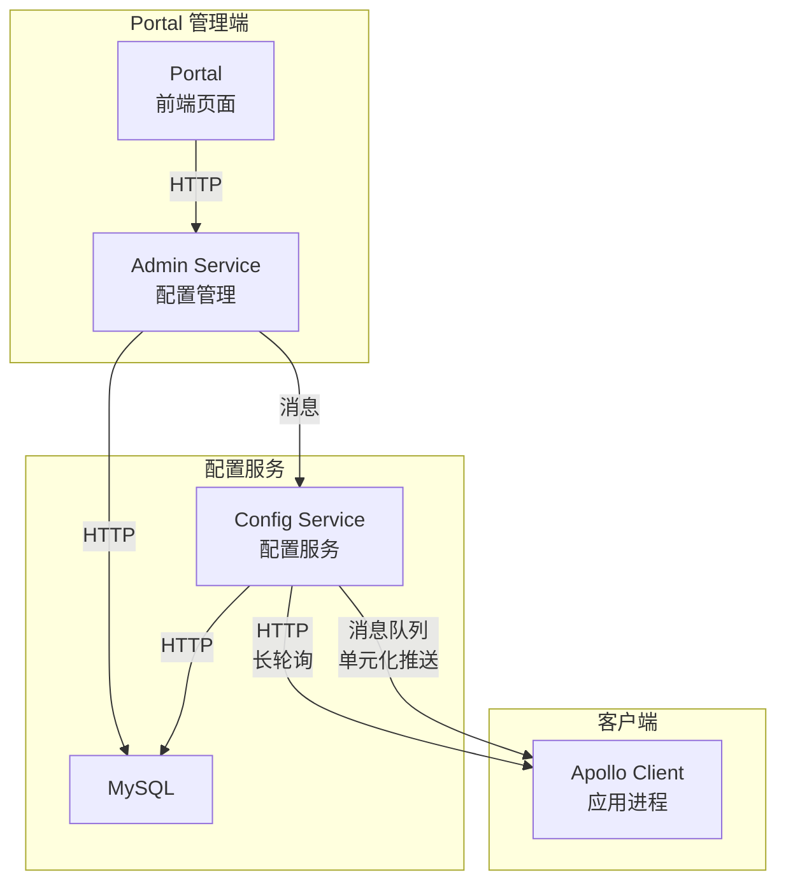

候选人小钱在面试某金融科技公司时，面试官看了他的项目经验"负责配置中心改造"，问道：

"你们用的什么配置中心？"

小钱说："Apollo。"

面试官追问："Apollo 有几个模块？Config Service 和 Admin Service 是干什么的？"

小钱说："Config Service 是提供配置查询的...Admin Service 是管理的..."

面试官追问："那配置变更的时候，是服务端推送还是客户端拉取的？"

小钱说："好像是推送..."

面试官说："是客户端拉取。推送是怎么实现的？"

小张答不上来了。

【面试官心理】
这道题我用来区分"用过"和"理解过"配置中心的候选人。Apollo 的四模块架构是基础，Config Service 推送 vs Client 拉取的组合才是精髓。大多数候选人只知道"Apollo 是配置中心"，不知道它的推送机制是通过消息队列实现的。能讲清楚这个的，基本都有生产运维经验。

## 一、Apollo 四模块架构 🔴

### 1.1 四个模块的职责



**Config Service（配置服务）**：
- 负责向客户端提供配置读取服务
- 每次启动/配置变更时读取 MySQL 中的配置
- 同时承担消息通知的角色（通过消息队列推送变更）

**Admin Service（管理服务）**：
- 负责配置的增删改查（管理端）
- Portal 通过它来操作配置
- 配置发布后会发送消息到消息队列

**Portal（管理界面）**：
- 提供 Web UI 供运维人员管理配置
- 调用 Admin Service
- 支持多环境、多集群、多命名空间

**Client（客户端）**：
- 嵌入应用进程
- 负责从 Config Service 拉取配置
- 监听配置变更并回调刷新

### 1.2 核心数据库表

```sql
-- Apollo 的配置数据存储在 MySQL 中
-- 核心表：

-- 1. App：应用信息
CREATE TABLE App (
    AppId VARCHAR(64) PRIMARY KEY,
    Name VARCHAR(512),
    OwnerName VARCHAR(64),
    OwnerEmail VARCHAR(64)
);

-- 2. AppCluster：集群信息
-- 比如：dev 集群、prod 集群、beta 集群
CREATE TABLE AppCluster (
    AppId VARCHAR(64),
    ClusterName VARCHAR(64),
    PRIMARY KEY (AppId, ClusterName)
);

-- 3. Namespace：命名空间
-- 默认命名空间：application
-- 支持自定义命名空间：比如 db-config, redis-config
CREATE TABLE Namespace (
    AppId VARCHAR(64),
    ClusterName VARCHAR(64),
    NamespaceName VARCHAR(64),
    PRIMARY KEY (AppId, ClusterName, NamespaceName)
);

-- 4. Item：具体的配置项
-- key=value 形式存储
CREATE TABLE Item (
    AppId VARCHAR(64),
    ClusterName VARCHAR(64),
    NamespaceName VARCHAR(64),
    KEY VARCHAR(128),
    VALUE TEXT,
    DataChange_LastModifiedBy VARCHAR(64),
    DataChange_LastModifiedTime TIMESTAMP,
    PRIMARY KEY (AppId, ClusterName, NamespaceName, KEY)
);

-- 5. Release：配置发布记录
-- 每次发布生成一条记录，客户端通过版本号判断是否需要更新
CREATE TABLE Release (
    ReleaseId BIGINT PRIMARY KEY AUTO_INCREMENT,
    AppId VARCHAR(64),
    ClusterName VARCHAR(64),
    NamespaceName VARCHAR(64),
    ReleaseKey VARCHAR(64),
    ReleaseVersion INT,
    DataChange_CreatedTime TIMESTAMP
);
```

## 二、配置发布与推送机制 🔴

### 2.1 推送 vs 拉取：Apollo 的混合模式

这是 Apollo 设计的精髓。

```java
// 大多数配置中心的推送方式：
// 1. 客户端拉取（Pull）：简单，但延迟高，轮询开销大
// 2. 服务端推送（Push）：延迟低，但需要维护长连接，复杂

// Apollo 的方案：服务端推送 + 客户端拉取（长轮询）
// 核心思路：
// 1. 配置变更时，通过消息队列（Meta Server / 独立 MQ）通知客户端
// 2. 客户端收到通知后，主动拉取最新配置
// 3. 客户端平时使用长轮询维持"准推送"体验
```

```java
// 客户端的核心逻辑：Config Service 长轮询
public class RemoteConfigLongPollService {

    private static final int LONG_POLL_TIMEOUT = 30000; // 30秒

    // 客户端启动时，发起长轮询请求
    public void startLongPolling() {
        while (true) {
            try {
                // 携带配置的 MD5 值，发起长轮询
                // 如果配置没变化，Config Service 会 hold 住请求 30 秒
                // 如果配置变化或超时，立即返回
                Response response = httpClient.post(
                    configServerUrl + "/notifications/v2",
                    buildNotificationRequest(),     // 包含 namespace 的 md5
                    LONG_POLL_TIMEOUT               // 30秒超时
                );

                // 收到返回（无论是有变化还是超时）
                // 立即重新拉取所有配置
                List<Notification> notifications = response.getBody();

                for (Notification notification : notifications) {
                    if (notification.hasChanged()) {
                        // 配置变更，重新拉取
                        remoteConfigService.sync();
                    }
                }

            } catch (Exception e) {
                // 网络异常，等待后重试
                Thread.sleep(1000);
            }
        }
    }
}
```

### 2.2 配置发布的完整流程

```java
// 1. 运维人员在 Portal 页面发布配置
// POST /apps/{appId}/clusters/{clusterName}/namespaces/{namespaceName}/releases

// 2. Portal 调用 Admin Service
// Admin Service 将配置写入 MySQL
// INSERT INTO Release VALUES (...)

// 3. Admin Service 发送消息到消息队列
// 消息内容：AppId + Cluster + Namespace + ReleaseId
// topic: apollo-release-notification

// 4. Config Service 消费消息
// 遍历所有订阅了这个 Namespace 的客户端连接
// 逐个发送通知（通过 HTTP 或 gRPC）

// 5. 客户端收到通知
// 立即向 Config Service 拉取最新配置
// 比对 MD5，发现有变化
// 调用用户注册的回调函数，刷新配置
```

:::tip 💡
Apollo 的推送机制是"消息通知 + 客户端拉取"的组合。消息队列的作用是**通知**，真正的数据同步还是通过 HTTP 拉取。这样设计的好处：
1. 推送链路解耦：Config Service 不需要维护每个客户端的长连接
2. 数据可靠性：HTTP 拉取天然支持重试，数据不会丢失
3. 扩展性好：可以接入多个消息队列（Apollo 支持 RabbitMQ/RocketMQ）
:::

### 2.3 客户端的配置监听

```java
// 应用启动时注册配置监听
@Configuration
public class ApolloConfig {

    public static void main(String[] args) {
        Config appConfig = Config.get("application");

        // 监听整个 namespace 的变化
        appConfig.addChangeListener(changeEvent -> {
            for (String key : changeEvent.changedKeys()) {
                ConfigChange change = changeEvent.getChange(key);
                System.out.println("配置变更: " + key);
                System.out.println("  旧值: " + change.getOldValue());
                System.out.println("  新值: " + change.getNewValue());
            }
        });
    }
}

// Spring Boot 集成
// Apollo 会自动将配置注入到 @Value 或 @ConfigurationProperties
// 配置变更时，自动刷新（需要开启 auto-update-injected-spring-configuration-properties）
@ConfigurationProperties(prefix = "db")
public class DbConfig {
    private String host;
    private int port;

    // Apollo 会自动更新这些字段（无需重启应用）
}
```

:::warning ⚠️
Apollo 的自动刷新有局限：
1. `@Value` 注入的字段只有基本类型和 String 会自动刷新
2. `@ConfigurationProperties` 需要开启 `apollo.auto.update.injected.fields=true`
3. 静态字段不会自动刷新（需要手动处理）
4. 如果配置变更回调执行耗时过长，会阻塞其他监听器
:::

## 三、灰度发布与回滚 🔴

### 3.1 灰度发布流程

```java
// 灰度发布：先让部分实例加载新配置，其他实例保持旧配置
// 全量发布：所有实例都加载新配置

// 灰度发布的关键概念：
// - 灰度规则：哪些实例使用新配置（IP 匹配、标签匹配）
// - 灰度百分比：比如 10% 的实例

// Apollo 的灰度实现：
// 1. 发布时指定灰度规则
// 2. 创建两条 Release 记录：
//    - 灰度 Release：针对灰度实例
//    - 主 Release：针对非灰度实例
// 3. 灰度实例拉取灰度 Release
// 4. 非灰度实例拉取主 Release

// 灰度生效后，可以"全量发布"：
// 将灰度 Release 合并到主 Release
// 所有实例都使用新配置
```

### 3.2 灰度回滚

```java
// 回滚的两种方式：
// 1. 取消灰度：将灰度 Release 删除，灰度实例回退到主 Release
// 2. 回滚主 Release：将主 Release 回退到上一个版本

// Apollo 的 Release 版本不可修改，只能"回退到旧版本"
// 实现方式：发布一个新 Release，内容是回退版本的数据

// 回滚示例：
// 当前 Release: v3 (内容是 C)
// 回退到 v1 (内容是 A)
// Apollo 创建一个新的 Release v4，内容 = v1 的内容
```

## 四、多环境与权限管理 🔴

### 4.1 四级结构

```java
// Apollo 的配置层级结构：
// App -> Environment -> Cluster -> Namespace

// 1. App（应用）：最顶层，代表一个微服务或应用
// 2. Environment（环境）：DEV、UAT、PROD 三个标准环境
//    每个环境有独立的 Config Service 和数据库
// 3. Cluster（集群）：同一个环境内的不同集群
//    比如：PROD + 北京机房、PROD + 上海机房
// 4. Namespace（命名空间）：配置分组
//    默认：application（应用配置）
//    自定义：db-config、redis-config、feature-flags

// 优先级（高到低）：
// 环境 > 集群 > 命名空间
// 精确匹配 > 默认值
```

### 4.2 权限管理

```java
// Apollo 的权限模型：
// 1. 管理员（Owner）：拥有应用的所有权限，可以发布配置
// 2. 编辑者（Editor）：可以修改配置，但不能发布
// 3. 查看者（Viewer）：只能查看配置

// 特殊权限：Apollo 支持配置发布审批流程
// 需要管理员审批后才能发布到 PROD 环境

// 配置授权：
// Apollo 支持将某个 Namespace 的权限单独授予某个用户
// 比如：只给 DBA 团队授予 db-config Namespace 的权限
```

## 五、三大配置中心对比 🟡

| 维度 | Apollo | Nacos | Spring Cloud Config |
| --- | --- | --- | --- |
| 推送机制 | 长轮询 + 消息队列 | 长轮询（HTTP） | Git Webhook（需要配合 Bus） |
| 架构复杂度 | 高（4个模块） | 低（单进程） | 中（需要 Git + Eureka） |
| 多环境 | 原生支持（多环境独立部署） | 命名空间隔离 | profiles 隔离 |
| 灰度发布 | 支持（规则灰度） | 支持（权重灰度） | 不支持 |
| 管理界面 | 自带 Web UI | 自带 Web UI | 无（需要自建） |
| 多语言 | 支持（HTTP 接口） | 支持（HTTP/gRPC） | 依赖 Spring Cloud |
| 存储 | MySQL | MySQL/Derby | Git（本地或远程） |
| 适用规模 | 中大型 | 中小型 | 中小型（Java 技术栈） |

【面试官心理】
问到三大配置中心对比的候选人，说明他有技术选型的意识。我会追问："你们当时为什么选 Apollo 而不是 Nacos？"能说出"灰度发布"和"权限管理"需求的，通常是经历过实际痛点的。

## 六、生产避坑指南 🔴

### ❌ 翻车点一：配置变更后应用没有重启但部分配置没有生效

```java
// ❌ 问题：Apollo 配置变了，但某些 Bean 的配置没有刷新
// 原因：Bean 已经初始化完成，@Value 字段已经被注入

// ✅ 解决方案：
// 1. 手动监听配置变更，重新初始化 Bean
@Configuration
public class ConfigRefresh implements ApplicationContextAware {

    private ApplicationContext applicationContext;

    @Override
    public void setApplicationContext(ApplicationContext applicationContext) {
        this.applicationContext = applicationContext;
    }

    @ApolloConfigChangeListener
    private void onChange(ConfigChangeEvent event) {
        for (String key : event.changedKeys()) {
            if (key.startsWith("db.")) {
                // 重新初始化数据库配置 Bean
                applicationContext.getBean(DatabaseConfig.class).refresh();
            }
        }
    }
}

// 2. 使用 @RefreshScope（Spring Cloud 生态）
@RefreshScope
@Configuration
@ConfigurationProperties(prefix = "db")
public class DatabaseConfig {
    private String host;
    private int port;
    // Apollo 会自动刷新这些字段
}
```

### ❌ 翻车点二：本地开发环境和测试环境配置混淆

```java
// ❌ 问题：本地 IDEA 启动时，Apollo 连接到了测试环境
// 原因：没有正确配置 meta server 地址

// ✅ 正确配置：
// 通过 JVM 参数指定
// -Dapollo.meta=http://apollo-config-test:8080
// -Dapollo.env=DEV

// 或通过配置文件
// META-INF/app.properties
// app.id=order-service
// apollo.meta=http://apollo-config-dev:8080
```

### ❌ 翻车点三：客户端启动时配置不可用导致服务启动失败

```java
// ❌ 问题：Apollo 配置拉取失败，Config Service 不可用
// 应用启动直接报错退出

// ✅ 解决方案：配置启动失败容忍度
// apollo.configService.startup.timeout = 3000  # 启动超时 3 秒
// apollo.configService.startup.retry = 3         # 重试 3 次

// 或者使用本地缓存
// 配置变更时会同步一份到本地文件
// 启动时优先读取本地文件
@Configuration
public class ApolloLocalCache {
    @Bean
    public ConfigFile configFile() {
        // 使用本地缓存文件
        // /opt/data/apollo-config-cache/{appId}/{cluster}/{namespace}
        return ConfigFile.of("application", "json",
            new LocalFileConfigRepository("application"));
    }
}
```

## 七、面试追问链 🟡

### 追问一：Apollo 的 Meta Server 是什么？

【面试官心理】
问这个问题的面试官，通常想确认候选人对 Apollo 整体架构的理解深度。Meta Server 扮演了"服务发现"的角色，解决了 Config Service 的地址发现问题。

Meta Server 是 Config Service 的网关，职责：
1. 提供 Config Service 的地址发现（类似 Eureka）
2. 客户端通过 Meta Server 获取 Config Service 的地址
3. 本身是无状态的，可以水平扩展

```
客户端 -> Meta Server -> Config Service 列表 -> 选择一个 -> 获取配置
```

### 追问二：配置变更的延迟是多少？

【面试官心理】
能说出"秒级"的候选人，说明他测试过实际延迟。我会继续追问："如果客户端和 Config Service 之间网络抖动，配置变更通知会丢失吗？"能回答出"不会，因为有长轮询兜底"的，说明他理解透了 Apollo 的推送机制。

Apollo 的配置变更推送延迟：
- 理想情况：1-2 秒（消息队列 + 长轮询）
- 网络抖动：最多 35 秒（长轮询 30 秒 + 重试延迟）
- 极端情况：取决于客户端的重试策略和超时配置
