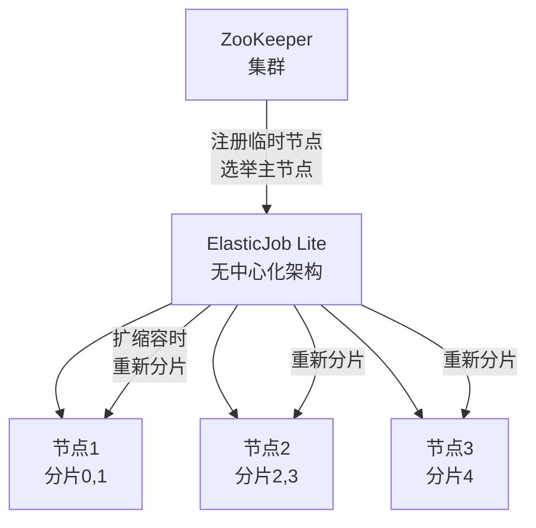
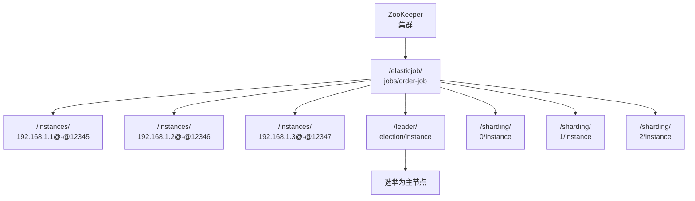

候选人小刘在面试某电商公司时，面试官看了他的项目经验中"负责数据同步任务"，问道：

"你们数据同步用了什么方案？定时任务怎么分片的？"

小刘说："我们用的 XXL-JOB 做定时任务，分片...就是按 ID 取模分的。"

面试官追问："那 ElasticJob 了解吗？它的分片是怎么实现的？"

小刘说："好像用到了 ZooKeeper..."

面试官追问："ZooKeeper 在里面具体干什么？重新分片的时候发生了什么？"

小刘彻底卡住了。

【面试官心理】
这道题我用来区分"用过调度框架"和"理解过分布式协调"的候选人。ElasticJob 的设计比 XXL-JOB 更轻量，但 ZooKeeper 的引入让它在分布式协调方面更强大。能讲清楚 ZooKeeper 临时节点和主节点选举的，至少对分布式协调有基本认知。

## 一、为什么需要 ElasticJob 🔴

### 1.1 XXL-JOB 和 Quartz 的瓶颈

在分布式场景下，XXL-JOB 和 Quartz 都有各自的局限：

```java
// XXL-JOB 的问题：
// 1. 调度中心是单点（社区版），挂了就没有新任务触发了
// 2. 路由策略虽然是"分片广播"，但分片参数是由调度中心计算的
//    执行器只是被动接收，没有真正的"自主分片"能力
// 3. 没有 ZooKeeper，所有协调都依赖数据库

// Quartz 集群的问题：
// 1. 通过数据库锁抢任务，节点多了锁竞争严重
// 2. 没有分片能力，只能通过业务代码自己写分片逻辑
// 3. 数据库成为性能瓶颈
```

### 1.2 ElasticJob 的设计哲学

ElasticJob 的核心理念：**让每个分片任务尽可能均匀地分布到各个节点，并且能够动态扩缩容。**



ElasticJob 分为两个版本：
- **ElasticJob-Lite**：轻量级，无中心化架构，嵌入应用进程
- **ElasticJob-Cloud**：云原生版本，支持更复杂的资源调度（Mesos）

这里重点讲 **ElasticJob-Lite**。

## 二、分片机制核心原理 🔴

### 2.1 分片键的定义

```java
// ElasticJob 的分片通过 shardingItemParameters 配置
// 每个分片用逗号分隔，格式为：分片序号=描述

@JobSharding("${myjob.shardingItems}")
public class MyJob implements SimpleJob {

    @Override
    public void execute(ShardingContext shardingContext) {
        // shardingContext.getShardingItemList() 返回当前节点负责的分片序号
        // 比如 [0, 1] 表示当前节点负责分片0和分片1
        List<Integer> shards = shardingContext.getShardingItemList();
        for (Integer shard : shards) {
            // 根据分片序号处理不同的数据范围
            processByShard(shard);
        }
    }
}

// 配置文件
myjob:
  shardingItemParameters: |
    0=北京,天津,河北
    1=上海,江苏,浙江
    2=广东,福建,海南
```

### 2.2 默认分片策略：AverageAllocationJobShardingStrategy

```java
// ElasticJob 默认的分片策略
// 核心逻辑：将 n 个分片均匀分配给 m 个节点

// 示例：3 个分片，2 个节点
// 节点1：分片 0
// 节点2：分片 1, 2

// 示例：4 个分片，3 个节点
// 节点1：分片 0, 3
// 节点2：分片 1
// 节点3：分片 2

// 关键代码逻辑：
public static Map<JobInstance, List<Integer>> sharding(
        List<JobInstance> jobInstances, // 在线节点列表
        int shardingTotalCount,         // 总分片数
        String shardingItemParameters) {// 分片参数

    Map<JobInstance, List<Integer>> result = new LinkedHashMap<>();

    // 先将每个分片平均分配
    for (int i = 0; i < shardingTotalCount; i++) {
        int jobInstanceIndex = i % jobInstances.size();  // 取模分配
        List<Integer> shardingItems = result.getOrDefault(
            jobInstances.get(jobInstanceIndex), new ArrayList<>());
        shardingItems.add(i);
        result.put(jobInstances.get(jobInstanceIndex), shardingItems);
    }

    return result;
}
```

**平均分配的缺陷：**

```java
// ❌ 问题：按平均分配，如果分片0是热点数据
// 节点1只拿到1个分片，节点2拿到2个分片
// 但节点1的分片0数据量是节点2的10倍
// 负载严重不均

// ✅ 解决方案：自定义分片策略
public class HotRegionShardingStrategy implements JobShardingStrategy {

    @Override
    public Map<JobInstance, List<Integer>> sharding(
            List<JobInstance> jobInstances,
            JobConfiguration jobConfiguration) {

        // 根据数据量动态调整分片分配
        // 比如：热点地区（北上广）分配更多分片
        // 非热点地区（西藏/新疆）分配更少分片

        Map<JobInstance, List<Integer>> result = new HashMap<>();
        // 自定义逻辑...
        return result;
    }
}
```

### 2.3 分片广播 vs 分片执行

ElasticJob 的分片广播和其他调度框架不同：

```java
// ElasticJob 的分片是"每个节点只执行自己分配到的分片"
// 不存在"所有节点都执行所有分片"的模式

// 场景：10个分片，3个节点
// 节点1：分片 0, 3, 6, 9
// 节点2：分片 1, 4, 7
// 节点3：分片 2, 5, 8

// 每个节点只查询并处理自己分片范围内的数据
// 这就天然避免了数据重复处理的问题

// 典型的分片查询：
@Bean
public DataSource dataSource() {
    // ...
}

public class OrderSyncJob implements SimpleJob {
    @Override
    public void execute(ShardingContext shardingContext) {
        List<Integer> shards = shardingContext.getShardingItemList();
        int shardingTotal = shardingContext.getShardingTotalCount();

        for (Integer shard : shards) {
            // 按分片分页查询
            // SELECT * FROM orders
            // WHERE status = 0
            // AND mod(id, #{shardingTotal}) = #{sharding}
            // LIMIT #{pageSize} OFFSET #{offset}

            List<Order> orders = orderMapper.selectBySharding(shard, shardingTotal);
            for (Order order : orders) {
                syncOrder(order);
            }
        }
    }
}
```

## 三、ZooKeeper 协调原理 🔴

### 3.1 ZooKeeper 在 ElasticJob 中的角色

这是 ElasticJob 和 XXL-JOB 最大的架构差异。

```java
// ElasticJob 使用 ZooKeeper 做三件事：
// 1. 注册节点：每个执行器启动时在 ZooKeeper 创建临时节点
// 2. 主节点选举：多个执行器竞争创建同一个临时节点，成功者为主节点
// 3. 分片信息存储：分片分配结果存储在 ZooKeeper 的持久化节点中
```



### 3.2 临时节点与主节点选举

```java
// ElasticJob 的主节点选举使用 ZooKeeper 的临时顺序节点
// 核心逻辑：谁先创建节点，谁就是主节点

// 执行器启动时
public class JobInstance {
    private final String instanceId; // 格式：IP@JobName@随机数

    public void register() {
        // 在 ZooKeeper 中创建临时节点
        // 路径：/elasticjob/{jobName}/leader/election/{instanceId}
        // ZooKeeper 保证同一时刻只有一个节点能创建成功

        // 成功创建 -> 当前节点为主节点
        // 创建失败 -> 当前节点为从节点，注册 watcher 监听主节点变化
    }
}

// 主节点的职责：
// 1. 触发重新分片
// 2. 转移分片（节点下线时）
// 3. 清理过期的任务执行记录
// 4. 处理 Misfire
```

### 3.3 分片信息的存储与监听

```java
// 分片信息存储在 ZooKeeper 的持久化节点中
// 路径：/elasticjob/{jobName}/sharding/{分片序号}/instance
// 内容：{instanceId}

// 重新分片流程（主节点触发）：
// 1. 先将所有分片标记为 DISABLED（禁用）
// 2. 等待正在执行的任务完成（最多等待 10 分钟）
// 3. 根据新的节点数量，重新计算分片分配
// 4. 更新 ZooKeeper 中的分片节点
// 5. 各节点收到变更通知，自动切换到新的分片

// 关键：先禁后启，确保数据一致性
```

:::warning ⚠️
重新分片期间，所有任务执行会被暂停。如果你的业务要求7x24小时不间断，这个"先禁后启"的过程可能导致数据处理延迟。需要评估重新分片的频率和业务容忍度。
:::

### 3.4 ZooKeeper 节点下线与故障转移

```java
// 节点主动下线：
// 1. 执行器调用 scheduler.shutdown()
// 2. ZooKeeper 临时节点自动删除
// 3. 主节点检测到节点消失，重新分配分片

// 节点异常下线（断网/进程崩溃）：
// 1. ZooKeeper 临时节点在 session 超时后自动删除（默认 30 秒）
// 2. 主节点通过心跳检测发现节点消失
// 3. 重新分配该节点的分片

// 分片转移时，丢失中的任务怎么办？
// ElasticJob 不保证任务不丢失
// 建议：
// 1. 任务本身要做幂等
// 2. 使用带事务的数据库更新（状态机）
// 3. 或者接受"最多处理一次"的语义
```

## 四、弹性扩缩容 🟡

### 4.1 动态增加节点

```java
// 场景：双十一零点，从 3 个节点扩展到 10 个节点

// 步骤：
// 1. 启动新的执行器进程
// 2. 新节点在 ZooKeeper 注册临时节点
// 3. 现有节点通过 watcher 感知到新节点
// 4. 主节点触发重新分片
// 5. 每个节点重新分配到更少的分片
// 6. 处理压力大幅降低

// 扩缩容的时机由主节点控制
// 不是每次节点变化都触发重新分片
// 有以下配置可以控制：

// shardingStrategyType: 分片策略类型
// reconcileIntervalMinutes: 重新分片的检查间隔（默认 10 分钟）
// maxTimeDiffSeconds: 最大时间误差（超过这个误差会触发重新分片，默认 -1 表示不检查）
```

### 4.2 数据倾斜问题

```java
// ❌ 问题：静态分片参数无法应对数据热点
// 固定的分片参数：
// 0=北京,天津,河北
// 1=上海,江苏,浙江
// 2=广东,福建,海南

// 但广东的数据量是其他省份的10倍！
// 分片2永远是最慢的那个

// ✅ 解决方案1：按数据量动态分片
// 在 Job 中实时计算每个分片的数据量
// 通过 ZooKeeper 协调动态调整

// ✅ 解决方案2：自定义分片参数
// 使用时间范围或 ID 范围作为分片键
// 比如：按日期分片 0=2024-01, 1=2024-02, 2=2024-03
```

## 五、作业监控与事件追踪 🟡

### 5.1 JobEventConfiguration

```java
// ElasticJob 支持作业执行事件的追踪
// 通过 JobEventConfiguration 配置事件总线

@Configuration
public class ElasticJobConfiguration {

    @Autowired
    private DataSource dataSource;

    @Bean
    public ElasticJobConfiguration elasticJobConfiguration() {
        return reg -> reg
            .jobScheduler("myJob",
                new SpringJobScheduler(
                    new MyJob(),
                    createDataflowJobConfiguration(),
                    createJobEventConfig()))
            ..globalConfiguration(
                new RegistryCenterConfiguration(
                    new ZooKeeperRegistryCenter(zkConfig)));
    }

    @Bean
    public JobEventConfiguration createJobEventConfig() {
        // 使用数据库存储作业事件
        return new JobEventRdbConfiguration(dataSource);
    }
}

// JobEvent 包含的事件类型：
// - CLOUD_JOB_EXECUTION_STATISTICS：作业执行统计
// - CLOUD_JOB_STATUS_TRACE：作业状态追踪
// - CLOUD_JOB_MISFIRE：Misfire 记录
// - CLOUD_JOB_STATUS_TRACE_LISTENER：状态变更监听
```

### 5.2 监控数据的使用

```java
// 作业执行完成后的统计数据：
// - 作业名称、执行节点、分片序号
// - 开始时间、结束时间、执行时长
// - 执行结果（成功/失败）、错误信息
// - Misfire 次数、错过触发次数

// 可以用于：
// 1. 告警：执行失败超过阈值自动告警
// 2. 告警：执行时间过长（比如超过预期5倍）自动告警
// 3. 监控：实时查看作业执行状态和分布
// 4. 审计：记录每个作业的执行历史
```

## 六、ElasticJob vs XXL-JOB 🟡

| 维度 | ElasticJob Lite | XXL-JOB |
| --- | --- | --- |
| 架构 | 无中心化（依赖 ZooKeeper） | 中心化（调度中心 + 执行器） |
| 分片协调 | ZooKeeper 实时协调 | 调度中心计算，HTTP 触发 |
| 节点注册 | ZooKeeper 临时节点 | 调度中心数据库注册 |
| 主节点 | ZooKeeper 选举 | 调度中心本身 |
| 依赖 | 需要 ZooKeeper 集群 | 需要 MySQL |
| 运维复杂度 | 高（ZooKeeper 集群） | 低（MySQL + Web 服务） |
| 分片粒度 | 节点级别（每个节点知道自己的分片） | 任务级别（调度中心分配） |
| 适用规模 | 中大型（已有 ZooKeeper） | 中小型（运维简单） |

【面试官心理】
问到 ElasticJob vs XXL-JOB 的候选人，说明他有技术选型的经验。我会继续追问："如果让你们在 ElasticJob 和 XXL-JOB 之间选，你们选哪个？为什么？"能权衡出"运维复杂度"和"功能完整性"的候选人，通常有实际的架构决策经验。

## 七、常见翻车现场 🔴

### ❌ 翻车点一：重新分片导致数据重复

```java
// ❌ 错误：没有考虑重新分片时的状态一致性
@Bean
public SimpleJob myJob() {
    return shardingContext -> {
        List<Integer> shards = shardingContext.getShardingItemList();
        // 每次分片变化后，都从头开始处理
        // 没有记录处理位置，导致重新分片后数据重复
        List<Order> orders = orderMapper.selectAll();
        for (Order order : orders) {
            syncOrder(order);
        }
    };
}

// ✅ 正确：使用分片上下文中的偏移量，或者数据库状态标记
@Bean
public SimpleJob myJob() {
    return shardingContext -> {
        List<Integer> shards = shardingContext.getShardingItemList();
        // 使用分片参数中的范围，避免重复
        // 或者通过数据库状态（status=1 表示已处理）保证幂等
        long offset = getOffsetFromRedis(shardingContext.getShardingParameter());
        List<Order> orders = orderMapper.selectByShardingWithOffset(shards, offset);
        for (Order order : orders) {
            syncOrder(order);
            updateOffset(order.getId());
        }
    };
}
```

### ❌ 翻车点二：ZooKeeper 集群故障导致调度不可用

```java
// ❌ 错误：单 ZooKeeper 集群，没有高可用
// 如果 ZooKeeper 集群不可用
// 所有 ElasticJob 节点都无法获取分片信息
// 整个调度系统瘫痪

// ✅ 正确：ZooKeeper 集群高可用
// ZooKeeper 集群至少 3 个节点，部署在不同的机架/机房
// 配置重试策略
RegistryCenterConfiguration config = new RegistryCenterConfiguration();
config.setConnectionTimeoutMilliseconds(3000);
config.setSessionTimeoutMilliseconds(60000);
config.setMaxRetries(3);
```
