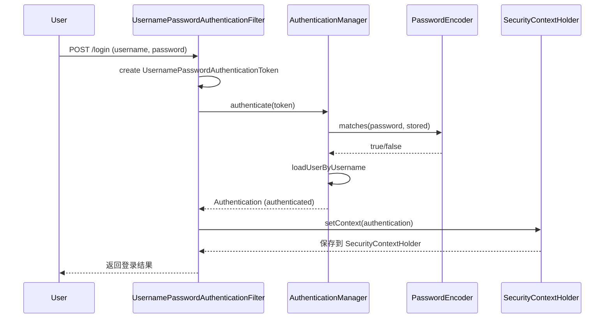
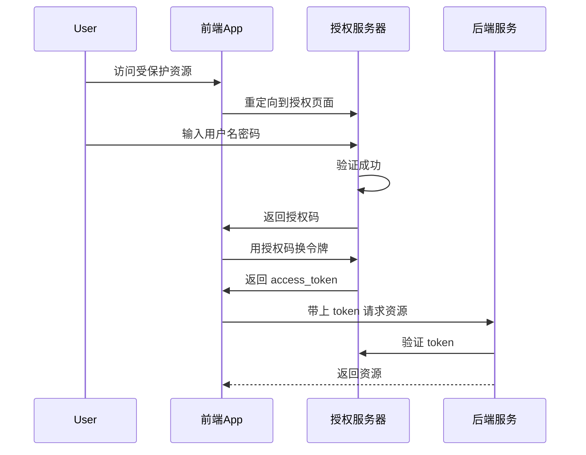

# Spring Security 与 Validation

候选人小李面试时被问到："Spring Security 是怎么做认证的？"

他回答："用 SecurityFilterChain，过滤器链..."面试官追问："UsernamePasswordAuthenticationFilter 做了什么？Authentication 对象的结构是什么？"

小李支支吾吾，说不清楚。

【面试官心理】
我问他认证流程，不是想听他背过滤器名字。我想知道的是：他有没有真正理解 Spring Security 的设计理念，能不能说清楚"认证"和"授权"的区别，以及在生产环境里是怎么做权限控制的。

---

## 一、Spring Security 认证 🔴

### 1.1 问题拆解

**第一层：怎么用？**
面试官问："Spring Security 的认证流程是什么？"
候选人答："用过滤器链..."（太笼统）

**第一层：核心组件**
面试官追问："Authentication 接口的结构是什么？SecurityContext 怎么工作的？"
候选人答：...（核心概念）

**第三层：密码加密**
面试官追问："BCryptPasswordEncoder 是怎么加密的？为什么慢？"
候选人答：...（P6 分水岭）

### 1.2 标准回答

**Authentication 接口结构**：

```java
public interface Authentication extends Serializable {
    // 主要凭证：通常用户名/密码
    Object getCredentials();

    // 认证请求的细节：IP、SessionId 等
    Object getDetails();

    // 主要身份：通常用户名或 UserDetails
    Object getPrincipal();

    // 已授权的权限列表
    Collection<? extends GrantedAuthority> getAuthorities();

    // 是否已认证
    boolean isAuthenticated();

    // 设置认证状态
    void setAuthenticated(boolean isAuthenticated);
}
```

**认证流程时序图**：



**Spring Security 过滤器链**：

| 过滤器 | 顺序 | 作用 |
| --- | --- | --- |
| SecurityContextPersistenceFilter | 1 | 从 Session 恢复 SecurityContext |
| WebAsyncManagerIntegrationFilter | 2 | 异步请求上下文集成 |
| HeaderWriterFilter | 3 | 添加安全响应头 |
| CsrfFilter | 4 | CSRF 防护 |
| LogoutFilter | 5 | 处理登出 |
| UsernamePasswordAuthenticationFilter | 6 | 用户名密码认证 |
| RequestCacheAwareFilter | 7 | 缓存请求 |
| SecurityContextHolderAwareRequestFilter | 8 | 包装请求 |
| AnonymousAuthenticationFilter | 9 | 匿名认证 |
| SessionManagementFilter | 10 | Session 管理 |
| ExceptionTranslationFilter | 11 | 异常转换 |
| FilterSecurityInterceptor | 12 | 权限校验 |

**密码加密方案对比**：

```java
// 不推荐的方案
// MD5（已破解）：不安全，不应使用
PasswordEncoder md5 = new StandardPasswordEncoder("salt");
String md5Hash = md5.encode("password");  // 不安全！

// SHA-256：比 MD5 好，但不够慢，容易被 GPU 暴力破解
PasswordEncoder sha256 = new StandardPasswordEncoder("salt");
String sha256Hash = sha256.encode("password");

// BCrypt：专为密码设计，慢 + 加盐
PasswordEncoder bcrypt = new BCryptPasswordEncoder();
String bcryptHash = bcrypt.encode("password");
boolean matches = bcrypt.matches("password", bcryptHash);
// BCrypt 工作因子默认 10，可以调整到 12-14 更安全
```

:::warning ⚠️
密码加密的坑：
1. **MD5/SHA 不安全**：彩虹表攻击，几秒钟破解
2. **BCrypt 要设足够的工作因子**：默认 10，建议生产环境设 12+
3. **不要自己实现加密**：用业界标准库

Spring Security 5 推荐 BCrypt，这是目前密码存储的标准。
:::

---

## 二、Spring Security 授权 🔴

### 2.1 问题拆解

**第一层：怎么用？**
面试官问："Spring Security 怎么做权限控制？"
候选人答："用 @PreAuthorize..."（基本使用）

**第二层：原理**
面试官追问："@PreAuthorize 和 @Secured 有什么区别？WebSecurityConfigurerAdapter 怎么配置？"
候选人答：...（配置方式）

**第三层：OAuth2**
面试官追问："OAuth2 的四种授权模式是什么？什么场景用哪种？"
候选人答：...（P6/P7 分水岭）

### 2.2 标准回答

**权限控制方式**：

```java
// 方式一：@PreAuthorize（支持 SpEL）
@PreAuthorize("hasRole('ADMIN') and hasAuthority('USER_WRITE')")
public User updateUser(User user) {
    return userService.update(user);
}

// 方式二：@Secured（简单，但不能 SpEL）
@Secured({"ROLE_ADMIN", "ROLE_USER"})
public User getUser(Long id) {
    return userService.getById(id);
}

// 方式三：方法级别安全配置
@Configuration
@EnableMethodSecurity(prePostEnabled = true, securedEnabled = true)
public class SecurityConfig {
    // 默认配置
}
```

**OAuth2 四种授权模式**：

| 模式 | 场景 | 安全性 |
| --- | --- | --- |
| 授权码模式 | 有后端的 Web 应用 | 最高 |
| 简化模式 | 纯前端 SPA | 中等 |
| 密码模式 | 可信任的第一方应用 | 低 |
| 客户端模式 | 微服务间调用 | 低 |

**授权码模式流程**：



**JWT 结构**：

```java
// JWT 三部分：Header.Payload.Signature
public class JwtTokenProvider {
    @Autowired
    private JwtConfig jwtConfig;

    // 生成 Token
    public String generateToken(Authentication auth) {
        Map<String, Object> claims = new HashMap<>();
        claims.put("roles", auth.getAuthorities().stream()
            .map(GrantedAuthority::getAuthority)
            .collect(Collectors.toList()));
        claims.put("userId", getUserId(auth));

        return Jwts.builder()
            .setClaims(claims)
            .setSubject(auth.getName())
            .setIssuedAt(new Date())
            .setExpiration(new Date(System.currentTimeMillis() + jwtConfig.getExpiration()))
            .signWith(Keys.hmacShaKeyFor(jwtConfig.getSecret().getBytes()))
            .compact();
    }

    // 验证 Token
    public boolean validateToken(String token) {
        try {
            Jwts.parserBuilder()
                .setSigningKey(Keys.hmacShaKeyFor(jwtConfig.getSecret().getBytes()))
                .build()
                .parseClaimsJws(token);
            return true;
        } catch (JwtException e) {
            return false;
        }
    }
}
```

【面试官心理】
我追问他 OAuth2 和 JWT，是想看他有没有实际做过认证授权相关的项目。能说清四种授权模式适用场景的，基本都有过安全开发经验。

---

## 三、Spring Validation 校验 🔴

### 3.1 问题拆解

**第一层：怎么用？**
面试官问："@Validated 和 @Valid 有什么区别？"
候选人答："都是做参数校验..."（开始混淆）

**第二层：分组校验**
面试官追问："分组校验怎么用？什么场景需要？"
候选人答：...（进阶用法）

**第三层：自定义校验**
面试官追问："怎么自定义校验注解？"
候选人答：...（P6 分水岭）

### 3.2 标准回答

**@Validated vs @Valid**：

```java
// @Valid：标准 Bean Validation 注解
public class User {
    @NotNull(message = "用户名不能为空")
    private String username;
}

// @Validated：Spring 的分组校验扩展
@RestController
@Validated  // 开启方法级别校验
public class UserController {

    @PostMapping("/user")
    // @Valid 嵌套校验
    public User create(@Valid @RequestBody User user) {
        return userService.create(user);
    }

    // 分组校验
    @PutMapping("/user")
    public User update(@Validated({UpdateGroup.class}) @RequestBody User user) {
        return userService.update(user);
    }
}
```

**分组校验示例**：

```java
// 定义分组
public interface CreateGroup {
    // 创建时的校验分组
}
public interface UpdateGroup {
    // 更新时的校验分组
}

// 实体中使用分组
public class User {
    @NotBlank(groups = {CreateGroup.class})  // 创建时必填
    @Null(groups = {UpdateGroup.class})       // 更新时必须为空
    private String id;

    @NotBlank(message = "用户名不能为空")
    private String username;

    @Min(value = 0, message = "年龄不能小于0")
    @Max(value = 150, message = "年龄不能超过150")
    private Integer age;
}
```

**自定义校验注解**：

```java
// 第一步：定义注解
@Target({ElementType.FIELD, ElementType.PARAMETER})
@Retention(RetentionPolicy.RUNTIME)
@Constraint(validatedBy = PhoneValidator.class)
public @interface Phone {
    String message() default "手机号格式不正确";
    Class<?>[] groups() default {};
    Class<? extends Payload>[] payload() default {};
}

// 第二步：实现校验器
public class PhoneValidator implements ConstraintValidator<Phone, String> {
    // 手机号正则：1开头 + 10位数字
    private static final Pattern PHONE_PATTERN = Pattern.compile("^1[3-9]\\d{9}$");

    @Override
    public void initialize(Phone constraintAnnotation) {
        // 初始化
    }

    @Override
    public boolean isValid(String value, ConstraintValidatorContext context) {
        if (value == null || value.isEmpty()) {
            return true;  // null 由 @NotNull 控制
        }
        return PHONE_PATTERN.matcher(value).matches();
    }
}

// 第三步：使用
public class User {
    @Phone
    private String phone;
}
```

【面试官心理】
我追问他自定义校验注解，是想看他有没有扩展过 Validation 框架。能写出一个自定义注解的，基本都有过"框架不满足业务需求"的实战经验。

### 3.3 生产避坑

:::warning ⚠️
Validation 常见踩坑点：
1. **嵌套校验**：必须在嵌套对象上加 `@Valid`，否则内层对象不校验
2. **分组顺序**：默认不保证校验顺序，如果需要顺序，用 `@GroupSequence`
3. **全局异常**：校验失败会抛出 `MethodArgumentNotValidException`，需要全局处理
4. **分页参数**：分页的 page、size 不用校验，但自定义参数需要

```java
// 全局异常处理
@RestControllerAdvice
public class GlobalExceptionHandler {
    @ExceptionHandler(MethodArgumentNotValidException.class)
    public Result<?> handleValidation(MethodArgumentNotValidException e) {
        List<String> errors = e.getBindingResult().getFieldErrors().stream()
            .map(FieldError::getDefaultMessage)
            .collect(Collectors.toList());
        return Result.fail(400, errors.toString());
    }
}
```
:::

---

## 四、Security 生产问题 🟡

### 4.1 问题拆解

**第一层：常见问题**
面试官问："遇到过什么 Security 相关的问题？"
候选人答："JWT 过期..."（简单回答）

**第二层：细节追问**
面试官追问："Token 过期了怎么处理？Refresh Token 怎么用？"
候选人答：...（实战问题）

**第三层：方案设计**
面试官追问："如果让你设计一个无感知的 Token 刷新机制，怎么做？"
候选人答：...（P7 拉开差距）

### 4.2 标准回答

**Token 刷新方案**：

```java
public class JwtAuthService {
    @Autowired
    private JwtConfig jwtConfig;

    // Access Token 过期但 Refresh Token 有效
    public AuthResult refreshToken(String refreshToken) {
        // 1. 验证 Refresh Token
        if (!validateRefreshToken(refreshToken)) {
            throw new AuthException("Refresh token 无效");
        }

        // 2. 获取用户信息
        String userId = getUserIdFromRefreshToken(refreshToken);
        User user = userService.findById(userId);

        // 3. 生成新的 Access Token
        String newAccessToken = generateAccessToken(user);

        // 4. 可选：Rotation - 生成新的 Refresh Token
        String newRefreshToken = generateRefreshToken(user);

        return new AuthResult(newAccessToken, newRefreshToken);
    }
}
```

:::tip 💡
Token 刷新的最佳实践：
1. **Access Token 短有效期**：15 分钟 - 1 小时
2. **Refresh Token 长有效期**：7 - 30 天
3. **Refresh Token Rotation**：每次刷新生成新的 Refresh Token，旧 token 作废
4. **Refresh Token 存储**：用 HttpOnly Cookie，比 LocalStorage 更安全
:::

---

## 五、学习路径指引

| 级别 | 重点 | 期望回答 |
| --- | --- | --- |
| P5 | 基本配置、认证流程 | 能说清过滤器链 |
| P6 | 密码加密、分组校验、自定义注解 | 能回答追问 |
| P7 | OAuth2、JWT 刷新机制、方案设计 | 有实战经验 |

---

## 六、生产避坑总结

| 场景 | 问题 | 解决方案 |
| --- | --- | --- |
| CSRF | 前后端分离关闭 CSRF 导致安全风险 | 确认是否真的需要关闭 |
| 密码明文 | 数据库存明文密码 | 用 BCrypt 加密 |
| Token 泄露 | XSS 攻击获取 Token | HttpOnly Cookie + HTTPS |
| 权限过粗 | 只判断是否登录，不过滤权限 | 细粒度权限控制 |
| 校验遗漏 | 缺少参数校验导致非法数据 | 全面使用 @Validated |
| 校验顺序 | 校验失败但没有返回第一条错误 | 全局异常统一处理 |
