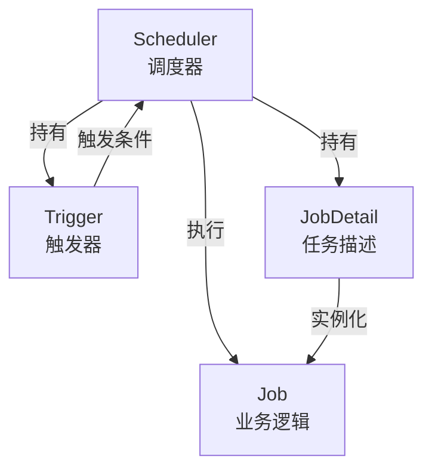

候选人小赵在面试美团后端岗时，面试官翻到简历上"负责定时任务模块"，问道：

"你们用的什么定时任务框架？"

小赵说："Quartz。"

面试官追问："Quartz 有哪几种 Trigger？Cron 表达式用过吗？"

小赵说："有 SimpleTrigger 和 CronTrigger，Cron 就是那种 * * * * * ? 的表达式..."

面试官打断他："Cron 表达式有几位？你们那个'每天早上9点执行'怎么写？"

小赵说："应该是5位吧...9点...那个我不会写。"

面试官继续追问："那 Misfire 是什么？任务漏触发了你怎么处理？"

小赵沉默了三秒。

【面试官心理】
这道题我用来考察候选人有没有真正在生产环境用过 Quartz。知道名字的占 80%，能写 Cron 表达式的占 50%，能讲清楚 Misfire 处理策略的只有 20%。Cron 表达式的位数是个经典坑，6位和7位的区别、第一位是秒还是分——这些细节才是 P6 和 P5 的分水岭。

## 一、核心组件全景图 🔴

### 1.1 四大核心组件

Quartz 的设计非常模块化，理解了四个核心组件，就理解了一半的面试题。



**Scheduler（调度器）**：整个框架的指挥官，负责管理 Trigger 和 JobDetail 的关联关系，启动后根据 Trigger 的时间规则触发任务。

```java
// 通过工厂创建 Scheduler
Scheduler scheduler = StdSchedulerFactory.getDefaultScheduler();

// 添加一个任务
scheduler.scheduleJob(jobDetail, trigger);

// 启动调度器
scheduler.start();

// 关闭
scheduler.shutdown();
```

**Trigger（触发器）**：定义"什么时候执行"。Quartz 内置了两种 Trigger，分别对应两种场景。

**JobDetail（任务描述）**：定义"要执行什么任务"。它携带了任务的描述信息、Job 类引用、以及 JobDataMap（任务级别的数据传递）。

**Job（业务逻辑）**：真正执行业务代码的类。JobDetail 只负责"描述"任务，具体的执行逻辑在 Job 实现类中。

:::tip 💡
面试官最爱问的一个问题是：**JobDetail 和 Job 的区别是什么？**
简单说：JobDetail 是"任务蓝图"，描述任务的名字、分组、数据等；Job 是"具体的执行者"，每次触发都会创建一个新的 Job 实例。JobDetail 和 Job 的关系，就像"菜单"和"厨师"——菜单描述要点什么菜，厨师负责做。
:::

### 1.2 JobDetail vs Job：一个容易混淆的点

```java
// ❌ 错误理解：JobDetail 就是 Job
// ✅ 正确理解：JobDetail 是任务的描述信息，Job 是任务执行逻辑

// JobDetail 包含：
// - Job 的类名（用于反射实例化）
// - 任务名称和分组
// - 任务数据 JobDataMap
// - 持久化标记（isDurable）
// - 可恢复标记（requestsRecovery）

// Job 只有一个 execute 方法
public interface Job {
    void execute(JobExecutionContext context) throws JobExecutionException;
}
```

为什么每次触发都要实例化新的 Job？

```java
// 因为 Job 可能被并发执行
// 如果复用同一个实例，成员变量会被多个线程同时修改
public class MyJob implements Job {
    private int count = 0; // ❌ 如果复用，这个值会被并发污染

    @Override
    public void execute(JobExecutionContext context) throws JobExecutionException {
        // 每次触发都是新的 MyJob 实例，count 始终是 0
        count++; // 线程安全
    }
}
```

### 1.3 JobFactory：自定义实例化策略

默认情况下，Quartz 使用 `StdJobFactory` 通过反射创建 Job 实例。但如果你需要 Spring 管理 Job 的依赖注入，就需要自定义 JobFactory。

```java
// 自定义 JobFactory：让 Spring 注入依赖
public class SpringJobFactory extends AdaptableJobFactory {

    @Autowired
    private AutowireCapableBeanFactory beanFactory;

    @Override
    protected Object createJobInstance(TriggerFiredBundle bundle) throws Exception {
        // 使用 Spring 的 BeanFactory 创建 Job 实例
        Object job = super.createJobInstance(bundle);
        // 自动注入 @Autowired 字段
        beanFactory.autowireBean(job);
        return job;
    }
}

// 在 Spring 配置中使用
@Bean
public SpringJobFactory springJobFactory() {
    return new SpringJobFactory();
}

@Bean
public SchedulerFactoryBean schedulerFactory(SpringJobFactory factory) {
    SchedulerFactoryBean bean = new SchedulerFactoryBean();
    bean.setJobFactory(factory);
    return bean;
}
```

:::warning ⚠️
如果不用自定义 JobFactory，Job 类中的 `@Autowired` 注入的字段全是 null。因为 Quartz 直接通过 `Class.newInstance()` 创建，绕过了 Spring 的容器。
:::

## 二、Trigger 的两种类型 🔴

### 2.1 SimpleTrigger：简单定时

适用于"固定时间间隔执行 N 次"的场景。

```java
// 场景：每天早上9点执行一次
SimpleTrigger trigger = newTrigger()
    .withIdentity("myTrigger", "group1")
    .startAt(DateBuilder.todayAt(9, 0, 0))  // 早上9点
    .withSchedule(
        simpleSchedule()
            .withIntervalInHours(24)         // 每24小时
            .repeatForever()                 // 无限重复
    )
    .build();

// 场景：立即执行，每30分钟一次，共执行10次
SimpleTrigger trigger = newTrigger()
    .startAt(DateBuilder.futureDate(0, IntervalUnit.SECOND))
    .withSchedule(
        simpleSchedule()
            .withIntervalInMinutes(30)
            .withRepeatCount(9)  // 共执行10次（1次 + 9次重复）
    )
    .build();
```

### 2.2 CronTrigger：表达式定时（最常考）

适用于复杂的时间规则，比如"每周二和周四早上9点执行"、"每月最后一个工作日执行"。

```java
CronTrigger trigger = newTrigger()
    .withIdentity("myCronTrigger", "group1")
    .withSchedule(cronSchedule("0 0 9 ? * MON-FRI"))  // 每周一到周五早上9点
    .build();
```

**Cron 表达式格式（6位 vs 7位）：**

| 格式 | 位数 | 说明 | 示例 |
| --- | --- | --- | --- |
| 6位 | 秒 分 时 日 月 周 | 缺少年字段 | `0 0 9 * * ?` 每天9点 |
| 7位 | 秒 分 时 日 月 周 年 | 完整格式 | `0 0 9 * * ? 2024` 2024年每天9点 |

:::warning ⚠️
这是 Quartz 面试的第一大坑：很多候选人以为 Cron 表达式是5位或6位，但 Quartz 标准格式是 **6位**（从秒开始）。Spring @Scheduled 默认的 cron 是6位（从分开始）。两者位数不同，非常容易搞混。
:::

**常用 Cron 表达式汇总：**

```java
// 每天早上9点整
"0 0 9 * * ?"

// 每周一早上9点
"0 0 9 ? * MON"

// 每月1号和15号凌晨2点
"0 0 2 1,15 * ?"

// 每天早上9点到下午6点，每小时整点执行
"0 0 9-18 * * ?"

// 每月最后一个工作日（用L和W组合）
"0 0 18 LW * ?"  // 注意：LW 表示最后一个工作日
// 注意：Quartz 的 L 和 W 组合行为和 Linux cron 不一样！

// 每隔5分钟
"0 0/5 * * * ?"

// 每年1月1日凌晨0点
"0 0 0 1 1 ?"
```

### 2.3 Cron 表达式的位细节 🔴

这是面试官最喜欢追问的地方。

```java
// Quartz Cron 表达式：6位格式
// 秒  分  时  日  月  周
// 0   0   9   *   *   ?   每天9点整

// 第一位：秒（0-59）
// 第二位：分（0-59）
// 第三位：时（0-23）
// 第四位：日（1-31，* 表示每一天）
// 第五位：月（1-12 或 JAN-DEC）
// 第六位：周（1-7 或 SUN-SAT，? 表示不关心）
```

**日和周的矛盾：**

当日字段和周字段同时指定值时，Quartz 会报错。通常固定一个为 `?`。

```java
// ❌ 错误：日和周同时指定
"0 0 9 15 * MON"  // 矛盾：第15天 AND 周一

// ✅ 正确：固定一个为 ?
"0 0 9 15 * ?"     // 每月15号
"0 0 9 ? * MON"    // 每周一
```

**L、W、C 特殊字符：**

```java
// L - 最后的值
"0 0 18 L * ?"     // 每月最后一天18点
"0 0 ? * 6L"       // 每月最后一个周五

// W - 最近的工作日
"0 0 9 15W * ?"    // 每月15号最近的工作日（如果15号是周六，则14号执行）

// C - 日历相关
"0 0 9 1C * ?"     // 每月第一天
```

## 三、Misfire 机制 🔴

### 3.1 什么是 Misfire

Misfire（错失触发）是指任务应该触发但由于某种原因没有触发的情况。常见原因：

```java
// 1. 调度器被关闭了一段时间
// 2. 执行节点挂了
// 3. 触发时刻系统负载过高，线程池满了
// 4. Quartz 集群中数据库锁竞争激烈，导致触发延迟

// 比如：任务应该每10秒执行一次
// 但调度器因为数据库锁竞争，15秒后才触发
// 这5秒的延迟就是 Misfire
```

### 3.2 Misfire 处理策略

Quartz 为不同类型的 Trigger 提供了多种 Misfire 处理策略：

```java
// SimpleTrigger 的 Misfire 策略
withMisfireHandlingInstructionFireNow()       // 立即触发一次，然后按新规则
withMisfireHandlingInstructionNowWithRemainingCount() // 用剩余次数补发
withMisfireHandlingInstructionNowWithExistingCount()  // 只触发一次，用现有次数
withMisfireHandlingInstructionIgnoreMisfires()         // 忽略所有 Misfire，按正常规则继续

// CronTrigger 的 Misfire 策略
withMisfireHandlingInstructionFireAndProceed()  // 立即触发一次（最常用）
withMisfireHandlingInstructionDoNothing()       // 不触发，等待下一次正常时间
withMisfireHandlingInstructionIgnoreMisfires()  // 忽略 Misfire，按正常规则
```

**Misfire 阈值：**

```java
// Quartz 默认的 Misfire 阈值是 60000 毫秒（60秒）
// 如果一个任务超过 60 秒没有被触发，就认为发生了 Misfire
// 这个值可以通过配置修改

// quartz.properties
org.quartz.jobStore.misfireThreshold = 60000
```

:::warning ⚠️
Misfire 策略选错了会导致严重问题。比如一个"每分钟执行一次"的统计任务，如果选错了 Misfire 策略，可能导致：
- 短时间内触发多次（数据重复计算）
- 很长时间不触发（数据丢失）
- 永久不触发（任务被"冻结"）
生产环境一定要根据业务逻辑选择合适的策略。
:::

### 3.3 Misfire 在生产中的翻车案例

```java
// ❌ 翻车场景：库存同步任务，每分钟执行一次
// 开发同学用了默认的 Misfire 策略
SimpleTrigger trigger = newTrigger()
    .withSchedule(
        simpleSchedule()
            .withIntervalInMinutes(1)
            .repeatForever()
            // 没有指定 Misfire 策略，使用了默认
    )
    .build();

// 问题：如果调度器重启了5分钟
// 重启后，一次性补发了 5 次任务
// 导致 5 万条库存数据被同步了 5 次
// 库存数量直接翻5倍

// ✅ 正确做法：
// 1. 选择合适的 Misfire 策略（用 remaining count）
// 2. 在 Job 中做幂等检查（根据业务时间判断是否需要处理）
SimpleTrigger trigger = newTrigger()
    .withSchedule(
        simpleSchedule()
            .withIntervalInMinutes(1)
            .repeatForever()
            .withMisfireHandlingInstructionNowWithRemainingCount()
    )
    .build();
```

## 四、JDBCJobStore 与集群模式 🟡

### 4.1 为什么需要 JDBCJobStore

单机模式的 Quartz 将任务信息存储在内存中（RAMJobStore）。问题是：重启后所有任务丢失，且无法跨节点协调。

JDBCJobStore 将任务信息持久化到数据库，支持集群部署：

```java
// quartz.properties
org.quartz.jobStore.class = org.quartz.impl.jdbcjobstore.JobStoreTX
org.quartz.jobStore.driverDelegateClass = org.quartz.impl.jdbcjobstore.StdJDBCDelegate
org.quartz.jobStore.dataSource = myDS
org.quartz.jobStore.tablePrefix = QRTZ_
org.quartz.jobStore.isClustered = true  // 开启集群模式
org.quartz.jobStore.clusterCheckinInterval = 10000  // 心跳间隔 10 秒

org.quartz.dataSource.myDS.driver = com.mysql.cj.jdbc.Driver
org.quartz.dataSource.myDS.URL = jdbc:mysql://localhost:3306/quartz
org.quartz.dataSource.myDS.user = root
org.quartz.dataSource.myDS.password = password
```

### 4.2 集群模式下的抢锁机制

```java
// 集群模式下，多个节点通过数据库锁抢"任务执行权"
// Quartz 使用两套锁：
// 1. TRIGGER_ACCESS_LOCK：获取下一个要触发的 Trigger
// 2. STATE_ACCESS_LOCK：更新任务执行状态

// 关键 SQL：
// SELECT * FROM QRTZ_TRIGGERS
// WHERE NEXT_FIRE_TIME <= ?
// AND TRIGGER_STATE = 'WAITING'
// FOR UPDATE NOWAIT  // 关键：数据库行锁

// 抢到锁的节点负责触发该任务
// 其他节点继续等待下一次抢锁
```

**集群模式的坑：**

```java
// ❌ 坑1：同一个 Job 在多个节点同时触发
// 如果 Trigger 的 StatefulJob 配置错误
// 可能导致同一个任务在两个节点同时执行
// 解决：用 @DisallowConcurrentExecution 注解禁止并发

// ❌ 坑2：数据库成为瓶颈
// 每次抢锁都要访问数据库
// 节点多了之后，锁竞争激烈
// 解决：增加 clusterCheckinInterval，或使用 Terracotta（不推荐，已停止维护）

// ✅ 正确的并发控制
@DisallowConcurrentExecution   // 禁止同一个 JobDetail 并发执行
public class MyJob implements Job {
    // ...
}

@PersistJobDataAfterExecution   // 执行后将 JobDataMap 持久化
public class MyJob implements Job {
    // ...
}
```

### 4.3 集群 vs 单机

| 维度 | RAMJobStore（单机） | JDBCJobStore（集群） |
| --- | --- | --- |
| 任务持久化 | 内存，重启丢失 | 数据库，持久化 |
| 高可用 | 无 | 主备切换（通过抢锁） |
| 扩展性 | 无 | 可水平扩展节点 |
| 性能 | 高（无数据库开销） | 中等（数据库锁竞争） |
| 运维复杂度 | 低 | 高（需要维护数据库） |
| 适用场景 | 单机、定时备份 | 生产环境高可用 |

## 五、Listener 机制 🟡

### 5.1 TriggerListener 和 JobListener

```java
// TriggerListener：监听 Trigger 的生命周期
public class MyTriggerListener implements TriggerListener {
    @Override
    public String getName() {
        return "MyTriggerListener";
    }

    @Override
    public void triggerFired(Trigger trigger, JobExecutionContext context) {
        // Trigger 被触发
    }

    @Override
    public boolean vetoJobExecution(Trigger trigger, JobExecutionContext context) {
        // 返回 true = 阻止 Job 执行（也叫 VetomJob）
        // 返回 false = 继续执行
        return false;
    }

    @Override
    public void triggerMisfired(Trigger trigger) {
        // 发生了 Misfire
    }

    @Override
    public void triggerComplete(Trigger trigger, JobExecutionContext context,
                                CompletedExecutionInstruction triggerInstructionCode) {
        // Trigger 执行完成
    }
}

// JobListener：监听 Job 的执行
public class MyJobListener implements JobListener {
    @Override
    public String getName() {
        return "MyJobListener";
    }

    @Override
    public void jobToBeExecuted(JobExecutionContext context) {
        // Job 即将被执行
    }

    @Override
    public void jobExecutionVetoed(JobExecutionContext context) {
        // Job 被 TriggerListener 否决了
    }

    @Override
    public void jobWasExecuted(JobExecutionContext context, JobExecutionException jobException) {
        // Job 执行完成（无论成功还是失败）
        if (jobException != null) {
            // 记录失败日志
        }
    }
}

// 注册 Listener
scheduler.getListenerManager().addTriggerListener(new MyTriggerListener());
scheduler.getListenerManager().addJobListener(new MyJobListener());
```

:::tip 💡
Listener 的实际用途：日志记录、任务超时监控、失败告警、限流控制。但大多数候选人只在面试中被问到过，自己从来没写过。面试官追问 Listener，通常是想看你有没有"扩展框架"的意识。
:::

## 六、常见翻车现场 🔴

### ❌ 翻车点一：Cron 表达式写错

```java
// ❌ 错误：Quartz 的 Cron 是从秒开始的6位表达式
"0 9 * * *"   // ❌ 这是5位，Linux cron 格式，不是 Quartz

// ✅ 正确：
"0 0 9 * * ?" // 每天9点整（秒 分 时 日 月 周）
"0 30 9 * * ?" // 每天9点30分
```

### ❌ 翻车点二：混淆 JobDetail 和 Job

```java
// ❌ 错误：把 JobDetail 当 Job 用
scheduler.deleteJob(new JobKey("myJob")); // 删的是 JobDetail，不是 Job
// 但 Job 类里的代码还在某处...

// ✅ 正确：理解两者的生命周期
// JobDetail 是持久化的任务定义
// Job 是每次触发时实例化的执行者
```

### ❌ 翻车点三：Misfire 策略配置错误

```java
// ❌ 错误：支付回调任务，Misfire 时不应该重复触发
SimpleTrigger trigger = newTrigger()
    .withSchedule(
        simpleSchedule()
            .withIntervalInHours(1)
            .repeatForever()
            .withMisfireHandlingInstructionFireNow() // ❌ 重复触发！
    )
    .build();

// ✅ 正确：幂等处理
@DisallowConcurrentExecution
public class PaymentCallbackJob implements Job {
    @Override
    public void execute(JobExecutionContext context) throws JobExecutionException {
        JobDataMap dataMap = context.getJobDetail().getJobDataMap();
        String batchId = dataMap.getString("batchId");

        // 通过 Redis 锁保证幂等
        String lockKey = "payment:callback:" + batchId;
        Boolean acquired = redisTemplate.opsForValue().setIfAbsent(lockKey, "1", 1, TimeUnit.HOURS);
        if (!acquired) {
            return; // 已处理过，跳过
        }

        // 执行业务逻辑...
    }
}
```

## 七、面试追问链 🟡

### 追问一：Quartz 的集群模式和 XXL-JOB 的架构有什么区别？

【面试官心理】
问这个问题的面试官，通常想看你有没有对比过多种调度方案。能说出"数据库锁"和"调度中心+执行器"的核心区别，才算真正理解了两者的架构差异。

| 维度 | Quartz 集群 | XXL-JOB |
| --- | --- | --- |
| 协调机制 | 数据库锁抢占 | 调度中心中心化 |
| 任务分发 | 抢锁后本地执行 | HTTP/RPC 远程执行 |
| 管理界面 | 无（需自行开发） | 自带 Web 管理界面 |
| 任务分片 | 不支持 | 支持 |
| 扩展性 | 受数据库限制 | 好（执行器可水平扩展） |

### 追问二：如果 Quartz 节点挂了，任务会丢失吗？

不会丢失。触发时间到了但没执行的任务，Trigger 状态会变成 `BLOCKED` 或 `WAITING`。其他节点抢到锁后会继续触发。

但 Misfire 处理策略决定了这个"补发"的行为——是立即补一次，还是等下一次正常时间，还是忽略。

【面试官心理】
能回答出 Misfire 策略的候选人，说明他有生产事故的实战经验。我会继续追问："如果任务执行到一半节点挂了，怎么保证不重复执行？"能说出分布式锁或幂等检查的，通常是 P6+。
