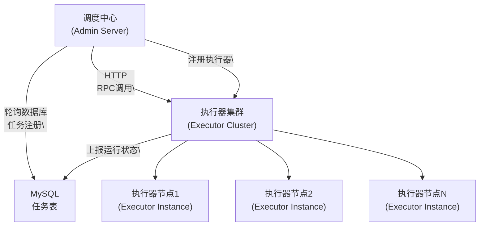
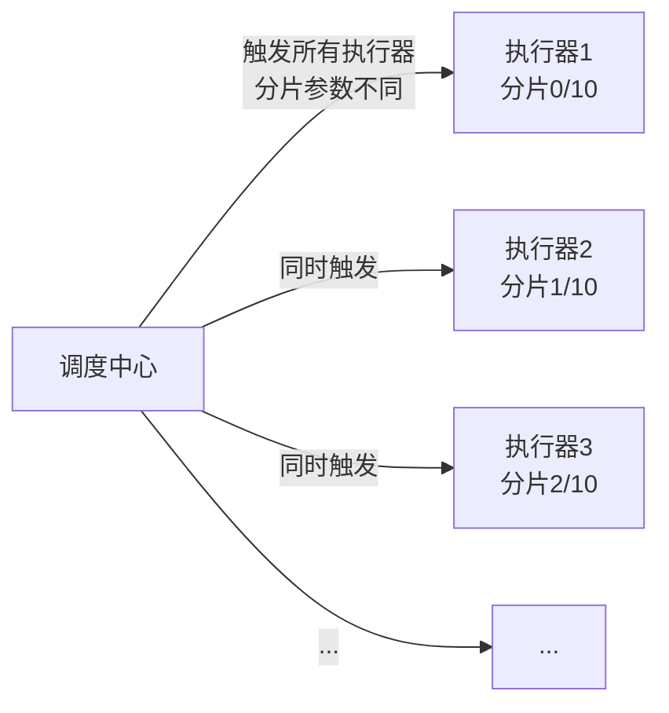

候选人小张去字节跳动面试，面试官看了他的项目经验，问了一个很直接的问题：

"你们用的什么定时任务方案？"

小张说："XXL-JOB。"

面试官追问："那 XXL-JOB 是怎么实现分布式调度的？调度中心和执行器之间是怎么通信的？"

小张说："通过 HTTP...？"

面试官点点头："那执行器挂了怎么办？任务分片是怎么实现的？"

小张停顿了一下，说："分片...我们没用到。"

面试官继续追问："那 XXL-JOB 的路由策略有哪些？你们用的是什么？"

小张答不上来。

【面试官心理】

这道题我其实在考察他对分布式调度系统的理解深度。XXL-JOB 是目前国内最流行的分布式调度平台之一，能把 XXL-JOB 的原理讲清楚的候选人，至少对 RPC 通信、任务分片、HA 方案有基本认知。但大多数候选人只是"用过"，不知道"怎么实现的"。连路由策略都说不全，说明他根本没有仔细看过 XXL-JOB 的文档。

## 一、为什么需要分布式调度 🔴

### 1.1 Quartz 的局限性

在讲 XXL-JOB 之前，先说清楚为什么 Quartz 在分布式场景下不够用：

```java
// Quartz 的集群模式：通过数据库锁抢占
// 问题1：所有节点共享数据库，数据库成为瓶颈
// 问题2：没有任务分片，无法按业务维度拆分
// 问题3：节点故障后，任务接管延迟最高 10 秒
// 问题4：无法动态管理任务（增删改查都要改代码或数据库）
```

Quartz 的架构是"中心化"的——所有调度逻辑都集中在一个地方（数据库），集群只是多个"抢锁的节点"。这在任务量小的时候没问题，但一旦上了规模就扛不住。

### 1.2 XXL-JOB 的核心架构



XXL-JOB 采用的是**分离式架构**：调度中心和执行器完全独立，通过 HTTP 或 RPC 通信。调度中心只负责任务的"触发"，执行器负责"执行"。这就好比"指挥部"和"作战部队"的分离。

```java
// 执行器启动时，向调度中心注册自己
// 调度中心维护一个"执行器列表"
// 触发任务时，从执行器列表中按路由策略选择一个执行
// 执行器执行完成后，通过 HTTP 回调上报结果
```

## 二、调度中心核心原理 🔴

### 2.1 任务注册与触发流程

```java
// 调度中心的核心调度逻辑在 JobScheduleController 中
// 伪代码展示关键流程

public class JobScheduleController {

    // 1. 预读即将触发的任务（提前 5 秒）
    // 从数据库读取下次触发时间 <= now 的任务
    List<XxlJobInfo> jobInfoList = jobInfoRepository
        .findByNextTriggerTimeLessThanEqual(now + PRE_READ_MS);

    // 2. 遍历每个任务，触发执行
    for (XxlJobInfo jobInfo : jobInfoList) {
        // 计算距下次触发还有多少秒
        long nextTriggerTime = calculateNextTriggerTime(jobInfo);

        // 3. 更新下次触发时间
        jobInfo.setNextTriggerTime(nextTriggerTime);
        jobInfoRepository.save(jobInfo);

        // 4. 触发任务执行
        // 通过线程池异步执行，不阻塞主调度循环
        triggerJobService.trigger(jobInfo.getId());
    }
}
```

### 2.2 路由策略：任务分发给哪个执行器

这是面试官最爱的追问点。XXL-JOB 提供了 10 种路由策略：

```java
public enum ExecutorRouteStrategyEnum {
    FIRST,           // 第一个（注册顺序）
    LAST,            // 最后一个
    ROUND,           // 轮询
    RANDOM,          // 随机
    CONSISTENT_HASH, // 一致性哈希（同一个任务总是路由到同一个执行器）
    LEAST_FREQUENTLY_USED,  // 最不经常使用
    LEAST_RECENTLY_USED,    // 最近最久未使用
    FAILOVER,        // 故障转移（按顺序遍历执行器，跳过不在线的）
    BUSYOVER,        // 忙碌转移（按顺序遍历执行器，跳过正在执行的）
    SHARDING_BROADCAST,  // 分片广播（所有执行器同时执行，用于数据同步）
}
```

```java
// 路由策略的实现示例：故障转移（FAILOVER）
public class FailoverRouter {
    public static ExecutorAddress doRouter(XxlJobInfo jobInfo, List<ExecutorAddress> addressList) {
        // 1. 获取上一次执行的执行器地址
        String lastAddress = jobInfo.getExecutorHandler();

        // 2. 如果上一次执行的执行器还在线，直接用它
        if (lastAddress != null && isOnline(lastAddress)) {
            return lastAddress;
        }

        // 3. 否则按顺序找一个在线的执行器
        for (ExecutorAddress address : addressList) {
            if (isOnline(address)) {
                return address;
            }
        }

        // 4. 没有任何在线的执行器，抛出异常
        throw new NoOnlineExecutorException();
    }
}
```

:::tip 💡
路由策略的选择取决于业务场景：
- **ROUND（轮询）**：适用于无状态任务，均匀分配负载
- **CONSISTENT_HASH（一致性哈希）**：适用于需要同一任务始终在同一节点执行（比如本地缓存预热）
- **FAILOVER（故障转移）**：适用于重要任务，需要快速故障恢复
- **SHARDING_BROADCAST（分片广播）**：适用于数据同步场景，所有节点同时执行不同分片
:::

### 2.3 调度线程池与错失触发

```java
// 调度中心使用线程池管理调度任务
// 核心线程数 = CPU 核心数，最大线程数 = CPU 核心数 * 3
private ThreadPoolExecutor scheduleThreadPool =
    new ThreadPoolExecutor(
        1,  // 只有一个调度线程，按顺序读取数据库
        Math.min(Runtime.getRuntime().availableProcessors() * 3, 10),
        60L, TimeUnit.SECONDS,
        new LinkedBlockingQueue<>(200000));

// 执行线程池用于真正触发任务
private ThreadPoolExecutor ringThreadPool =
    new ThreadPoolExecutor(
        Math.min(Runtime.getRuntime().availableProcessors() * 3, 10),
        Integer.MAX_VALUE,  // 弹性扩展
        60L, TimeUnit.SECONDS,
        new LinkedBlockingQueue<>(200000),
        new ThreadFactory() {
            public Thread newThread(Runnable r) {
                return new Thread(r, "xxl-job, executor-trigger-pool-" + new AtomicInteger().incrementAndGet());
            }
        },
        newRejectedExecutionHandler());
```

**为什么要两个线程池？** 因为调度线程需要严格按时间触发（预读 5 秒内的任务），而执行线程负责实际的 HTTP 调用。如果把两者混在一起，HTTP 调用慢会阻塞调度。

## 三、执行器核心原理 🔴

### 3.1 执行器的自注册机制

```java
// 执行器启动时，向调度中心注册自己的地址
// 关键代码在 XxlJobSpringExecutor 中

@Override
public void afterSingletonsInstantiated() {
    // 1. 启动 RPC 服务（Netty），监听回调端口
    // 2. 向调度中心注册当前执行器的地址
    //    POST /api/register
    //    body: {
    //      "registryGroup": "EXECUTOR",
    //      "registryKey": "xxl-job-executor-example",
    //      "registryValue": "192.168.1.100:9999"
    //    }

    XxlJobDynamicScheduler.registerExecutorService(
        "EXECUTOR",
        "xxl-job-executor-example",
        "192.168.1.100:9999"  // 执行器的 RPC 地址
    );
}
```

### 3.2 任务执行入口

```java
// 执行器收到调度中心的触发请求后
// 通过 JobHandler 的方法签名触发对应的任务

// 执行器通过 Netty 接收任务
public class JobThreadPoolExecutor {
    private static final Logger logger = LoggerFactory.getLogger(JobThreadPoolExecutor.class);

    public void execute(String jobId, ShardingUtil shardingVO) {
        // 1. 从线程池中取一个线程执行
        Future future = executor.submit(new Runnable() {
            @Override
            public void run() {
                try {
                    // 2. 执行任务（这里会执行业务逻辑）
                    // 3. 捕获异常
                    // 4. 上报执行结果
                } finally {
                    // 清理上下文
                }
            }
        });
    }
}
```

### 3.3 执行结果回调

```java
// 任务执行完成后，执行器通过 HTTP 回调调度中心
// POST /api/callback
// body: {
//   "logId": 12345,
//   "logDateTime": 1710000000000,
//   "handleCode": 200,           // 200=成功，500=失败
//   "handleMsg": "success",
//   "executeResult": {
//     "code": 0,
//     "msg": null
//   }
// }

public class XxlJobExecutor {
    // 结果回调线程池
    private static ThreadPoolExecutor callbackThreadPool =
        new ThreadPoolExecutor(
            2, 4, 10,
            TimeUnit.SECONDS,
            new LinkedBlockingQueue<>(10000),
            new NamedThreadFactory("xxl-job-callback", true));
}
```

## 四、分片广播：数据并行的核心 🟡

### 4.1 分片任务的使用场景

分片广播是 XXL-JOB 最强大的功能之一，适用于大数据量拆分场景：

```java
// 场景：每天凌晨同步 1000 万订单到数据仓库
// 如果单节点执行，需要 10 小时
// 如果分成 10 个分片，每个分片处理 100 万，执行时间缩短到 1 小时

@XxlJob("orderSyncJob")
public ReturnT<String> execute(String param) {
    // 1. 获取分片参数
    ShardingUtil.ShardingVO shardingVO = ShardingUtil.getShardingVO();
    int shardIndex = shardingVO.getIndex();  // 当前分片序号（从1开始）
    int shardTotal = shardingVO.getTotal(); // 总分片数

    // 2. 根据分片参数查询数据（分页查，每页按分片隔离）
    // 比如：SELECT * FROM orders
    //       WHERE status = 0
    //       AND MOD(id, total) = index - 1
    //       LIMIT 10000 OFFSET offset

    // 3. 处理每页数据
    List<Order> orders = orderMapper.selectByPage(shardIndex, shardTotal);
    for (Order order : orders) {
        syncOrder(order);
    }

    // 4. 返回成功
    return ReturnT.SUCCESS;
}
```

### 4.2 分片广播的执行流程



```java
// 调度中心触发分片广播时，会为每个分片发送独立的触发请求
// 每个执行器收到的分片参数不同

// 调度中心源码中的关键逻辑
for (int i = 0; i < shardingTotal; i++) {
    ShardingVO shardingVO = new ShardingVO();
    shardingVO.setIndex(i + 1);      // 分片序号从1开始
    shardingVO.setTotal(shardingTotal);

    // 为每个分片单独触发
    triggerNode(shardingVO);
}
```

## 五、故障转移与任务丢失防护 🔴

### 5.1 执行器的超时与丢失检测

```java
// 调度中心维护每个任务的执行状态
// 如果执行器超时未回调，调度中心认为任务失败

// 关键配置
// xxl.job.executor.logretentiondays = 30   # 日志保留天数
// xxl.job.executor.timeout = 0              # 任务超时时间（0=不超时）

// 调度中心定期检查超时任务
// 如果一个任务开始执行后，超过 timeout 时间没有回调结果
// 调度中心会将该任务标记为"超时失败"，并可以触发故障转移

public class JobFailMonitorHelper {
    // 监控线程，每 10 秒检查一次超时任务
    public static void monitor() {
        List<Long> failJobIds = jobLogMapper.findFailJobIds(
            System.currentTimeMillis() - JOB_TIMEOUT_MS
        );

        for (Long jobId : failJobIds) {
            // 触发故障转移：重新调度该任务
            jobScheduleService.trigger(jobId);
        }
    }
}
```

### 5.2 任务堆积与优先级

```java
// 如果执行器处理速度跟不上调度速度，会造成任务堆积
// XXL-JOB 的处理方式：

// 1. 执行器端使用有界队列
private ThreadPoolExecutor executor = new ThreadPoolExecutor(
    corePoolSize, maxPoolSize, 30L, TimeUnit.SECONDS,
    new LinkedBlockingQueue<>(200),  // 有界队列，拒绝多余任务
    new RejectedExecutionHandler() {
        @Override
        public void rejectedExecution(Runnable r, ThreadPoolExecutor executor) {
            // 任务被拒绝执行，记录日志
            // 调度中心会通过回调感知到失败
        }
    });

// 2. 调度中心检测到执行失败后，可以配置重试次数
// jobInfo.setExecutorBlockStrategy("SERIAL_EXECUTION"); // 单机串行
// jobInfo.setExecutorBlockStrategy("DISCARD_LATER");    // 丢弃后续
// jobInfo.setExecutorBlockStrategy("COVER_EARLY");      // 覆盖之前
```

## 六、常见翻车现场 🔴

### ❌ 翻车点一：分片任务使用不当导致数据重复

```java
// ❌ 错误：分片参数理解错误，导致数据重复或遗漏
@XxlJob("badShardingJob")
public ReturnT<String> execute(String param) {
    ShardingUtil.ShardingVO sharding = ShardingUtil.getShardingVO();
    int index = sharding.getIndex();

    // ❌ 错误：使用 % 取模时，index 从 1 开始，容易出错
    List<Order> orders = orderMapper.selectByMod(index % sharding.getTotal());

    // ❌ 错误：没有分页，大数据量下 OOM
    List<Order> allOrders = orderMapper.selectAll(); // 1000万数据全加载
}

// ✅ 正确：分片 + 分页结合
@XxlJob("goodShardingJob")
public ReturnT<String> execute(String param) {
    ShardingUtil.ShardingVO sharding = ShardingUtil.getShardingVO();
    int index = sharding.getIndex();
    int total = sharding.getTotal();

    int pageSize = 1000;
    int offset = 0;
    boolean hasMore = true;

    while (hasMore) {
        List<Order> orders = orderMapper.selectBySharding(index, total, offset, pageSize);
        if (orders.isEmpty()) {
            hasMore = false;
        } else {
            processOrders(orders);
            offset += pageSize;
        }
    }
    return ReturnT.SUCCESS;
}
```

### ❌ 翻车点二：任务中抛异常但没正确处理

```java
// ❌ 危险：catch 异常后返回成功
@XxlJob("badJob")
public ReturnT<String> execute(String param) {
    try {
        doSomething();
    } catch (Exception e) {
        log.error("执行失败", e);
        return new ReturnT<>(200, "success");  // ❌ 失败了但返回成功！
    }
    return ReturnT.SUCCESS;
}

// ✅ 正确：异常时返回错误码
@XxlJob("goodJob")
public ReturnT<String> execute(String param) {
    try {
        doSomething();
    } catch (Exception e) {
        log.error("执行失败", e);
        return new ReturnT<>(500, "系统异常: " + e.getMessage()); // 正确：返回 500
    }
    return ReturnT.SUCCESS;
}
```

## 七、面试追问链 🟡

### 追问一：XXL-JOB 和 Quartz 的核心区别是什么？

| 维度 | Quartz | XXL-JOB |
| --- | --- | --- |
| 架构模式 | 无中心化（数据库抢占） | 中心化（调度中心 + 执行器分离） |
| 任务管理 | 数据库 + 代码 | Web 界面可视化 |
| 执行方式 | 本地 JVM | 独立执行器进程 |
| 任务分片 | 不支持 | 支持 |
| 故障转移 | 数据库锁，不及时 | 心跳检测，快速转移 |
| 扩展性 | 差（数据库瓶颈） | 好（执行器可水平扩展） |

### 追问二：XXL-JOB 的调度中心挂了怎么办？

调度中心是单节点部署的（社区版），如果调度中心挂了：
- 已触发的任务会继续在执行器上执行
- 但新的任务不会被触发
- 恢复后，需要手动补偿错失的任务触发

生产环境建议：
- 双机部署调度中心（社区版不支持集群）
- 或者使用 XXL-JOB 的高可用方案（社区在推进中）

【面试官心理】

问到调度中心单点问题的候选人，说明他有高可用意识。我会继续追问："如果让你们自己设计一个高可用的调度中心，你会怎么做？"能回答出主备切换或选举机制的候选人，通常有架构设计能力。
