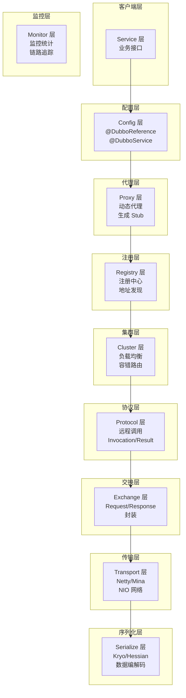
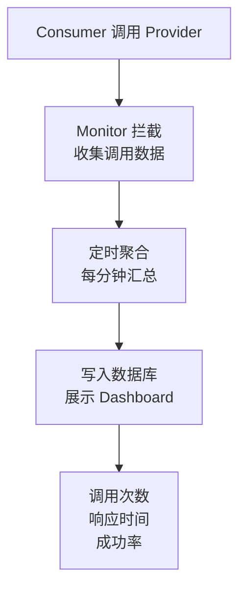
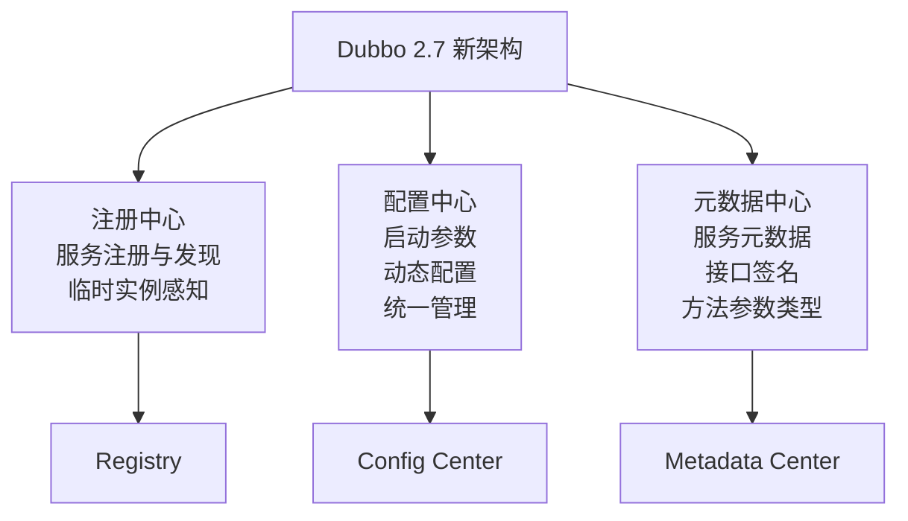
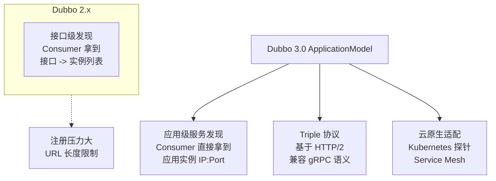

候选人小李在面试美团 P6 时，简历上写着"精通 Dubbo，参与过服务治理"。

面试官翻到这一页，问了一句："Dubbo 的架构分哪几层？Registry、Config、Cluster、Protocol 分别负责什么？"

小李愣了两秒，说："好像有十几层，我也记不太清..."

【面试官心理】
Dubbo 的分层架构是理解整个框架的基础。一个"精通 Dubbo"的候选人如果说不清楚分层，说明他只是会用 API，从来没有研究过框架的内部设计。这种候选人我通常会继续追问到源码细节，看他是真的理解还是装的。

## 一、Dubbo 的整体架构 🔴

### 1.1 十五层架构全景图

Dubbo 采用分层架构设计，这种设计的好处是**每一层都可以独立替换**，而不影响其他层：



**每一层的核心职责**：

| 层级 | 核心组件 | 职责 | 面试高频追问 |
| --- | --- | --- | --- |
| `config` 配置层 | `ReferenceConfig`<br/>`ServiceBean` | 解析配置注解<br/>生成配置对象 | @DubboReference 怎么解析的 |
| `proxy` 代理层 | `JavassistProxyFactory`<br/>`StubProxyFactory` | 生成客户端 Stub<br/>生成服务端 Wrapper | 动态代理用什么实现 |
| `registry` 注册层 | `RegistryFactory`<br/>`ZookeeperRegistry` | 服务注册<br/>服务发现 | 注册中心挂了怎么办 |
| `cluster` 集群层 | `Cluster`<br/>`LoadBalance` | 容错路由<br/>负载均衡 | Cluster 挂了怎么容错 |
| `protocol` 协议层 | `DubboProtocol`<br/>`HttpProtocol` | 远程调用封装<br/>Invocation 构建 | Dubbo 协议头多少字节 |
| `exchange` 交换层 | `HeaderExchange`<br/>`ExchangeChannel` | Request/Response 封装<br/>状态管理 | 怎么实现同步转异步 |
| `transport` 传输层 | `NettyChannel`<br/>`NIO Server` | 网络传输<br/>编解码 | Netty Pipeline 怎么设计 |
| `serialize` 序列化层 | `KryoSerialization`<br/>`HessianSerialization` | 对象序列化<br/>反序列化 | 为什么选 Kryo |

### 1.2 ❌ 错误示范

**候选人原话**："Dubbo 就是基于 Spring 的 RPC 框架，用起来跟 Feign 差不多。"

**问题诊断**：
- 完全不理解 Dubbo 的分层架构
- 把 Dubbo 和 Spring Cloud 的组件混为一谈
- 说明没有深入研究过 Dubbo 源码

**面试官内心 OS**：这个人简历上写"精通 Dubbo"简直是笑话，连基本架构都不清楚。

## 二、四大核心组件角色 🔴

### 2.1 Provider（服务提供者）

服务提供者在启动时向注册中心注册自己的服务：

```java
// 服务发布
@DubboService(version = "1.0.0", group = "order-service")
public class OrderServiceImpl implements OrderService {
    @Override
    public Order putOrder(Order order) {
        // 业务逻辑
        return order;
    }
}
```

发布流程：

```mermaid
graph LR
    A[@DubboService 注解<br/>被 Spring 扫描] --> B[ServiceBean<br/>afterPropertiesSet]
    B --> C[DubboBootstrap.start]
    C --> D[ServiceConfig.export<br/>导出服务]
    D --> E[向 Registry 注册<br/>URL 信息]
    E --> F[启动 Netty Server<br/>监听端口]
```

**关键问题**：服务暴露在哪个时机发生？

答案是：**Spring 容器刷新完成后**（`ContextRefreshedEvent` 事件）。具体来说，是 `ServiceBean` 实现了 `ApplicationListener<ContextRefreshedEvent>`，在 `onApplicationEvent` 中触发的。

### 2.2 Consumer（服务消费者）

消费者通过动态代理发起调用：

```java
// 服务引用
@DubboReference(version = "1.0.0", group = "order-service")
private OrderService orderService;

// 实际调用的是这个
public Order putOrder(Order order) {
    // 1. Cluster 选择一个 Invoker
    // 2. Directory 获取所有 Invoker
    // 3. LoadBalance 负载均衡
    // 4. Protocol 执行远程调用
    return doInvoke(order);
}
```

### 2.3 Registry（注册中心）

注册中心是 Dubbo 架构的**大脑**，负责：
- 服务注册（Provider 上线时注册）
- 服务发现（Consumer 订阅获取 Provider 列表）
- 变更通知（Provider 列表变化时推送给 Consumer）

Dubbo 支持多种注册中心：

| 注册中心 | CAP 模型 | 适用场景 | 运维复杂度 |
| --- | --- | --- | --- |
| ZooKeeper | CP（强一致） | 老项目、Kubernetes 环境 | 高 |
| Nacos | AP + CP 双模式 | Spring Cloud Alibaba 生态 | 低 |
| Redis | AP | 临时用，不推荐生产 | 低 |
| Multicast | - | 本地开发 | - |

### 2.4 Monitor（监控中心）

Monitor 负责收集调用统计信息：



### 2.5 Container（容器）

Container 不是 Docker 容器，而是 Dubbo 的**依赖容器**：

- Spring Container：Dubbo 默认依赖 Spring 容器
- Jetty Container：轻量级容器
- Logback Container：日志容器

## 三、Dubbo 版本演进：2.6 vs 2.7 vs 3.0 🟡

### 3.1 Dubbo 2.6 的局限性

Dubbo 2.6 是 2017 年发布的，有几个明显问题：

1. **注册中心压力大**：每个 Consumer 直接订阅所有 Provider，10 万实例的集群会有大量的通知风暴
2. **元数据存储不合理**：服务元数据（方法签名、参数类型）存在 URL 参数中，URL 长度限制导致大服务无法注册
3. **治理能力弱**：缺乏配置中心、元数据中心概念

### 3.2 Dubbo 2.7 的三大中心化组件

Dubbo 2.7 引入了三个中心化组件来解决上述问题：



**配置中心**：以前你需要在 XML 或 properties 文件里配置所有参数，现在统一放到 Nacos/Apollo 配置中心，支持动态修改。

**元数据中心**：服务的方法签名、参数类型不再塞在 URL 里，而是存到元数据中心。注册中心只存"服务 -> 实例列表"的映射。

### 3.3 Dubbo 3.0 的 ApplicationModel

Dubbo 3.0 是 2021 年发布的，核心目标是**云原生化**：



**应用级服务发现**是最大的变化。以前 Consumer 拿到的是 `interface + method + version + group`，Dubbo 3.0 拿到的是 `appName + ip + port`，直接省去了接口映射层。

:::tip 💡
Dubbo 3.0 的应用级服务发现让注册中心压力降低了 90% 以上。原来 10 万个 Dubbo 实例需要注册 50 万条数据（每个实例有 5 个接口），现在只需要 10 万条。
:::

### 3.4 版本选型建议

| 版本 | 适用场景 | 不适用场景 |
| --- | --- | --- |
| Dubbo 2.6 | 维护老项目 | 新项目、性能敏感场景 |
| Dubbo 2.7 | Spring Cloud Alibaba 生态 | 云原生、Kubernetes |
| Dubbo 3.0 | 新项目、云原生 | 需要大量老系统改造 |

【面试官心理】
能说清楚 Dubbo 版本演进路径的候选人，说明他有技术视野，能看到技术债务和演进方向。这种人在团队里是技术 leader 的苗子。

## 四、Dubbo 的扩展机制 🟢

### 4.1 SPI 机制

Dubbo 的核心扩展机制是基于 SPI（Service Provider Interface），这是 Dubbo 区别于 Spring 的关键设计：

```java
// Dubbo SPI 用法：ExtensionLoader
ExtensionLoader<LoadBalance> loader =
    ExtensionLoader.getExtensionLoader(LoadBalance.class);

// 获取指定实现
LoadBalance random = loader.getExtension("random");

// 获取自适应实现（@Adaptive 标注的类）
LoadBalance adaptive = loader.getAdaptiveExtension();
```

**Dubbo SPI vs JDK SPI**：

| 特性 | JDK SPI | Dubbo SPI |
| --- | --- | --- |
| 加载时机 | 首次加载时全部实例化 | 按需加载（lazy） |
| AOP 支持 | 无 | 支持 Wrapper 包装 |
| 依赖注入 | 无 | 支持 |
| 自适应扩展 | 无 | 支持 @Adaptive |

```java
// JDK SPI：一次性加载所有实现
ServiceLoader<Log> loader = ServiceLoader.load(Log.class);
for (Log log : loader) {  // 全部实例化！
    log.info("loaded");
}

// Dubbo SPI：只加载需要的实现
ExtensionLoader<LoadBalance> loader =
    ExtensionLoader.getExtensionLoader(LoadBalance.class);
LoadBalance lb = loader.getExtension("random");  // 只实例化 random
```

### 4.2 常用扩展点

Dubbo 预留了大量扩展点：

| 扩展点接口 | 默认实现 | 作用 |
| --- | --- | --- |
| `LoadBalance` | `RandomLoadBalance` | 负载均衡 |
| `Cluster` | `FailoverCluster` | 集群容错 |
| `Protocol` | `DubboProtocol` | 协议层 |
| `Registry` | `ZookeeperRegistry` | 注册中心 |
| `Filter` | `EchoFilter` 等 | 拦截器链 |

## 五、生产避坑

### 5.1 常见翻车点

1. **注册中心选错**：选了 ZooKeeper 但运维能力不足，导致注册中心成了单点故障
2. **版本号不一致**：Provider 和 Consumer 的 version 不匹配，导致调用失败
3. **超时配置连锁**：A -> B -> C 调用链超时配置不合理，导致资源浪费
4. **序列化不兼容**：Provider 升级序列化方式后，Consumer 没升级，无法反序列化

### 5.2 排查方法

```bash
# 查看注册到 ZooKeeper 的服务
zkCli.sh -server 127.0.0.1:2181
ls /dubbo/com.xxx.OrderService/providers

# 查看 Dubbo 线程池状态
dubbo.admin -> 线程池监控

# 开启调试日志
<logger name="com.alibaba.dubbo" level="DEBUG"/>
```

:::warning ⚠️
Dubbo 的线程池模型容易被忽略。默认用 FixedThreadPool，当线程池满时新请求会被拒绝。如果你的服务是高并发入口，记得改成CachedThreadPool或根据压测结果调整线程池参数。
:::

【面试官心理】
Dubbo 架构是理解整个微服务生态的基础。能说清楚分层架构、版本演进、扩展机制的候选人，至少是 P6+。我通常会在这道题的基础上继续追问服务治理、流量管理相关的问题。
