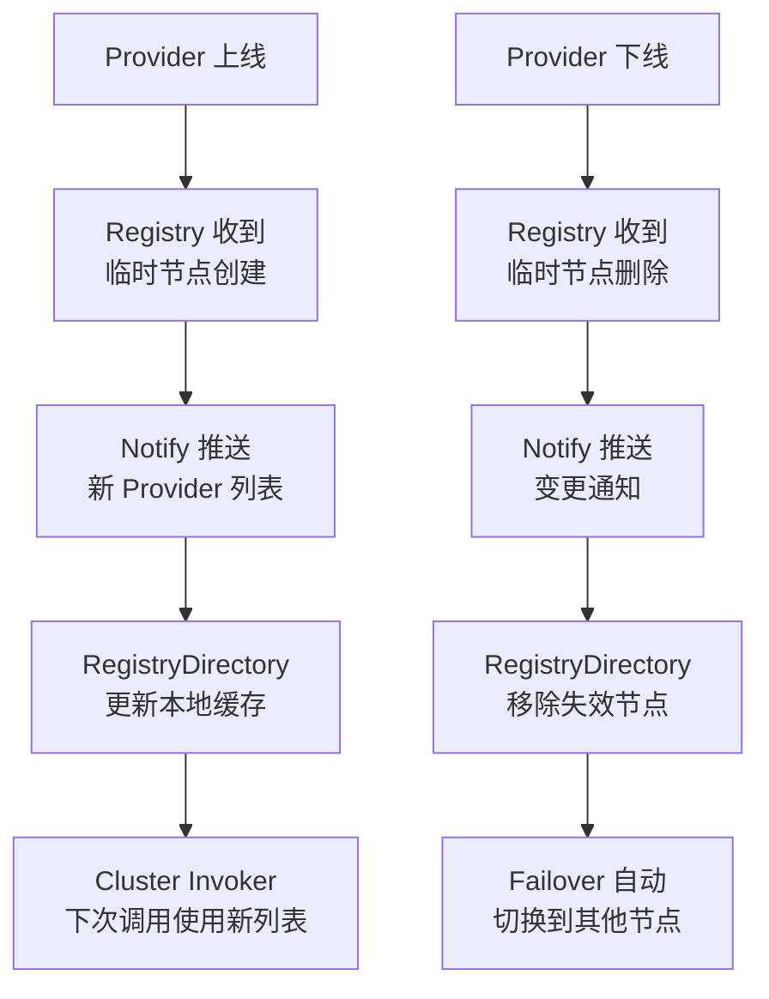

候选人小王在面试阿里 P6 时，面试官问："Dubbo 的服务是什么时候暴露出去的？如果我想等注册中心启动后再暴露，该怎么做？"

小王说："启动的时候就会暴露..."面试官追问："具体是什么时机？Spring Bean 初始化的时候还是容器刷新完成后？"

小王开始擦汗。

【面试官心理】
服务暴露时机是 Dubbo 最容易被忽略的细节。90% 的候选人只知道"服务会暴露"，不知道暴露的精确时机和延迟暴露的用法。这道题能答好的，基本都看过 Dubbo 的源码。

## 一、服务暴露的四步流程 🔴

### 1.1 完整暴露链路

Dubbo 服务暴露不是简单地把服务扔到注册中心，背后有一系列精细的步骤：

```mermaid
graph TD
    A[@DubboService 注解<br/>被 Spring 扫描] --> B[ServiceBean<br/>实例化]
    B --> C[Spring 容器刷新完成<br/>ContextRefreshedEvent 触发]
    C --> D[DubboBootstrap.start<br/>启动引导]
    D --> E[ServiceConfig.export<br/>导出服务]
    E --> F{delay 配置？}
    F -->|是| G[延迟暴露<br/>等待 delay 毫秒]
    F -->|否| H[立即暴露]
    G --> H
    H --> I[注册到注册中心<br/>Registry]
    I --> J[启动 Netty Server<br/>监听20880端口]
    J --> K[通知 Monitor<br/>记录元数据]
```

**关键代码入口**：

```java
// ServiceBean 监听 Spring 容器刷新事件
public class ServiceBean<T> extends ServiceConfig<T>
    implements ApplicationListener<ContextRefreshedEvent> {

    @Override
    public void onApplicationEvent(ContextRefreshedEvent event) {
        // 只有 Root ApplicationContext 触发时才暴露
        if (event.getApplicationContext().getParent() == null) {
            DubboBootstrap.getInstance().start();
        }
    }
}

// DubboBootstrap.start() 的核心逻辑
public void start() {
    // 1. 导出服务（protocol.export）
    // 2. 注册到注册中心（registry.register）
}
```

### 1.2 ❌ 错误示范

**候选人原话**："Dubbo 的服务暴露是在 Spring 的 InitializingBean 里做的。"

**问题诊断**：
- 混淆了 Spring Bean 生命周期和 Dubbo 服务暴露时机
- InitializingBean 的 afterPropertiesSet 用于初始化 Bean，不是服务暴露
- 真正的暴露时机是 ApplicationListener

**面试官内心 OS**：这个候选人显然没有看过源码，只是在网上搜过一些零散的文章。

## 二、Spring Boot 整合流程 🟡

### 2.1 @DubboService vs @Service

Spring Boot 环境下，Dubbo 提供了两种注解：

| 注解 | 所属框架 | 作用 | 注册到 |
| --- | --- | --- | --- |
| `@DubboService` | Dubbo | 暴露 Dubbo 服务 | 注册中心（ZooKeeper/Nacos） |
| `@Service`（Spring） | Spring | 注册 Spring Bean | Spring IOC 容器 |

```java
// ✅ 正确：暴露 Dubbo 服务
@DubboService(version = "1.0.0", group = "order-service")
public class OrderServiceImpl implements OrderService {
    // Dubbo 服务，会注册到注册中心
}

// ❌ 错误：只在本地注册，不会暴露给消费者
@Service
public class OrderServiceImpl implements OrderService {
    // 只是 Spring Bean，不会暴露 Dubbo 服务
}
```

### 2.2 自动装配流程

Spring Boot 通过 `DubboAutoConfiguration` 实现自动装配：

```mermaid
graph TD
    A[DubboAutoConfiguration] --> B[自动装配<br/>@EnableDubbo<br/>@DubboComponentScan]
    B --> C[扫描 @DubboService<br/>和 @DubboReference]
    C --> D[创建 ServiceBean<br/>和 ReferenceBean]
    D --> E[等待容器刷新完成]
    E --> F[DubboBootstrap.start]
```

**关键配置参数**：

```yaml
dubbo:
  application:
    name: order-service
  registry:
    address: nacos://127.0.0.1:8848
    group: order
  protocol:
    name: dubbo
    port: 20880      # Dubbo 协议默认端口
    threads: 200     # IO 线程数
  provider:
    timeout: 3000    # 提供者超时（默认值）
    retries: 0       # 重试次数
  consumer:
    timeout: 3000    # 消费者超时
    check: false     # 启动时不检查提供者
```

## 三、服务引用（Refer）流程 🟡

### 3.1 @DubboReference 的引用过程

服务引用比服务暴露更复杂，因为它涉及订阅和动态感知：

```mermaid
graph TD
    A[@DubboReference 注解<br/>被扫描] --> B[ReferenceBean<br/>创建]
    B --> C[DubboBootstrap.start<br/>触发引用]
    C --> D[RegistryDirectory<br/>创建目录]
    D --> E[向注册中心<br/>订阅服务]
    E --> F[注册中心返回<br/>Provider 列表]
    F --> G[Invoker 链路<br/>Cluster + LoadBalance]
    G --> H[动态代理生成<br/>Stub 类]
```

**Refer 的核心代码**：

```java
// ReferenceBean 继承自 ReferenceConfig
public class ReferenceBean<T> extends ReferenceConfig<T>
    implements FactoryBean, ApplicationContextAware {

    @Override
    public Object getObject() {
        // 触发 init() -> createProxy()
        return init();
    }

    private T createProxy(Map<String, String> params) {
        // 1. 判断是直连还是注册中心模式
        if (url != null) {
            // 直连：直接连接指定地址
            urls.add(url);
        } else {
            // 注册中心：订阅获取地址
            List<URL> urls = registryProtocol.getRegistry(this)
                .getAddresses(...);
        }

        // 2. 构建 Invoker 链
        Invoker<T> invoker = cluster.join(
            directory = new RegistryDirectory<>(type, url)
        );

        // 3. 生成代理对象
        return proxyFactory.getProxy(invoker);
    }
}
```

### 3.2 订阅通知机制

Consumer 订阅服务后，注册中心会推送 Provider 列表的变化：



**关键问题**：如果注册中心推送延迟，Consumer 调用了一个已下线的 Provider，会发生什么？

答案是：**Dubbo 有心跳检测机制**。如果调用失败，Dubbo 会标记该 Provider 为不可用，后续调用不再发送到该节点。

## 四、延迟暴露（Delay Export）🟢

### 4.1 延迟暴露的场景

延迟暴露是解决"注册中心未就绪就暴露服务"问题的利器：

```java
// 延迟 5 秒暴露
@DubboService(delay = 5000)
public class OrderServiceImpl implements OrderService {
    // 服务将在 Spring 容器启动后 5 秒才暴露
}

// 延迟到 Spring 容器完全启动
@DubboService(delay = -1)
// delay = -1 表示等 Spring 容器完全启动后再暴露
```

### 4.2 延迟暴露的原理

```java
// ServiceConfig.export() 中的延迟逻辑
public synchronized void export() {
    if (delay != null && delay > 0) {
        // 延迟暴露：用定时器等待
        delayExportExecutor.schedule(() -> {
            doExport();
        }, delay, TimeUnit.MILLISECONDS);
    } else {
        // 立即暴露或等 Spring 容器刷新
        doExport();
    }
}

// ServiceBean 中 delay = -1 的处理
public void onApplicationEvent(ContextRefreshedEvent event) {
    if (shouldExport()) {
        DubboBootstrap.getInstance().export();
    }
}
```

### 4.3 ❌ 错误示范

**候选人原话**："我把 delay 设置为 -1 是为了让服务不暴露。"

**问题诊断**：
- 完全理解错了 delay 参数的含义
- `-1` 表示不延迟暴露，在 Spring 容器刷新时立即暴露
- 如果想控制暴露时机，应该用 `export = false` 手动暴露

【面试官心理】
这个问题虽然细节，但能答好的候选人说明他真正动手研究过源码。延迟暴露是一个生产中常用的技巧——比如等待数据库连接池就绪后再暴露服务，避免服务暴露后调用失败。

## 五、Refer 阶段的订阅机制 🟡

### 5.1 RegistryDirectory 的动态感知

RegistryDirectory 是 Dubbo 2.7 引入的核心组件，它持有 Provider 列表的本地缓存，并监听注册中心的变更：

```java
public class RegistryDirectory<T> extends AbstractDirectory<T> {

    // 本地缓存的 Invoker 列表
    private volatile List<Invoker<T>> invokers = new ArrayList<>();

    // 注册中心推送触发更新
    @Override
    public void notify(List<URL> urls) {
        // 1. 解析urls，区分是 provider 还是 router 还是 config
        Map<String, List<URL>> providerMap = toRouters(urls);

        // 2. 转换为 Invoker
        List<Invoker<T>> newInvokers = convert(providerMap);

        // 3. 更新本地缓存
        this.invokers = newInvokers;

        // 4. 通知 Cluster 刷新
        routerChain.setInvokers(newInvokers);
    }
}
```

### 5.2 三种 URL 类型

注册中心推送的 URL 有三种类型，Dubbo 通过协议头区分：

| URL 类型 | 协议头 | 作用 |
| --- | --- | --- |
| Provider URL | `dubbo://` | 服务提供者地址 |
| Router URL | `router://` | 路由规则 |
| Config URL | `config://` | 动态配置 |

```java
// URL 解析示例
// dubbo://192.168.1.100:20880/com.xxx.OrderService?version=1.0.0&group=order
//                           ^协议  ^IP   ^端口  ^接口 ^版本  ^分组
```

## 六、工程选型

### 6.1 什么场景需要延迟暴露

| 场景 | 配置 | 原因 |
| --- | --- | --- |
| 等待数据库就绪 | `delay = -1` | 服务暴露后如果依赖 DB，调用会失败 |
| 等待注册中心就绪 | `delay = 3000` | 注册中心启动慢，避免连接失败 |
| 等待 warm-up | `delay = 10000` | JIT 编译需要时间，避免瞬时性能下降 |

### 6.2 手动暴露控制

```java
// 手动控制暴露时机
@DubboService(export = false)
public class OrderServiceImpl implements OrderService {
    // 不会自动暴露
}

// 在应用启动后手动暴露
@Service
public class BootstrapRunner implements ApplicationRunner {
    @Autowired
    private ApplicationContext context;

    @Override
    public void run(ApplicationArguments args) {
        // 等待各种资源就绪后，手动暴露
        OrderServiceImpl service = context.getBean(OrderServiceImpl.class);
        // 获取 ReferenceBean/ServicBean 手动调用 export()
    }
}
```

:::tip 💡
DubboBootstrap.start() 是幂等的，多次调用不会重复暴露服务。这个设计让你可以在任何时机调用它来触发暴露。
:::

:::warning ⚠️
服务引用时，如果注册中心返回的 Provider 列表为空，Dubbo 默认会抛异常（`check = true`）。生产环境建议设置 `check = false`，让服务启动成功，然后在运行时感知 Provider。
:::

## 七、生产避坑

### 7.1 常见翻车点

1. **注册中心网络不通**：Provider 启动了但注册失败，Consumer 找不到服务
2. **版本号不匹配**：Provider 的 version 和 Consumer 的 version 对不上
3. **端口冲突**：多实例部署时端口配置冲突
4. **元数据未推送**：Dubbo 2.7 的元数据中心未配置，导致服务可见但方法不可见

### 7.2 排查方法

```bash
# 查看服务是否暴露到注册中心
zkCli.sh -server 127.0.0.1:2181 get /dubbo/com.xxx.OrderService/providers

# 查看 Dubbo 服务端口是否监听
netstat -tlnp | grep 20880

# 查看引用是否成功
dubbo admin -> 消费者 -> 查看订阅状态

# 开启调试
dubbo:
  application:
    logger: slf4j
  dubbo:
    level: DEBUG
```

【面试官心理】
服务暴露与引用是 Dubbo 最核心的启动流程。能说清楚 ContextRefreshedEvent 触发时机、RegistryDirectory 的动态感知、延迟暴露的用法的候选人，说明他有源码阅读能力。这种候选人在我这里是 P6+ 的水平。
