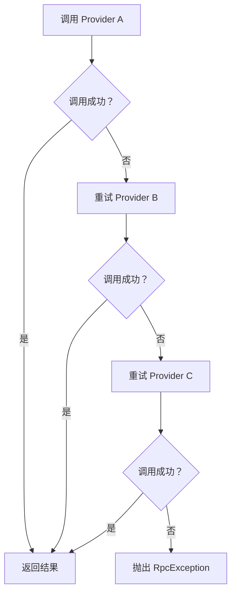
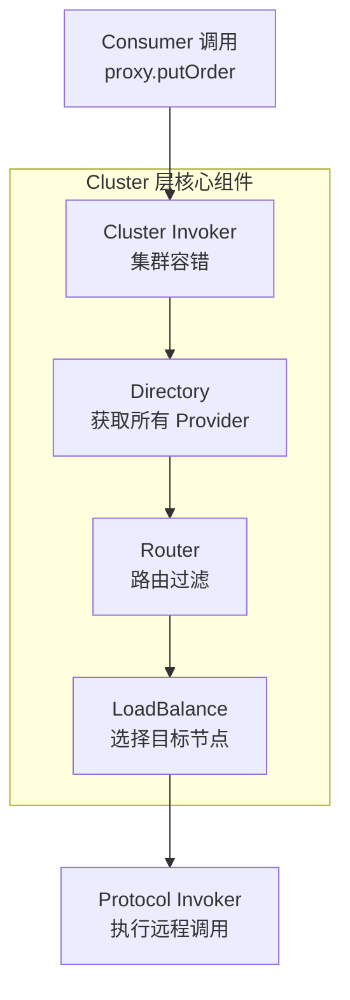
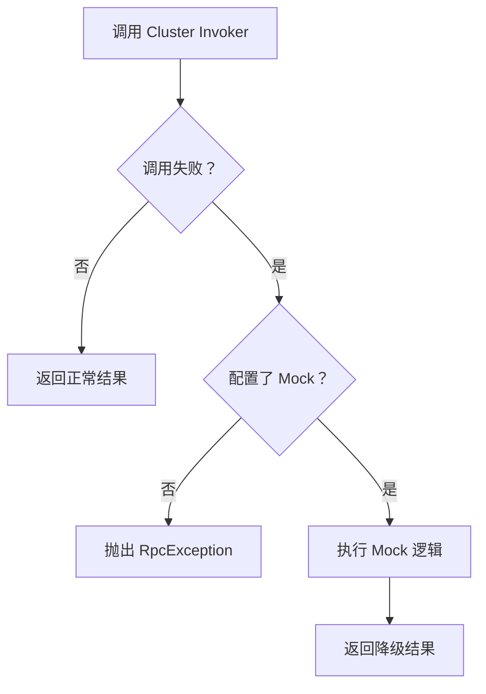
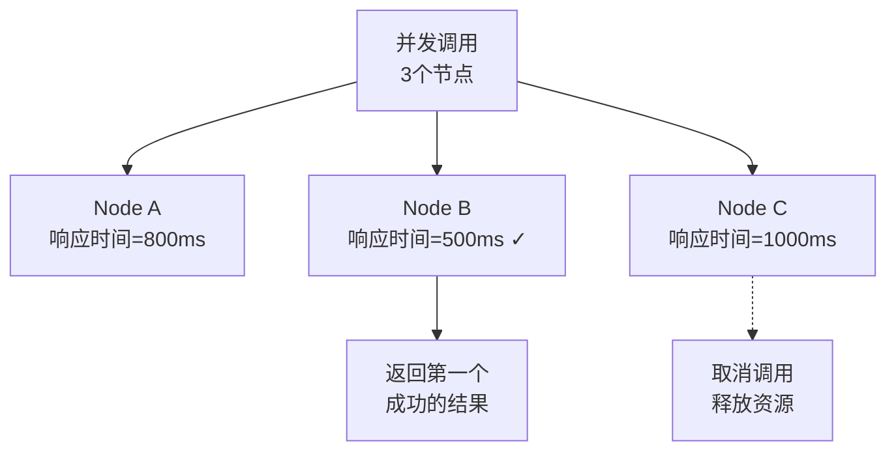
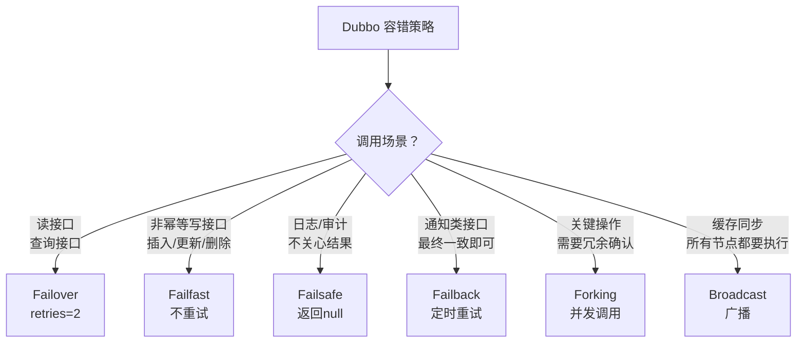

候选人小李在面试美团 P6 时，被问到："Dubbo 的集群容错策略有哪些？如果调用失败了怎么处理？"

小张回答："有失败重试。"面试官追问："重试几次？什么接口可以重试？什么接口不能重试？"

小李："...所有接口都能重试吧？"

【面试官心理】
容错机制是分布式系统的生死线。能区分幂等和非幂等接口、能说清楚各种容错策略适用场景的候选人，说明他有生产经验。很多线上故障就是因为没有理解重试的代价。

## 一、六种容错策略 🔴

### 1.1 策略一览

| 策略 | 类名 | 行为 | 适用场景 | 副作用 |
| --- | --- | --- | --- | --- |
| Failover | `FailoverCluster` | 失败自动切换到其他节点 | 查询、读接口 | 可能重复操作 |
| Failfast | `FailfastCluster` | 快速失败，不重试 | 非幂等写接口 | 可能丢请求 |
| Failsafe | `FailsafeCluster` | 失败静默返回空 | 日志、审计 | 可能丢数据 |
| Failback | `FailbackCluster` | 失败后定时重试 | 通知类接口 | 可能延迟 |
| Forking | `ForkingCluster` | 并发调用多个节点 | 对结果有冗余校验 | 资源消耗大 |
| Broadcast | `BroadcastCluster` | 广播所有节点 | 更新所有缓存 | 无 |

### 1.2 Failover（失败自动切换）

**这是 Dubbo 的默认容错策略，也是最容易出问题的策略。**

```java
@DubboReference(cluster = "failover", retries = 3)
private OrderService orderService;
```

Failover 的调用链路：



**源码核心**：

```java
public class FailoverClusterInvoker<T> extends AbstractClusterInvoker<T> {

    @Override
    public Result doInvoke(Invocation invocation, List<Invoker<T>> invokers, LoadBalance loadbalance) {
        List<Invoker<T>> copy = invokers;
        int len = getUrl().getMethodParameter(invocation.getMethodName(),
            Constants.RETRIES_KEY, Constants.DEFAULT_RETRIES) + 1; // retries + 1

        Exception exception = null;
        for (int i = 0; i < len; i++) {
            Invoker<T> invoker;
            if (i > 0) {
                // 每次重试前，检查服务是否恢复
                copy = list(invocation);
                if (copy.isEmpty()) {
                    throw new RpcException("No provider available...");
                }
            }

            try {
                // 负载均衡选择节点
                invoker = select(loadbalance, copy, invocation);
                // 执行调用
                Result result = invoker.invoke(invocation);
                return result;
            } catch (Exception e) {
                // 记录异常，继续重试
                exception = e;
            }
        }
        throw new RpcException("Failover 调用失败", exception);
    }
}
```

### 1.3 ❌ 错误示范

**候选人原话**："所有 Dubbo 接口都应该用 Failover，因为重试总比失败好。"

**问题诊断**：
- 完全不理解幂等性的概念
- 插入接口用 Failover 会导致数据重复
- 更新接口用 Failover 可能导致数据覆盖
- 删除接口用 Failover 可能导致误删

**面试官内心 OS**：这种候选人如果上了生产，肯定会写出"重试导致重复下单"的 bug。

### 1.4 容错策略与幂等性对应

| 接口类型 | 幂等性 | 推荐容错策略 | 原因 |
| --- | --- | --- | --- |
| GET | 幂等 | Failover | 重试无害 |
| SELECT | 幂等 | Failover | 重试无害 |
| INSERT | 非幂等 | Failfast/Failsafe | 重试会重复插入 |
| UPDATE | 视情况 | Failfast | 重试可能覆盖他人更新 |
| DELETE | 非幂等 | Failfast | 重试可能误删 |

## 二、Cluster Invoker 调用链路 🟡

### 2.1 完整链路

Dubbo 的每一次远程调用，都会经过 Cluster 层的多层包装：



**层层递进**：

```java
// 1. Cluster Invoker 负责容错
Invoker<T> clusterInvoker = new FailoverClusterInvoker<>(directory);

// 2. Directory 获取所有可用 Invoker
List<Invoker<T>> invokers = directory.list(invocation);

// 3. Router 过滤不满足路由规则的 Invoker
invokers = routerChain.route(invokers, invocation);

// 4. LoadBalance 选择最终目标
Invoker<T> selected = loadbalance.select(invokers, invocation);

// 5. Protocol Invoker 执行调用
Result result = selected.invoke(invocation);
```

### 2.2 Directory 的作用

Directory 负责维护 Provider 列表，并监听注册中心的变化：

```java
public class RegistryDirectory<T> extends AbstractDirectory<T>
    implements NotifyListener {

    // 本地缓存的 Invoker 列表
    private volatile List<Invoker<T>> invokers = new ArrayList<>();

    @Override
    public List<Invoker<T>> doList(Invocation invocation) {
        // 1. 从 invokers 中过滤出符合条件的 Invoker
        // 2. 通过 Router 进行路由过滤
        return routerChain.route(invokers, invocation);
    }

    // 注册中心推送触发
    @Override
    public void notify(List<URL> urls) {
        // 更新本地缓存的 invokers
        this.invokers = convert(providers);
        // 通知 Router 刷新
        routerChain.setInvokers(invokers);
    }
}
```

### 2.3 Router（路由规则）

Dubbo 支持基于条件的路由规则：

```yaml
dubbo:
  router:
    - name: condition
      priority: 1
      enabled: true
      force: false
      rule: |
        host = 192.168.* => host != 192.168.1.100
        # 1.1.x 网段的调用优先打 2.x 节点
```

## 三、服务降级（Mock）🟡

### 3.1 Mock 的使用场景

Mock 用于在服务不可用时返回降级结果，而不是直接抛出异常：

```java
// 配置降级逻辑
@DubboReference(mock = "com.xxx.OrderServiceMock")
private OrderService orderService;

// 或者直接配置返回值
@DubboReference(mock = "return null")
private OrderService orderService;

// 编程式配置
@DubboReference(mock = "force:return null")
private OrderService orderService;
```

### 3.2 Mock 的执行时机



**Mock 的触发条件**：
1. 服务提供者不可用（网络超时、节点宕机）
2. 服务提供者抛出 RpcException
3. `force:return` 强制返回，不发起实际调用

## 四、Failback（失败定时重试）🟢

### 4.1 适用场景

Failback 适用于**不要求实时性，但必须最终成功**的场景：

- 短信通知
- 邮件发送
- 支付回调
- 日志上报

```java
@DubboReference(cluster = "failback", timeout = 1000)
private NotifyService notifyService;
```

### 4.2 实现原理

```java
public class FailbackClusterInvoker<T> extends AbstractClusterInvoker<T> {

    private ScheduledExecutorService scheduledExecutor =
        Executors.newScheduledThreadPool(1);

    @Override
    protected Result doInvoke(Invocation invocation,
                               List<Invoker<T>> invokers,
                               LoadBalance loadbalance) {
        try {
            checkInvokers(invokers, invocation);
            Invoker<T> invoker = select(loadbalance, invokers, invocation);
            return invoker.invoke(invocation);
        } catch (Exception e) {
            // 失败后，将请求加入定时重试队列
            addFailed(loadInvocation(invocation, invokers));
            // 静默返回
            return AsyncRpcResult.newDefaultAsyncResult(invocation);
        }
    }

    // 定时重试
    private void addFailed(RetryScheduledTask task) {
        scheduledExecutor.scheduleWithFixedDelay(task, 5, 5, TimeUnit.SECONDS);
    }
}
```

### 4.3 ❌ 错误示范

**候选人原话**："Failback 的重试间隔是 5 秒，可以配置。"

**问题诊断**：
- 重试间隔是硬编码的 5 秒，无法配置（这是 Dubbo 2.7 的情况）
- 3.0 版本支持自定义重试间隔和重试次数
- 但 Failback 本身的问题是无法保证重试一定成功，可能丢失请求

【面试官心理】
Failback 是最容易踩坑的策略。它的"静默返回"会让人误以为调用成功了，但实际上请求可能永久丢失。生产环境中，Failback 通常需要配合 MQ 使用，确保消息不丢失。

## 五、Forking（并发调用）🟢

### 5.1 Forking 的使用场景

Forking 会同时调用多个节点，返回第一个成功的结果：

```java
@DubboReference(cluster = "forking", forks = 3, timeout = 1000)
private OrderService orderService;
```



### 5.2 适用场景

| 场景 | 推荐策略 | 原因 |
| --- | --- | --- |
| 高频查询，需要最快响应 | Forking | 取最快响应 |
| 关键写操作，需要冗余确认 | Forking | 多数一致即可 |
| 异步通知，不关心结果 | Failsafe | 静默丢弃 |
| 批量操作，所有节点都要执行 | Broadcast | 确保全部生效 |

## 六、工程选型

### 6.1 策略选择原则



### 6.2 降级策略

```yaml
dubbo:
  consumer:
    # 默认容错策略
    cluster: failover
    # 默认重试次数
    retries: 0
    # 超时时间
    timeout: 3000
    # 降级 Mock
    mock: force:return null

# 针对特定接口配置
dubbo:
  consumer:
    - method: getOrder
      timeout: 1000
      cluster: failover
      retries: 3
    - method: createOrder
      timeout: 5000
      cluster: failfast
```

:::tip 💡
重试次数 `retries` 的默认值在 Dubbo 2.7 是 2，Dubbo 3.0 改成了 0（不重试）。这是因为 Dubbo 3.0 认为重试应该由调用方显式控制，而不是框架默认行为。
:::

:::warning ⚠️
Failover 的重试发生在 Cluster 层，不是在 Protocol 层。这意味着重试时会重新经过 Router 和 LoadBalance，每次可能打到不同的节点。如果你用的是一致性哈希路由，Failover 重试会导致同一请求打到不同节点，破坏缓存命中。
:::

## 七、生产避坑

### 7.1 常见翻车点

1. **插入接口用了 Failover**：导致重复下单、重复创建用户
2. **超时配置过长**：Failover 重试多次，每次都超时，导致最终失败时间过长
3. **重试风暴**：多个服务同时 Failover，导致下游被打爆
4. **Mock 配置错误**：`force:return` 和 `fail:return` 混淆，前者不发起调用，后者先尝试再降级

### 7.2 排查方法

```bash
# 查看重试次数配置
dubbo.admin -> 服务详情 -> 消费者配置

# 查看 Cluster Invoker 类型
# 在日志中搜索 cluster 类型
grep "cluster" dubbo.log

# 开启调用链路日志
-Ddubbo.tracing.logger=slf4j
```

【面试官心理】
容错机制是分布式系统的基本功。能说清楚幂等性对容错策略的影响、能区分六种容错策略的适用场景的候选人，说明他有生产经验。这种候选人在我这里是 P6+ 的水平。
