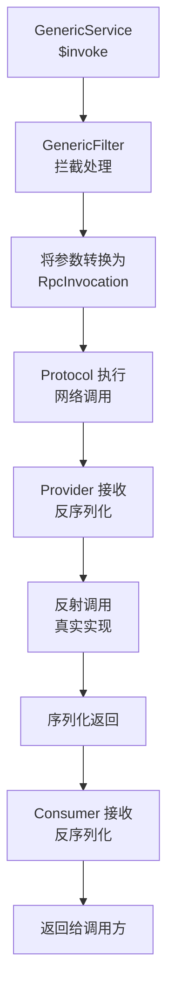
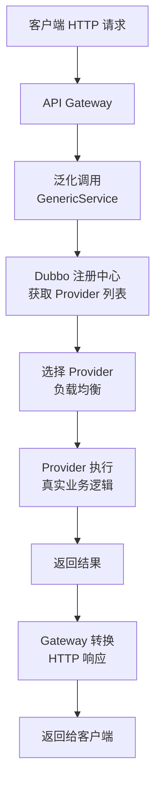

候选人小李在面试阿里 P6 时，面试官问："你们公司如果要在网关层调用后端服务，但不想引入所有服务的 API 依赖，该怎么办？"

小李想了半天，说："可以用 HTTP 调用..."面试官追问："如果后端就是 Dubbo 服务呢？"

小李卡住了。

【面试官心理】
泛化调用是 Dubbo 解决"跨语言调用"和"网关集成"的核心能力。很多候选人只知道用 @DubboReference 注入，但不知道 Dubbo 提供了一个不需要依赖 API jar 的调用方式。这道题考察的是候选人对 Dubbo 生态的全面理解。

## 一、泛化调用的使用场景 🔴

### 1.1 什么时候需要泛化调用

泛化调用的典型场景：

| 场景 | 痛点 | 泛化调用如何解决 |
| --- | --- | --- |
| API 网关 | 不可能引入所有后端 API | 只依赖 Dubbo 接口名，用字符串调用 |
| 测试平台 | 不想 mock 所有接口 | 动态构造请求参数 |
| 数据同步 | 跨系统调用 | 不依赖对方系统的 API jar |
| 动态代理平台 | 运行时决定调用哪个接口 | 接口名和方法名都是动态的 |

### 1.2 ❌ 错误示范

**候选人原话**："Dubbo 泛化调用就是用 FastJSON 序列化参数。"

**问题诊断**：
- 完全不理解泛化调用的本质
- 泛化调用解决的是"没有接口定义"的问题
- FastJSON 只是序列化方式，和泛化调用是两个概念

【面试官心理】
泛化调用是 Dubbo 面试中的进阶问题。能说清楚泛化调用的原理和适用场景的候选人，说明他对 Dubbo 有深度理解，不只是会用 API。

## 二、泛化调用的使用方法 🟡

### 2.1 基础配置

**方式一：XML 配置**

```xml
<dubbo:reference id="orderService" interface="com.xxx.OrderService"
    generic="true" />
```

**方式二：注解配置**

```java
@DubboReference(generic = true)
private GenericService orderService;
```

**方式三：编程式**

```java
ReferenceConfig<GenericService> reference = new ReferenceConfig<>();
reference.setInterface("com.xxx.OrderService");
reference.setGeneric(true);
GenericService genericService = reference.get();
```

### 2.2 调用方式

**GenericService 提供的两个核心方法**：

```java
public interface GenericService {
    // 同步调用
    Object $invoke(String methodName, String[] parameterTypes, Object[] args);

    // 异步调用
    Object $invokeAsync(String methodName, String[] parameterTypes, Object[] args);
}
```

**调用示例**：

```java
// 引入 GenericService
@DubboReference(generic = true)
private GenericService orderService;

// 调用 putOrder(String id, double amount)
// 注意：泛化调用需要传入完整的参数类型
Object result = orderService.$invoke(
    "putOrder",                          // 方法名
    new String[]{"java.lang.String", "double"},  // 参数类型（全限定名）
    new Object[]{"ORDER_123", 100.0}     // 参数值
);

// 强制类型转换
Order order = (Order) result;
```

### 2.3 泛化的调用链路



## 三、泛化调用的底层原理 🟡

### 3.1 GenericFilter

Dubbo 通过 `GenericFilter` 处理泛化调用请求：

```java
@Activate(group = Constants.PROVIDER, value = Constants.GENERIC_KEY)
public class GenericFilter implements Filter {

    @Override
    public Result invoke(Invoker<?> invoker, Invocation invocation) throws RpcException {
        if (invocation.getMethodName().equals(Constants.$INVOKE)
            && invocation.getArguments() != null
            && invocation.getArguments().length == 3) {

            // 泛化调用的特殊参数
            String method = (String) invocation.getArguments()[0];
            String[] types = (String[]) invocation.getArguments()[1];
            Object[] args = (Object[]) invocation.getArguments()[2];

            // 反射调用真实方法
            ReflectUtils.findMethodByMethodSignature(invoker.getInterface(), method, types);
            Method targetMethod = ...;

            // 执行真实方法
            return invoker.invoke(new RpcInvocation(targetMethod, args));
        }
        return invoker.invoke(invocation);
    }
}
```

### 3.2 客户端参数转换

客户端在发起泛化调用时，需要把参数转换为 Dubbo 能识别的格式：

```java
public class GenericFilter implements Filter {

    @Override
    public Result invoke(Invoker<?> invoker, Invocation invocation) throws RpcException {
        if (RpcUtils.isGeneric(invocation)) {
            // 获取原始参数
            Object[] args = invocation.getArguments();

            // args[0] = methodName
            // args[1] = parameterTypes
            // args[2] = parameters

            // 对 Map 类型的参数进行处理
            // 如果 args[2] 中有 Map（Java 对象），需要转换为真实对象
            Object[] convertedArgs = PojoUtils.generalize(args[2]);
        }
    }
}
```

### 3.3 PojoUtils（复杂对象转换）

泛化调用中，如果参数是复杂对象（不是基本类型），需要用 Map 表示：

```java
// 传入 Order 对象（用 Map 表示）
Map<String, Object> orderMap = new HashMap<>();
orderMap.put("id", "ORDER_123");
orderMap.put("amount", 100.0);
orderMap.put("status", "CREATED");

// 泛化调用
orderService.$invoke(
    "putOrder",
    new String[]{"com.xxx.Order"},
    new Object[]{orderMap}  // 传入 Map，不是 Order 对象
);
```

Dubbo 的 `PojoUtils` 负责在 Provider 端把 Map 转换为真实的 POJO 对象：

```java
// PojoUtils.generalize: POJO -> Map（客户端）
// PojoUtils.realize:   Map -> POJO（服务端）
```

## 四、JavaRequest 的 Map 传参 🟢

### 4.1 为什么用 Map 传参

泛化调用没有编译期的接口定义，所有复杂对象都必须用 Map 表示：

```java
// ❌ 错误：传入真实对象
orderService.$invoke("putOrder",
    new String[]{"com.xxx.Order"},
    new Object[]{new Order("123", 100.0)}  // 编译错误！没有 Order 依赖

// ✅ 正确：传入 Map
orderService.$invoke("putOrder",
    new String[]{"com.xxx.Order"},
    new Object[]{createOrderMap()});
```

### 4.2 手动构建 Map

```java
private Map<String, Object> createOrderMap() {
    Map<String, Object> order = new HashMap<>();
    order.put("id", "ORDER_123");
    order.put("amount", 100.0);
    order.put("customer", createCustomerMap());
    order.put("items", Arrays.asList(createItemMap(), createItemMap()));
    return order;
}

private Map<String, Object> createCustomerMap() {
    Map<String, Object> customer = new HashMap<>();
    customer.put("id", "CUSTOMER_001");
    customer.put("name", "张三");
    return customer;
}

private Map<String, Object> createItemMap() {
    Map<String, Object> item = new HashMap<>();
    item.put("productId", "PROD_001");
    item.put("quantity", 2);
    return item;
}
```

## 五、ParameterizedType 泛型处理 🟢

### 5.1 泛型返回值的处理

如果泛化调用的返回值是复杂类型，需要自己处理泛型信息：

```java
// 返回值是 List<Order>
Object result = orderService.$invoke(
    "listOrders",
    new String[]{},
    new Object[]{}
);

// result 是 Object，需要手动转换
List<Map> resultList = (List<Map>) result;

// 手动转换为 Order 对象
List<Order> orders = resultList.stream()
    .map(map -> convertToOrder(map))
    .collect(Collectors.toList());

private Order convertToOrder(Map<String, Object> map) {
    Order order = new Order();
    order.setId((String) map.get("id"));
    order.setAmount((Double) map.get("amount"));
    return order;
}
```

### 5.2 Type 类型处理

Dubbo 提供了 `Type` 类型来处理泛型：

```java
// 使用 JavaParameterizedType 处理泛型
public class Generic parameterizedType = new JavaParameterizedType(
    new Type[]{List.class, Order.class}  // List<Order>
);

// 通过 Type 对象构建参数类型
String[] types = new String[]{parameterizedType.getTypeName()};
```

## 六、性能开销 🟢

### 6.1 泛化调用的性能问题

泛化调用比普通调用的性能开销大：

| 环节 | 普通调用 | 泛化调用 | 差距 |
| --- | --- | --- | --- |
| 序列化 | 已有 stub | 需要额外处理 Map | +20% |
| 反射调用 | 无 | Provider 端反射 | +15% |
| 类型转换 | 无 | Map -> POJO | +30% |
| 总计 | 基准 | - | +65% |

### 6.2 优化建议

1. **避免嵌套 Map**：嵌套层数越深，性能损耗越大
2. **复用 GenericService 实例**：不要每次调用都创建新的 ReferenceConfig
3. **考虑使用 gRPC**：如果性能是关键需求，gRPC 的 IDL 编译更高效
4. **缓存方法签名**：避免每次调用都解析方法签名

## 七、API 网关中的应用 🟡

### 7.1 网关调用架构



### 7.2 网关实现示例

```java
@RestController
@RequestMapping("/api")
public class ApiGateway {

    @DubboReference(generic = true)
    private GenericService genericService;

    @PostMapping("/call")
    public Object callService(@RequestBody DubboRequest request) {
        // request.service: 接口名
        // request.method: 方法名
        // request.params: 参数 Map

        Object result = genericService.$invoke(
            request.getMethod(),
            request.getParameterTypes(),
            request.getParams()
        );

        return result;
    }
}
```

:::tip 💡
Apache Dubbo 官方提供了 `dubbo-rpc-native-friendly` 模块，专门优化泛化调用的性能。如果你需要在网关层大量使用泛化调用，可以考虑集成这个模块。
:::

:::warning ⚠️
泛化调用的 `generic=true` 意味着 Consumer 端不需要引入 Provider 的 API jar。但这不代表 Provider 可以随意变更接口——接口签名变更（如参数类型、方法名）仍然会导致泛化调用失败。
:::

## 八、生产避坑

### 8.1 常见翻车点

1. **参数类型写错**：`double` vs `java.lang.Double`，少一个点都不行
2. **嵌套泛型没处理**：返回 `List<Map>` 但代码里当 `List<Order>` 处理
3. **Map 嵌套层数过深**：三层以上嵌套的性能损耗难以接受
4. **泛化调用没设超时**：默认超时时间可能过长

### 8.2 调试技巧

```java
// 开启泛化调用的调试日志
-Ddubbo.rpc.generic.filter=DEBUG

// 查看实际调用的方法签名
logger.info("Calling {} with types {} and args {}",
    methodName, parameterTypes, args);
```

【面试官心理】
泛化调用是 Dubbo 在网关和跨语言场景中的核心能力。能说清楚泛化调用的原理、适用场景和性能开销的候选人，说明他对 Dubbo 生态有全面理解。这种候选人在我这里是 P6+ 的水平。
