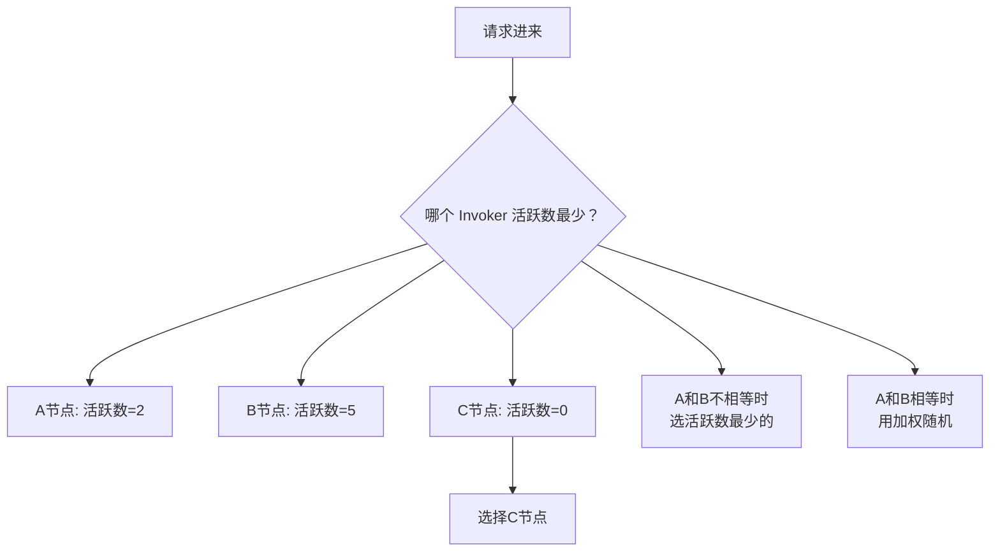
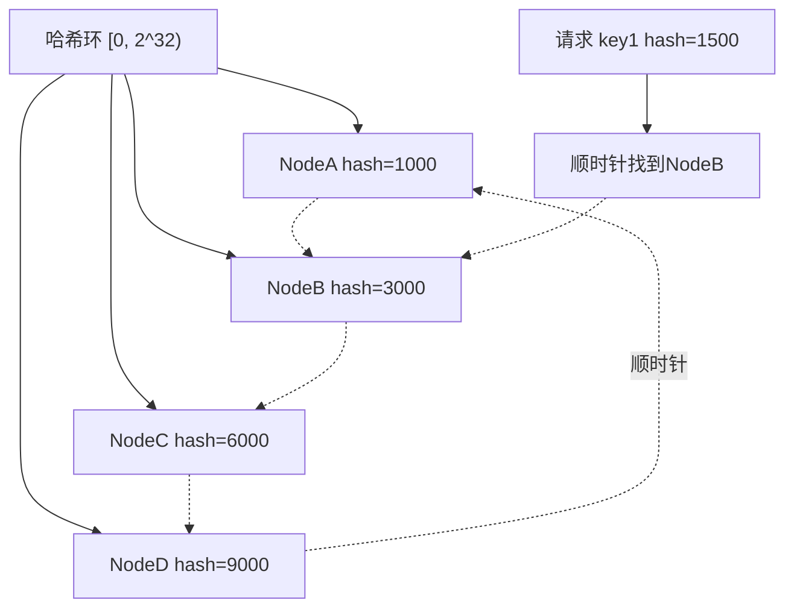
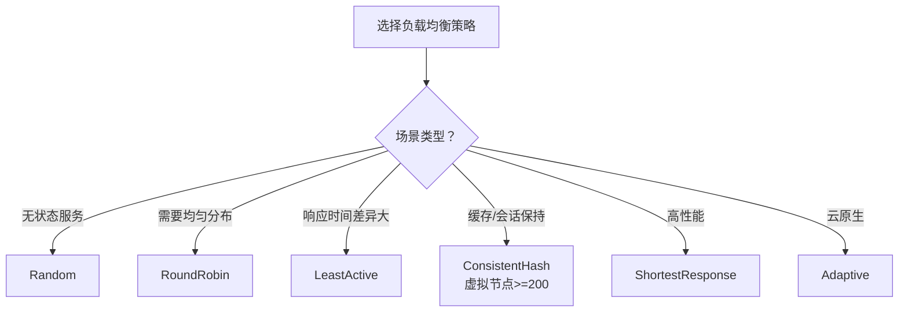

候选人小张在面试字节 P6 时，被问到："Dubbo 有哪几种负载均衡策略？加权轮询和普通轮询有什么区别？"

小张说："有随机、加权随机、轮询..."面试官追问："那一致性哈希用过吗？虚拟节点是怎么实现的？"

小张："..."

【面试官心理】
负载均衡是 RPC 框架中最考察算法功底的部分。随机和轮询大家都用过，但能说清楚"平滑加权轮询"和"一致性哈希虚拟节点"的候选人，才是真正理解过源码的。这道题是 P6 和 P5 的分水岭。

## 一、六种负载均衡策略 🔴

### 1.1 策略一览

| 策略 | 类名 | 核心原理 | 适用场景 | 命中率 |
| --- | --- | --- | --- | --- |
| Random | `RandomLoadBalance` | 加权随机 | 无状态服务 | 高频 |
| RoundRobin | `RoundRobinLoadBalance` | 平滑加权轮询 | 需保证请求均匀 | 中频 |
| LeastActive | `LeastActiveLoadBalance` | 最少活跃数 | 响应时间差异大的服务 | 中频 |
| ConsistentHash | `ConsistentHashLoadBalance` | 一致性哈希 | 缓存命中、Session 保持 | 低频 |
| ShortestResponse | `ShortestResponseLoadBalance` | 最短响应时间 | 高性能要求 | 低频 |
| Adaptive | `AdaptiveLoadBalance` | 自适应负载均衡 | Dubbo 3.0 云原生 | 低频 |

### 1.2 Random（加权随机）

加权随机是最常用的负载均衡策略，核心思想是：**权重越大的节点，被选中的概率越高**。

```java
public class RandomLoadBalance extends AbstractLoadBalance {

    @Override
    protected <T> T doSelect(List<Invoker<T>> invokers, URL url, Invocation invocation) {
        int length = invokers.size();
        boolean sameWeight = true;
        int[] weights = new int[length];

        // 1. 计算每个 Invoker 的权重
        for (int i = 0; i < length; i++) {
            int weight = getWeight(invokers.get(i), invocation);
            weights[i] = weight;

            // 检查权重是否相同
            if (sameWeight && i > 0 && weight != weights[i-1]) {
                sameWeight = false;
            }
        }

        // 2. 权重相同 -> 纯随机
        if (sameWeight) {
            return invokers.get(ThreadLocalRandom.current().nextInt(length));
        }

        // 3. 权重不同 -> 加权随机（核心算法）
        int offset = ThreadLocalRandom.current().nextInt(totalWeight);
        for (int i = 0; i < length; i++) {
            offset -= weights[i];
            if (offset < 0) {
                return invokers.get(i);
            }
        }
        return invokers.get(invokers.size() - 1);
    }
}
```

**加权随机的数学原理**：

```
假设有三个节点：
- A 权重 = 5
- B 权重 = 3
- C 权重 = 2
总权重 = 10

随机一个 [0, 10) 的数：
- [0, 5)  -> A（概率 50%）
- [5, 8)  -> B（概率 30%）
- [8, 10) -> C（概率 20%）
```

### 1.3 ❌ 错误示范

**候选人原话**："加权随机就是给每个节点分配一个区间，权重越大区间越大。"

**问题诊断**：
- 说对了原理但不够精确
- 正确做法是"随机一个偏移量 offset，然后遍历减去权重"而不是"直接分配区间"
- 这道题我通常会追问源码细节

**面试官内心 OS**：这个人知道加权随机的思想，但没有动手看过源码。P6 候选人至少应该能说出源码的关键变量名。

## 二、RoundRobin（平滑加权轮询）🟡

### 2.1 为什么普通轮询不够用

假设有三个节点 A、B、C，权重分别是 5、1、1：

| 请求 | 普通轮询 | 加权轮询（平滑） |
| --- | --- | --- |
| 1 | A | A（current=4） |
| 2 | B | A（current=3） |
| 3 | C | A（current=2） |
| 4 | A | A（current=1） |
| 5 | A | A（current=0） |
| 6 | A | A（current=-1, 重置） |
| 7 | A | B（current=0） |
| 8 | A | A（current=-1, 重置） |
| 9 | A | A（current=-2, 重置） |
| 10 | A | A（current=-3, 重置） |

普通轮询在短时间内会让 A 连续承担 5 个请求，造成瞬时压力不均。

### 2.2 平滑加权轮询的原理

Dubbo 使用 **SmoothWeightedRoundRobin**（平滑加权轮询），核心思想是：**每次选择 effectiveWeight 最大的节点，然后降低其 currentWeight**。

```java
public class RoundRobinLoadBalance extends AbstractLoadBalance {

    // 每个 Invoker 的当前 currentWeight
    private ConcurrentMap<String, WeightedRoundRobin> weightMap = new ConcurrentHashMap<>();

    @Override
    protected <T> T doSelect(List<Invoker<T>> invokers, URL url, Invocation invocation) {
        String key = invokers.get(0).getUrl().getServiceKey();
        int totalWeight = 0;
        long maxCurrent = Long.MIN_VALUE;
        Invoker<T> selectedInvoker = null;
        WeightedRoundRobin selectedWRR = null;

        // 1. 遍历所有 Invoker，找 currentWeight 最大的
        for (Invoker<T> invoker : invokers) {
            String identifyString = invoker.getUrl().identifyString();
            WeightedRoundRobin weightedRoundRobin = weightMap.computeIfAbsent(
                identifyString, k -> new WeightedRoundRobin()
            );

            // 2. 更新 effectiveWeight（权重不变）
            int weight = getWeight(invoker, invocation);
            weightedRoundRobin.setWeight(weight);

            // 3. 核心：currentWeight += effectiveWeight
            //    每次轮询都增加，增加幅度取决于权重
            weightedRoundRobin.incurCounter();

            // 4. 比较 currentWeight，找最大的
            if (weightedRoundRobin.getCurrentWeight() > maxCurrent) {
                maxCurrent = weightedRoundRobin.getCurrentWeight();
                selectedInvoker = invoker;
                selectedWRR = weightedRoundRobin;
            }
            totalWeight += weight;
        }

        // 5. 选中后，currentWeight -= totalWeight
        //    相当于"还债"，让其他节点有机会被选中
        if (selectedInvoker != null) {
            selectedWRR.sel(totalWeight);
            return selectedInvoker;
        }

        return invokers.get(0);
    }
}
```

**执行示例**：

```
初始：currentWeight = 0
请求1：A(5).cur=5 vs B(1).cur=0 vs C(1).cur=0  -> 选A，cur=5-7=-2
请求2：A(-2).cur=-2+5=3 vs B(1).cur=0+1=1 vs C(1).cur=0+1=1  -> 选A，cur=3-7=-4
请求3：A(-4).cur=-4+5=1 vs B(1).cur=1+1=2 vs C(1).cur=1+1=2  -> 选B，cur=2-7=-5
请求4：A(1).cur=1+5=6 vs B(-5).cur=-5+1=-4 vs C(2).cur=2+1=3  -> 选A，cur=6-7=-1
请求5：A(-1).cur=-1+5=4 vs B(-4).cur=-4+1=-3 vs C(3).cur=3+1=4  -> 选A，cur=4-7=-3
请求6：A(-3).cur=-3+5=2 vs B(-3).cur=-3+1=-2 vs C(4).cur=4+1=5  -> 选C，cur=5-7=-2
...
```

### 2.3 ❌ 错误示范

**候选人原话**："加权轮询就是按权重轮流选择，A 权重 5 就连续选 5 次。"

**问题诊断**：
- 完全不理解"平滑"的含义
- 普通轮询在高权重节点场景下会造成瞬时压力不均
- 这是 Nginx 平滑加权轮询的经典算法，Dubbo 直接借鉴了

【面试官心理】
平滑加权轮询是 Nginx 在 2013 年引入的算法。Dubbo 2.6 早期版本用的是普通加权轮询，2.7 改成了平滑版本。能说出这个演进的候选人，说明他有技术追踪能力。

## 三、LeastActive（最少活跃数）🟡

### 3.1 核心思想

LeastActive 的核心是**让响应快的节点多干活**。每个 Invoker 维护一个活跃数计数器（越忙的节点活跃数越大）：



### 3.2 源码关键点

```java
public class LeastActiveLoadBalance extends AbstractLoadBalance {

    @Override
    protected <T> T doSelect(List<Invoker<T>> invokers, URL url, Invocation invocation) {
        int length = invokers.size();
        int leastActive = -1;
        int totalWeight = 0;
        int leastCount = 0;
        int[] weights = new int[length];

        // 1. 找到最少活跃数的 Invoker
        for (int i = 0; i < length; i++) {
            Invoker<T> invoker = invokers.get(i);
            int active = RpcStatus.getStatus(invoker.getUrl())
                .getActive(); // 当前活跃请求数
            int weight = getWeight(invoker, invocation);
            weights[i] = weight;

            if (leastActive == -1 || active < leastActive) {
                leastActive = active;
                leastCount = 1;
                totalWeight = weight;
            } else if (active == leastActive) {
                leastCount++;
                totalWeight += weight;
            }
        }

        // 2. 活跃数相同 -> 加权随机
        if (leastCount == 1 && totalWeight > 0) {
            // 加权随机选择
        }
        // 3. 活跃数不同 -> 选择最少活跃数的
        return leastActiveInvoker;
    }
}
```

## 四、ConsistentHash（一致性哈希）🟢

### 4.1 为什么需要一致性哈希

在缓存场景中，如果用随机或轮询，每次请求可能打到不同节点，缓存命中率极低：

| 策略 | 10个请求 | 缓存命中率 |
| --- | --- | --- |
| 随机 | 分散到10个节点 | 0% |
| 轮询 | 分散到10个节点 | 0% |
| 一致性哈希 | 同一 key 打到同一节点 | 90%+ |

### 4.2 一致性哈希的原理

将整个哈希空间 `[0, 2^32)` 做成一个环，节点哈希后落在环上，请求哈希后顺时针找到第一个节点：



### 4.3 虚拟节点

一致性哈希的问题是**节点不够均匀**时会导致数据倾斜。虚拟节点解决了这个问题：

```
实际节点：NodeA, NodeB, NodeC
虚拟节点：
  - NodeA#1, NodeA#2, NodeA#3, ... NodeA#100
  - NodeB#1, NodeB#2, NodeB#3, ... NodeB#100
  - NodeC#1, NodeC#2, NodeC#3, ... NodeC#100

总共有 300 个虚拟节点分布在环上，数据分布更均匀
```

```java
// Dubbo ConsistentHashLoadBalance 默认配置
@Activate(group = Constants.CONSUMER, value = Constants.LOADBALANCE_KEY)
public class ConsistentHashLoadBalance<T> extends AbstractLoadBalance {

    // 默认 160 个虚拟节点
    private static final int DEFAULT_VIRTUAL_NODES = 160;

    // 虚拟节点哈希环
    private final TreeMap<Long, Invoker<T>> virtualInvokers = new TreeMap<>();

    @Override
    protected <T> T doSelect(List<Invoker<T>> invokers, URL url, Invocation invocation) {
        // 对请求参数做哈希（默认只用第一个参数）
        String key = getKey(invocation);
        long hash = hash(key);

        // 顺时针找到第一个虚拟节点
        Map.Entry<Long, Invoker<T>> entry =
            virtualInvokers.tailMap(hash, true).firstEntry();

        if (entry == null) {
            entry = virtualInvokers.firstEntry();
        }
        return entry.getValue();
    }
}
```

:::tip 💡
Dubbo 的一致性哈希默认只对第一个参数做哈希。这是有意设计的——如果参数是 OrderId，那么同一个 OrderId 的所有操作都会打到同一个节点。但如果你需要根据多个维度做哈希，需要自定义实现。
:::

## 五、其他策略 🟢

### 5.1 ShortestResponse（最短响应时间）

Dubbo 3.0 引入的策略，综合考虑活跃数和平均响应时间：

```java
public class ShortestResponseLoadBalance extends AbstractLoadBalance {

    @Override
    protected <T> T doSelect(List<Invoker<T>> invokers, URL url, Invocation invocation) {
        // 计算每个 Invoker 的预估响应时间
        // 预估响应时间 = 平均RT * (当前活跃数 + 1)
        // 选择预估响应时间最短的
    }
}
```

### 5.2 Adaptive（自适应负载均衡）

Dubbo 3.0 云原生引入，根据实时负载动态调整：

- 服务端上报负载信息（CPU、内存、RT）
- Consumer 根据负载选择最合适的节点
- 类似于 MVP 算法的变体

## 六、工程选型

### 6.1 策略选择决策树



### 6.2 线上配置建议

```yaml
dubbo:
  provider:
    loadbalance: leastactive  # 默认加权随机，响应时间差异大时改这个
  consumer:
    loadbalance: leastactive
```

:::warning ⚠️
一致性哈希的虚拟节点数不是越多越好。虚拟节点越多，哈希环越大，查找性能越差（TreeMap 的时间复杂度是 O(logN)）。160 是 Dubbo 的默认值，通常够用了。
:::

【面试官心理】
负载均衡策略是 RPC 框架中最考察算法理解的部分。能说清楚平滑加权轮询的"currentWeight += effectiveWeight; currentWeight -= totalWeight"机制、一致性哈希的虚拟节点数的候选人，基本都手动跟过 Dubbo 源码。这种候选人在我这里是 P6+。
