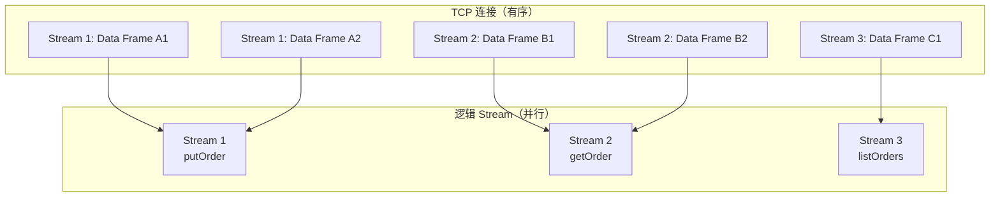
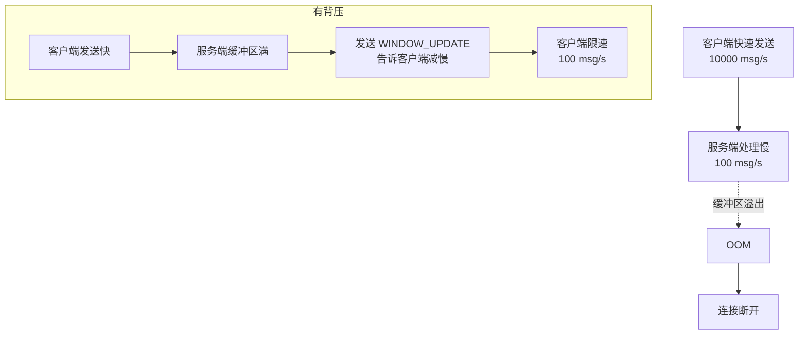
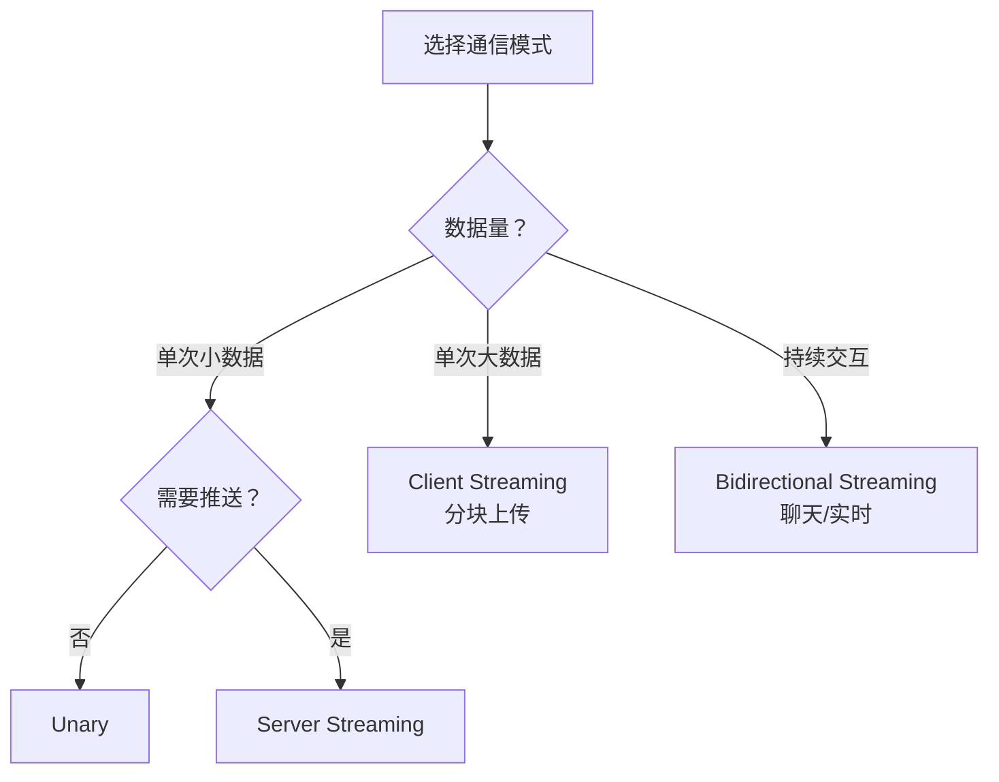

候选人小李在面试字节 P6 时，面试官问："gRPC 的流式调用用过吗？什么场景用 Server Streaming，什么场景用 Client Streaming？"

小李说："用过，就是一边发数据一边收数据..."面试官追问："那你知道流式调用的 backpressure 机制吗？如果服务端处理速度比客户端发送速度慢会怎样？"

小张摇头。

【面试官心理】
gRPC 的四种通信模式是区分"用过"和"精通"的关键。能说清楚每种模式适用场景、backpressure 机制、流控原理的候选人，说明他有实战经验。流式调用在生产环境中容易出问题，这道题能筛选出真正踩过坑的人。

## 一、四种通信模式概览 🔴

### 1.1 模式对比

| 模式 | 客户端请求 | 服务端响应 | 适用场景 | 命中率 |
| --- | --- | --- | --- | --- |
| Unary | 1个 | 1个 | 普通 CRUD | 高频 |
| Server Streaming | 1个 | n个 | 推送、监控 | 中频 |
| Client Streaming | n个 | 1个 | 文件上传、日志上报 | 中频 |
| Bidirectional | n个 | n个 | 聊天、实时交互 | 低频 |

### 1.2 HTTP/2 Stream 的并行原理



**关键点**：Stream ID 是 31 位无符号整数，客户端发起的 Stream 用奇数，服务端发起的用偶数。

## 二、Unary（一元调用）🔴

### 2.1 定义与使用

Unary 是最常用的模式，对应传统的请求-响应：

```protobuf
service OrderService {
    // Unary: 一个请求，一个响应
    rpc GetOrder(GetOrderRequest) returns (Order);
}
```

### 2.2 服务端实现

```java
public class OrderServiceImpl extends OrderServiceGrpc.OrderServiceImplBase {

    @Override
    public void getOrder(GetOrderRequest request,
                         io.grpc.stub.StreamObserver<Order> responseObserver) {
        // 1. 执行业务逻辑
        Order order = orderRepository.findById(request.getOrderId());

        // 2. 发送响应（只调用一次）
        responseObserver.onNext(order);

        // 3. 标记完成
        responseObserver.onCompleted();
    }
}
```

### 2.3 客户端调用

```java
// 同步调用
Order order = blockingStub.getOrder(request);

// 异步调用
asyncStub.getOrder(request, new StreamObserver<Order>() {
    @Override
    public void onNext(Order order) {
        // 处理响应
    }

    @Override
    public void onError(Throwable t) {
        // 处理错误
    }

    @Override
    public void onCompleted() {
        // 完成
    }
});
```

## 三、Server Streaming（服务端流）🟡

### 3.1 适用场景

Server Streaming 适用于**服务端需要推送多个消息**的场景：

- **实时监控**：客户端订阅后，服务端持续推送监控数据
- **推送通知**：下发消息流给客户端
- **日志流**：实时推送应用日志
- **文件下载**：大文件分块传输

### 3.2 Proto 定义

```protobuf
service OrderService {
    // 服务端流：客户端发一个请求，服务端返回多个响应
    rpc SubscribeOrders(SubscribeRequest) returns (stream Order);
}
```

### 3.3 服务端实现

```java
@Override
public void subscribeOrders(SubscribeRequest request,
                              StreamObserver<Order> responseObserver) {
    // 1. 建立长连接
    String subscriberId = request.getSubscriberId();

    try {
        // 2. 模拟持续推送订单
        for (int i = 0; i < 10; i++) {
            Order order = Order.newBuilder()
                .setId("ORDER_" + i)
                .setAmount(100.0 + i)
                .setStatus(OrderStatus.CREATED)
                .build();

            // 发送一条消息
            responseObserver.onNext(order);

            // 模拟延迟
            Thread.sleep(1000);
        }

        // 3. 完成流
        responseObserver.onCompleted();

    } catch (Exception e) {
        // 出错时取消流
        responseObserver.onError(Status.INTERNAL
            .withDescription("Server error")
            .withCause(e)
            .asRuntimeException());
    }
}
```

### 3.4 客户端调用

```java
// 创建流式监听器
StreamObserver<Order> responseObserver = new StreamObserver<Order>() {
    @Override
    public void onNext(Order order) {
        System.out.println("收到订单: " + order.getId());
    }

    @Override
    public void onError(Throwable t) {
        System.err.println("Stream 错误: " + t.getMessage());
    }

    @Override
    public void onCompleted() {
        System.out.println("Stream 完成");
    }
};

// 开始流式调用
StreamObserver<SubscribeRequest> requestObserver =
    asyncStub.subscribeOrders(responseObserver);

// 发送请求（只发一个）
requestObserver.onNext(SubscribeRequest.newBuilder()
    .setSubscriberId("CLIENT_001")
    .build());

// 标记请求发送完成
requestObserver.onCompleted();
```

### 3.5 ❌ 错误示范

**候选人原话**："Server Streaming 就是服务端一次返回多个结果，客户端一次性收到。"

**问题诊断**：
- 没有理解流的本质是"分批到达"
- 客户端是逐步收到消息，不是一次性
- onNext 会被调用多次，不是调用一次

**面试官内心 OS**：这个候选人显然没有写过流式调用的代码，只是在博客上看过。

## 四、Client Streaming（客户端流）🟡

### 4.1 适用场景

Client Streaming 适用于**客户端需要发送大量数据**的场景：

- **文件上传**：客户端上传大文件，服务端分块接收
- **日志上报**：客户端持续上报日志
- **批量写入**：客户端批量创建订单
- **实时数据采集**：传感器数据上报

### 4.2 Proto 定义

```protobuf
service OrderService {
    // 客户端流：客户端发送多个请求，服务端返回一个响应
    rpc BatchCreateOrders(stream CreateOrderRequest) returns (BatchCreateResponse);
}
```

### 4.3 服务端实现

```java
@Override
public StreamObserver<CreateOrderRequest> batchCreateOrders(
        StreamObserver<BatchCreateResponse> responseObserver) {

    // 返回 StreamObserver，客户端用它发送消息
    return new StreamObserver<CreateOrderRequest>() {
        private List<String> orderIds = new ArrayList<>();

        @Override
        public void onNext(CreateOrderRequest request) {
            // 客户端每发一条消息，这里就回调一次
            String orderId = orderService.create(request);
            orderIds.add(orderId);
        }

        @Override
        public void onError(Throwable t) {
            // 客户端出错，取消操作
            log.error("客户端流出错: " + t.getMessage());
        }

        @Override
        public void onCompleted() {
            // 客户端发送完成，准备返回
            BatchCreateResponse response = BatchCreateResponse.newBuilder()
                .setSuccessCount(orderIds.size())
                .addAllOrderIds(orderIds)
                .build();
            responseObserver.onNext(response);
            responseObserver.onCompleted();
        }
    };
}
```

### 4.4 客户端调用

```java
// 开始流式调用，获取发送器
StreamObserver<CreateOrderRequest> requestObserver =
    asyncStub.batchCreateOrders(new StreamObserver<BatchCreateResponse>() {
        @Override
        public void onNext(BatchCreateResponse response) {
            System.out.println("批量创建完成，成功数量: " + response.getSuccessCount());
        }

        @Override
        public void onError(Throwable t) {
            System.err.println("批量创建失败: " + t.getMessage());
        }

        @Override
        public void onCompleted() {
            System.out.println("收到服务端响应");
        }
    });

// 发送多条消息
for (int i = 0; i < 1000; i++) {
    CreateOrderRequest request = CreateOrderRequest.newBuilder()
        .setProductId("PROD_" + i)
        .setQuantity(1)
        .build();
    requestObserver.onNext(request);
}

// 标记发送完成
requestObserver.onCompleted();

// 等待响应（异步）
TimeUnit.SECONDS.sleep(10);
```

## 五、Bidirectional Streaming（双向流）🟡

### 5.1 适用场景

Bidirectional Streaming 适用于**需要实时交互**的场景：

- **聊天应用**：双方互发消息
- **实时数据交换**：双方互相推送数据
- **文件共享**：双方互发文件块
- **游戏同步**：玩家实时交互

### 5.2 Proto 定义

```protobuf
service OrderService {
    // 双向流：客户端和服务端都发送流
    rpc ChatWithOrders(stream OrderMessage) returns (stream OrderMessage);
}
```

### 5.3 服务端实现

```java
@Override
public StreamObserver<OrderMessage> chatWithOrders(
        StreamObserver<OrderMessage> responseObserver) {

    return new StreamObserver<OrderMessage>() {
        @Override
        public void onNext(OrderMessage message) {
            // 收到客户端消息，处理后返回
            OrderMessage response = OrderMessage.newBuilder()
                .setOrderId(message.getOrderId())
                .setContent("服务端处理: " + message.getContent())
                .setTimestamp(System.currentTimeMillis())
                .build();
            responseObserver.onNext(response);
        }

        @Override
        public void onError(Throwable t) {
            log.error("连接异常: " + t.getMessage());
        }

        @Override
        public void onCompleted() {
            responseObserver.onCompleted();
        }
    };
}
```

### 5.4 客户端调用

```java
// 开始双向流
StreamObserver<OrderMessage> requestObserver =
    asyncStub.chatWithOrders(new StreamObserver<OrderMessage>() {
        @Override
        public void onNext(OrderMessage response) {
            System.out.println("收到服务端响应: " + response.getContent());
        }

        @Override
        public void onError(Throwable t) {
            System.err.println("连接异常: " + t.getMessage());
        }

        @Override
        public void onCompleted() {
            System.out.println("服务端完成");
        }
    });

// 客户端发送消息（可以随时发送）
for (int i = 0; i < 10; i++) {
    OrderMessage message = OrderMessage.newBuilder()
        .setOrderId("ORDER_" + i)
        .setContent("客户端消息 " + i)
        .setTimestamp(System.currentTimeMillis())
        .build();
    requestObserver.onNext(message);
}

// 标记客户端发送完成（但仍可接收服务端消息）
requestObserver.onCompleted();

// 等待服务端完成
TimeUnit.SECONDS.sleep(10);
```

## 六、Backpressure（背压）机制 🟡

### 6.1 什么是背压

背压是流控机制，防止**发送方速度过快导致接收方 OOM**：



### 6.2 gRPC 的流控原理

HTTP/2 本身有流量控制机制：

- **Stream Flow Control**：每个 Stream 有独立的流量控制窗口（默认 65535 字节）
- **Connection Flow Control**：整个连接有总的流量控制窗口

gRPC 在 HTTP/2 之上增加了应用层的背压：

```java
// gRPC 的 MessageFramer 控制发送速率
// 当接收方的应用层缓冲区满时
// gRPC 会停止从 HTTP/2 读取数据
// HTTP/2 的 flow control 会自动通知发送方减慢
```

### 6.3 生产中的背压问题

**场景**：服务端流推送监控数据，客户端处理不过来

```java
// 问题代码：客户端处理速度太慢
responseObserver.onNext(order -> {
    // 模拟慢处理
    Thread.sleep(5000);  // 5秒处理一条
    saveToDatabase(order);
});

// 后果：
// 1. HTTP/2 窗口耗尽
// 2. 服务端发送阻塞
// 3. 内存堆积
// 4. 最终 OOM
```

**正确做法**：

```java
// 使用信号量或队列实现背压
Semaphore semaphore = new Semaphore(100);

responseObserver.onNext(order -> {
    semaphore.acquire();
    try {
        saveToDatabase(order);
    } finally {
        semaphore.release();
    }
});
```

## 七、实战选型 🟡

### 7.1 模式选择决策树



### 7.2 性能对比

| 模式 | 适用数据量 | 延迟 | 资源消耗 |
| --- | --- | --- | --- |
| Unary | `< 1MB` | 低 | 低 |
| Server Streaming | `1MB - 1GB` | 中 | 中（服务端缓存） |
| Client Streaming | `1MB - 1GB` | 中 | 中（客户端缓存） |
| Bidirectional | 任意 | 低 | 高（双方缓冲） |

:::tip 💡
gRPC 的流式调用不是银弹。如果你的数据量很小（< 1MB），Unary 通常是最简单高效的选择。流式调用的开销（Stream 建立、流量控制）可能得不偿失。
:::

:::warning ⚠️
Bidirectional Streaming 的两个流是独立的，但它们共享同一个 TCP 连接。如果一方的流出现问题（比如网络断开），另一方也会受到影响。
:::

【面试官心理】
gRPC 的四种通信模式是微服务通信的核心能力。能说清楚每种模式的适用场景、backpressure 机制、流控原理的候选人，说明他有实战经验。这种候选人在我这里是 P6+ 的加分项。
