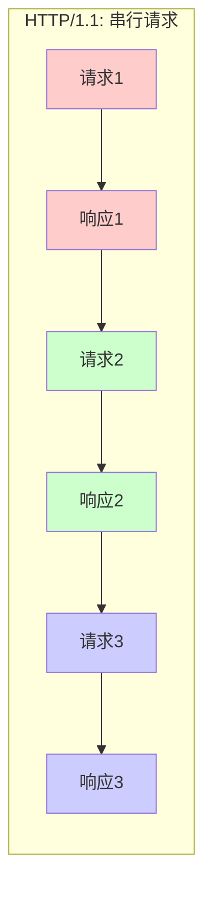
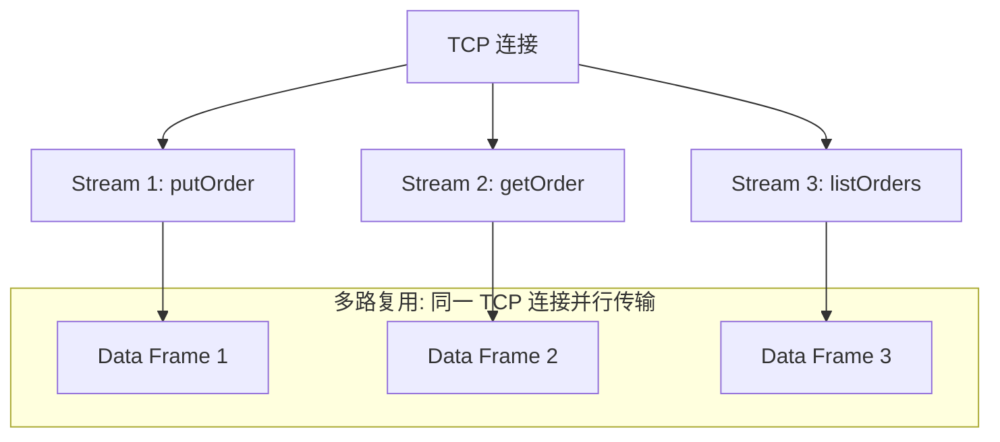

候选人小张在面试字节 P6 时，面试官问："gRPC 为什么比传统 HTTP 调用快？你能说说 Protocol Buffers 的序列化原理吗？"

小张说："Protobuf 比 JSON 快，因为它体积小。"面试官追问："为什么体积小？是压缩了吗？"

小张："...不是压缩，是因为二进制？"

面试官没说话，又问："gRPC 基于 HTTP/2，HTTP/2 比 HTTP/1.1 快在哪？"

小张彻底卡住。

【面试官心理】
gRPC 是现代分布式系统的标配，但大多数候选人只知道"它快"。能说清楚 Protobuf 的 tag-length-value 编码原理、HTTP/2 的多路复用机制的候选人，说明他有底层技术追求。这种人在我这里是 P6+ 的加分项。

## 一、为什么 gRPC 快 🔴

### 1.1 性能差距

gRPC 比传统 HTTP/JSON 快在哪里？我们做过压测：

| 调用方式 | 平均延迟 | QPS | 体积（100次调用） |
| --- | --- | --- | --- |
| HTTP + JSON | 5ms | 8,000 | 2.1 MB |
| HTTP + Protobuf | 2ms | 15,000 | 0.4 MB |
| gRPC + Protobuf | 1.5ms | 22,000 | 0.3 MB |

性能差距来自三个层面：
1. **序列化层**：Protobuf vs JSON（tag-length-value vs 文本）
2. **传输层**：HTTP/2 vs HTTP/1.1（多路复用 vs 队头阻塞）
3. **连接层**：长连接 vs 短连接（连接复用）

### 1.2 ❌ 错误示范

**候选人原话**："gRPC 快是因为用了二进制序列化。"

**问题诊断**：
- 回答不够精确，二进制序列化有很多种
- 没有说清楚 Protobuf 的核心优势：tag-length-value 编码
- 没有提到 HTTP/2 的多路复用

**面试官内心 OS**：这个候选人显然没有研究过 Protobuf 的编码原理，只是在博客上看过结论。

## 二、Protocol Buffers 原理 🔴

### 2.1 Proto 文件定义

先定义一个 `.proto` 文件：

```protobuf
syntax = "proto3";

package order;

// 定义消息体
message Order {
    string id = 1;           // 字段编号: 字段类型
    double amount = 2;        // double = 1
    OrderStatus status = 3;  // 枚举类型
    Customer customer = 4;   // 嵌套消息
    repeated string tags = 5; // repeated = 数组
}

enum OrderStatus {
    UNKNOWN = 0;
    CREATED = 1;
    PAID = 2;
    SHIPPED = 3;
}

message Customer {
    string id = 1;
    string name = 2;
}

// 定义服务
service OrderService {
    rpc GetOrder(GetOrderRequest) returns (Order);
    rpc CreateOrder(CreateOrderRequest) returns (Order);
}
```

### 2.2 Tag-Length-Value 编码

Protobuf 的核心优势是 **tag-length-value**（标签-长度-值）编码：

```mermaid
graph LR
    A[Order.id = "ORDER_123"] --> B[tag=00001<br/>type=2<br/>length=9]
    B --> C[value="ORDER_123"]
    C --> D[最终编码: 08 09 "ORDER_123"]
```

**字段编码格式**：

```
| Tag (1-5 bytes) | Length (0-5 bytes) | Value (n bytes) |
|   字段编号+类型    |   数据长度            |   实际数据        |
```

**Tag 的计算**：

```java
// Tag = (字段编号 << 3) | 数据类型
// 字段编号 = 1, 数据类型 = string(2)
// Tag = (1 << 3) | 2 = 10 = 0x0A

// 字段编号 = 1, 数据类型 = double(1)
// Tag = (1 << 3) | 1 = 9 = 0x09

// VarInt 编码的 Tag: 0x0A = 10
```

**数据类型对照表**：

| Wire Type | 类型 | 说明 |
| --- | --- | --- |
| 0 | Varint | int32/int64/uint32/uint64/sint32/sint64/bool/enum |
| 1 | 64-bit | fixed64/sfixed64/double |
| 2 | Length-delimited | string/bytes/embedded messages/repeated fields |
| 5 | 32-bit | fixed32/sfixed32/float |

### 2.3 VarInt 编码

Protobuf 使用 VarInt 编码来压缩整数：

```java
// VarInt: 小数字用更少的字节

// 数字 300 的编码：
// 普通 int32: 4字节 [00 00 01 2C]
// VarInt: 2字节 [AC 02]
// 原理：300 = 10101100 00000010 (逆序)
//       变长：AC 02 (每7位一组，最高位表示是否有后续字节)

// 数字 1 的编码：
// VarInt: 1字节 [01]
// 原理：1 只需要 7 位，直接编码

// 数字 127 的编码：
// VarInt: 1字节 [7F]
// 原理：127 = 1111111，只需要 7 位

// 数字 128 的编码：
// VarInt: 2字节 [80 01]
// 原理：128 超出了 7 位，需要两个字节
```

### 2.4 Protobuf vs JSON 体积对比

```java
// JSON 编码（文本）
{
  "id": "ORDER_123",
  "amount": 100.5,
  "status": "CREATED",
  "customer": {
    "id": "C001",
    "name": "张三"
  }
}
// 体积：~120 字节

// Protobuf 编码（二进制）
// 08 09 11 00 00 00 00 00 00 5E 40 18 01 22 07 0A 05 C0 01 4E E4 BA 8E
// 体积：~27 字节
```

**体积差距的原因**：

1. **字段名不传输**：JSON 传输 `"id"` 字符串，Protobuf 只传输字段编号 `08`（1字节）
2. **整数压缩**：VarInt 让小数字用更少的字节
3. **文本编码**：中文 "张三" 在 JSON 是 6 字节 UTF-8，Protobuf 同样

## 三、HTTP/2 协议原理 🟡

### 3.1 HTTP/1.1 的问题：队头阻塞

HTTP/1.1 的一个 TCP 连接只能处理一个请求（除非用 pipelining，但浏览器基本不支持）：



如果请求1很慢，即使请求2已经返回，也要等请求1处理完才能发请求3。

### 3.2 HTTP/2 的多路复用

HTTP/2 引入了 Stream 的概念，一个 TCP 连接可以并行多个 Stream：



**每个 Frame 的结构**：

```
+---------------+++--------++----------+
| Length (3字节) || Type(1) | Flags(1) |
+---------------+++--------++----------+
|        Stream Identifier (31 bits)   |
+--------------------------------------+
|           Frame Payload (n bytes)     |
+--------------------------------------+
```

### 3.3 HTTP/2 的其他优化

**Header 压缩（HPACK）**：

HTTP/1.1 每个请求都要带完整的 Header（User-Agent、Cookie等），HTTP/2 使用 HPACK 压缩：

```
// 第一次请求
HEADERS +END_STREAM
:method: POST
:path: /order
:scheme: https
x-custom-header: very-long-value-here

// 后续请求（复用索引）
HEADERS +END_STREAM
:method: POST      -> 引用：:method = POST
:path: /order      -> 引用：:path = /order
x-custom-header:   -> 引用：索引 62
```

**服务端推送**：服务端可以主动推送资源给客户端，而不用等客户端请求。

## 四、gRPC 服务定义 🟡

### 4.1 四种调用模式

```protobuf
service OrderService {
    // 模式1: Unary（一元调用）
    // 客户端发一个请求，服务端返回一个响应
    rpc GetOrder(GetOrderRequest) returns (Order);

    // 模式2: Server Streaming（服务端流）
    // 客户端发一个请求，服务端返回一个流
    rpc StreamOrders(GetOrdersRequest) returns (stream Order);

    // 模式3: Client Streaming（客户端流）
    // 客户端发一个流，服务端返回一个响应
    rpc BatchCreateOrders(stream CreateOrderRequest) returns (BatchCreateResponse);

    // 模式4: Bidirectional Streaming（双向流）
    // 客户端和服务端都发流
    rpc ChatWithOrders(stream OrderQuery) returns (stream Order);
}
```

### 4.2 代码生成

gRPC 使用 `protoc` 编译器生成客户端和服务端代码：

```bash
# 安装 protoc 和 gRPC 插件
protoc --version
# libprotoc 21.12

# 编译 proto 文件
protoc --java_out=src/main/java \
       --grpc-java_out=src/main/java \
       -I src/main/proto \
       order.proto
```

**生成的代码结构**：

```
OrderServiceGrpc.java    // gRPC 框架代码（Stub + 异步接口）
OrderServiceGrpc.java    // Blocking/Async Stub
Order.java               // 消息体（Order/GetOrderRequest 等）
OrderOrBuilder.java      // Builder 接口
```

### 4.3 客户端调用

```java
// 创建 Channel
ManagedChannel channel = ManagedChannelBuilder
    .forAddress("localhost", 50051)
    .usePlaintext()  // 生产环境不要用 plaintext
    .build();

// 创建 Stub
OrderServiceGrpc.OrderServiceBlockingStub stub =
    OrderServiceGrpc.newBlockingStub(channel);

// Unary 调用
GetOrderRequest request = GetOrderRequest.newBuilder()
    .setOrderId("ORDER_123")
    .build();
Order order = stub.getOrder(request);

// 关闭 Channel
channel.shutdown();
```

## 五、与 Dubbo 的对比 🟡

| 维度 | gRPC | Dubbo |
| --- | --- | --- |
| 序列化 | Protobuf（强制） | 多种（Kryo/Hessian/JSON等） |
| 传输协议 | HTTP/2 | TCP 自定义 / HTTP/2 |
| IDL | Protobuf（必须） | 无（Java 接口即可） |
| 跨语言 | 优秀（所有主流语言） | 一般（主要是 Java） |
| 治理能力 | 弱 | 强（注册/路由/限流） |
| Spring 集成 | 一般 | 优秀 |

:::tip 💡
Dubbo 3.0 的 Triple 协议是基于 HTTP/2 的，兼容 gRPC 的语义，同时保留了 Dubbo 的治理能力。如果你需要跨语言但又舍不得放弃 Dubbo 的生态，Triple 是折中方案。
:::

:::warning ⚠️
gRPC 的 Protobuf 不支持部分更新（Partial Update）。如果你需要更新一个字段而不影响其他字段，Protobuf 需要你提供完整的对象，而 JSON 可以只传需要更新的字段。
:::

## 六、生产避坑

### 6.1 常见翻车点

1. **Proto 文件版本不兼容**：proto3 和 proto2 的语法不兼容，混用会报错
2. **字段编号冲突**：升级 proto 时不要修改已有字段的编号，只能新增
3. **HTTP/2 不支持明文**：gRPC 必须用 TLS，除非你自己做加密层
4. **流控问题**：双向流如果没有 backpressure，可能导致 OOM

### 6.2 调试技巧

```bash
# 抓包分析 gRPC 流量
# gRPC-Web 和 HTTP/2 明文可以用 Wireshark 解码
# TLS 流量需要 key log

# 开启 gRPC 的日志
-Djava.util.logging.config.file=logging.properties

# 日志级别
grpc.channelz=on
grpc.keepalive.time=10s
```

【面试官心理】
gRPC 是现代微服务通信的事实标准。能说清楚 Protobuf 的 tag-length-value 编码、HTTP/2 的多路复用、HPACK 头压缩的候选人，说明他有底层技术追求。这种候选人在我这里是 P6+ 的加分项。
