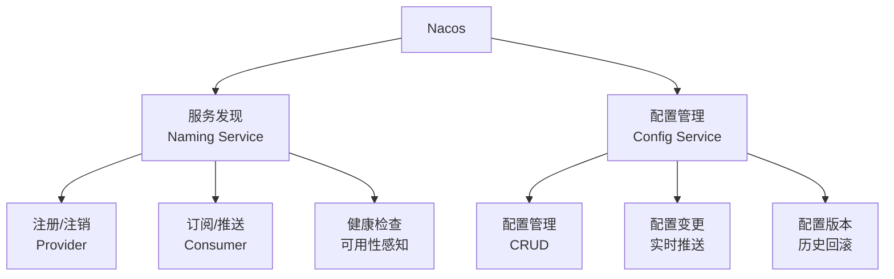
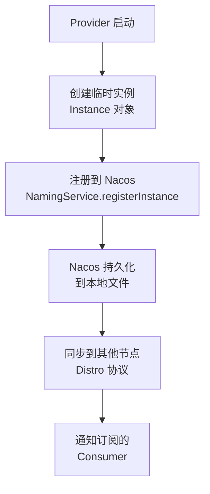
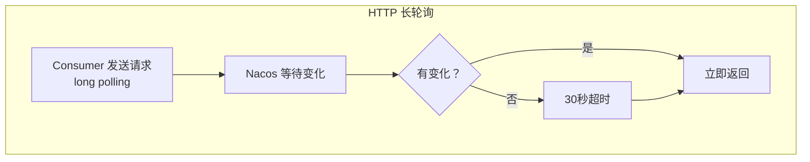
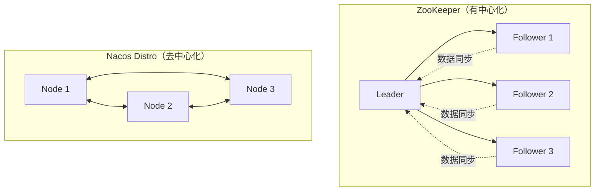
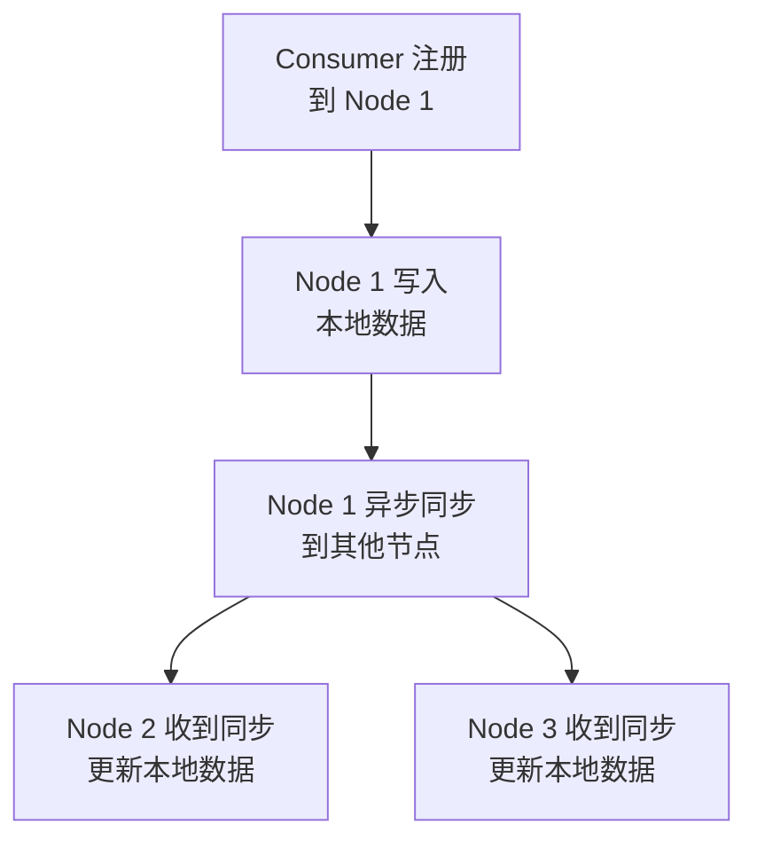
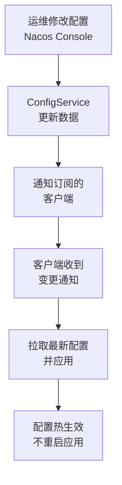

候选人小李在面试阿里 P6 时，面试官问："你们注册中心用的什么？为什么不用 ZooKeeper？"

小李说："用的 Nacos，因为它是阿里开源的..."面试官追问："Nacos 2.0 相比 1.0 有什么变化？Distro 协议是怎么保证 AP 的？"

小李支支吾吾。

【面试官心理】
Nacos 是 Spring Cloud Alibaba 的核心组件，但很多候选人只知道"它是注册中心"。能说清楚 Nacos 的 AP + CP 双模式、Distro 协议、Nacos 2.0 的 gRPC 升级的候选人，说明他对注册中心有深入理解。这种候选人在我这里是 P6+ 的加分项。

## 一、Nacos 概述 🔴

### 1.1 Nacos 的两大核心能力

Nacos（Naming and Configuration Service）是阿里开源的**服务发现和配置管理**平台：



### 1.2 为什么选 Nacos

| 维度 | ZooKeeper | Nacos | Eureka |
| --- | --- | --- | --- |
| **一致性模型** | CP | AP + CP | AP |
| **配置管理** | 无 | 有 | 无 |
| **多协议** | 自定义 | HTTP/DNS | HTTP |
| **运维复杂度** | 高 | 中 | 低 |
| **活跃度** | 一般 | 高（阿里背书） | 低（已停止维护） |
| **生态** | Dubbo/Kubernetes | Spring Cloud Alibaba | Spring Cloud |

## 二、服务注册与发现 🟡

### 2.1 服务注册流程



**核心代码**：

```java
// Provider 注册
namingService.registerInstance(
    "order-service",      // 服务名
    "192.168.1.100",      // IP
    8080,                  // 端口
    "DEFAULT"             // 集群名
);

// Provider 心跳（Nacos 2.0 使用 gRPC 长连接）
namingService.registerInstance(
    "order-service",
    instanceId,
    heartbeatPeriod // 默认 5秒
);
```

### 2.2 临时实例 vs 持久实例

| 类型 | ephemeral | 健康检查 | 适用场景 | 故障时行为 |
| --- | --- | --- | --- | --- |
| 临时实例 | `true` | 客户端心跳 | 服务注册（Spring Cloud） | 心跳断开即删除 |
| 持久实例 | `false` | 服务端主动探测 | 配置中心、持久服务 | 永不下线 |

```java
// 临时实例（默认）
Instance instance = new Instance();
instance.setEphemeral(true);  // 默认
namingService.registerInstance("order-service", instance);

// 持久实例
instance.setEphemeral(false);
namingService.registerInstance("order-service", instance);
```

### 2.3 服务订阅与变更通知

```java
// Consumer 订阅服务
@NacosInjected
private NamingService namingService;

void subscribe() {
    namingService.subscribe(
        "order-service",
        event -> {
            // 服务列表变更时回调
            List<Instance> instances =
                namingService.selectInstances("order-service", true);
            updateLoadBalancer(instances);
        }
    );
}
```

## 三、Nacos 2.0 的 gRPC 升级 🟡

### 3.1 为什么升级

Nacos 1.0 使用 **HTTP 长轮询** 进行服务变更推送：



**HTTP 长轮询的问题**：

1. **延迟高**：最长等待 30 秒才能感知变更
2. **资源浪费**：每个 Consumer 都要占用一个 HTTP 连接
3. **服务端压力大**：大量长轮询请求占用线程

### 3.2 Nacos 2.0 的 gRPC

Nacos 2.0 引入了 **gRPC 长连接**：


**升级对比**：

| 维度 | Nacos 1.0 | Nacos 2.0 |
| --- | --- | --- |
| 通信协议 | HTTP | gRPC |
| 推送延迟 | 30 秒（最长） | 1 秒内 |
| 连接数 | 多（轮询占用） | 少（复用连接） |
| 服务端资源 | 高 | 低 |

### 3.3 Nacos 2.0 的连接管理

```java
// Nacos 2.0 的 gRPC 连接模型
// 每个 Consumer 与 Nacos 保持一个 gRPC 连接
// 该连接同时处理：
// 1. 心跳（保持连接活跃）
// 2. 服务变更推送（双向流）
// 3. 查询请求

// 配置端口
nacos:
  server:
    port: 8848
    grpc:
      port: 9848  # gRPC 端口（默认 9848）
```

## 四、Distro 协议 🟡

### 4.1 为什么需要 Distro

Nacos 是一个**去中心化**的注册中心，没有 ZooKeeper 那样的 Leader：



**Distro 的设计目标**：

1. **AP 优先**：节点间数据最终一致，允许短暂不一致
2. **无 Leader**：任意节点都可以写入
3. **负载分散**：写入压力分散到所有节点

### 4.2 Distro 的数据同步



**同步时机**：

1. **定时同步**：每 5 秒同步一次
2. **变更同步**：数据变更时立即同步到其他节点
3. **启动同步**：节点启动时全量同步

### 4.3 ❌ 错误示范

**候选人原话**："Nacos 用 Distro 协议保证强一致性。"

**问题诊断**：
- 完全理解错了 Distro 的设计目标
- Distro 是 AP 协议，不是 CP
- ZooKeeper 才是强一致（CP）

【面试官心理】
Distro 是 Nacos 的核心技术，能说清楚它"最终一致"的特性和"无 Leader"的设计的候选人，说明他对分布式系统有深入理解。

## 五、配置管理 🟡

### 5.1 配置变更推送



### 5.2 配置监听

```java
// Java SDK 监听配置
@Configuration
public class NacosConfig {

    @NacosConfigurationProperties(dataId = "order.yml", autoRefreshed = true)
    private OrderConfig orderConfig;
}

// 或者使用 Listener
@NacosInjected
private ConfigService configService;

public void listenConfig() {
    configService.addListener(
        "order.yml",        // dataId
        "DEFAULT_GROUP",   // group
        new Listener() {
            @Override
            public void receiveConfigInfo(String config) {
                // 配置变更时回调
                System.out.println("配置变更: " + config);
            }
        }
    );
}
```

### 5.3 配置的命名空间和分组

```yaml
# 命名空间隔离（不同环境）
nacos:
  config:
    namespace: ${NACOS_NAMESPACE}

# 分组隔离（不同业务线）
nacos:
  config:
    group: ${NACOS_GROUP}

# 配置查找路径
# ${namespace}/${group}/${dataId}
# public/DEFAULT_GROUP/order.yml
```

## 六、CP + AP 双模式 🟢

### 6.1 CP 模式（一致性优先）

```java
// 使用 Raft 协议保证强一致
// 适用于：配置中心、元数据
nacos:
  cluster:
    raft:
      enabled: true

// 注册时指定 CP
namingService.registerInstance("order-service", instance, "CP");
```

### 6.2 AP 模式（可用性优先）

```java
// 默认模式
// 适用于：服务注册与发现
nacos:
  cluster:
    distro:
      enabled: true

// 注册时指定 AP
namingService.registerInstance("order-service", instance, "AP");
```

### 6.3 选型建议

| 场景 | 推荐模式 | 理由 |
| --- | --- | --- |
| 服务注册发现 | AP | 服务高可用更重要 |
| 分布式配置 | CP | 配置一致性更重要 |
| 领导选举 | CP | 需要强一致 |
| 订阅发布 | AP | 实时性更重要 |

## 七、生产避坑

### 7.1 常见翻车点

1. **命名空间配置错误**：不同环境的命名空间混用
2. **心跳间隔不一致**：客户端和服务端心跳配置不匹配
3. **gRPC 端口未开放**：Nacos 2.0 需要开放 9848 端口
4. **数据量过大**：Nacos 单节点数据量建议不超过 100 万

### 7.2 监控指标

```bash
# Nacos 监控端点
curl http://127.0.0.1:8848/nacos/v1/ns/operator/metrics

# 返回 JSON
{
  "serviceCount": 100,
  "instanceCount": 1000,
  "subscribeCount": 5000,
  "publisherCount": 100,
  "connectionCount": 200
}
```

:::tip 💡
Nacos 2.0 的 gRPC 端口默认是主端口 + 1000（8848 -> 9848）。如果你的 Nacos 部署在 Kubernetes 中，需要同时暴露这两个端口。
:::

:::warning ⚠️
Nacos 的 Distro 协议是最终一致，不是强一致。如果你在服务注册后立即调用，可能会发现服务还没同步过来。对于这种场景，可以加一个启动延迟（spring.cloud.nacos.discovery.registerEnabled=false 配合手动注册）。
:::

【面试官心理】
Nacos 是 Spring Cloud Alibaba 生态的核心组件。能说清楚 Nacos 2.0 的 gRPC 升级、Distro 协议、AP + CP 双模式的候选人，说明他对注册中心有深入理解。这种候选人在我这里是 P6+ 的加分项。
