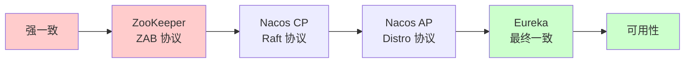
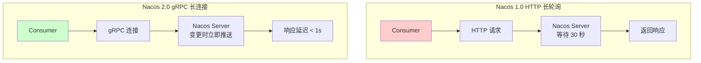
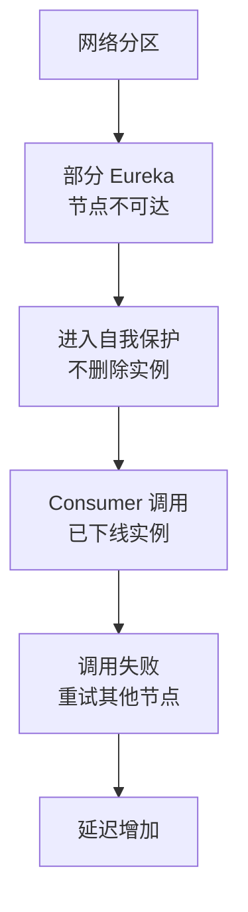
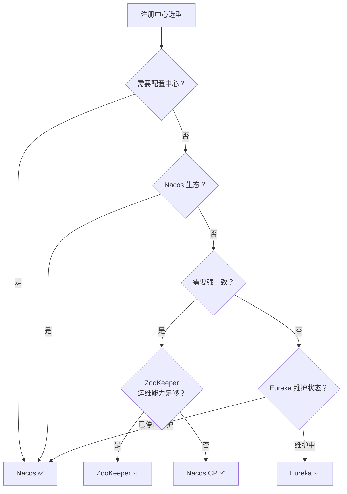

面试官问候选人小李："你们团队在做技术选型时，为什么选了 Nacos 而不是 ZooKeeper？"

小李说："因为 Nacos 是阿里开源的，文档多..."面试官追问："那 ZooKeeper 的问题是什么？Nacos 比 ZooKeeper 好在哪？"

小李答不上来。

【面试官心理】
这道题我用来考察候选人的技术选型能力。能从 CAP 理论、一致性模型、运维复杂度、生态集成等多个维度分析选型的候选人，说明他有架构视野。这种候选人在我这里是 P7 的潜力股。

## 一、三种注册中心定位 🔴

### 1.1 概览对比

| 维度 | ZooKeeper | Nacos | Eureka |
| --- | --- | --- | --- |
| **CAP 模型** | CP（强一致） | AP + CP 双模式 | AP（高可用） |
| **一致性协议** | ZAB 协议 | Distro/Raft | 无（最终一致） |
| **配置管理** | 无 | 有 | 无 |
| **多语言支持** | 弱 | 中 | 弱 |
| **运维复杂度** | 高 | 中 | 低 |
| **活跃度** | 一般 | 高 | 低（停止维护） |
| **适用场景** | 分布式协调 | 服务发现 + 配置 | 服务发现 |

### 1.2 一致性光谱



## 二、ZooKeeper：CP 的分布式协调器 🟡

### 2.1 核心优势

| 优势 | 说明 |
| --- | --- |
| **强一致性** | ZAB 协议保证所有节点数据一致 |
| **成熟稳定** | 经过大规模生产验证（Hadoop、Kafka） |
| **分布式锁** | 临时顺序节点天然支持分布式锁 |
| **功能丰富** | Watch 机制支持事件通知 |

### 2.2 核心劣势

| 劣势 | 说明 |
| --- | --- |
| **运维复杂** | 需要奇数部署（3/5/7节点） |
| **写入瓶颈** | Leader 是写入瓶颈，高并发写入差 |
| **无配置管理** | 不支持配置中心 |
| **学习成本** | ZAB 协议复杂，需要专业运维 |
| **健康检查** | 需要自行实现 |

### 2.3 适用场景

- **分布式锁**：需要强一致锁的场景
- **配置管理**：需要配合 Apollo 等配置中心
- **Master 选举**：需要强一致选主的场景
- **Hadoop 生态**：Hadoop、Kafka、Storm 等组件原生支持

## 三、Nacos：AP + CP 双模式的注册中心 🟡

### 3.1 核心优势

| 优势 | 说明 |
| --- | --- |
| **双模式** | 支持 AP 和 CP，可根据场景切换 |
| **配置管理** | 内置配置中心，开箱即用 |
| **简单易用** | 提供控制台，运维友好 |
| **Spring Cloud 集成** | Spring Cloud Alibaba 生态核心 |
| **gRPC 推送** | 2.0 版本推送延迟 < 1 秒 |

### 3.2 核心劣势

| 劣势 | 说明 |
| --- | --- |
| **多语言支持一般** | 主要支持 Java |
| **数据一致性弱** | Distro 协议是最终一致 |
| **文档质量** | 部分功能文档不完善 |

### 3.3 Nacos vs ZooKeeper

| 维度 | Nacos | ZooKeeper |
| --- | --- | --- |
| **一致性模型** | AP + CP | CP |
| **配置中心** | 内置 | 无 |
| **多语言** | 一般 | 弱 |
| **运维难度** | 低 | 高 |
| **健康检查** | TCP/HTTP/MySQL/ANS | 客户端心跳 |
| **推送方式** | gRPC 长连接 | Watch |

### 3.4 Nacos 2.0 的性能优势



## 四、Eureka：AP 的自我保护注册中心 🟡

### 4.1 核心优势

| 优势 | 说明 |
| --- | --- |
| **高可用** | AP 模型，节点可独立工作 |
| **简单部署** | 单机即可运行，开发友好 |
| **Spring Cloud 集成** | Spring Cloud 原生支持 |
| **自我保护** | 网络分区时保护注册信息 |

### 4.2 核心劣势

| 劣势 | 说明 |
| --- | --- |
| **停止维护** | Netflix 已停止维护 Eureka 2.0 |
| **无配置中心** | 不支持配置管理 |
| **数据一致性弱** | 最终一致，可能读到过期数据 |
| **多语言支持** | 弱 |

### 4.3 自我保护机制

Eureka 的自我保护机制防止**网络分区时误删健康实例**：

```java
// Eureka Server 每 15 分钟统计
// 如果健康实例占比 < 85%，进入自我保护
// 自我保护期间，不删除任何实例

// 自我保护触发条件
// expectedRenewsPerMin > 0.85 * renenwsPerMinThreshold
// expectedRenewsPerMin: 期望的心跳数
// renenwsPerMinThreshold: 实际收到的心跳数
```

**自我保护的问题**：



## 五、综合对比表 🔴

### 5.1 核心维度对比

| 维度 | ZooKeeper | Nacos | Eureka |
| --- | --- | --- | --- |
| **一致性** | 强一致（CP） | 强一致/最终一致（CP/AP） | 最终一致（AP） |
| **一致性协议** | ZAB | Raft/Distro | 无 |
| **服务注册** | 支持 | 支持 | 支持 |
| **服务发现** | 支持 | 支持 | 支持 |
| **配置管理** | 不支持 | 支持 | 不支持 |
| **健康检查** | 客户端心跳 | TCP/HTTP/MySQL/ANS | 客户端心跳 |
| **推送方式** | Watch | gRPC/HTTP | 轮询 |
| **运维难度** | 高 | 中 | 低 |
| **多语言** | 弱 | 中 | 弱 |
| **社区活跃** | 一般 | 高 | 低（停止维护） |
| **版本** | 3.8.x | 2.x | 2.x（停止维护） |

### 5.2 生产环境对比

| 维度 | ZooKeeper | Nacos | Eureka |
| --- | --- | --- | --- |
| **最小部署** | 3 节点 | 3 节点 | 2 节点 |
| **内存占用** | 低 | 中 | 中 |
| **并发写入** | 低（Leader 瓶颈） | 中 | 低 |
| **数据容量** | 10 万实例/节点 | 100 万实例/节点 | 无限 |
| **故障恢复** | 需要选主 | 自动恢复 | 自动恢复 |
| **运维工具** | 官方运维一般 | 控制台完善 | 控制台完善 |

## 六、选型决策树 🟡

### 6.1 决策流程



### 6.2 按场景选型

| 场景 | 推荐方案 | 理由 |
| --- | --- | --- |
| Spring Cloud Alibaba 生态 | Nacos | 无缝集成 |
| 需要配置中心 | Nacos | 内置配置管理 |
| 分布式锁（强一致） | ZooKeeper | ZAB 保证强一致 |
| 快速启动（开发测试） | Eureka | 单机即可 |
| 大规模服务（> 1000 实例） | Nacos | Distro 支持大数据量 |
| 跨语言服务调用 | Consul | 多语言支持好 |
| Kubernetes 生态 | Nacos/Consul | 云原生支持 |

### 6.3 按团队能力选型

| 团队能力 | 推荐方案 | 理由 |
| --- | --- | --- |
| Java 团队 + Spring Cloud | Nacos | 生态好，文档多 |
| 有 ZooKeeper 经验 | ZooKeeper | 复用经验 |
| 小团队，快速迭代 | Eureka | 上手快 |
| 多语言团队 | Consul | 多语言支持好 |
| 有运维能力 | ZooKeeper | 功能强大 |

## 七、生产避坑 🟡

### 7.1 ZooKeeper 的坑

1. **单机部署的隐患**：单机 ZooKeeper 无法容忍任何故障
2. **写入压力过大**：高并发写入场景下 Leader 成为瓶颈
3. **Session 超时配置**：心跳间隔和超时时间要配合好
4. **数据量限制**：不适合存储大量数据（最大 1MB/节点）

### 7.2 Nacos 的坑

1. **gRPC 端口未开放**：Nacos 2.0 需要开放 9848 端口
2. **Distro 数据不一致**：AP 模式下可能读到过期数据
3. **命名空间隔离**：不同环境要用不同命名空间
4. **数据量过大**：单节点超过 100 万实例后性能下降

### 7.3 Eureka 的坑

1. **已停止维护**：继续使用有安全风险
2. **自我保护误判**：网络抖动时可能保护已下线实例
3. **无配置中心**：需要配合 Spring Cloud Config
4. **客户端缓存**：可能读到 30 秒前的数据

:::tip 💡
如果你的团队使用 Spring Cloud Alibaba，Nacos 是最自然的选择。如果你的团队有 Dubbo 背景，Nacos 也是首选。如果你的场景需要强一致（分布式锁、选主），ZooKeeper 是更可靠的选择。
:::

:::warning ⚠️
Eureka 2.0 已经停止维护，生产环境不建议新项目使用 Eureka。Netflix 已经将 Eureka 捐赠给 Apache，但短期内不会有大的改进。建议迁移到 Nacos。
:::

## 八、迁移方案 🟢

### 8.1 ZooKeeper 到 Nacos

```yaml
# 之前：ZooKeeper
dubbo:
  registry:
    address: zookeeper://127.0.0.1:2181

# 之后：Nacos
dubbo:
  registry:
    address: nacos://127.0.0.1:8848
    group: DEFAULT_GROUP
    namespace: dev
```

### 8.2 Eureka 到 Nacos

```yaml
# 之前：Eureka
spring:
  application:
    name: order-service
  eureka:
    client:
      service-url:
        defaultZone: http://127.0.0.1:8761/eureka/

# 之后：Nacos
spring:
  application:
    name: order-service
  cloud:
    nacos:
      discovery:
        server-addr: 127.0.0.1:8848
        namespace: dev
```

【面试官心理】
注册中心选型是考察架构能力的关键问题。能从 CAP 理论、一致性模型、运维复杂度、生态集成等多个维度分析选型的候选人，说明他有架构视野。这种候选人在我这里是 P7 的潜力股。
