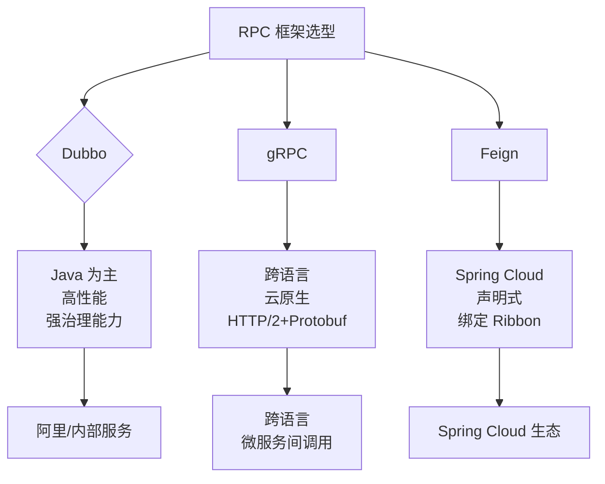
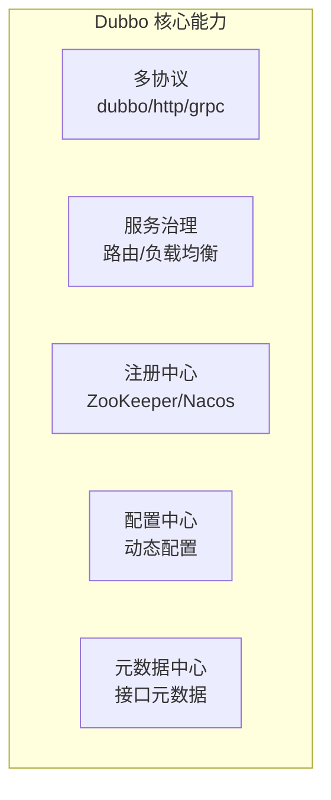
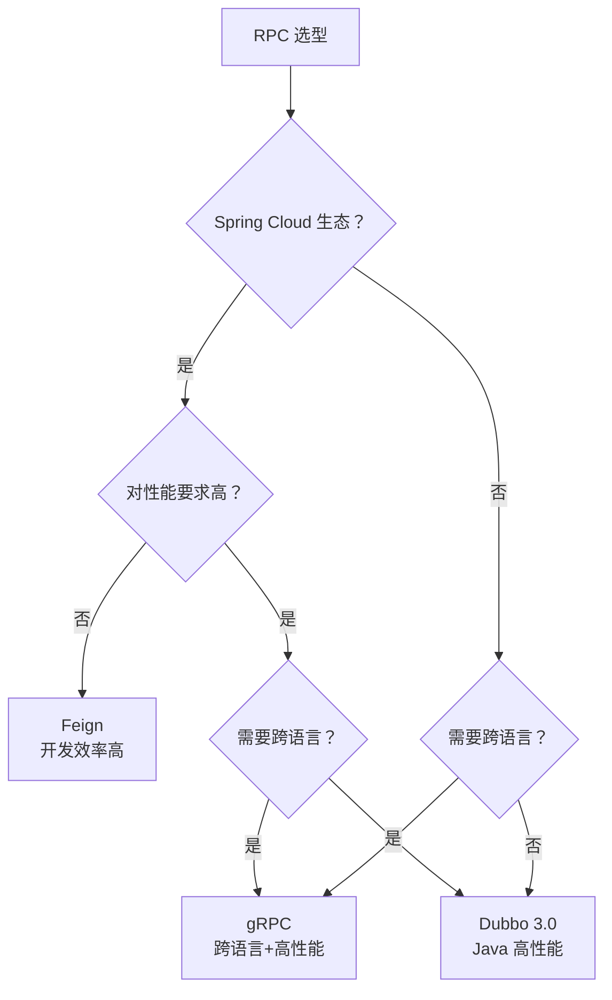

面试官问候选人小李："你们公司内部服务间调用用的什么框架？"

小李："Dubbo。"面试官："为什么选 Dubbo 不选 gRPC？"

小李说："因为团队熟悉..."面试官追问："那如果现在让你重新选型，你会怎么选？"

小李开始犹豫。

【面试官心理】
这道题我用来试探候选人的技术视野和选型能力。能从架构、性能、团队、生态等多个维度分析选型的候选人，说明他有技术决策能力。这种候选人在我这里是 P7 的潜力股。

## 一、三大框架定位 🔴

### 1.1 定位对比

| 框架 | 定位 | 生态 | 跨语言 | 治理能力 |
| --- | --- | --- | --- | --- |
| Dubbo | 高性能 RPC | Java 生态 | 一般 | 强 |
| gRPC | 跨语言 RPC | 云原生生态 | 优秀 | 弱 |
| Feign | 声明式 HTTP 客户端 | Spring Cloud 生态 | HTTP | 依赖 Ribbon |



### 1.2 ❌ 错误示范

**候选人原话**："Feign 就是 Dubbo 的替代品，都可以用。"

**问题诊断**：
- 混淆了 HTTP 客户端和 RPC 框架的概念
- Feign 本质是 HTTP 调用，不是 RPC
- 性能差距巨大（HTTP vs TCP 二进制）

【面试官心理】
技术选型不是"哪个火用哪个"，而是根据业务场景、团队能力、技术生态综合决策。能说清楚选型原因的候选人，才是真正有技术判断力的人。

## 二、Dubbo：Java 生态的 RPC 王者 🔴

### 2.1 核心优势

Dubbo 是阿里巴巴开源的高性能 RPC 框架，在 Java 生态中无可匹敌：



**为什么 Dubbo 快**：

1. **TCP 自定义协议**：Dubbo 协议头只有 16 字节，比 HTTP 头小得多
2. **Kryo 序列化**：比 Protobuf 略快（但不支持跨语言）
3. **Netty NIO**：异步 IO，高并发下性能优异
4. **连接池复用**：长连接，避免 TCP 连接建立开销

### 2.2 Dubbo 3.0 的性能

Dubbo 3.0 在性能上有质的飞跃：

| 指标 | Dubbo 2.7 | Dubbo 3.0 | 提升 |
| --- | --- | --- | --- |
| QPS | 8,000 | 35,000 | `4.4x` |
| 平均延迟 | 2ms | 0.5ms | `4x` |
| 注册压力 | 50万条/集群 | 10万条/集群 | `-80%` |
| 内存占用 | 高 | 低 | `-50%` |

### 2.3 适用场景

- **Java 内部服务调用**：高性能、低延迟
- **需要强治理能力**：路由、限流、熔断
- **Spring Cloud Alibaba 生态**：无缝集成 Nacos/Sentinel
- **超大规模集群**：应用级服务发现降低注册压力

## 三、gRPC：跨语言的云原生首选 🟡

### 3.1 核心优势

gRPC 是 Google 主推的跨语言 RPC 框架，云原生时代的标配：

**IDL 驱动开发**：

```protobuf
syntax = "proto3";

service OrderService {
    rpc GetOrder(GetOrderRequest) returns (Order);
    rpc StreamOrders(GetOrdersRequest) returns (stream Order);
}

message Order {
    string id = 1;
    double amount = 2;
}
```

### 3.2 为什么 gRPC 适合跨语言

| 维度 | Dubbo | gRPC |
| --- | --- | --- |
| 接口定义 | Java 接口 | Protobuf IDL |
| 代码生成 | 仅 Java | 20+ 语言 |
| 服务契约 | 无（隐式） | 有（显式 .proto） |
| API 演进 | 依赖 Java 版本 | 字段编号管理 |

**gRPC 的好处**：

1. **强类型契约**：.proto 文件是服务契约，任何语言都可以解析
2. **代码生成**：protoc 插件为每种语言生成强类型客户端/服务端
3. **版本兼容**：通过字段编号管理，API 演进不影响旧客户端

### 3.3 适用场景

- **跨语言调用**：Go/Python/Node.js 客户端调用 Java 服务
- **微服务间通信**：Kubernetes 环境下的服务网格
- **移动端调用**：移动端和后端的通信
- **对性能要求极高**：HTTP/2 + Protobuf 的组合性能优异

### 3.4 gRPC 的局限性

- **治理能力弱**：没有注册中心、路由、限流
- **调试困难**：二进制协议，需要工具解析
- **Spring 集成不完善**：需要额外适配

## 四、Feign：Spring Cloud 的声明式 HTTP 客户端 🟡

### 4.1 核心优势

Feign 的核心理念是**声明式调用**：你定义一个接口，Feign 帮你实现网络调用：

```java
@FeignClient(name = "order-service", fallback = OrderClientFallback.class)
public interface OrderClient {

    @RequestMapping(method = RequestMethod.GET, path = "/orders/{id}")
    Order getOrder(@PathVariable("id") String id);

    @RequestMapping(method = RequestMethod.POST, path = "/orders")
    Order createOrder(@RequestBody CreateOrderRequest request);
}
```

### 4.2 Feign vs Dubbo

| 维度 | Feign | Dubbo |
| --- | --- | --- |
| 底层协议 | HTTP/1.1 或 HTTP/2 | TCP 自定义协议 |
| 序列化 | JSON | Kryo/Hessian/Protobuf |
| 性能 | 低 | 高 |
| 延迟 | 5-10ms | 0.5-2ms |
| 治理能力 | 弱（依赖 Ribbon） | 强 |
| Spring 集成 | 深度集成 | 需要适配 |
| 适用场景 | Spring Cloud 内部 | 高性能 RPC |

### 4.3 ❌ 错误示范

**候选人原话**："Feign 是 RPC 框架，性能和 Dubbo 差不多。"

**问题诊断**：
- 混淆了 HTTP 调用和 RPC 调用的本质
- Feign 本质是 HTTP 客户端，有 HTTP 头的开销
- 在高并发场景下，Feign 的性能只有 Dubbo 的 1/5

**面试官内心 OS**：这个候选人显然没有做过性能对比测试，只是在网上看过一些文章。

### 4.4 适用场景

- **Spring Cloud 生态内部**：和 Ribbon/Eureka/Hystrix 集成
- **HTTP 接口调用**：对性能要求不高的场景
- **快速开发**：声明式调用，开发效率高

## 五、三维对比 🔴

### 5.1 综合对比表

| 维度 | Dubbo 3.0 | gRPC | Feign |
| --- | --- | --- | --- |
| **性能** | 极高 | 高 | 中 |
| **延迟** | 0.5-2ms | 1-3ms | 5-10ms |
| **吞吐量** | 35,000 QPS | 22,000 QPS | 8,000 QPS |
| **跨语言** | 一般 | 优秀 | 无 |
| **治理能力** | 强 | 弱 | 弱 |
| **学习成本** | 中 | 中 | 低 |
| **生态集成** | Spring Cloud Alibaba | 云原生/Kubernetes | Spring Cloud |
| **调试难度** | 中 | 高（需要工具） | 低（JSON 明文） |
| **协议** | Triple/HTTP2/TCP | HTTP/2 | HTTP |

### 5.2 性能测试数据

基于单核 2.5GHz CPU、1GB 内存的测试结果：

| 场景 | Dubbo 3.0 | gRPC | Feign |
| --- | --- | --- | --- |
| 小消息体（100B） | 0.5ms / 35k QPS | 1ms / 22k QPS | 5ms / 8k QPS |
| 中消息体（1KB） | 0.8ms / 28k QPS | 1.2ms / 18k QPS | 8ms / 5k QPS |
| 大消息体（100KB） | 5ms / 5k QPS | 4ms / 6k QPS | 15ms / 1k QPS |

### 5.3 选型决策树



## 六、工程选型建议 🟡

### 6.1 按业务场景选型

| 场景 | 推荐方案 | 理由 |
| --- | --- | --- |
| Spring Cloud 微服务 | Feign + OpenFeign | 生态无缝集成 |
| 高性能 Java 服务 | Dubbo 3.0 | Java 性能最优 |
| 跨语言服务 | gRPC | 20+ 语言支持 |
| 内部 Java 调用 | Dubbo 3.0 | 治理能力强 |
| 外部 API 暴露 | HTTP + JSON | 最通用 |
| Kubernetes 环境 | gRPC | 云原生支持好 |

### 6.2 按团队能力选型

| 团队能力 | 推荐方案 | 理由 |
| --- | --- | --- |
| Java 为主，有 Dubbo 经验 | Dubbo 3.0 | 现有能力复用 |
| Spring Cloud 团队 | Feign | 团队熟悉 |
| 追求新技术 | gRPC | 云原生趋势 |
| 小团队，快速开发 | Feign | 学习成本低 |

### 6.3 按性能需求选型

| 性能需求 | 推荐方案 | QPS 预期 |
| --- | --- | --- |
| `< 5000 QPS` | Feign | 够用 |
| `5000 - 20000 QPS` | gRPC | 性能足够 |
| `> 20000 QPS` | Dubbo 3.0 | Java 性能最优 |

:::tip 💡
Dubbo 3.0 的 Triple 协议兼容 gRPC 的语义，同时保留了 Dubbo 的治理能力。如果你想同时享受 gRPC 的跨语言能力和 Dubbo 的治理能力，可以考虑 Dubbo 3.0 + Triple 协议。
:::

:::warning ⚠️
Feign 的性能问题在高并发场景下会暴露无遗。我们线上有一次从 Feign 迁移到 Dubbo，QPS 从 8000 提升到 28000，延迟从 8ms 降低到 1.2ms。性能敏感的场景，慎用 Feign。
:::

## 七、生产避坑

### 7.1 常见翻车点

1. **Dubbo + Feign 混用**：团队里有人用 Dubbo，有人用 Feign，导致地址发现不一致
2. **gRPC 版本不兼容**：不同语言的 gRPC 库版本不同，兼容性有问题
3. **Feign 超时配置不合理**：默认超时太长，导致错误延迟暴露
4. **Dubbo 协议选择错误**：Dubbo 2.7 默认用 dubbo://，Dubbo 3.0 建议用 Triple

### 7.2 迁移注意事项

**Feign -> Dubbo 迁移**：

```java
// Feign
@FeignClient(name = "order-service")
public interface OrderClient {
    @RequestMapping(method = RequestMethod.GET, path = "/orders/{id}")
    Order getOrder(@PathVariable("id") String id);
}

// Dubbo
@DubboReference
private OrderService orderService;

// Dubbo 只需要接口和 Spring 注入，不需要注解配置
```

**Dubbo -> gRPC 迁移**：

```java
// Dubbo
@DubboService
public class OrderServiceImpl implements OrderService {
    public Order getOrder(String id) { ... }
}

// gRPC
public class OrderServiceImpl extends OrderServiceGrpc.OrderServiceImplBase {
    public void getOrder(GetOrderRequest request,
                         StreamObserver<Order> responseObserver) {
        Order order = orderRepository.findById(request.getOrderId());
        responseObserver.onNext(order);
        responseObserver.onCompleted();
    }
}
```

【面试官心理】
技术选型是考察架构能力的关键问题。能从性能、跨语言、治理能力、团队能力、生态集成等多个维度分析选型的候选人，说明他有全局视野。这种候选人在我这里是 P7 的潜力股。
