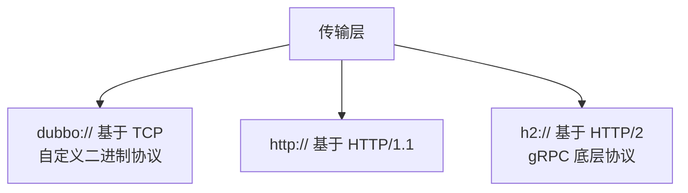
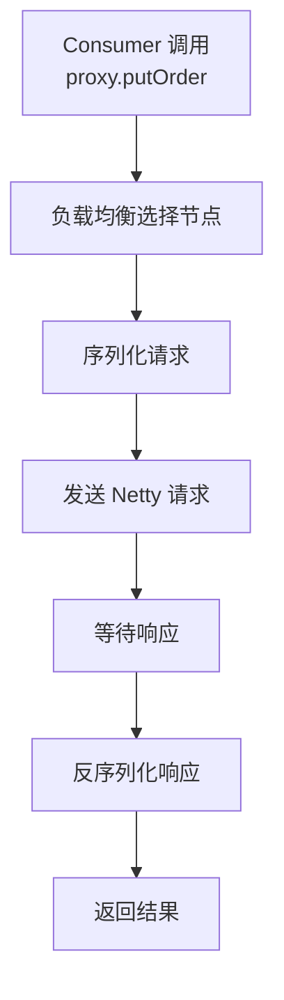
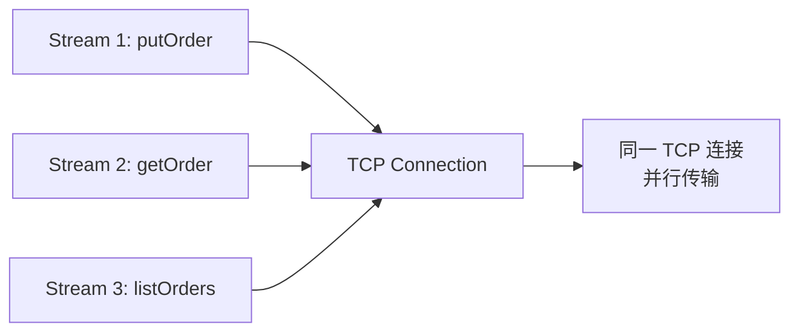
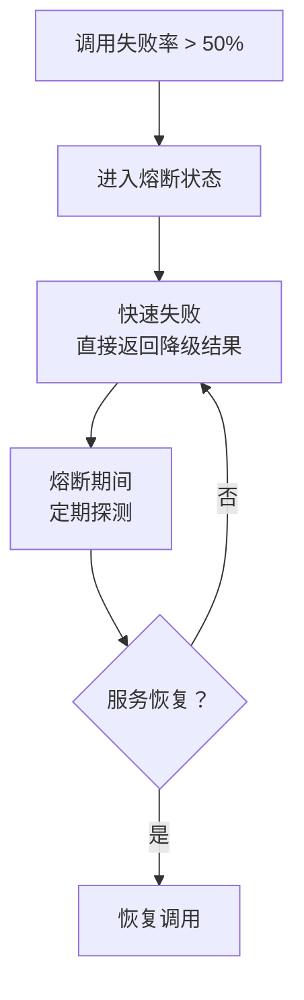

候选人小张在字节跳动面试时，被问到"RPC 调用过程中发生了什么"，他立刻回答："客户端 Stub 把请求序列化，通过网络发到服务端，服务端处理后返回。"

面试官点点头："序列化具体做了什么？用什么协议传输？为什么不用 HTTP？"

小张开始卡壳。

【面试官心理】
这个问题我用来试探候选人对 RPC 整个链路的理解深度。能背出四步流程的占 80%，能讲清序列化协议选型原因的占 40%，能说清楚动态代理在其中的角色的只有 20%。RPC 是分布式系统的根基，这道题答不好，后续的 Dubbo、gRPC 问题都不用问了。

## 一、RPC 的四步调用流程 🔴

### 1.1 完整调用链路

RPC 的本质是"让调用远程服务像调用本地方法一样简单"。这背后隐藏着复杂的技术细节。


**第一步：客户端 Stub（桩）**

客户端创建一个代理对象，这个代理对象持有服务端的地址信息。当你调用 `orderService.putOrder(order)` 时，实际上调用的是这个代理对象。

```java
// 你以为你在调用本地方法
Order order = orderService.putOrder(new Order("123", 100.0));

// 实际上调用的是这个代理
public class OrderServiceStub implements OrderService {
    private InetSocketAddress addr;

    public Order putOrder(Order order) {
        // 1. 把方法名、参数打包
        RpcRequest request = new RpcRequest();
        request.setMethodName("putOrder");
        request.setParams(new Object[]{order});

        // 2. 序列化
        byte[] data = serializer.serialize(request);

        // 3. 网络发送
        Socket socket = new Socket(addr.getHost(), addr.getPort());
        OutputStream out = socket.getOutputStream();
        out.write(data);
        // ...
    }
}
```

**第二步：序列化（Serialize）**

将请求对象序列化为字节流。这是 RPC 性能损耗最大的环节之一。不同序列化协议性能差异巨大：

| 序列化协议 | 序列化速度 | 体积大小 | 跨语言 | 典型场景 |
| --- | --- | --- | --- | --- |
| Java Serialization | 慢 | 大 | 否 | JDK 内部 |
| Hessian | 中等 | 中等 | 是 | 老牌 RPC 框架 |
| Kryo | 快 | 小 | 否 | Dubbo 默认 |
| Protobuf | 极快 | 极小 | 是 | gRPC |
| FastJSON | 快 | 中等 | 是 | 简单场景 |

**第三步：网络传输**

序列化后的数据通过 TCP/UDP/HTTP 传输。这里有个经典误区：很多人以为 RPC 必须用 TCP，实际上 Dubbo 支持多种协议（dubbo:// 基于 TCP，http:// 基于 HTTP）。



**第四步：服务端处理与响应**

服务端接收请求后，反序列化，执行真实业务逻辑，序列化响应，返回。

### 1.2 ❌ 错误示范

**候选人原话**："RPC 就是通过 HTTP 调用远程接口。"

**问题诊断**：
- 把传输层协议和 RPC 框架混为一谈
- 完全不理解 TCP 二进制协议的性能优势
- 不知道 HTTP/2 的多路复用是 RPC 需要的特性

**面试官内心 OS**：这人肯定只会用 Feign，没深入研究过底层。

### 1.3 标准回答（P5/P6/P7）

**P5 回答**：
"RPC 调用分四步：客户端通过动态代理生成 Stub，Stub 把方法名和参数序列化，通过网络发送到服务端，服务端反序列化后执行逻辑，返回结果。"

**P6 回答**：
"RPC 在 Stub 层做的事比表面看起来复杂。动态代理在客户端生成了一个实现类，这个类持有注册中心的地址，当调用方法时，它会从注册中心拿到服务提供者列表，通过负载均衡选一个节点，然后序列化请求并发送。服务端收到后，通过 Netty 的 Pipeline 进行解码，反序列化，执行完逻辑后再走同样的链路返回。"

**P7 回答**：
"RPC 的核心挑战有三个：第一个是序列化和反序列化的性能——我们线上做过压测，Protobuf 比 Java Serialization 快了 10 倍，体积小了 5 倍；第二个是连接复用，HTTP/1.1 每次请求都要建立 TCP 连接，HTTP/2 可以多路复用，Dubbo 3.0 的 Triple 协议就是基于 HTTP/2；第三个是地址发现，我们当时选了 Nacos 而不是 ZooKeeper，因为 Nacos 的推送延迟更低。"

【面试官心理】
P7 回答的特点是有具体数字、有踩坑经历、有方案对比。这说明候选人真正在生产环境用过 RPC，而不是背了篇博客。

## 二、序列化协议详解 🟡

### 2.1 为什么序列化是性能瓶颈

你写了一个 RPC 框架，测试环境跑得好好的，一上生产发现 QPS 5000 就到顶了。profiler 一看，80% 的时间花在序列化上。

序列化慢的原因：
1. **反射开销**：Java 反射需要在运行时解析类结构，性能损耗严重
2. **对象创建**：每次序列化都可能创建新的中间对象，增加 GC 压力
3. **字符串处理**：字段名、类型信息都要写入流中

### 2.2 主流序列化协议对比

**Kryo（Dubbo 默认）**

```java
// Kryo 的序列化核心
Kryo kryo = new Kryo();
kryo.register(Order.class, new JavaSerializer());

Output output = new Output(new FileOutputStream("order.bin"));
kryo.writeObject(output, order);
output.close();
```

Kryo 的优点：速度快（比 Hessian 快 10 倍），体积小。缺点：不支持跨语言，JDK 版本兼容性差。

**Protobuf（gRPC 默认）**

定义 `.proto` 文件：

```protobuf
syntax = "proto3";

message Order {
    string id = 1;
    double amount = 2;
    string status = 3;
}

service OrderService {
    rpc putOrder(Order) returns (Order);
}
```

Protobuf 的核心优势：**tag-length-value 编码**。每个字段用 `字段编号 + 数据类型 + 数据值` 的方式存储，字段名不参与传输。

```mermaid
graph LR
    A[Order.id = "123"] --> B[字段编号: 1<br/>数据类型: string<br/>值: "123"]
    B --> C[01 08 "123"] --> D[01 = 字段1<br/>08 = string类型<br/>+3长度]
```

这就是为什么 Protobuf 序列化后体积极小——不需要传输字段名。

### 2.3 ❌ 错误示范

**候选人原话**："FastJSON 也是一种序列化协议，我们项目里用它做 RPC 序列化。"

**问题诊断**：
- 混淆了 JSON 序列化库和 RPC 序列化协议
- FastJSON 没有字段编号优化，体积会比 Protobuf 大 3-5 倍
- 没有考虑 JSON 的跨语言特性在 RPC 场景是否必要

【面试官心理】
这个问题我用来试探候选人对序列化原理的理解程度。能说出 tag-length-value 编码的候选人，基本都看过序列化库的源码，这种人通常值得培养。

## 三、动态代理在 RPC 中的角色 🟡

### 3.1 动态代理的三个作用

Dubbo 的动态代理是整个框架的核心，它承担了三个职责：



1. **屏蔽网络细节**：调用方以为在调用本地方法，实际上在发起网络请求
2. **地址发现**：动态代理持有注册中心引用，能动态获取服务提供者列表
3. **负载均衡**：每次调用时通过负载均衡策略选择目标节点

### 3.2 JDK 动态代理 vs Javassist vs ByteBuddy

Dubbo 在不同版本用了不同的动态代理实现：

| 版本 | 代理方式 | 性能 | 灵活性 |
| --- | --- | --- | --- |
| Dubbo 2.6 | Javassist | 高 | 中 |
| Dubbo 2.7 | Javassist + JDK Proxy | 中 | 高 |
| Dubbo 3.0 | Javassist + 字节码生成 | 高 | 高 |

```java
// JDK 动态代理的核心接口
public interface InvocationHandler {
    Object invoke(Object proxy, Method method, Object[] args) throws Throwable;
}

// Dubbo 中的 InvokerInvocationHandler
public class InvokerInvocationHandler implements InvocationHandler {
    private final Invoker<?> invoker;

    public Object invoke(Object proxy, Method method, Object[] args) {
        // 1. 构建 RPC 请求
        RpcInvocation invocation = new RpcInvocation(
            method, args, invoker.getInterface()
        );
        // 2. 通过 Cluster Invoker 执行集群容错
        return invoker.invoke(invocation).recreate();
    }
}
```

### 3.3 ❌ 错误示范

**候选人原话**："Dubbo 用动态代理是为了实现 AOP，切面编程。"

**问题诊断**：
- 完全混淆了 AOP 和 RPC 动态代理的概念
- AOP 是为了增强方法（事务、日志），动态代理是为了远程调用
- 典型的"听别人说过但没理解"的表现

【面试官心理】
这个问题我能接受不知道，但混淆概念就不行。动态代理和 AOP 没有任何关系，前者是设计模式，后者是面向切面编程——虽然动态代理可以用于实现 AOP，但它们是两回事。

## 四、传输协议与网络层 🟡

### 4.1 TCP 二进制协议 vs HTTP

**Dubbo 协议（基于 TCP）**

```java
// Dubbo 协议头格式（自定义二进制协议）
// Magic(2) + Flag(1) + Status(1) + InvokeID(8) + Body Length(4)
// 固定 16 字节头 + 变长 Body
+--------+--------+--------+--------+
| Magic  | Flag   | Status | InvokeID (8 bytes) |
+--------+--------+--------+--------+
| Body Length (4 bytes)                      |
+--------+--------+--------+--------+
|               Body                          |
+----------------------------------------------+
```

自定义协议的优点：性能高（无 HTTP 头开销）、可定制（支持心跳、压缩、加密）。缺点：需要自己实现编解码。

**HTTP/2 协议（gRPC 使用）**

HTTP/2 的核心优势是**多路复用**：



一个 TCP 连接上可以并行多个 Stream（相当于虚拟连接），解决了 HTTP/1.1 的队头阻塞问题。

### 4.2 追问升级

**面试官追问**："为什么说 TCP 二进制协议比 HTTP 更快？"

P6 候选人："因为少了 HTTP 头的开销。"

P7 候选人："不只是 HTTP 头的问题。TCP 二进制协议可以自定义协议头，不需要解析文本，Netty 的 ByteToMessageDecoder 可以直接处理二进制流。但更重要的是，HTTP/1.1 有队头阻塞——虽然 TCP 是可靠的，但如果第一个请求慢了，后面所有请求都要等。HTTP/2 通过 Stream 解决了这个问题。Dubbo 3.0 的 Triple 协议升级到 HTTP/2，就是为了利用多路复用能力。"

【面试官心理】
能说出队头阻塞和 HTTP/2 Stream 的候选人，说明他对网络协议有实战理解。这种人在性能调优场景中能发挥作用。

## 五、超时、重试与熔断 🟢

### 5.1 超时机制

超时是 RPC 调用中最容易出问题的环节：

```java
// Dubbo 超时配置
@DubboReference(timeout = 3000)  // 3秒超时

// 如果调用链路是 A -> B -> C
// A 设置超时 3s，B 处理 2s，C 处理 2s
// 那么 A 实际只有 -1s 的超时（已经超时了）
```

**级联超时问题**：如果整条调用链超时配置不合理，会导致上游提前超时，浪费下游的计算资源。

### 5.2 重试机制

Dubbo 支持重试，但重试是有风险的：

```java
// retries = 3 意味着：首次调用 + 3次重试 = 最多 4 次
// ⚠️ idempotent=true 的接口才能重试！
@DubboReference(retries = 3, timeout = 1000)
```

| 接口类型 | 可否重试 | 重试后果 |
| --- | --- | --- |
| 查询接口 | 是 | 浪费资源，结果相同 |
| 插入接口 | 否 | 重复插入，数据不一致 |
| 更新接口 | 视情况 | 可能覆盖他人更新 |
| 删除接口 | 否 | 重复删除 |

### 5.3 熔断机制

当某个服务节点的错误率超过阈值时，自动熔断，避免雪崩：



## 六、工程选型

**什么场景用什么 RPC 框架？**

| 场景 | 推荐方案 | 理由 |
| --- | --- | --- |
| Spring Cloud 生态内部调用 | Feign + Ribbon | 集成好，声明式调用 |
| Java 内部高性能调用 | Dubbo 3.0 | 治理能力强，性能高 |
| 跨语言调用 | gRPC | 跨语言，IDL 定义服务 |
| 对外暴露 API | HTTP + JSON | 最通用，兼容性最好 |
| 超高并发内部调用 | 自定义 TCP + Protobuf | 极致性能优化 |

:::tip 💡
Dubbo 3.0 的 Triple 协议是基于 HTTP/2 的，兼容 gRPC 的语义，同时保留了 Dubbo 的治理能力。如果你需要跨语言但又舍不得放弃 Dubbo 的生态，Triple 是折中方案。
:::

:::warning ⚠️
RPC 调用的超时配置一定要小于等于下游服务的超时配置。很多线上事故就是因为上游超时配置过长，导致错误堆积无法及时熔断。
:::

## 七、生产避坑

### 7.1 线上常见翻车点

1. **超时配置过大**：上游设置了 10s 超时，下游其实 1s 就能返回，结果错误被延迟暴露
2. **重试了非幂等接口**：插入操作重试导致重复数据
3. **序列化版本不兼容**：升级序列化库后没有做兼容性测试，旧数据无法反序列化
4. **连接池耗尽**：高并发下 TCP 连接数暴涨，连接池被打满

### 7.2 排查方法

```bash
# 查看 RPC 调用链路延迟
dubbo.protocol.dubbo.ttl=3000

# 开启 Netty 调试
-Djava.net.preferIPv4Stack=true
-Dnetty.leakDetection=PARANOID

# 抓包分析
tcpdump -i any -w rpc.pcap port 20880
```

【面试官心理】
能说出生产排查方法的候选人，说明他有实际踩坑经验。这种候选人在我这里至少是 P6+ 的印象分。
