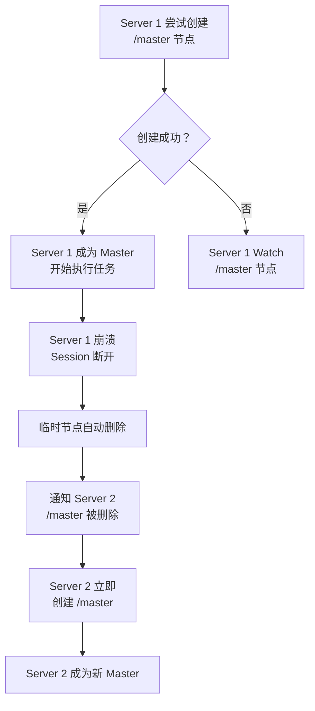
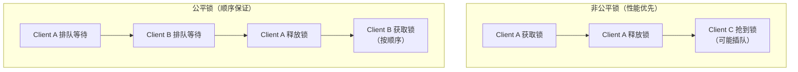
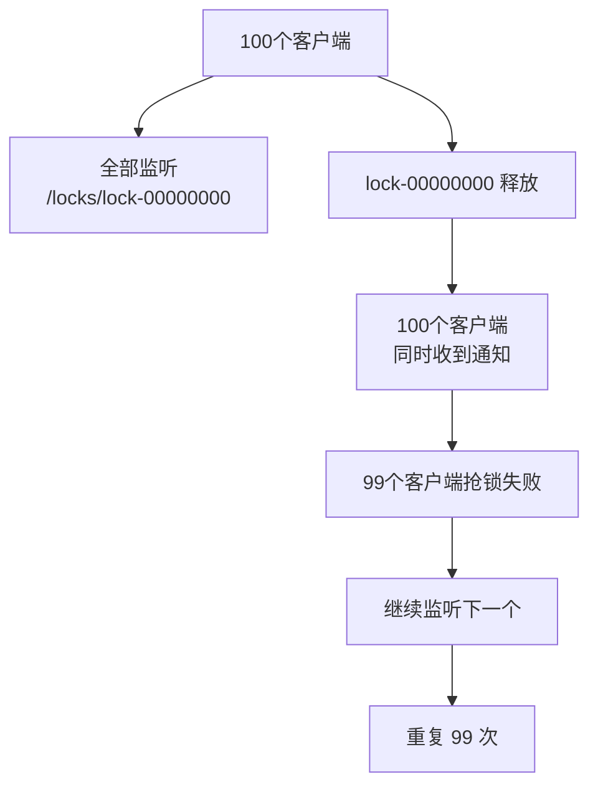
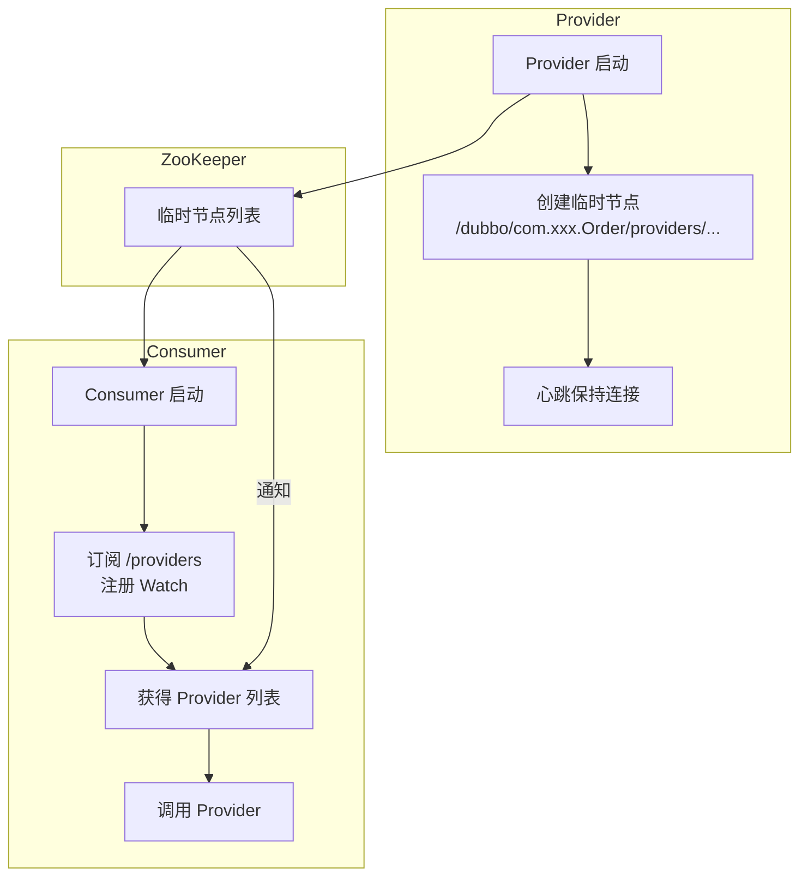
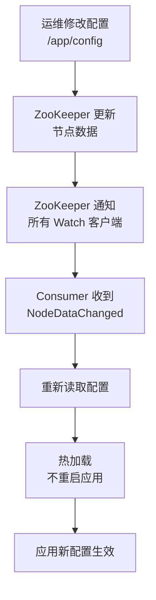

候选人小李在面试阿里 P6 时，面试官问："ZooKeeper 在你们项目里是怎么用的？用过分布式锁吗？"

小李说："用过，用 ZooKeeper 的临时节点做的。"面试官追问："那怎么保证锁的公平性？如果获取锁的节点崩溃了会怎样？"

小李："..."

【面试官心理】
ZooKeeper 的典型应用场景是考察候选人实战经验的关键问题。能说清楚分布式锁的实现原理（临时顺序节点 + Watch）、Master 选举、配置管理的候选人，说明他有生产环境的使用经验。这种候选人在我这里是 P6+ 的水平。

## 一、Master 选举 🔴

### 1.1 场景描述

多台服务器竞争一个 Master 角色，只有 Master 能执行关键操作（如数据同步、任务分发）。

### 1.2 实现原理

**核心思想**：用临时节点 + Watch，谁先创建节点谁就是 Master。



### 1.3 代码实现

```java
public class MasterElection {

    private ZooKeeper zk;
    private String masterPath = "/master";

    public boolean tryBecomeMaster() {
        try {
            // 尝试创建临时节点
            zk.create(masterPath,
                zk.getSessionId(),
                ZooDefs.Ids.OPEN_ACL_UNSAFE,
                CreateMode.EPHEMERAL);
            return true;  // 创建成功，成为 Master
        } catch (NodeExistsException e) {
            // 节点已存在，说明已有 Master
            return false;
        }
    }

    public void watchMaster() {
        // 注册 Watch，监听 Master 节点变化
        zk.exists(masterPath, event -> {
            if (event.getType() == EventType.NodeDeleted) {
                // Master 节点被删除，尝试抢主
                if (tryBecomeMaster()) {
                    System.out.println("我成为了新的 Master");
                } else {
                    // 没抢到，继续 Watch
                    watchMaster();
                }
            }
        });
    }
}
```

### 1.4 ❌ 错误示范

**候选人原话**："Master 选举用临时节点就行，临时节点挂了自动删除。"

**问题诊断**：
- 没有提到 Watch 机制，轮询效率低下
- 没有处理竞态条件（多个节点同时抢主）
- 没有说明如何判断当前节点是否是 Master

【面试官心理】
Master 选举的细节在于"临时节点 + Watch"的组合使用。单用临时节点会导致轮询，效率低下；加上 Watch 才能实现高效的通知机制。

## 二、分布式锁 🟡

### 2.1 分布式锁的要求

| 要求 | 说明 | 实现方式 |
| --- | --- | --- |
| 互斥性 | 同一时刻只有一个客户端持有锁 | 临时顺序节点 |
| 可重入 | 同一客户端可以多次获取锁 | 记录持有者 |
| 锁超时 | 持有者崩溃后自动释放 | TTL + Watch |
| 公平性 | 按申请顺序获取锁 | 顺序节点 |
| 高性能 | 锁操作延迟低 | Watch 通知 |

### 2.2 非公平锁实现

```java
public class DistributedLock {

    private ZooKeeper zk;
    private String lockPath = "/locks";

    // 非公平锁：谁抢到谁拿，不保证顺序
    public void lock() throws Exception {
        String node = zk.create(
            lockPath + "/lock-",
            new byte[0],
            ZooDefs.Ids.OPEN_ACL_UNSAFE,
            CreateMode.EPHEMERAL_SEQUENTIAL
        );

        // 获取所有锁节点
        List<String> nodes = zk.getChildren(lockPath, false);
        Collections.sort(nodes);

        if (node.equals(lockPath + "/" + nodes.get(0))) {
            // 我是第一个，说明拿到了锁
            return;
        } else {
            // 监听前一个节点的删除事件
            String prevNode = lockPath + "/" + nodes.get(
                nodes.indexOf(node.substring(node.lastIndexOf("/") + 1)) - 1
            );
            zk.exists(prevNode, event -> {
                if (event.getType() == EventType.NodeDeleted) {
                    // 前一个节点释放了，我可以拿锁了
                    synchronized (this) {
                        this.notify();
                    }
                }
            });
            synchronized (this) {
                this.wait();
            }
        }
    }

    public void unlock() {
        zk.delete(lockPath + "/" + currentNode, -1);
    }
}
```

### 2.3 公平锁 vs 非公平锁



**公平锁的实现**：

```java
// 关键：监听比自己小的那个节点，而不是监听最小节点
List<String> nodes = zk.getChildren(lockPath, false);
// 排序后找到自己的位置
int index = nodes.indexOf(myNodeName);
if (index == 0) {
    // 我是最小的，拿到锁
} else {
    // 监听比我小的那个节点
    String prevNode = lockPath + "/" + nodes.get(index - 1);
    zk.exists(prevNode, watch);
}
```

### 2.4 羊群效应问题

**问题**：大量客户端同时抢一把锁时，如果用监听最小节点，会产生"羊群效应"：



**解决方案**：改用监听前一个节点，形成**锁队列**：

```java
// 监听前一个节点，而不是最小节点
String prevNode = lockPath + "/" + nodes.get(index - 1);
zk.exists(prevNode, event -> {
    // 只有前一个节点释放时才收到通知
});
```

## 三、服务注册与发现 🟡

### 3.1 核心原理



### 3.2 Provider 注册

```java
// Provider 启动时注册
public void registerProvider(String serviceName, String host, int port) {
    String path = String.format("/dubbo/%s/providers/%s:%d",
        serviceName, host, port);
    zk.create(path,
        "version=1.0".getBytes(),
        ZooDefs.Ids.OPEN_ACL_UNSAFE,
        CreateMode.EPHEMERAL);
}

// Provider 心跳
public void heartbeat() {
    // 临时节点不需要心跳
    // Session 保持连接即可
}
```

### 3.3 Consumer 订阅

```java
// Consumer 启动时订阅
public List<String> subscribeProviders(String serviceName) {
    String path = "/dubbo/" + serviceName + "/providers";

    // 获取当前 Provider 列表
    List<String> providers = zk.getChildren(path, event -> {
        if (event.getType() == EventType.NodeChildrenChanged) {
            // Provider 列表变化，重新获取
            List<String> newProviders = zk.getChildren(path, this);
            updateInvokerList(newProviders);
        }
    });

    return providers;
}
```

### 3.4 节点变化感知

| 事件 | 触发时机 | Consumer 处理 |
| --- | --- | --- |
| Provider 上线 | 创建临时节点 | 更新本地 Provider 列表 |
| Provider 下线 | Session 断开/主动删除 | 从列表中移除 |
| Provider 网络抖动 | Session 断开 | 暂时移除，可能恢复 |
| Provider 网络恢复 | Session 重新建立 | 重新注册，Consumer 感知 |

## 四、配置管理 🟡

### 4.1 动态配置管理

```java
public class ConfigWatcher {

    private ZooKeeper zk;
    private String configPath = "/app/config";

    // 读取配置
    public String getConfig() throws Exception {
        byte[] data = zk.getData(configPath, event -> {
            if (event.getType() == EventType.NodeDataChanged) {
                // 配置变更，重新读取
                String newConfig = getConfig();
                applyConfig(newConfig);
            }
        }, null);
        return new String(data);
    }

    // 更新配置
    public void updateConfig(String newConfig) throws Exception {
        Stat stat = zk.setData(configPath, newConfig.getBytes(), -1);
        // Watch 机制会自动通知所有订阅的客户端
    }
}
```

### 4.2 配置变更的完整链路



## 五、分布式队列 🟢

### 5.1 FIFO 队列

```java
public class DistributedQueue {

    private ZooKeeper zk;
    private String queuePath = "/queue";

    // 入队：创建顺序节点
    public void enqueue(String data) throws Exception {
        zk.create(queuePath + "/item-",
            data.getBytes(),
            ZooDefs.Ids.OPEN_ACL_UNSAFE,
            CreateMode.PERSISTENT_SEQUENTIAL);
    }

    // 出队：获取最小序号节点
    public String dequeue() throws Exception {
        List<String> items = zk.getChildren(queuePath, false);
        if (items.isEmpty()) {
            return null;
        }
        Collections.sort(items);
        String minItem = items.get(0);
        byte[] data = zk.getData(queuePath + "/" + minItem, false, null);
        zk.delete(queuePath + "/" + minItem, -1);
        return new String(data);
    }
}
```

### 5.2 阻塞队列

```java
// 阻塞出队：没有数据时等待
public String dequeueBlocking() throws Exception {
    while (true) {
        List<String> items = zk.getChildren(queuePath, event -> {
            // 有新数据入队时通知
            synchronized (this) {
                this.notify();
            }
        });

        if (!items.isEmpty()) {
            Collections.sort(items);
            String minItem = items.get(0);
            byte[] data = zk.getData(queuePath + "/" + minItem, false, null);
            zk.delete(queuePath + "/" + minItem, -1);
            return new String(data);
        }

        synchronized (this) {
            this.wait();
        }
    }
}
```

## 六、ID 生成器 🟢

### 6.1 基于顺序节点的 ID 生成

```java
public class IdGenerator {

    private ZooKeeper zk;
    private String idPath = "/ids";

    // 生成唯一 ID
    public String generateId() throws Exception {
        String node = zk.create(idPath + "/id-",
            new byte[0],
            ZooDefs.Ids.OPEN_ACL_UNSAFE,
            CreateMode.PERSISTENT_SEQUENTIAL);
        // 返回节点名，如 /ids/id-00000001
        return node.substring(node.lastIndexOf("-") + 1);
    }
}
```

## 七、Watch 回调的线程模型 🟢

### 7.1 Watch 在哪个线程执行

ZooKeeper 的 Watch 回调在**客户端的 EventThread** 中执行：

```java
ZooKeeper zk = new ZooKeeper("127.0.0.1:2181",
    5000,
    watchedEvent -> {
        // 这个方法在 EventThread 中执行
        // 不是在你创建 Watch 的线程中
    });

// 注意：Watch 回调中不要做耗时操作
// 否则会阻塞其他 Watch 回调
```

### 7.2 常见坑

```java
// ❌ 错误：在 Watch 回调中做网络请求
zk.getData(path, event -> {
    // 这个方法在 EventThread 中执行
    // 如果在这里做 RPC 调用，可能阻塞其他 Watch
    orderService.callRemote();
});

// ✅ 正确：把业务逻辑放到线程池
zk.getData(path, event -> {
    executor.submit(() -> {
        orderService.callRemote();
    });
});
```

## 八、生产避坑

### 8.1 常见翻车点

1. **羊群效应**：大量 Watch 监听同一个节点，导致通知风暴
2. **Watch 漏注册**：收到通知后忘记重新注册
3. **Session 超时配置不当**：超时太短导致误判节点下线
4. **ZNode 数据过大**：最大 1MB，超过会失败
5. **临时节点不能创建子节点**：这是 ZooKeeper 的限制

### 8.2 Curator 框架

生产环境推荐使用 Curator，它封装了 ZooKeeper 的复杂操作：

```java
// Curator 的分布式锁
InterProcessMutex lock = new InterProcessMutex(zkClient, "/locks/order-lock");
try {
    if (lock.acquire(30, TimeUnit.SECONDS)) {
        // 持有锁
        doSomething();
    }
} finally {
    lock.release();
}

// Curator 的 Leader 选举
LeaderLatch latch = new LeaderLatch(zkClient, "/master");
latch.addListener(new LeaderLatchListener() {
    @Override
    public void isLeader() {
        System.out.println("我成为 Leader");
    }
    @Override
    public void notLeader() {
        System.out.println("我不再是 Leader");
    }
});
latch.start();
```

:::tip 💡
Curator 是 Netflix 开源的 ZooKeeper 客户端封装，生产环境强烈推荐使用。它解决了原生 ZooKeeper 客户端的很多坑：自动重连、Watch 重新注册、分布式锁的公平性等。
:::

:::warning ⚠️
ZooKeeper 的临时节点和 Session 绑定，如果 Session 超时（比如网络抖动），临时节点会被删除。如果你的服务需要临时节点来做健康检查，记得把 Session 超时配置得合理一些，避免误判。
:::

【面试官心理】
ZooKeeper 的典型应用场景是考察候选人实战经验的关键。能说清楚分布式锁的临时顺序节点实现、羊群效应的解决、Master 选举的 Watch 机制的候选人，说明他有生产环境的使用经验。这种候选人在我这里是 P6+ 的水平。
