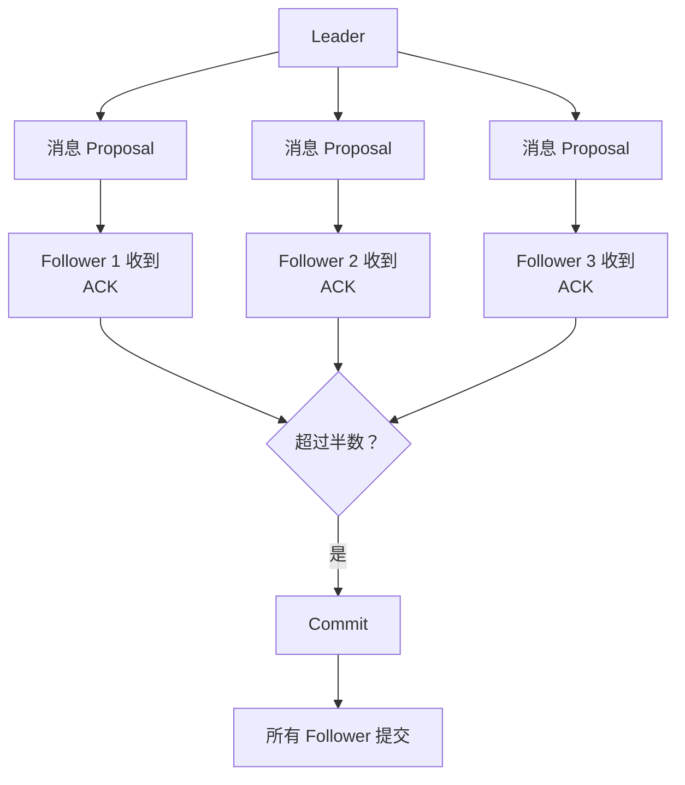
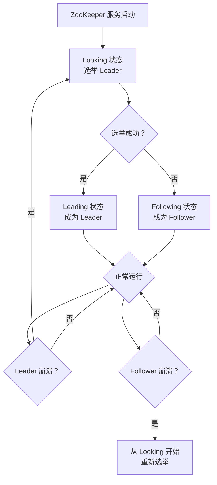
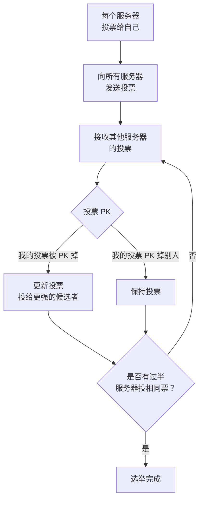
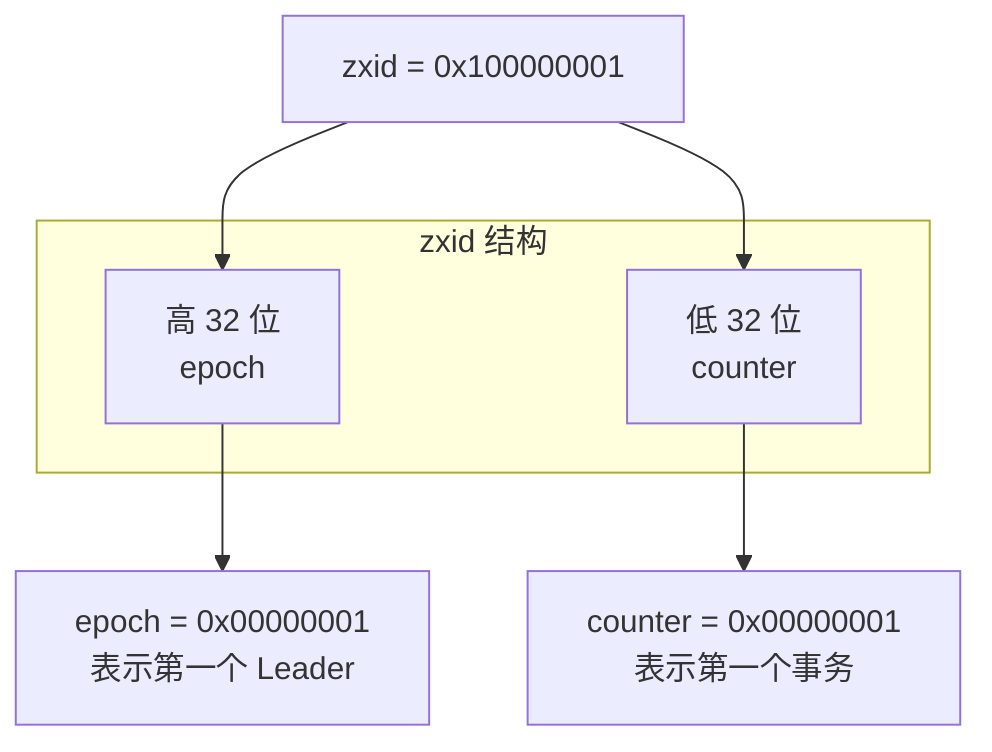
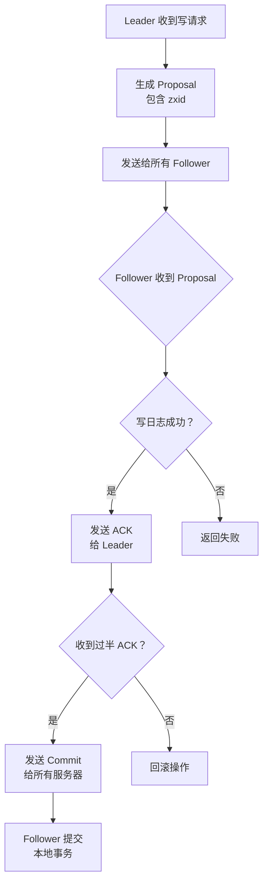
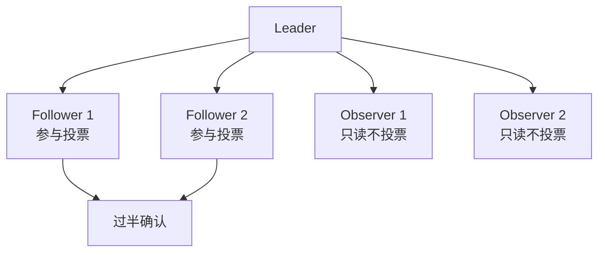
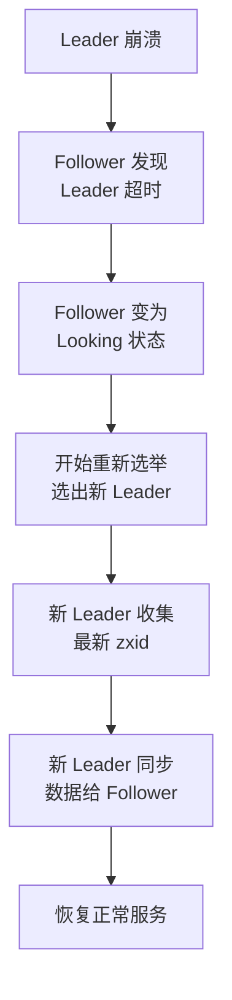
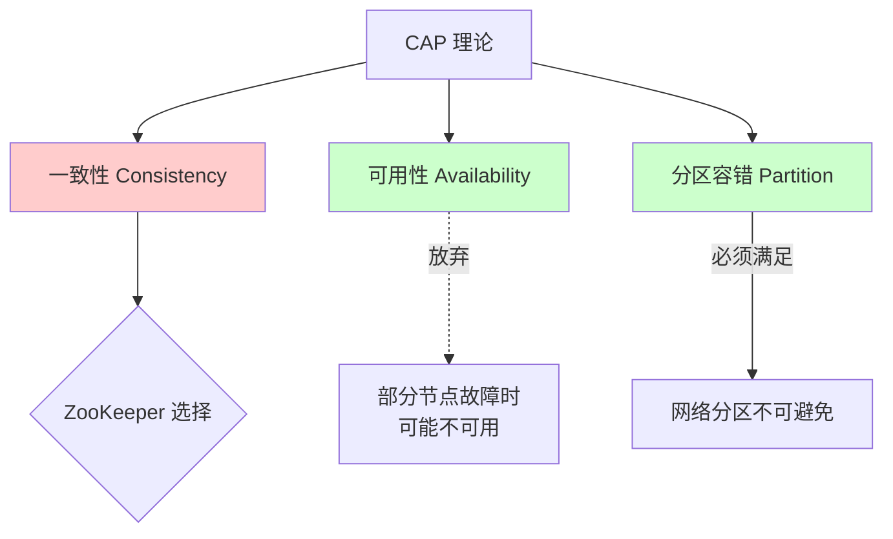

候选人小李在面试美团 P6 时，面试官问："ZooKeeper 的 Leader 选举是怎么进行的？如果 Leader 挂了，新 Leader 是怎么选出来的？"

小李说："用 ZooKeeper 的 Leader 选举..."面试官追问："那选举的具体算法是什么？zxid 和 epoch 分别代表什么？"

小李摇头。

【面试官心理】
ZAB 协议是 ZooKeeper 一致性的核心，但大多数候选人只知道"ZooKeeper 是 CP 系统"。能说清楚 Leader 选举算法、zxid 的作用、崩溃恢复流程的候选人，说明他对分布式一致性有深入理解。这种候选人在我这里是 P6+ 的加分项。

## 一、ZAB 协议概述 🔴

### 1.1 ZAB 是什么

ZAB（ZooKeeper Atomic Broadcast）是 ZooKeeper 的**原子广播协议**，它解决了三个问题：

1. **原子性**：消息要么全部同步，要么全部不同步
2. **一致性**：所有 Follower 的状态最终一致
3. **有序性**：消息按 Leader 提出的顺序执行



### 1.2 ❌ 错误示范

**候选人原话**："ZAB 就是 Paxos 算法在 ZooKeeper 中的实现。"

**问题诊断**：
- 混淆了 ZAB 和 Paxos 的关系
- ZAB 是专门为 ZooKeeper 设计的，不是 Paxos
- ZAB 有 Leader 概念，Paxos 没有

【面试官心理】
ZAB 和 Paxos 的关系是经典面试题。能说清楚 ZAB 是为 ZooKeeper 设计的、专注于"主备"模式的协议，而不是通用的一致性算法，才是真正理解了 ZooKeeper 的设计哲学。

## 二、ZAB 的两种运行模式 🟡

### 2.1 模式切换图



### 2.2 状态说明

| 状态 | 角色 | 说明 |
| --- | --- | --- |
| Looking | 竞选状态 | 服务启动或 Leader 崩溃后进入 |
| Leading | 领导者状态 | 成为 Leader，负责接收客户端请求 |
| Following | 跟随者状态 | 成为 Follower，接收 Leader 的提议 |
| Observing | 观察者状态 | 只读，不参与投票 |

## 三、Leader 选举机制 🟡

### 3.1 选举的触发时机

1. **服务启动时**：所有服务都是 Looking 状态，开始选举
2. **Leader 崩溃时**：Leader 无法响应，Follower 变为 Looking
3. **过半 Follower 无法连接 Leader**：触发重新选举

### 3.2 投票的数据结构

```java
class Vote {
    long serverId;     // 服务器 ID（myid）
    long zxid;         // 事务 ID
    long electionEpoch; // 选举轮次
    QuorumPeer.ServerState state; // 状态
}
```

**投票优先级**（按以下顺序比较）：

```
1. electionEpoch（选举轮次）: 越大越优（说明服务越"新"）
2. zxid（事务 ID）: 越大越优（数据越完整）
3. serverId（服务器 ID）: 越大越优（作为最终裁决）
```

### 3.3 Fast Leader Election 算法



**投票 PK 的逻辑**：

```java
// 伪代码
if (收到的投票.executionEpoch > 我的executionEpoch) {
    // 收到的服务器更新，投票更优
    更新投票 = 收到的投票
} else if (收到的投票.executionEpoch == 我的executionEpoch) {
    if (收到的投票.zxid > 我的zxid) {
        // 数据更完整
        更新投票 = 收到的投票
    } else if (收到的投票.zxid == 我的zxid) {
        if (收到的投票.serverId > 我的serverId) {
            // 更大 ID 作为裁决
            更新投票 = 收到的投票
        }
    }
}
```

### 3.4 zxid 的作用

zxid（ZooKeeper Transaction ID）是**全局递增的事务编号**：



**zxid 的含义**：

- **高 32 位（epoch）**：Leader 的任期号，每次选举递增
- **低 32 位（counter）**：事务计数器，每个事务递增

**zxid 为什么越大越优**：

1. **高 epoch 表示更新的 Leader**：说明数据更新
2. **高 counter 表示数据更完整**：没有丢失事务
3. **新 Leader 必须包含所有已提交的事务**：通过 zxid 保证

## 四、消息广播（Broadcast）🟡

### 4.1 两阶段提交

ZAB 的消息广播是一个简化版的 2PC：



### 4.2 为什么是过半确认

ZooKeeper 的**过半原则**：

- **写入**：需要过半节点确认（3节点集群需要2个确认）
- **读取**：可以读任意节点（最终一致）
- **选举**：需要过半节点同意

**过半原则的好处**：

```
3 节点集群：
- 写入需要 2 个确认
- 最多容忍 1 个节点故障

5 节点集群：
- 写入需要 3 个确认
- 最多容忍 2 个节点故障

2 节点集群（不推荐）：
- 写入需要 2 个确认
- 最多容忍 0 个节点故障
- 如果一个节点挂了，无法选出新 Leader
```

### 4.3 Observer 节点

Observer 不参与投票，只同步 Leader 的数据：



**使用场景**：

- 跨数据中心部署：Observer 可以部署在远距离数据中心，减少延迟
- 读多写少：增加 Observer 提高读取吞吐量

## 五、崩溃恢复（Recovery）🟡

### 5.1 什么时候需要恢复

Leader 崩溃后，需要恢复两个保证：

1. **已提交的事务必须被所有服务器接受**
2. **未提交的事务必须被丢弃**

### 5.2 恢复流程



### 5.3 数据同步的三种情况

| 情况 | 说明 | 处理方式 |
| --- | --- | --- |
| **DIFF 同步** | Follower 落后不多 | Leader 发送差异 Proposal |
| **SNAP 同步** | Follower 落后太多 | Leader 发送完整快照 |
| **TRUNC 同步** | Follower 多了一些 Proposal | Leader 让 Follower 回滚 |

## 六、CAP 定位 🟢

### 6.1 ZooKeeper 是 CP 系统

ZooKeeper 保证**强一致性（CP）**：



**为什么 ZooKeeper 是 CP**：

1. **一致性**：所有 Follower 的状态最终一致
2. **分区容错**：支持网络分区
3. **牺牲可用性**：Leader 崩溃时，服务不可用，直到新 Leader 选出

### 6.2 与 Eureka 的对比

| 维度 | ZooKeeper | Eureka |
| --- | --- | --- |
| CAP | CP（强一致） | AP（高可用） |
| 一致性 | 强一致 | 最终一致 |
| 可用性 | Leader 崩溃时短暂不可用 | 始终可用 |
| 数据新鲜度 | 最新数据 | 可能有延迟 |

:::tip 💡
Eureka 的 AP 特性意味着：当你写数据时，即使某些节点没收到数据，客户端仍然可以读到旧数据。但 ZooKeeper 的 CP 特性保证了：如果 Leader 说数据已提交，所有节点都能读到。
:::

## 七、生产避坑

### 7.1 常见翻车点

1. **偶数节点部署**：2 节点 ZooKeeper 无法容忍任何节点故障
2. **Session 超时配置过长**：Leader 崩溃后需要更长时间恢复
3. **写入压力过大**：ZooKeeper 不适合高并发写入
4. **网络分区导致脑裂**：过半原则可以防止脑裂，但需要正确配置

### 7.2 运维建议

| 配置 | 推荐值 | 说明 |
| --- | --- | --- |
| 节点数 | 3/5/7 | 必须奇数，满足过半原则 |
| tickTime | 2000ms | 心跳间隔 |
| initLimit | 10 | 初始化超时倍数 |
| syncLimit | 5 | 同步超时倍数 |
| snapCount | 100000 | 快照间隔（事务数） |

:::warning ⚠️
ZooKeeper 的写入是串行的（通过 Leader），高并发写入场景下会成为瓶颈。注册中心场景下写入量不大，但如果你的场景有大量动态配置更新，需要评估 ZooKeeper 的承受能力。
:::

【面试官心理】
ZAB 协议是 ZooKeeper 一致性的核心。能说清楚 Leader 选举的投票优先级（electionEpoch > zxid > serverId）、消息广播的两阶段提交、崩溃恢复的数据同步流程的候选人，说明他对分布式一致性有深入理解。这种候选人在我这里是 P6+ 的加分项。
