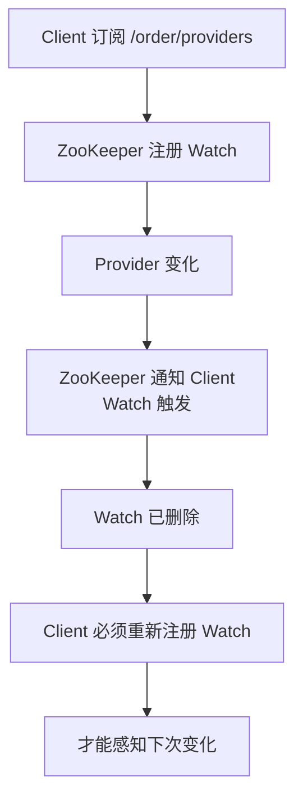
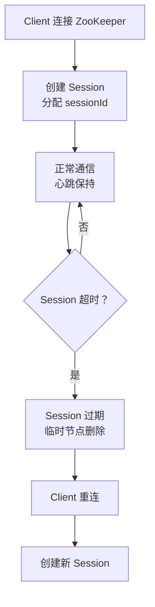

候选人小张在面试阿里 P6 时，面试官问："ZooKeeper 的 ZNode 有哪几种类型？Watcher 机制是一次性的还是持久有效的？"

小张说："有持久节点和临时节点...Watcher 应该是一次性的吧？"

面试官追问："那为什么是一次性的？怎么保证不丢消息？"

小李卡住了。

【面试官心理】
ZooKeeper 是分布式系统的基础组件，但大多数候选人只知道"它用来做注册中心"。能说清楚 ZNode 类型、Watcher 的一次性触发机制、ACL 权限控制的候选人，说明他有分布式系统的基础。这种候选人在我这里是 P6+ 的加分项。

## 一、ZooKeeper 的角色定位 🔴

### 1.1 ZooKeeper 能做什么

ZooKeeper 是分布式系统的**协调服务**，它解决的问题：

| 问题 | ZooKeeper 解决方案 |
| --- | --- |
| 分布式锁 | 临时顺序节点 + Watch |
| 服务注册与发现 | 临时节点 + Watch |
| Master 选举 | 临时节点 + Watch |
| 配置管理 | 持久节点 + Watch |
| 分布式队列 | 顺序节点 |
| 命名服务 | 持久节点路径 |

### 1.2 ZooKeeper 不擅长什么

- **大数据存储**：数据量超过 GB 级别就力不从心
- **高吞吐量写入**：写操作需要 Leader 协调
- **跨数据中心部署**：延迟敏感场景

## 二、ZNode 数据模型 🔴

### 2.1 ZNode 的结构

ZooKeeper 的数据模型是一个树形结构：

```mermaid
graph TD
    A[/] --> B[/dubbo]
    A --> C[/zookeeper]
    B --> D[providers]
    B --> E[consumers]
    D --> F[dubbo://192.168.1.1<br/>20880/com.xxx.Order]
    D --> G[dubbo://192.168.1.2<br/>20880/com.xxx.Order]
    E --> H[消费者列表]
```

**每个 ZNode 的元数据**：

```
czxid: 0x100000001     // 创建时的 zxid
mzxid: 0x100000002     // 最后修改的 zxid
pzxid: 0x100000003     // 子节点最后修改的 zxid
ctime: 2024-01-01 10:00  // 创建时间
mtime: 2024-01-01 10:05  // 修改时间
version: 5              // 数据版本号（用于 CAS）
cversion: 3             // 子节点版本号
aversion: 0             // ACL 版本号
ephemeralOwner: 0x0     // 临时节点所有者 sessionId（持久节点为0）
dataLength: 128         // 数据长度（最大 1MB）
numChildren: 2           // 子节点数量
```

### 2.2 四种 ZNode 类型

| 类型 | 创建方式 | 生命周期 | 典型用途 |
| --- | --- | --- | --- |
| 持久节点 | `create /path data` | 永不过期，除非手动删除 | 配置存储 |
| 临时节点 | `create -e /path data` | 与 session 绑定，session 断则删 | 服务注册 |
| 持久顺序节点 | `create -s /path data` | 永不过期，名称带序号 | 分布式队列 |
| 临时顺序节点 | `create -se /path data` | session 断则删，名称带序号 | 分布式锁 |

```java
// Java API 创建 ZNode
zk.create("/order-service/providers",
    "192.168.1.1:20880".getBytes(),
    ZooDefs.Ids.OPEN_ACL_UNSAFE,
    CreateMode.PERSISTENT);  // 持久节点

zk.create("/order-service/providers",
    "192.168.1.1:20880".getBytes(),
    ZooDefs.Ids.OPEN_ACL_UNSAFE,
    CreateMode.EPHEMERAL);  // 临时节点

zk.create("/locks/lock-",
    "".getBytes(),
    ZooDefs.Ids.OPEN_ACL_UNSAFE,
    CreateMode.EPHEMERAL_SEQUENTIAL);  // 临时顺序节点
```

### 2.3 ❌ 错误示范

**候选人原话**："临时节点在创建后会自动删除，过段时间就会没了。"

**问题诊断**：
- 没有理解临时节点的真正生命周期
- 临时节点的生命周期和 session 绑定，不是"过段时间"
- session 断开会立即删除，不是定时删除

【面试官心理】
这个问题我用来试探候选人对 ZooKeeper 核心概念的理解深度。ZNode 的四种类型是 ZooKeeper 最基础的概念，说不清楚的候选人说明他没有深入研究过。

## 三、Watcher 机制 🟡

### 3.1 Watch 的一次性触发

Watcher 是 ZooKeeper 实现服务发现的核心机制，**但它是一次性的**：



**为什么是一次性**：

ZooKeeper 的设计哲学是**简单优先**。持久有效的 Watch 需要 ZooKeeper 维护大量状态，而一次性 Watch 只需要在服务端维护一个简单的触发器。

### 3.2 Watch 的注册与触发

```java
// 1. 注册 Watch（读取数据时注册）
Stat stat = zk.exists("/order/providers", true);

// 2. 或者读取数据时注册 Watch
byte[] data = zk.getData("/order/providers", watcher, stat);

// 3. Watch 触发时的回调
Watcher watcher = new Watcher() {
    @Override
    public void process(WatchedEvent event) {
        System.out.println("事件类型: " + event.getType());
        System.out.println("路径: " + event.getPath());
        System.out.println("状态: " + event.getState());

        // ⚠️ 必须重新注册 Watch
        if (event.getType() == EventType.NodeChildrenChanged) {
            // 重新注册 Watch，继续监听
            zk.getChildren(event.getPath(), this);
        }
    }
};
```

### 3.3 Watch 的事件类型

| 事件类型 | 触发时机 |
| --- | --- |
| `None` | 客户端连接状态变化 |
| `NodeCreated` | ZNode 被创建 |
| `NodeDeleted` | ZNode 被删除 |
| `NodeDataChanged` | ZNode 数据被修改 |
| `NodeChildrenChanged` | ZNode 子节点变化 |

### 3.4 Watch 的三大保证

1. **Watcher 异步发送**：服务端先更新数据，然后异步通知客户端
2. **Watcher 按顺序发送**：同一个客户端的 Watch 按事件顺序处理
3. **先注册再触发**：只有已经注册的 Watch 才会被触发

### 3.5 ❌ 错误示范

**候选人原话**："Watcher 是持久有效的，只要注册一次就能一直收到通知。"

**问题诊断**：
- 完全理解错了 Watcher 的生命周期
- 持久有效的 Watch 会导致 ZooKeeper 内存暴涨
- 正确做法是每次收到通知后重新注册

【面试官心理】
Watcher 的一次性触发是 ZooKeeper 最容易踩坑的地方。能说清楚为什么是一次性、怎么重新注册的候选人，说明他真正用过 ZooKeeper，而不是只在博客上看过。

## 四、ACL 权限控制 🟡

### 4.1 五类权限

ZooKeeper 的 ACL 分为五类：

| 权限 | 简写 | 说明 | 对应操作 |
| --- | --- | --- | --- |
| READ | r | 读取 ZNode 数据和子节点列表 | `getData`、`getChildren` |
| WRITE | w | 修改 ZNode 数据 | `setData` |
| CREATE | c | 创建子节点 | `create` |
| DELETE | d | 删除子节点 | `delete` |
| ADMIN | a | 设置权限 | `setACL` |

### 4.2 ACL 的认证方式

```java
// 方式1：world 认证（默认）
// 所有人都有所有权限
new ACL(Perms.ALL, new Id("world", "anyone"));

// 方式2：IP 认证
// 只有指定 IP 有权限
new ACL(Perms.READ, new Id("ip", "192.168.1.1"));

// 方式3：Digest 认证（用户名密码）
// 只有指定用户有权限
new ACL(Perms.ALL, new Id("digest", "user1:password1"));

// 方式4：SASL 认证（Kerberos）
// 用于 Kerberos 认证
```

### 4.3 设置 ACL

```java
// 创建带权限的 ZNode
List<ACL> acls = Arrays.asList(
    new ACL(Perms.READ, new Id("world", "anyone")),  // 所有人可读
    new ACL(Perms.ALL, new Id("auth", ""))          // 认证用户可写
);
zk.create("/order/config",
    "timeout=3000".getBytes(),
    acls,
    CreateMode.PERSISTENT);

// 客户端认证后访问
zk.addAuthInfo("digest", "user1:password1".getBytes());
byte[] data = zk.getData("/order/config", false, null);
```

## 五、会话管理 🟡

### 5.1 Session 的生命周期



**Session 超时时间**：

```properties
# ZooKeeper 服务端配置
tickTime=2000           # 心跳间隔（毫秒）
initLimit=10            # 初始化超时倍数
syncLimit=5             # 同步超时倍数
# Session 超时 = tickTime * initLimit ~ tickTime * 2 * initLimit
# 例如：2秒 * 10 = 20秒
```

### 5.2 Session 的作用

- **维护客户端状态**：客户端与服务端的心跳连接
- **绑定临时节点**：Session 断开，临时节点自动删除
- **保证操作顺序**：同一个 Session 的操作按顺序执行

## 六、Chroot 命名空间 🟢

### 6.1 什么是 Chroot

Chroot 允许将 ZooKeeper 的一个子树作为独立命名空间：

```
zkServer.sh start config /zookeeper/data/myapp
```

配置后，客户端连接到的是 `/myapp` 下的路径：

```java
// 连接时指定 chroot
ZooKeeper zk = new ZooKeeper(
    "127.0.0.1:2181/myapp",  // chroot = /myapp
    5000,
    watcher
);

// 实际访问的是 /myapp/order
zk.getData("/order", false, null);
```

### 6.2 使用场景

- **多租户隔离**：不同租户使用不同的 ZooKeeper 子树
- **应用隔离**：不同应用使用不同的命名空间

## 七、生产避坑

### 7.1 常见翻车点

1. **Watch 漏注册**：收到通知后忘记重新注册，导致丢失后续事件
2. **Session 超时配置不合理**：超时太短导致误判节点下线
3. **ZNode 数据过大**：ZooKeeper 不适合存大量数据（最大 1MB）
4. **单机部署**：ZooKeeper 必须奇数部署（3/5/7 节点）

### 7.2 监控指标

```bash
# ZooKeeper 四字命令
echo stat | nc 127.0.0.1 2181
# 查看连接数、请求延迟、节点数

echo mntr | nc 127.0.0.1 2181
# 查看更多监控指标
# zk_avg_latency
# zk_max_latency
# zk_packets_received
# zk_packets_sent
# zk_ephemerals_count
# zk_approximate_data_size
```

:::tip 💡
ZooKeeper 的 Watch 是顺序触发的，不会出现"先收到删除事件，后收到创建事件"的乱序问题。这保证了服务发现的正确性。
:::

:::warning ⚠️
ZooKeeper 的 Session 超时时间需要和注册中心的心跳配合设置。如果 ZooKeeper 的 Session 超时是 30 秒，而应用的心跳是 10 秒，临时节点可能会被提前删除，导致服务不可用。
:::

【面试官心理】
ZooKeeper 是分布式系统的基础组件。能说清楚 ZNode 四种类型、Watcher 一次性触发机制、ACL 权限控制、Session 生命周期的候选人，说明他有分布式系统的基础。这种候选人在我这里是 P6+ 的加分项。
