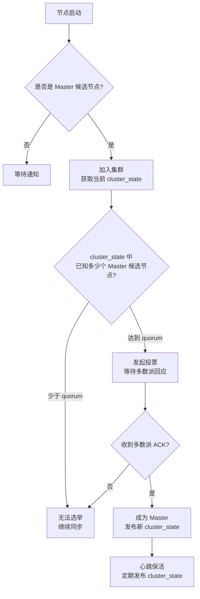
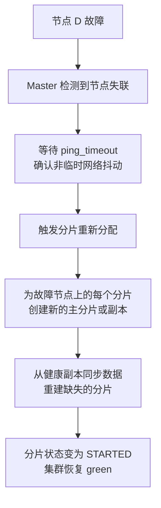

## ES 集群与分片分配

候选人小刘在面试时被问到："你们的 ES 集群有几个节点？主节点是怎么选的？"

小刘说："有 5 个节点，3 个是 Master。"

面试官追问："3 个 Master 候选节点，怎么选出一个主的？用的什么算法？"

小刘说："好像是...投票？"

面试官追问："如果投票平了呢？两个节点同时认为自己是 Master 呢？"

小刘答不上来。

面试官又问："你们的热数据、温数据是怎么分离的？Hot-Warm 架构了解吗？"

小刘彻底懵了。

【面试官心理】
这道题我是在探测候选人对 ES 集群内部机制的理解。能把 ZenDiscovery/Bootstrap 讲清楚的占 20%，能说出脑裂原因和解决方案的占 10%，能讲清楚 Hot-Warm 架构的占 5%。能答到最后的，基本都负责过生产集群的运维和扩容。

---

## 一、主节点选举机制 🔴

### 1.1 ZenDiscovery 的演进

ES 7.x 之前的版本使用 ZenDiscovery 机制，7.x 之后引入了全新的 `cluster.coordination` 模块。面试中要注意版本差异：

**ES 6.x 及之前：ZenDiscovery**
- 基于 Ping 的发现机制
- 需要手动配置 `minimum_master_nodes` 防止脑裂
- 配置繁琐，容易踩坑

**ES 7.x+：新协调层（Cluster Coordination）**
- 引入 bootstrapping 流程，首次启动时设定初始节点列表
- 自动计算 `minimum_master_nodes`
- 从根本上解决了脑裂问题

### 1.2 选举流程

ES 的主节点选举本质上是 **Bully 算法的变种**：谁先发起选举，谁的 term（任期）更大，谁更可能成为 Master。



**quorum 计算公式**：
```
quorum = (master_eligible_nodes / 2) + 1
```

例如：3 个 Master 候选节点，`quorum = (3/2) + 1 = 2`，即至少 2 个节点同意才能选出 Master。

:::warning ⚠️
**最常见的脑裂场景**：网络分区导致 3 节点集群分裂成 2+1。

- 节点 A、B 互相能通信，但与节点 C 断联
- 节点 A、B 认为当前 Master 失联，重新发起选举，节点 A 成为 Master（2 票）
- 节点 C 独自成一个分区，重新选举，节点 C 也成为 Master（1 票，但满足不了 quorum 啊！）

等等，这里节点 C 成为不了 Master，因为 1 < 2。**所以奇数个 Master 节点本身就能防止脑裂**，这就是为什么生产环境必须用奇数个 Master 候选节点。
:::

### 1.3 错误示范

**候选人原话**："我们用 2 个 Master 节点，这样一个挂了另一个能顶上。"

**问题诊断**：
- 2 个 Master 节点，quorum = (2/2) + 1 = 2
- 如果网络抖动导致两个节点失联，**两个节点都无法满足 quorum，都无法成为 Master**
- 集群彻底不可用（不是"有主备切换"而是"全部瘫痪"）

**正确做法**：用 **3 个或 5 个**奇数个 Master 候选节点。3 节点集群可以容忍 1 个节点故障；5 节点集群可以容忍 2 个节点故障。

---

## 二、分片分配策略 🟡

### 2.1 分配规则

ES 的分片分配遵循一套优先级规则：

| 优先级 | 规则 | 说明 |
| --- | --- | --- |
| 1 | 副本优先于主分片 | 优先在有副本的节点上分配主分片 |
| 2 | 均衡优先 | 尽量让每个节点的分片数均衡 |
| 3 | 感知优先 | 优先分配到不同机架/可用区的节点 |

**均衡算法（BalancedShardsAllocator）**：

```java
// 简化逻辑：计算每个节点的"分片数权重"
double nodeWeight = 
    shardCountOnNode * PRIMARY_WEIGHT + 
    replicaCountOnNode * REPLICA_WEIGHT;

// 优先分配到权重最低的节点
targetNode = findNodeWithLowestWeight();
```

`index.balance` 参数控制均衡策略的激进程度，默认 0.45（即各节点分片数差异不超过平均值的 45%）。

### 2.2 分片再平衡

当新节点加入或节点离开时，ES 会自动触发分片再平衡：

```bash
# 查看当前分片分布
GET _cat/allocation?v

# 查看分片迁移状态
GET _cat/recovery?v

# 手动触发再平衡
POST /_cluster/reroute
{
  "commands": [
    {
      "move": {
        "index": "orders",
        "shard": 0,
        "from_node": "node_1",
        "to_node": "node_2"
      }
    }
  ]
}
```

:::tip 💡
**生产环境慎用手动 reroute**：自动再平衡会根据全局最优做决策，手动 reroute 可能会破坏均衡。除非你能确保手动操作比自动决策更优，否则建议让 ES 自己处理。
:::

---

## 三、故障检测与恢复 🔴

### 3.1 故障检测机制

ES 有两套故障检测：

| 检测类型 | 发起方 | 被检测方 | 检测内容 |
| --- | --- | --- | --- |
| Master 检测 | Master 节点 | 所有节点 | 节点是否存活 |
| 节点检测 | 各节点 | Master 节点 | Master 是否失联 |

**检测机制**：定期发送 ping，如果连续 3 次（默认 `ping_timeout`）无响应，则判定为故障节点。

### 3.2 故障恢复流程



**数据恢复时间估算**：

| 数据量 | 副本数 | 恢复时间（SSD） | 恢复时间（HDD） |
| --- | --- | --- | --- |
| 100GB | 1 | 约 2~5 分钟 | 约 10~30 分钟 |
| 1TB | 1 | 约 30~60 分钟 | 约 3~6 小时 |
| 1TB | 0 | **数据丢失** | **数据丢失** |

:::warning ⚠️
**副本数为 0 是最危险的配置**。一旦节点故障，**数据永久丢失，无法恢复**。很多团队为了"节省存储成本"把副本数设为 0，这在生产环境是不可接受的。
:::

---

## 四、Hot-Warm 架构 🟡

### 4.1 适用场景

Hot-Warm 架构用于分离热数据和冷数据：

- **Hot 节点**：SSD 存储，接收实时写入和高频查询
- **Warm 节点**：HDD 存储，仅存储历史数据（低频查询）
- **Cold 节点**：大容量 HDD，存储归档数据（极低频查询）

### 4.2 配置步骤

**第一步：标记节点角色**

```bash
# Hot 节点配置
node.attr.box_type: hot

# Warm 节点配置
node.attr.box_type: warm

# Cold 节点配置
node.attr.box_type: cold
```

**第二步：配置索引分配过滤器**

```json
PUT /orders/_settings
{
  "index.routing.allocation.include.box_type": "hot"
}
```

**第三步：数据从 Hot 迁移到 Warm**

```json
// 等订单超过 7 天后迁移到 Warm 节点
POST /orders/_settings
{
  "index.routing.allocation.include.box_type": "warm",
  "index.unassigned.node_left.delayed_timeout": "1h"
}
```

### 4.3 成本对比

| 节点类型 | 存储介质 | 单价（元/TB） | 适用数据 |
| --- | --- | --- | --- |
| Hot | NVMe SSD | 800~1200 | 最近 1~7 天 |
| Warm | SATA SSD | 400~600 | 7~30 天 |
| Cold | HDD | 80~150 | 30 天以上 |

**一个真实的成本案例**：某电商平台的订单索引，每天新增 100GB 数据，Hot 节点用 2TB SSD，Warm 节点用 10TB HDD，Cold 节点用 50TB HDD。一个月后 Hot 节点占用 2TB，Warm 节点占用 23TB，Cold 节点占用 50TB。总存储成本比全部用 SSD 节省了 **70%**。

---

## 五、集群扩缩容 🟡

### 5.1 扩容步骤

**扩容 Data 节点**（相对安全）：

1. 启动新节点，配置与现有节点相同
2. ES 自动检测到新节点，触发分片再平衡
3. 新分片从现有节点迁移到新节点
4. 监控迁移进度：`GET _cat/recovery?v`

:::tip 💡
**扩容期间的性能影响**：分片迁移会占用网络带宽和磁盘 IO。如果业务高峰期同时触发大规模迁移，查询延迟可能翻倍。建议：
- 在业务低峰期（凌晨）执行扩容
- 临时调低 `indices.recovery.max_bytes_per_sec` 限制迁移速度
:::

**扩容 Master 节点**（需要谨慎）：

1. **先加节点，再改配置**：
```bash
# 新节点配置中加入 master: true
node.master: true
```
2. 更新所有现有节点的 `discovery.seed_hosts` 列表
3. **不要一次性加太多 Master 候选节点**，每次加 1 个

### 5.2 缩容步骤

**缩容比扩容更危险**，因为涉及到数据迁移和副本重建：

1. **先确保副本数足够**：缩容前检查数据量，确保副本能覆盖所有分片
2. **使用分片分配过滤器逐步迁移**：
```bash
# 将某个节点上的分片迁移到其他节点
PUT /_cluster/settings
{
  "transient": {
    "cluster.routing.allocation.exclude._ip": "192.168.1.100"
  }
}
```
3. **确认节点分片数为 0 后再下线节点**
4. **永远不要一次缩容多个节点**，每次最多缩容 1 个

:::warning ⚠️
**缩容导致数据丢失的真实案例**：某团队想把 5 节点的集群缩容到 3 节点，一次性把 2 个节点下线。结果：这两个节点上恰好有 2 个分片没有完整副本（1 副本，1 节点故障），直接丢了数据。**教训：缩容前必须检查 `GET _cat/shards?v` 确保没有单点分片**。
:::

---

## 六、生产避坑清单

| 避坑点 | 检查命令 | 正确做法 |
| --- | --- | --- |
| Master 候选节点为偶数 | `GET _cat/nodes?v` | 必须为奇数（3/5/7） |
| 单分片无副本 | `GET _cat/shards?v` | 每个分片至少 1 个副本 |
| 分片分布不均 | `GET _cat/allocation?v` | 各节点分片数差异 `<` 20% |
| 未配置 Hot-Warm | `GET _nodes/stats/indices/store` | 按时间分层存储 |
| 缩容前未检查 | `GET _cat/shards?v` | 逐个节点迁移，确认清空后再下线 |

【面试官心理】
这道题能答到 Hot-Warm 架构和缩容避坑的候选人，说明他既有全局视野，又有实战教训。Hot-Warm 架构是成本优化的经典方案，缩容踩过坑的候选人知道"数据安全大于一切"。这两种经验组合在一起，就是 P6/P7 的水平线。
