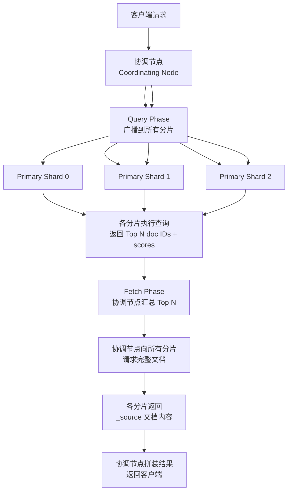
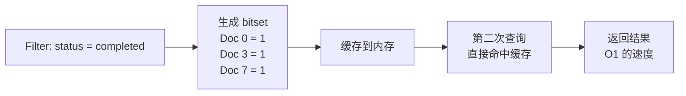

## Elasticsearch 查询流程

候选人小赵在阿里面试时，面试官问："ES 的查询流程是怎样的？"

小赵回答："就是从索引里把数据查出来。"

面试官追问："那 ES 怎么知道数据在哪个分片？查询多个分片时结果怎么汇总？"

小赵说："它会查所有分片...然后汇总？"

面试官点点头，又问："Filter 和 Query 的区别是什么？为什么 Filter 会更快？"

小赵停顿了两秒："Filter 不评分？"

面试官追问："那不评分为什么就快？底层是怎么实现的？"

小赵彻底接不住了。

【面试官心理】
这道题我是在探测候选人对 ES 查询链路的理解深度。能把"两阶段查询"讲清楚的占 40%，能说清 Filter Cache 机制的占 15%，能解释 bitset 缓存的占 5%。能答到最后的，基本都看过 Lucene 源码。

---

## 一、Query Then Fetch 两阶段 🔴

### 1.1 完整查询链路

ES 的查询分为两个阶段，简称 **Query Then Fetch**：



### 1.2 Query Phase（查询阶段）

协调节点向所有相关分片（可能是主分片或副本分片）发送查询请求，每个分片独立执行查询：

1. **解析查询语句**：判断是 term 查询、match 查询还是 bool 查询
2. **使用倒排索引定位候选文档**：找到所有匹配的文档 ID
3. **计算相关性得分**：根据 TF/IDF 等算法计算文档和查询的相关度
4. **排序并取 Top N**：每个分片只返回自己的 Top N（默认 10 个）

**为什么每个分片只返回 Top N？**

因为如果一个索引有 5 个分片，每个分片返回 10000 个结果，协调节点需要汇总 50000 个结果再排序——这个开销是巨大的。**取 Top N 可以大幅减少协调节点的压力**。

### 1.3 Fetch Phase（获取阶段）

协调节点收集到所有分片返回的 doc ID 和分数后，按分数排序取全局 Top N，然后向所有相关分片并发请求这些文档的完整内容（`_source`）。

:::tip 💡
Fetch 阶段是网络密集型的，因为它需要从多个分片拉取完整的 JSON 文档。如果你的 `_source` 字段很大（比如每个文档几 MB），这个阶段的延迟会非常明显。优化方向：**尽量减少 `_source` 的字段数量，或者使用 `stored_fields` 只取必要字段**。
:::

---

## 二、DFS Then Query Then Fetch 🟡

### 2.1 什么是 DFS？

DFS（Distributed Frequency Search）是 ES 在查询前预先计算全局词频的策略。标准流程是：

```
标准 Query Then Fetch：
  查询 → 各分片独立计算 TF/IDF → 分数可能不一致

DFS Then Query Then Fetch：
  预计算全局 IDF → 各分片用统一的 IDF → 分数一致
```

### 2.2 为什么要预计算全局 IDF？

ES 的 IDF（逆文档频率）在每个分片上独立计算。假设某个词在分片 A 中出现 100 次（文档总数 1000），在分片 B 中出现 1 次（文档总数 10）：

- 分片 A 的 IDF：`log(1000/100) = 2.3`
- 分片 B 的 IDF：`log(10/1) = 2.3`

此时两者相同。但如果分片数据分布不均：

- 分片 A：`log(10000/100) = 4.6`
- 分片 B：`log(100/1) = 4.6`

**结果相同，但这是因为恰好比例一致**。实际上，不同分片的数据量往往不同，导致每个分片计算出的 IDF 不同，最终导致**跨分片查询时相关性得分不一致**。

### 2.3 什么时候用 DFS？

```json
// 开启 DFS 模式
GET /orders/_search?search_type=dfs_query_then_fetch
{
  "query": {
    "match": { "product_name": "手机" }
  }
}
```

**使用场景**：对相关性要求极高的场景（如推荐系统、搜索引擎排序）。**代价**：多一次全局词频收集，延迟增加 10%~30%。

**普通场景**：默认的 query_then_fetch 足够，因为分数的微小差异在实际使用中影响不大。

---

## 三、Filter vs Query 🔴

### 3.1 核心区别

这是 ES 面试中最高频的追问之一。

| 维度 | Query | Filter |
| --- | --- | --- |
| **目的** | 全文搜索，计算相关性 | 精确匹配，不过滤结果 |
| **评分** | 计算 TF/IDF 得分 | 不评分（所有文档得分 = 1） |
| **缓存** | 不缓存 | 自动缓存（bitset） |
| **性能** | 较慢 | 极快 |

### 3.2 Filter 的缓存机制

ES 的 Filter 使用 **bitset** 来缓存匹配结果：



假设有 100 万个文档，`status = completed` 的有 10 万个。bitset 用 100 万个 bit 表示，每个文档占用 1 bit，总共 125KB。第二次查询同一个 Filter 时，直接从缓存读取，不需要访问倒排索引。

### 3.3 实战建议

:::tip 💡
**Bool 查询中的最佳实践**：
- `must`：用 Query（需要评分）
- `should`：用 Query（需要评分）
- `filter`：用 Filter（不需要评分，自动缓存）
- `must_not`：用 Filter（不需要评分）

```json
{
  "query": {
    "bool": {
      "must": [
        { "match": { "title": "手机" } }
      ],
      "filter": [
        { "term": { "status": "published" } },
        { "range": { "price": { "gte": 1000, "lte": 5000 } } }
      ]
    }
  }
}
```
:::

### 3.4 错误示范

**候选人原话**："Filter 快是因为它不过滤数据，所以性能好。"

**问题诊断**：
- 完全理解反了：Filter 的目的就是过滤数据
- 把"不过滤"和"不评分"搞混了
- 不理解 bitset 缓存的原理

**面试官内心 OS**："这个候选人肯定没有实际调优过 ES 查询性能。他不知道 ES 为 Filter 专门维护了一套缓存体系，也不知道 bitset 是 Lucene 的核心数据结构。"

---

## 四、聚合分析 🟡

### 4.1 Bucket vs Metric

ES 的聚合分为两类，很多候选人分不清：

| 类型 | 作用 | 示例 |
| --- | --- | --- |
| **Bucket Aggregation** | 分桶（类似 SQL 的 GROUP BY） | 按品牌分组、按价格区间分组 |
| **Metric Aggregation** | 指标计算（类似 SQL 的 COUNT/SUM/AVG） | 计算平均价格、总销售额 |

```json
{
  "size": 0,  // 不返回原始文档，只看聚合结果
  "aggs": {
    "by_brand": {           // 桶聚合
      "terms": {
        "field": "brand.keyword",
        "size": 10
      },
      "aggs": {
        "avg_price": {      // 指标聚合
          "avg": { "field": "price" }
        }
      }
    }
  }
}
```

### 4.2 全局聚合的坑

:::warning ⚠️
ES 的聚合默认在查询结果范围内计算，即**只聚合被 query 匹配到的文档**，而不是全量数据。

```json
{
  "query": { "match": { "title": "iPhone" } },
  "aggs": {
    "all_brands": {
      "global": {},        // 全局聚合，忽略 query
      "aggs": {
        "filtered_brands": {
          "filter": { "term": { "category": "手机" } },
          "aggs": {
            "avg_price": { "avg": { "field": "price" } }
          }
        }
      }
    }
  }
}
```
如果要聚合全量数据，需要使用 `global` + `filter` 组合。
:::

---

## 五、查询性能调优 🟡

### 5.1 常见性能问题

| 问题现象 | 根因 | 解决方案 |
| --- | --- | --- |
| 查询延迟高 | 分片数过多（`>` 10）| 减少分片或使用 `routing` |
| 分片数据不均衡 | routing 字段选择不当 | 更换 routing 字段 |
| 聚合结果不准确 | 分片数太少，doc count 误差累积 | 增大 `shard_size` |
| 深度分页翻车 | `from + size` 过大 | 使用 `search_after` |
| scroll 占用内存 | scroll 上下文未及时释放 | 限制 scroll 超时时间 |

### 5.2 深度分页问题

`from + size` 的翻页方式在分页深度大时性能暴降：

- 第 1 页：`from=0, size=10` — 查 10 条
- 第 10000 页：`from=9990, size=10` — **每个分片查 10000 条**，协调节点汇总后丢弃前 9990 条

**正确的深度分页方式**：`search_after`

```json
// 第一次查询
GET /orders/_search
{
  "sort": [{ "create_time": "desc" }, { "_id": "asc" }],
  "size": 10
}

// 使用上一次查询的最后一个文档作为 search_after
GET /orders/_search
{
  "sort": [{ "create_time": "desc" }, { "_id": "asc" }],
  "search_after": ["2024-11-11T10:00:00Z", "order_9999"],
  "size": 10
}
```

【面试官心理】
`search_after` 是 ES 深度分页的标准解法，能说出这个的候选人说明他对分布式系统的分页问题有实战理解。这也是我在面试中判断候选人有没有"踩过坑"的标志之一。
